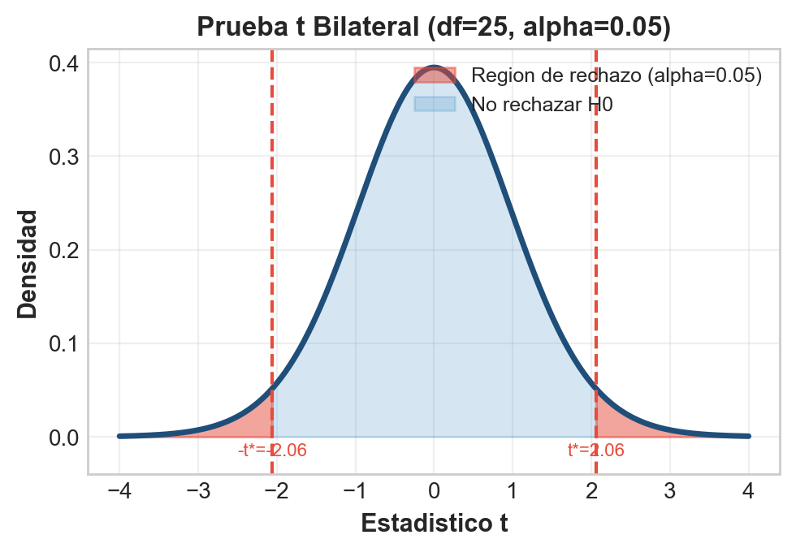
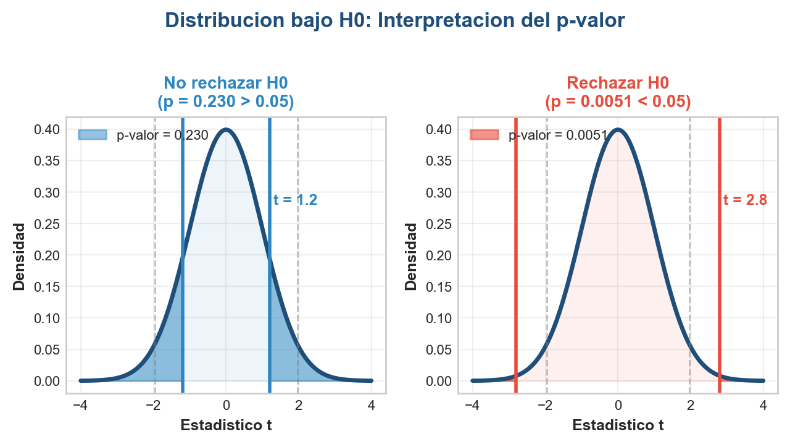
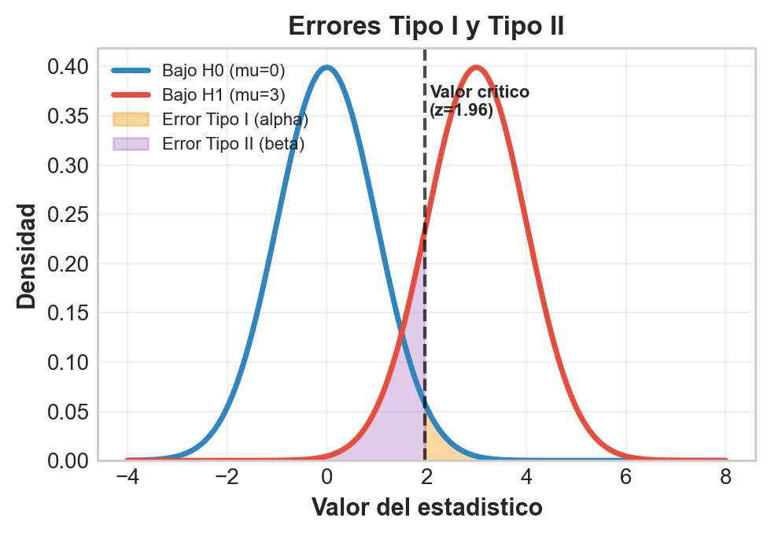
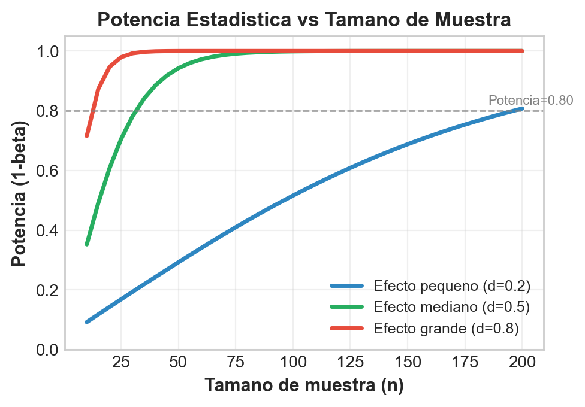
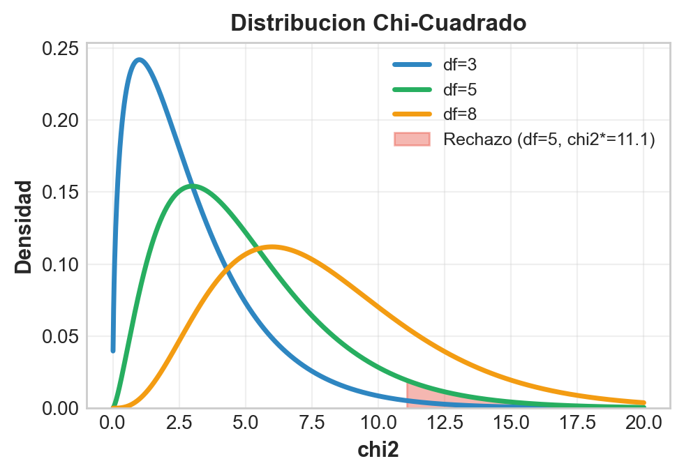

```{r}
#| label: setup
#| echo: false
library(tidyverse)
library(gapminder)
library(knitr)
library(broom)
library(plotly)
theme_set(theme_minimal(base_size = 13))
azul <- "#1F4E79"; celeste <- "#2E86C1"; rojo <- "#E74C3C"; verde <- "#27AE60"; naranja <- "#F39C12"; morado <- "#8E44AD"
datos <- gapminder %>% filter(year == 2007)
# En HTML (revealjs) los graficos se vuelven interactivos con plotly;
# en Beamer (PDF) se mantienen estaticos.
es_html <- knitr::is_html_output()
interactivo <- function(p) {
  if (es_html) plotly::config(plotly::ggplotly(p), displayModeBar = FALSE) else p
}

# Datos simulados: programa de empleo juvenil (dos muestras independientes)
set.seed(123)
empleo <- tibble(
  grupo = rep(c("Control", "Tratamiento"), c(120, 110)),
  salario = c(rnorm(120, mean = 520, sd = 90),
              rnorm(110, mean = 555, sd = 130))
)
m_c <- mean(empleo$salario[empleo$grupo == "Control"])
m_t <- mean(empleo$salario[empleo$grupo == "Tratamiento"])
s_c <- sd(empleo$salario[empleo$grupo == "Control"])
s_t <- sd(empleo$salario[empleo$grupo == "Tratamiento"])

# Datos simulados: capacitacion (muestras pareadas)
set.seed(456)
antes <- rnorm(80, mean = 480, sd = 70)
despues <- antes + rnorm(80, mean = 25, sd = 40)

# Tabla de contingencia: educacion y voto
tabla <- matrix(c(180, 150, 90, 20, 50, 110), ncol = 2,
                dimnames = list(Educacion = c("Superior", "Secundaria", "Primaria"),
                                Voto = c("Voto", "No voto")))
```

## Panorama de la sesión

| Bloque | Concepto clave | Herramienta en R |
|---|---|---|
| Lógica de la inferencia | $H_0$, $H_1$, distribución nula | `pt()`, `qt()` |
| Valor-p y decisión | $\alpha$, regiones de rechazo, ASA | `t.test()` |
| Errores y potencia | Tipo I/II, $1-\beta$, tamaño de muestra | `power.t.test()` |
| Pruebas t | una muestra, dos (Welch), pareada | `t.test()` |
| Variables categóricas | independencia, proporciones | `chisq.test()`, `prop.test()` |
| Buenas prácticas | relevancia, d de Cohen, p-hacking | corrección de Bonferroni |

::: {.callout-note appearance="simple"}
**Datos de trabajo:** `gapminder` (142 países, 2007) y microdatos simulados de un programa de empleo juvenil. En evaluación de políticas, cada rechazo de $H_0$ es una decisión sobre recursos públicos: conviene entender exactamente qué afirma (y qué no) una prueba de hipótesis.
:::

## La prueba de hipótesis en el flujo econométrico

:::: {.columns}

::: {.column width="55%"}
```{r}
#| label: img-flujo
#| echo: false
#| out.width: "100%"
knitr::include_graphics("figuras/flujo_econometria.png")
```
:::

::: {.column width="45%"}
- La econometría traduce preguntas de política a **parámetros**: $\mu$, $p$, $\beta$.
- Estimar no basta: hay que separar **señal de ruido muestral**.
- Toda evaluación de impacto termina en un contraste: ¿el efecto es distinguible de cero?
- Esta sesión construye la caja de herramientas del contraste; las próximas la aplican a coeficientes de regresión.
:::

::::

## La lógica frecuentista en seis pasos

| Paso | Qué se hace | Ejemplo: transferencia monetaria |
|---|---|---|
| 1. Formular | $H_0$: sin efecto; $H_1$: hay efecto | $H_0$: el consumo no cambia |
| 2. Elegir $\alpha$ | riesgo tolerado de falso positivo | $\alpha = 0.05$ |
| 3. Estadístico | según tipo de variable y diseño | t de dos muestras |
| 4. Calcular | con los datos muestrales | $t = 2.41$ |
| 5. Valor-p | prob. de algo tan extremo bajo $H_0$ | $p = 0.017$ |
| 6. Decidir | $p < \alpha$ implica rechazar $H_0$ | se rechaza: hay efecto |

Razonamiento por contradicción: **asumimos que el programa no funciona** ($H_0$) y preguntamos qué tan improbables serían nuestros datos en ese mundo. Los pasos 1 y 2 se fijan **antes** de mirar los datos.

## Hipótesis nula y alternativa: quién carga la prueba

:::: {.columns}

::: {.column width="50%"}
**Hipótesis nula ($H_0$)**

- Afirma "no efecto" o "no diferencia": el statu quo
- Se asume verdadera hasta que la evidencia la contradiga
- Nunca se "acepta": solo se **no rechaza**
- Ej: $\mu = 100$, $\mu_1 = \mu_2$, $p = 0.5$
:::

::: {.column width="50%"}
**Hipótesis alternativa ($H_1$)**

- Lo que el investigador quiere demostrar
- Sobre ella recae la **carga de la prueba**
- Puede ser bilateral o unilateral
- Ej: $\mu \neq 100$, $\mu_1 \neq \mu_2$, $p > 0.5$
:::

::::

::: {.callout-note appearance="simple"}
**Ejemplo — subsidio al empleo juvenil.** $H_0$: la tasa de ocupación de beneficiarios es igual a la de no beneficiarios. $H_1$: las tasas difieren. Si no logramos rechazar $H_0$, no probamos que el programa "no sirve": solo que la evidencia es insuficiente.
:::

## ¿Bilateral o unilateral? La dirección se decide antes

| Tipo | $H_1$ | Cuándo usarla | Ejemplo de política |
|---|---|---|---|
| Bilateral | $\mu \neq \mu_0$ | interesa cualquier dirección | ¿La reforma cambió el gasto de bolsillo en salud? |
| Unilateral derecha | $\mu > \mu_0$ | solo interesa un aumento | ¿El subsidio aumentó el empleo formal? |
| Unilateral izquierda | $\mu < \mu_0$ | solo interesa una caída | ¿La beca redujo la deserción escolar? |

::: {.callout-warning appearance="simple"}
La cola se elige **antes de ver los datos**, por teoría o diseño. Elegirla después de mirar el signo del efecto duplica de facto el error Tipo I: es una forma de p-hacking. Ante la duda, use la bilateral (más conservadora).
:::

## El estadístico de prueba y su distribución nula

:::: {.columns}

::: {.column width="50%"}
$$t = \frac{\text{estimación} - \text{valor bajo } H_0}{\text{error estándar}} = \frac{\bar{x} - \mu_0}{s/\sqrt{n}}$$

- Resume los datos en **un número**: a cuántos errores estándar está la estimación del valor nulo.
- La **distribución nula** describe cómo se comportaría ese número si $H_0$ fuera cierta (aquí, t de Student con $n-1$ gl).
- Un $|t|$ grande significa datos improbables bajo $H_0$.
:::

::: {.column width="50%"}
```{r}
#| label: img-dist-t
#| echo: false
#| out.width: "92%"

```

Con 25 gl y $\alpha = 0.05$ bilateral, la regla es rechazar si $|t| > 2.06$.
:::

::::

## Valor-p: la definición precisa

```{r}
#| label: plot-pvalor
#| echo: false
#| fig-height: 3.0
t_obs <- 2.3; gl <- 24
p_bilateral <- 2 * pt(-abs(t_obs), gl)
curva <- tibble(x = seq(-4.5, 4.5, 0.01), d = dt(seq(-4.5, 4.5, 0.01), gl))
p <- ggplot(curva, aes(x, d)) +
  geom_area(data = filter(curva, x >= t_obs), fill = rojo, alpha = 0.65) +
  geom_area(data = filter(curva, x <= -t_obs), fill = rojo, alpha = 0.65) +
  geom_line(color = azul, linewidth = 1.1) +
  geom_vline(xintercept = t_obs, color = rojo, linewidth = 1) +
  annotate("text", x = t_obs, y = 0.33, label = "t observado = 2.3", color = rojo, size = 4.2) +
  annotate("text", x = 3.1, y = 0.045, label = "p/2", color = rojo, size = 4.5) +
  annotate("text", x = -3.1, y = 0.045, label = "p/2", color = rojo, size = 4.5) +
  labs(x = "Estadístico t (distribución nula, 24 gl)", y = "Densidad",
       title = paste0("Área sombreada = valor-p = ", round(p_bilateral, 3)))
interactivo(p)
```

**Valor-p:** probabilidad de obtener un estadístico **tan extremo o más** que el observado, *suponiendo que $H_0$ es cierta*. Es $P(\text{datos extremos} \mid H_0)$ — no la probabilidad de que $H_0$ sea verdadera.

## El valor-p en la práctica: dos escenarios

```{r}
#| label: img-pvalor-escenarios
#| echo: false
#| out.width: "60%"

```

Mismo umbral $\alpha = 0.05$: a la izquierda, $t = 1.2$ deja mucha área en las colas ($p = 0.23$) y no se rechaza; a la derecha, $t = 2.8$ deja un área mínima ($p = 0.005$) y se rechaza $H_0$.

## Lo que el valor-p NO significa

| Malinterpretación frecuente | Realidad |
|---|---|
| "p es la probabilidad de que $H_0$ sea cierta" | p se calcula *asumiendo* $H_0$: es $P(\text{datos} \mid H_0)$, no $P(H_0 \mid \text{datos})$ |
| "p = 0.20 demuestra que no hay efecto" | ausencia de evidencia no es evidencia de ausencia (puede faltar potencia) |
| "p < 0.05 implica un efecto importante" | con n grande, efectos triviales producen p minúsculos |
| "1 - p es la probabilidad de replicar" | p no informa sobre replicabilidad del hallazgo |
| "p = 0.049 y p = 0.051 son mundos distintos" | 0.05 es una convención, no un umbral físico |

::: {.callout-important appearance="simple"}
**Declaración ASA (Wasserstein & Lazar, 2016):** el valor-p no mide la probabilidad de la hipótesis ni el tamaño del efecto, y ninguna decisión científica o de política debería basarse solo en si p cruza un umbral. Reporte p exacto, IC y tamaño de efecto.
:::

## Nivel de significancia y valores críticos

| $\alpha$ | Crítico bilateral (z) | Crítico unilateral (z) | Uso típico |
|:-:|:-:|:-:|---|
| 0.10 | 1.645 | 1.282 | análisis exploratorio |
| 0.05 | 1.960 | 1.645 | convención dominante |
| 0.01 | 2.576 | 2.326 | decisiones de alto costo |

- $\alpha$ es la probabilidad de **error Tipo I** que el investigador acepta a priori: define la región de rechazo en las colas de la distribución nula.
- Bajar $\alpha$ hace la prueba más exigente: menos falsos positivos, pero más falsos negativos ($\beta$ sube).
- En muestras pequeñas los críticos de la t son mayores que los de z (colas más pesadas): con 24 gl, el crítico bilateral al 5% es 2.06, no 1.96.

## Matriz de decisión: los cuatro escenarios

| Decisión | $H_0$ verdadera | $H_0$ falsa |
|---|---|---|
| Rechazar $H_0$ | **Error Tipo I** (prob = $\alpha$) | Correcto: potencia ($1-\beta$) |
| No rechazar $H_0$ | Correcto (prob = $1-\alpha$) | **Error Tipo II** (prob = $\beta$) |

- **Error Tipo I (falso positivo):** declarar efectivo un programa que no lo es — se financia una política inútil.
- **Error Tipo II (falso negativo):** no detectar un programa que sí funciona — se cancela una política valiosa.
- Reducir $\alpha$ aumenta $\beta$ y viceversa; la única forma de reducir ambos es **aumentar n**.

::: {.callout-tip appearance="simple"}
**Analogía judicial:** Tipo I = condenar a un inocente; Tipo II = absolver a un culpable. El sistema fija $\alpha$ bajo porque considera peor el falso positivo — igual que la estadística.
:::

## Errores Tipo I y II en las distribuciones

:::: {.columns}

::: {.column width="52%"}
```{r}
#| label: img-errores
#| echo: false
#| out.width: "100%"

```
:::

::: {.column width="48%"}
- Área **naranja**: $\alpha$, cola de la distribución bajo $H_0$ más allá del valor crítico.
- Área **morada**: $\beta$, parte de la distribución bajo $H_1$ que cae en zona de no rechazo.
- Mover el crítico a la derecha (bajar $\alpha$) agranda el área morada: el trade-off es geométrico.
- Si las campanas se separan (efecto mayor) o se angostan (más n, menos $\sigma$), ambos errores caen a la vez.
:::

::::

## Potencia: la zona que el diseño debe maximizar

```{r}
#| label: plot-potencia-anatomia
#| echo: false
#| fig-height: 3.2
crit <- qnorm(0.975)
malla <- tibble(x = seq(-4, 7, 0.01),
                h0 = dnorm(seq(-4, 7, 0.01), 0, 1),
                h1 = dnorm(seq(-4, 7, 0.01), 2.8, 1))
p <- ggplot(malla, aes(x)) +
  geom_area(data = filter(malla, x >= crit), aes(y = h1), fill = verde, alpha = 0.4) +
  geom_area(data = filter(malla, x <= crit), aes(y = h1), fill = naranja, alpha = 0.55) +
  geom_area(data = filter(malla, x >= crit), aes(y = h0), fill = rojo, alpha = 0.7) +
  geom_line(aes(y = h0), color = azul, linewidth = 1.1) +
  geom_line(aes(y = h1), color = rojo, linewidth = 1.1) +
  geom_vline(xintercept = crit, linetype = "dashed", color = "grey30") +
  annotate("text", x = -1.6, y = 0.36, label = "Bajo H0", color = azul, size = 4.5) +
  annotate("text", x = 4.6, y = 0.36, label = "Bajo H1 (efecto real)", color = rojo, size = 4.5) +
  annotate("text", x = 2.45, y = 0.085, label = "alfa", color = rojo, size = 4) +
  annotate("text", x = 1.0, y = 0.05, label = "beta", color = "#A04000", size = 4) +
  annotate("text", x = 4.7, y = 0.16, label = "Potencia = 1 - beta", color = verde, size = 4.5) +
  annotate("text", x = 2.6, y = 0.42, label = "valor crítico", color = "grey30", size = 3.8) +
  labs(x = "Valor del estadístico", y = "Densidad")
interactivo(p)
```

**Potencia** = probabilidad de rechazar $H_0$ cuando es falsa (área verde). El estándar de diseño en evaluación de impacto es potencia $\geq$ 0.80: un estudio con potencia 0.30 casi garantiza no detectar el efecto aunque exista.

## Cuatro palancas determinan la potencia

:::: {.columns}

::: {.column width="48%"}
- **Tamaño de efecto:** efectos más grandes se detectan más fácil; es la palanca que *no* controla el evaluador.
- **Tamaño de muestra (n):** más n reduce el error estándar; la palanca principal de diseño.
- **Nivel $\alpha$:** un $\alpha$ mayor da más potencia, al precio de más falsos positivos.
- **Varianza ($\sigma^2$):** menos ruido (mejor medición, estratificación) aumenta la potencia.

Con dos grupos, detectar un efecto pequeño ($d = 0.2$) con 80% de potencia exige **cerca de 400 casos por grupo** (unos 200 en total si el contraste es de una sola muestra, como ilustra la figura).
:::

::: {.column width="52%"}
```{r}
#| label: img-potencia-n
#| echo: false
#| out.width: "100%"

```
:::

::::

## power.t.test: diseñar el tamaño de muestra

:::: {.columns}

::: {.column width="46%"}
```{r}
#| label: code-power
# ¿Que n necesito? (d = 0.5)
p1 <- power.t.test(delta = 0.5,
                   sd = 1,
                   sig.level = 0.05,
                   power = 0.80)
ceiling(p1$n)   # n por grupo

# ¿Que potencia logro con n = 30?
p2 <- power.t.test(n = 30,
                   delta = 0.5,
                   sd = 1,
                   sig.level = 0.05)
round(p2$power, 2)
```
:::

::: {.column width="54%"}
```{r}
#| label: plot-curvas-potencia
#| echo: false
#| fig-width: 5.6
#| fig-height: 3.9
#| out.width: "100%"
malla_pot <- expand_grid(n = seq(10, 200, 5), d = c(0.2, 0.5, 0.8)) %>%
  mutate(potencia = map2_dbl(n, d, ~ power.t.test(n = .x, delta = .y,
                                                  sd = 1, sig.level = 0.05)$power),
         efecto = factor(d, labels = c("d = 0.2 (pequeño)", "d = 0.5 (mediano)",
                                       "d = 0.8 (grande)")))
p <- ggplot(malla_pot, aes(n, potencia, color = efecto)) +
  geom_line(linewidth = 1.2) +
  geom_hline(yintercept = 0.8, linetype = "dashed", color = "grey40") +
  annotate("text", x = 175, y = 0.86, label = "objetivo 0.80", color = "grey40", size = 4) +
  scale_color_manual(values = c(celeste, verde, rojo)) +
  labs(x = "n por grupo", y = "Potencia (1 - beta)", color = NULL,
       title = "Curvas de potencia con power.t.test") +
  theme(legend.position = "bottom")
interactivo(p)
```
:::

::::

## Prueba t de una muestra en R

**Pregunta:** ¿la esperanza de vida promedio mundial en 2007 difiere de 70 años? $H_0: \mu = 70$ vs $H_1: \mu \neq 70$, con $\alpha = 0.05$.

```{r}
#| label: code-t-una
t1 <- t.test(datos$lifeExp, mu = 70)
tidy(t1) %>%
  select(estimate, statistic, p.value, conf.low, conf.high) %>%
  mutate(across(everything(), ~ round(.x, 3)))
```

- La media muestral (67.0 años) está a casi 3 errores estándar de 70: se **rechaza** $H_0$ al 5%.
- Lectura equivalente: el IC 95% [65.0, 69.0] **no contiene** 70.
- Supuestos: muestra aleatoria, observaciones independientes, normalidad aproximada (o n grande, por TCL).

## Dos muestras: ¿Welch o pooled?

| Aspecto | Pooled (clásica) | Welch (defecto en R) |
|---|---|---|
| Supuesto sobre varianzas | iguales ($\sigma_1 = \sigma_2$) | pueden diferir |
| Grados de libertad | $n_1 + n_2 - 2$ | aproximación de Satterthwaite |
| Si las varianzas difieren | error Tipo I distorsionado | robusta |
| En `t.test()` | `var.equal = TRUE` | `var.equal = FALSE` (defecto) |

::: {.callout-tip appearance="simple"}
En evaluación de programas los grupos tratado y control rara vez comparten varianza: el tratamiento suele *aumentar* la dispersión de resultados (impactos heterogéneos). Use **Welch** salvo que tenga una razón fuerte para lo contrario.
:::

## Prueba t de dos muestras: programa de empleo

Simulamos un programa de empleo juvenil: salarios mensuales (miles de pesos) de `r sum(empleo$grupo == "Control")` controles (media `r round(m_c)`, DE `r round(s_c)`) y `r sum(empleo$grupo == "Tratamiento")` tratados (media `r round(m_t)`, DE `r round(s_t)`).

```{r}
#| label: code-t-dos
welch  <- t.test(salario ~ grupo, data = empleo)
pooled <- t.test(salario ~ grupo, data = empleo, var.equal = TRUE)
tibble(version = c("Welch", "Pooled"),
       t = c(welch$statistic, pooled$statistic),
       gl = c(welch$parameter, pooled$parameter),
       p = c(welch$p.value, pooled$p.value)) %>%
  mutate(across(-version, ~ round(.x, 3)))
```

Ambas versiones rechazan $H_0: \mu_T = \mu_C$ al 5%, pero no siempre coinciden: con varianzas y tamaños desiguales, la pooled puede sobre o subestimar la evidencia. Los gl de Welch (no enteros) reflejan la corrección.

## Prueba t pareada: antes y después de capacitar

:::: {.columns}

::: {.column width="46%"}
Ingresos de 80 trabajadores antes y después de una capacitación. Parear **elimina la heterogeneidad individual**: la prueba se hace sobre las diferencias $d_i$, con $n - 1$ gl.

```{r}
#| label: code-t-pareada
res <- t.test(despues, antes,
              paired = TRUE)
# diferencia media
round(as.numeric(res$estimate), 1)
# IC 95% de la diferencia
round(as.numeric(res$conf.int), 1)
# valor-p
signif(res$p.value, 2)
```
:::

::: {.column width="54%"}
```{r}
#| label: plot-pareada
#| echo: false
#| fig-width: 5.6
#| fig-height: 3.9
#| out.width: "100%"
dif <- despues - antes
p <- ggplot(tibble(dif), aes(dif)) +
  geom_histogram(bins = 18, fill = celeste, color = "white") +
  geom_vline(xintercept = 0, linetype = "dashed", color = "grey40", linewidth = 0.9) +
  geom_vline(xintercept = mean(dif), color = rojo, linewidth = 1.1) +
  annotate("text", x = mean(dif) + 22, y = 11.5,
           label = paste0("media = ", round(mean(dif), 1)), color = rojo, size = 4.3) +
  labs(x = "Diferencia individual (después - antes)", y = "N° de trabajadores",
       title = "Distribución de las diferencias pareadas")
interactivo(p)
```
:::

::::

## Chi-cuadrado de independencia: concepto

:::: {.columns}

::: {.column width="48%"}
$$\chi^2 = \sum_{i,j} \frac{(O_{ij} - E_{ij})^2}{E_{ij}}, \quad E_{ij} = \frac{\text{fila}_i \times \text{col}_j}{n}$$

- $H_0$: las dos variables categóricas son **independientes**; $H_1$: están asociadas.
- Grados de libertad: $(r-1)(c-1)$.
- Requisito: $E_{ij} \geq 5$ en al menos 80% de las celdas.
- Detecta asociación, **no dirección ni causalidad**.
:::

::: {.column width="52%"}
```{r}
#| label: img-chi
#| echo: false
#| out.width: "94%"

```

La distribución $\chi^2$ se desplaza a la derecha al crecer los gl; siempre se rechaza en la **cola superior**.
:::

::::

## Chi-cuadrado en R: educación y voto

¿Se asocia el nivel educativo con votar? Encuesta a 600 personas ($\alpha = 0.05$):

```{r}
#| label: tabla-contingencia
#| echo: false
tab_m <- addmargins(tabla)
dimnames(tab_m)[[1]][4] <- "Total"
dimnames(tab_m)[[2]][3] <- "Total"
kable(tab_m)
```

```{r}
#| label: code-chi
chisq.test(tabla)
```

Con $\chi^2 = 100$ y 2 gl, $p < 0.001$: se rechaza la independencia — la participación electoral está fuertemente asociada al nivel educativo.

## Chi-cuadrado: observado vs esperado

```{r}
#| label: plot-obs-esp
#| echo: false
#| fig-height: 3.1
chi <- chisq.test(tabla)
obs <- as.data.frame(as.table(chi$observed)) %>% mutate(tipo = "Observado")
esp <- as.data.frame(as.table(chi$expected)) %>% mutate(tipo = "Esperado bajo H0")
df_oe <- bind_rows(obs, esp) %>%
  mutate(Educacion = factor(Educacion, levels = c("Superior", "Secundaria", "Primaria")),
         tipo = factor(tipo, levels = c("Observado", "Esperado bajo H0")))
p <- ggplot(df_oe, aes(Educacion, Freq, fill = tipo)) +
  geom_col(position = position_dodge(width = 0.7), width = 0.62) +
  facet_wrap(~ Voto) +
  scale_fill_manual(values = c(celeste, naranja)) +
  labs(x = NULL, y = "Frecuencia", fill = NULL,
       title = "Frecuencias observadas vs esperadas bajo independencia") +
  theme(legend.position = "top")
interactivo(p)
```

El estadístico acumula las brechas entre barras: educación primaria vota **mucho menos** de lo que la independencia predice (90 vs 140) y concentra la mayor parte del $\chi^2$.

## Pruebas de proporciones con prop.test

:::: {.columns}

::: {.column width="50%"}
**Una proporción**
$$z = \frac{\hat{p} - p_0}{\sqrt{p_0(1-p_0)/n}}$$

```{r}
#| label: code-prop-una
# 132 de 200 comunas elegibles
# implementaron el programa
una <- prop.test(x = 132, n = 200,
                 p = 0.5)
round(as.numeric(una$estimate), 3)
signif(una$p.value, 3)
```
:::

::: {.column width="50%"}
**Dos proporciones**
$$z = \frac{\hat{p}_1 - \hat{p}_2}{\sqrt{\hat{p}(1-\hat{p})(\tfrac{1}{n_1} + \tfrac{1}{n_2})}}$$

```{r}
#| label: code-prop-dos
# empleo a 12 meses:
# 96/160 tratados, 62/158 control
dos <- prop.test(x = c(96, 62),
                 n = c(160, 158))
round(as.numeric(dos$estimate), 3)
signif(dos$p.value, 3)
```
:::

::::

Requisito de la aproximación normal: $np_0 \geq 5$ y $n(1-p_0) \geq 5$. `prop.test()` aplica por defecto la corrección de continuidad de Yates; ambos contrastes rechazan $H_0$ al 5%.

## Significancia estadística no es relevancia práctica

```{r}
#| label: plot-relevancia
#| echo: false
#| fig-height: 2.9
df_ic <- tibble(
  estudio = c("Piloto RCT (n = 40)", "Registro administrativo (n = 250.000)"),
  est = c(8, 0.4), lo = c(-1.2, 0.1), hi = c(17.2, 0.7),
  etiqueta = c("p = 0.086", "p < 0.001"))
p <- ggplot(df_ic, aes(x = est, y = estudio)) +
  annotate("rect", xmin = -2, xmax = 2, ymin = -Inf, ymax = Inf, fill = "grey80", alpha = 0.5) +
  geom_vline(xintercept = 0, linetype = "dashed", color = "grey40") +
  geom_pointrange(aes(xmin = lo, xmax = hi), color = azul, linewidth = 1.1, size = 0.7) +
  geom_text(aes(label = etiqueta), vjust = -1.3, color = rojo, size = 4.3) +
  annotate("text", x = 9, y = 0.55, label = "zona sombreada: irrelevancia práctica (menos de 2 pp)",
           color = "grey35", size = 3.6) +
  coord_cartesian(xlim = c(-4, 19), ylim = c(0.4, 2.5)) +
  labs(x = "Efecto sobre la tasa de empleo (puntos porcentuales)", y = NULL,
       title = "Mismo programa, dos estudios")
interactivo(p)
```

Con n enorme, un efecto de 0.4 pp es "significativo" pero **irrelevante** para la política; el piloto sugiere un efecto grande pero impreciso. La pregunta de política es *cuánto* (IC y magnitud), no solo si $p < 0.05$.

## Tamaño de efecto: d de Cohen

$$d = \frac{\bar{x}_1 - \bar{x}_2}{s_p}, \qquad s_p = \sqrt{\frac{(n_1-1)s_1^2 + (n_2-1)s_2^2}{n_1+n_2-2}}$$

Expresa la diferencia en **desviaciones estándar**: comparable entre estudios y variables. Referencias de Cohen (1988): 0.2 pequeño · 0.5 mediano · 0.8 grande (orientadoras, no dogma).

```{r}
#| label: code-cohen
sal_c <- empleo$salario[empleo$grupo == "Control"]
sal_t <- empleo$salario[empleo$grupo == "Tratamiento"]
sp <- sqrt(((length(sal_c) - 1) * var(sal_c) +
            (length(sal_t) - 1) * var(sal_t)) / (nrow(empleo) - 2))
round((mean(sal_t) - mean(sal_c)) / sp, 2)
```

El programa de empleo mueve salarios en ~0.3 DE: efecto pequeño-mediano. Reportar d junto al valor-p permite comparar el programa con otras intervenciones y alimentar análisis costo-efectividad.

## Comparaciones múltiples: el error se acumula

| Pruebas (m) | P(al menos 1 falso positivo) | $\alpha$ de Bonferroni (0.05/m) |
|:-:|:-:|:-:|
| 1 | 5.0% | 0.05 |
| 5 | 22.6% | 0.01 |
| 10 | 40.1% | 0.005 |
| 20 | 64.2% | 0.0025 |
| 100 | 99.4% | 0.0005 |

- Con $H_0$ cierta en todas, $P(\geq 1 \text{ falso positivo}) = 1 - (1-\alpha)^m$: probar 20 subgrupos casi garantiza un "hallazgo".
- **p-hacking:** probar especificaciones, outcomes o subgrupos hasta que algo dé $p < 0.05$ y reportar solo eso.
- **Bonferroni** ($\alpha/m$) controla el error familiar; es conservadora — Holm o FDR son alternativas menos costosas. La mejor defensa: preregistrar hipótesis y reportar **todas** las pruebas.

## p-hacking: simulación de la trampa

```{r}
#| label: plot-phacking
#| echo: false
#| fig-height: 3.2
set.seed(2026)
p_unico <- replicate(5000, t.test(rnorm(30), rnorm(30))$p.value)
p_min5 <- replicate(2000, min(replicate(5, t.test(rnorm(30), rnorm(30))$p.value)))
sim_ph <- bind_rows(
  tibble(p = p_unico, escenario = "Una prueba por estudio"),
  tibble(p = p_min5, escenario = "Se reporta el mínimo de 5 pruebas")
) %>%
  mutate(escenario = factor(escenario, levels = unique(escenario)))
p <- ggplot(sim_ph, aes(p, fill = p < 0.05)) +
  geom_histogram(breaks = seq(0, 1, 0.05), color = "white") +
  scale_fill_manual(values = c("FALSE" = celeste, "TRUE" = rojo), guide = "none") +
  facet_wrap(~ escenario, scales = "free_y") +
  labs(x = "valor-p reportado", y = "Frecuencia")
interactivo(p)
```

Todo se simula **bajo $H_0$ cierta** (efecto nulo). Con una prueba por estudio, los valores-p son uniformes y el `r round(100 * mean(p_unico < 0.05), 1)`% cae bajo 0.05; si se prueban 5 outcomes y se reporta el mínimo, la tasa de falsos positivos se multiplica por cuatro (`r round(100 * mean(p_min5 < 0.05), 1)`%).

## Síntesis: protocolo de un contraste bien hecho

:::: {.columns}

::: {.column width="52%"}
**Checklist antes de reportar**

1. $H_0$, $H_1$ y dirección definidas *a priori*
2. $\alpha$ y potencia fijados en la etapa de diseño (`power.t.test`)
3. Prueba elegida según tipo de variable y estructura (pareo, varianzas)
4. Reportar p exacto + IC + tamaño de efecto (d)
5. Declarar cuántas pruebas se hicieron; corregir si son varias
6. Distinguir significancia de relevancia práctica

**Funciones de la sesión:** `t.test()` `prop.test()` `chisq.test()` `power.t.test()` `qt()` `pt()`
:::

::: {.column width="48%"}
```{r}
#| label: img-matriz
#| echo: false
#| out.width: "100%"
knitr::include_graphics("figuras/matriz_decision.png")
```

**Próxima sesión:** regresión lineal simple y MCO — los mismos contrastes, aplicados a $\beta$.
:::

::::

## Ejercicio para practicar (30 min)

Con `gapminder` filtrado al año **1977**:

1. Pruebe si la esperanza de vida promedio mundial difiere de 60 años (formule $H_0$/$H_1$, elija cola y justifique).
2. Compare la esperanza de vida entre África y las Américas con Welch y con pooled. ¿Cambia la conclusión? ¿Cuál reportaría?
3. Calcule la d de Cohen de esa comparación e interprétela.
4. Cree la variable `alta_vida` (esperanza sobre la mediana global) y pruebe con `chisq.test()` si se asocia al continente. Grafique observado vs esperado.
5. Con `prop.test()`, contraste si la proporción de países con `alta_vida` en Asia difiere de 0.5.
6. ¿Qué n por grupo exigiría detectar $d = 0.3$ con potencia 0.80 y $\alpha = 0.05$? Use `power.t.test()`.

::: {.callout-note appearance="simple"}
**Referencias:** Wooldridge, *Introductory Econometrics* (apéndice C) · Stock & Watson, *Introduction to Econometrics* (cap. 3) · Wasserstein & Lazar (2016), "The ASA Statement on p-Values", *The American Statistician* · Cohen (1988), *Statistical Power Analysis*.
:::
