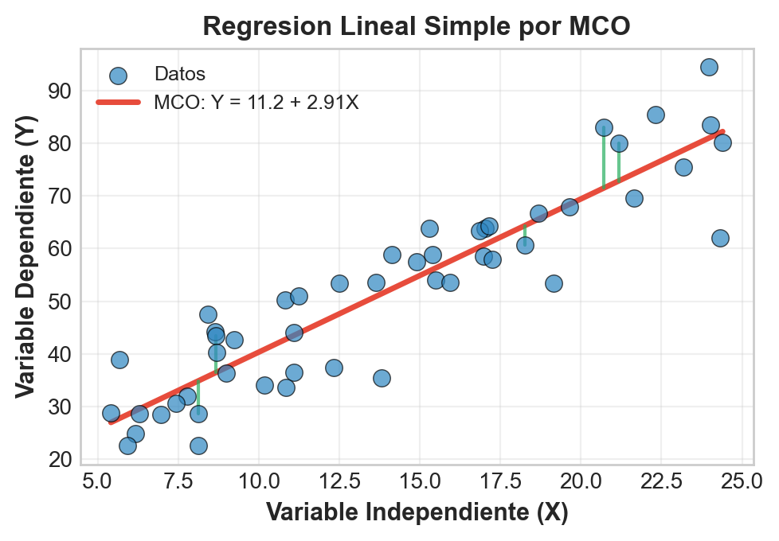
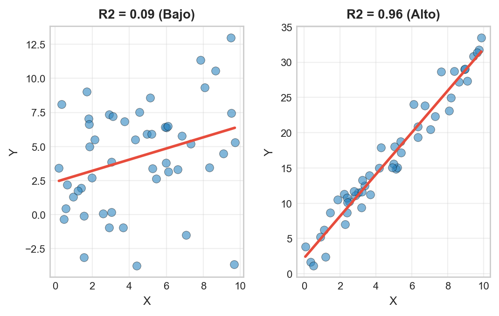

```{r}
#| label: setup
#| echo: false
library(tidyverse)
library(wooldridge)
library(gapminder)
library(knitr)
library(broom)
library(lmtest)
library(sandwich)
library(modelsummary)
library(plotly)
theme_set(theme_minimal(base_size = 13))
azul <- "#1F4E79"; celeste <- "#2E86C1"; rojo <- "#E74C3C"; verde <- "#27AE60"; naranja <- "#F39C12"; morado <- "#8E44AD"
# En HTML (revealjs) los graficos se vuelven interactivos con plotly;
# en Beamer (PDF) se mantienen estaticos.
es_html <- knitr::is_html_output()
interactivo <- function(p) {
  if (es_html) plotly::config(plotly::ggplotly(p), displayModeBar = FALSE) else p
}

data("wage1", package = "wooldridge")
modelo <- lm(wage ~ educ, data = wage1)
modelo_log <- lm(lwage ~ educ, data = wage1)
gap2007 <- gapminder %>% filter(year == 2007)
```

## Panorama de la sesión

| Bloque | Concepto clave | Herramienta en R |
|---|---|---|
| El modelo | $y = \beta_0 + \beta_1 x + u$; causal vs predictivo | — |
| Estimación MCO | Minimizar la suma de cuadrados | `lm()`, `broom::tidy()` |
| Interpretación | Unidades, formas funcionales, logs | `log()` |
| Bondad de ajuste | $R^2$: qué es y qué no es | `broom::glance()` |
| Inferencia | $SE(\hat{\beta}_1)$, prueba t, IC | `confint()`, `sandwich` |
| Supuestos | Gauss-Markov, heterocedasticidad | `plot(modelo)` |
| Predicción | Bandas media vs individuo; extrapolación | `predict()` |

::: {.callout-note appearance="simple"}
**Datos de trabajo:** `wage1` (Wooldridge): 526 trabajadores (EE.UU., 1976) con salario por hora y educación. ¿Cuánto rinde un año más de escolaridad? `gapminder` 2007 reaparece para formas funcionales.
:::

## La regresión en el flujo econométrico

:::: {.columns}

::: {.column width="55%"}
```{r}
#| label: img-flujo
#| echo: false
#| out.width: "100%"
knitr::include_graphics("figuras/flujo_econometria.png")
```
:::

::: {.column width="45%"}
- **Pregunta de política:** ¿cuánto aumenta el salario un año adicional de educación?
- **Modelo:** $y = \beta_0 + \beta_1 x + u$ traduce la pregunta a un parámetro: $\beta_1$.
- **Estimación:** MCO entrega $\hat{\beta}_1$ a partir de los datos.
- **Inferencia:** ¿es $\hat{\beta}_1$ distinguible del ruido muestral? (sesión 1).
- **Hoy:** el eslabón modelo → estimación → interpretación → diagnóstico.
:::

::::

## El modelo poblacional: $y = \beta_0 + \beta_1 x + u$

:::: {.columns}

::: {.column width="50%"}
$$y = \beta_0 + \beta_1 x + u$$

- $y$: variable dependiente (el resultado de interés)
- $x$: variable explicativa (la palanca de política)
- $\beta_0, \beta_1$: **parámetros poblacionales** desconocidos
- $u$: término de error — *todo lo demás* que afecta a $y$
- Si $E[u \mid x] = 0$, entonces $E[y \mid x] = \beta_0 + \beta_1 x$: la recta es la **media condicional**
:::

::: {.column width="50%"}
```{r}
#| label: img-modelo
#| echo: false
#| out.width: "100%"

```
:::

::::

## Dos lecturas del mismo modelo: predictiva y causal

| Lectura | Pregunta que responde | Requisito clave | Uso en política pública |
|---|---|---|---|
| **Predictiva** | ¿Cuál es el salario *esperado* de alguien con 12 años de educación? | Buen ajuste dentro del rango de los datos | Focalización, proyecciones, alertas tempranas |
| **Causal** | ¿Cuánto *subiría* el salario si la política agrega un año de educación? | Exogeneidad: $E[u \mid x] = 0$ | Evaluación de reformas, análisis costo-beneficio |

::: {.callout-important appearance="simple"}
La misma recta estimada admite ambas lecturas. Lo que decide cuál es válida no es el software sino los **supuestos**: si la habilidad (omitida en $u$) se correlaciona con la educación, $\hat{\beta}_1$ predice bien pero **no** mide el efecto causal.
:::

## Los datos: `wage1` de Wooldridge

```{r}
#| label: datos-wage
data("wage1", package = "wooldridge")
wage1 %>% select(wage, educ, exper) %>% glimpse()
```

- `wage`: salario promedio por hora (USD de 1976) — nuestra $y$
- `educ`: años de educación formal (rango 0–18) — nuestra $x$
- `lwage` = `log(wage)`: la usaremos para semi-elasticidades
- Corte transversal de la CPS: cada fila es un trabajador distinto

## Primer vistazo: siempre graficar antes de estimar

:::: {.columns}

::: {.column width="46%"}
```{r}
#| label: code-scatter
#| eval: false
ggplot(wage1,
       aes(x = educ, y = wage)) +
  geom_jitter(width = .2,
              alpha = .35,
              color = celeste) +
  geom_smooth(method = "lm",
              se = FALSE,
              color = rojo) +
  labs(x = "Educación (años)",
       y = "Salario (USD/hora)")
```

- Nube con pendiente positiva y mucha dispersión
- `educ` es discreta: el *jitter* evita el sobretrazado
- La recta resume $E[y \mid x]$; los puntos recuerdan que $u$ existe
:::

::: {.column width="54%"}
```{r}
#| label: plot-scatter
#| echo: false
#| fig-width: 5.6
#| fig-height: 3.9
#| out.width: "100%"
interactivo(
  ggplot(wage1, aes(x = educ, y = wage)) +
    geom_jitter(width = .2, alpha = .35, color = celeste) +
    geom_smooth(method = "lm", se = FALSE, color = rojo) +
    labs(x = "Educación (años)", y = "Salario (USD/hora)")
)
```
:::

::::

## MCO: minimizar la suma de cuadrados de los residuos

Cada recta candidata $(\beta_0, \beta_1)$ deja residuos $\hat{u}_i = y_i - \beta_0 - \beta_1 x_i$. MCO elige la recta que minimiza:

$$\min_{\beta_0, \beta_1} \; SCR = \sum_{i=1}^{n} (y_i - \beta_0 - \beta_1 x_i)^2$$

Condiciones de primer orden (derivar e igualar a cero):

$$\sum_i (y_i - \hat{\beta}_0 - \hat{\beta}_1 x_i) = 0 \qquad \sum_i x_i (y_i - \hat{\beta}_0 - \hat{\beta}_1 x_i) = 0$$

- **¿Por qué cuadrados?** Penaliza más los errores grandes, es diferenciable y tiene solución única (si $\text{Var}(x) > 0$).
- Las condiciones implican: los residuos **suman cero** y **no se correlacionan** con $x$.

## Los estimadores MCO: fórmula y verificación en R

$$\hat{\beta}_1 = \frac{\sum_i (x_i - \bar{x})(y_i - \bar{y})}{\sum_i (x_i - \bar{x})^2} = \frac{\widehat{\text{Cov}}(x, y)}{\widehat{\text{Var}}(x)} \qquad \hat{\beta}_0 = \bar{y} - \hat{\beta}_1 \bar{x}$$

```{r}
#| label: mco-manual
b1 <- cov(wage1$educ, wage1$wage) / var(wage1$educ)
b0 <- mean(wage1$wage) - b1 * mean(wage1$educ)
round(c(b0_manual = b0, b1_manual = b1), 4)
round(coef(lm(wage ~ educ, data = wage1)), 4)
```

La pendiente es la covarianza reescalada por la varianza de $x$; la recta MCO siempre pasa por el punto de medias $(\bar{x}, \bar{y})$.

## Anatomía del gráfico de regresión

```{r}
#| label: plot-anatomia
#| echo: false
#| fig-height: 3.2
set.seed(21)
sub <- wage1 %>% slice_sample(n = 70) %>%
  mutate(ajuste = predict(modelo, newdata = .),
         educ_j = educ + runif(n(), -.18, .18))
p <- ggplot(sub) +
  geom_segment(aes(x = educ_j, xend = educ_j, y = wage, yend = ajuste),
               color = rojo, alpha = .6) +
  geom_point(aes(x = educ_j, y = wage), color = celeste, size = 2, alpha = .85) +
  geom_abline(intercept = coef(modelo)[1], slope = coef(modelo)[2],
              color = azul, linewidth = 1) +
  annotate("text", x = 3, y = 20, label = "segmentos rojos = residuos",
           hjust = 0, color = rojo, size = 4.2) +
  annotate("text", x = 15, y = 13.5, label = "recta MCO: valores ajustados", color = azul, size = 4.2) +
  labs(x = "Educación (años)", y = "Salario (USD/hora)",
       title = "Submuestra de 70 trabajadores: observado, ajustado y residuo")
interactivo(p)
```

Cada observación se descompone en $y_i = \hat{y}_i + \hat{u}_i$: valor **ajustado** (sobre la recta) más **residuo** (distancia vertical). MCO hace que los cuadrados de esos segmentos sumen lo mínimo posible.

## `lm()` con `broom`: salida ordenada

```{r}
#| label: broom-salida
tidy(modelo) %>% kable(digits = 3)
glance(modelo) %>%
  select(r.squared, sigma, statistic, p.value, nobs) %>%
  kable(digits = 3)
```

`tidy()` devuelve la tabla de coeficientes como *data frame*; `glance()` resume el ajuste global. Ambos son preferibles a leer `summary()` a ojo: alimentan tablas y gráficos reproducibles.

## Interpretación: los coeficientes tienen unidades

$$\widehat{wage} = -0.90 + 0.54 \cdot educ$$

- **Unidades de $\hat{\beta}_1$:** unidades de $y$ por unidad de $x$ → aquí, **USD/hora por año de educación**.
- Cada año adicional de educación se asocia con **+0.54 USD/hora**, un 9% del salario medio (5.90 USD/hora).
- Cuatro años de universidad: $4 \times 0.54 = 2.17$ USD/hora, un 37% del salario medio — significancia **económica**, no solo estadística.
- **Intercepto:** $\hat{\beta}_0 = -0.90$ sería el salario con `educ = 0`. Un salario negativo es absurdo: el intercepto ancla la recta, pero no siempre tiene lectura propia fuera del soporte de los datos.

::: {.callout-important appearance="simple"}
Para leer 0.54 como **efecto causal** de una reforma educativa se requiere $E[u \mid educ] = 0$: que la habilidad, el entorno familiar y la calidad escolar (todos en $u$) no se muevan con la educación. La sesión 3 ataca este problema con controles.
:::

## Formas funcionales: la misma herramienta, otra pregunta

| Modelo | Especificación | Interpretación de $\beta_1$ | Ejemplo típico |
|---|---|---|---|
| Nivel-nivel | $y = \beta_0 + \beta_1 x + u$ | +1 unidad de $x$: $y$ cambia $\beta_1$ unidades | Salario vs educación |
| Log-nivel | $\ln y = \beta_0 + \beta_1 x + u$ | +1 unidad de $x$: $y$ cambia $100 \beta_1$ % | Retorno a la educación |
| Nivel-log | $y = \beta_0 + \beta_1 \ln x + u$ | +1% en $x$: $y$ cambia $\beta_1 / 100$ unidades | Esperanza de vida vs PIB |
| Log-log | $\ln y = \beta_0 + \beta_1 \ln x + u$ | +1% en $x$: $y$ cambia $\beta_1$ % (elasticidad) | Demanda vs precio |

::: {.callout-tip appearance="simple"}
Los logs convierten efectos absolutos en relativos, comprimen colas derechas y estabilizan la varianza; solo aplican a variables estrictamente positivas. La forma se elige por **teoría y datos**, no por comodidad.
:::

## Log-nivel en acción: el retorno a la educación

:::: {.columns}

::: {.column width="46%"}
```{r}
#| label: code-logwage
#| eval: false
modelo_log <- lm(lwage ~ educ,
                 data = wage1)
round(coef(modelo_log), 3)

ggplot(wage1,
       aes(x = educ, y = lwage)) +
  geom_jitter(width = .2,
              alpha = .35) +
  geom_smooth(method = "lm")
```

- $\hat{\beta}_1 = 0.083$: cada año de educación se asocia con un salario **~8.3% mayor**
- Es el "retorno a la educación", pieza central del debate sobre gratuidad y becas
- En logs la dispersión es más pareja: adelanto de homocedasticidad
:::

::: {.column width="54%"}
```{r}
#| label: plot-logwage
#| echo: false
#| fig-width: 5.6
#| fig-height: 3.9
#| out.width: "100%"
interactivo(
  ggplot(wage1, aes(x = educ, y = lwage)) +
    geom_jitter(width = .2, alpha = .35, color = celeste) +
    geom_smooth(method = "lm", se = FALSE, color = rojo) +
    labs(x = "Educación (años)", y = "log(salario)")
)
```
:::

::::

## Elegir forma funcional con los datos: gapminder

```{r}
#| label: plot-formas-gap
#| echo: false
#| fig-height: 3.0
dfor <- bind_rows(
  gap2007 %>% transmute(x = gdpPercap, lifeExp,
                        forma = "Nivel-nivel: vida ~ PIB (R2 = 0.46)"),
  gap2007 %>% transmute(x = log(gdpPercap), lifeExp,
                        forma = "Nivel-log: vida ~ ln(PIB) (R2 = 0.65)")
) %>% mutate(forma = factor(forma, levels = unique(forma)))
p <- ggplot(dfor, aes(x = x, y = lifeExp)) +
  geom_point(alpha = .5, color = celeste, size = 1.6) +
  geom_smooth(method = "lm", se = FALSE, color = rojo) +
  facet_wrap(~forma, scales = "free_x") +
  labs(x = "PIB per cápita (USD / log USD)", y = "Esperanza de vida (años)")
interactivo(p)
```

En niveles la recta falla en ambos extremos (no linealidad evidente); con $\ln(x)$ la relación se endereza y el $R^2$ sube de 0.46 a 0.65. Lectura nivel-log: duplicar el PIB per cápita (+100%) se asocia con ~5 años más de vida.

## $R^2$: descomposición de la varianza

:::: {.columns}

::: {.column width="50%"}
$$SST = SSE + SSR$$

- $SST = \sum (y_i - \bar{y})^2$: variación **total**
- $SSE = \sum (\hat{y}_i - \bar{y})^2$: **explicada** por el modelo
- $SSR = \sum (y_i - \hat{y}_i)^2$: **residual**

$$R^2 = \frac{SSE}{SST} = 1 - \frac{SSR}{SST} \in [0, 1]$$

En regresión simple, $R^2 = r_{xy}^2$: el cuadrado de la correlación.
:::

::: {.column width="50%"}
```{r}
#| label: img-r2
#| echo: false
#| out.width: "100%"

```
:::

::::

::: {.callout-note appearance="simple"}
Cuidado con la notación: aquí seguimos a Wooldridge ($SSE$ = explicada, $SSR$ = residual); otros textos invierten las siglas. Verifique siempre la definición antes de comparar fórmulas.
:::

## Anatomía de la descomposición: total, explicada, residual

```{r}
#| label: plot-descomposicion
#| echo: false
#| fig-height: 3.0
set.seed(5)
xd <- seq(1, 10, length.out = 14)
yd <- 3 + 1.1 * xd + rnorm(14, 0, 2.2)
md <- lm(yd ~ xd)
base <- tibble(x = xd, y = yd, ajuste = fitted(md))
d3 <- bind_rows(
  base %>% transmute(x, y, ystart = mean(y), yend = y, comp = "Total (SST)"),
  base %>% transmute(x, y, ystart = mean(y), yend = ajuste, comp = "Explicada (SSE)"),
  base %>% transmute(x, y, ystart = ajuste, yend = y, comp = "Residual (SSR)")
) %>% mutate(comp = factor(comp, levels = c("Total (SST)", "Explicada (SSE)", "Residual (SSR)")))
p <- ggplot(d3) +
  geom_segment(aes(x = x, xend = x, y = ystart, yend = yend, color = comp),
               linewidth = 1, show.legend = FALSE) +
  geom_point(aes(x = x, y = y), color = "grey35", size = 1.7) +
  geom_abline(intercept = coef(md)[1], slope = coef(md)[2], color = azul, linewidth = .7) +
  geom_hline(yintercept = mean(yd), linetype = "dashed", color = "grey50") +
  scale_color_manual(values = c(morado, verde, rojo)) +
  facet_wrap(~comp) +
  labs(x = "x", y = "y")
interactivo(p)
```

La desviación total de cada punto respecto de $\bar{y}$ (línea punteada) se parte en el tramo que la recta **explica** y el residuo que queda. $R^2$ es la fracción de los cuadrados verdes sobre los morados.

## $R^2$: qué responde y qué no

| Pregunta | ¿La responde el $R^2$? |
|---|---|
| ¿Qué fracción de la varianza de $y$ explica $x$? | **Sí**: exactamente eso |
| ¿Es grande o importante el efecto $\hat{\beta}_1$? | No: magnitud y ajuste son cosas distintas |
| ¿La relación es causal? | No: eso depende de $E[u \mid x] = 0$, no del ajuste |
| ¿Qué tan precisa es una predicción individual? | Solo en parte: mirar $\hat{\sigma}$ y las bandas de predicción |
| ¿Un $R^2$ bajo invalida el hallazgo? | **No**: $\hat{\beta}_1$ puede ser preciso y relevante igual |

::: {.callout-important appearance="simple"}
En `wage ~ educ`, $R^2 = 0.165$: la educación "solo" explica el 16.5% de la varianza salarial y, aun así, el retorno estimado es fuerte, preciso y central para la política educativa. En microdatos, los $R^2$ bajos son la norma, no una falla.
:::

## Error estándar de $\hat{\beta}_1$: la precisión del estimador

:::: {.columns}

::: {.column width="46%"}
$$SE(\hat{\beta}_1) = \frac{\hat{\sigma}}{\sqrt{\sum_i (x_i - \bar{x})^2}}$$

$$\hat{\sigma}^2 = \frac{SSR}{n - 2}$$

La precisión **mejora** con:

- Menos ruido en $y$ ($\hat{\sigma}$ pequeño)
- Más observaciones ($n$ grande)
- Más varianza en $x$: sin variación en la palanca de política, no hay información sobre su efecto
:::

::: {.column width="54%"}
```{r}
#| label: plot-se-sim
#| echo: false
#| fig-width: 5.4
#| fig-height: 3.6
#| out.width: "100%"
set.seed(99)
sim_se <- map_dfr(1:40, function(r) {
  map_dfr(c(25, 200), function(n) {
    xs <- runif(n, 0, 10)
    ys <- 2 + 0.5 * xs + rnorm(n, 0, 2)
    f <- lm(ys ~ xs)
    tibble(rep = r, tamano = paste0("n = ", n),
           x = c(0, 10), y = predict(f, tibble(xs = c(0, 10))))
  })
})
sim_se <- sim_se %>% mutate(tamano = factor(tamano, levels = c("n = 25", "n = 200")))
p <- ggplot(sim_se, aes(x = x, y = y, group = rep)) +
  geom_line(alpha = .25, color = celeste) +
  geom_abline(intercept = 2, slope = 0.5, color = rojo, linewidth = 1) +
  facet_wrap(~tamano) +
  labs(x = "x", y = "y", title = "40 rectas MCO, una por muestra")
interactivo(p)
```
:::

::::

## Prueba t del coeficiente e intervalo de confianza

$$H_0: \beta_1 = 0 \quad \text{vs} \quad H_1: \beta_1 \neq 0 \qquad t = \frac{\hat{\beta}_1}{SE(\hat{\beta}_1)} \sim t_{n-2}$$

```{r}
#| label: infer-t
tidy(modelo, conf.int = TRUE) %>%
  select(term, estimate, std.error, statistic, conf.low, conf.high) %>%
  kable(digits = 3)
```

- $t = 0.541 / 0.053 = 10.2 \gg 1.96$: rechazamos $H_0$ (p < 0.001) — el retorno no es ruido muestral.
- **IC 95%:** [0.44, 0.65] USD/hora por año. Para costo-beneficio importa el rango completo, no solo el punto: con 0.44 la reforma puede dejar de ser rentable.
- El intercepto no es significativo ($t = -1.32$): no hay evidencia de salario base distinto de cero, coherente con su falta de sentido económico aquí.

## Supuestos de Gauss-Markov (RLS1–RLS5)

| # | Supuesto | Significado | ¿Qué pasa si falla? |
|---|---|---|---|
| RLS1 | Lineal en parámetros | $y = \beta_0 + \beta_1 x + u$ | Cambiar forma funcional (logs) |
| RLS2 | Muestreo aleatorio | Muestra i.i.d. de la población | Sesgo de selección |
| RLS3 | Variación en $x$ | $\text{Var}(x) > 0$ | $\hat{\beta}_1$ no existe |
| RLS4 | Media condicional cero | $E[u \mid x] = 0$ | **Sesgo**: sin lectura causal |
| RLS5 | Homocedasticidad | $\text{Var}(u \mid x) = \sigma^2$ | SE clásicos inválidos → robustos |

- **Teorema de Gauss-Markov:** bajo RLS1–RLS5, MCO es **BLUE** (mejor estimador lineal insesgado).
- RLS1–RLS4 bastan para el insesgamiento; la normalidad de $u$ solo se usa para la t exacta con $n$ pequeño.

## Homocedasticidad vs heterocedasticidad

```{r}
#| label: plot-hetero
#| echo: false
#| fig-height: 3.0
set.seed(8)
xh <- runif(280, 0, 10)
dh <- bind_rows(
  tibble(x = xh, y = 2 + 1.5 * xh + rnorm(280, 0, 2),
         tipo = "Homocedasticidad: Var(u|x) constante"),
  tibble(x = xh, y = 2 + 1.5 * xh + rnorm(280, 0, 0.45 * xh),
         tipo = "Heterocedasticidad: Var(u|x) crece con x")
) %>% mutate(tipo = factor(tipo, levels = unique(tipo)))
p <- ggplot(dh, aes(x = x, y = y)) +
  geom_point(alpha = .35, color = celeste, size = 1.4) +
  geom_smooth(method = "lm", se = FALSE, color = rojo) +
  facet_wrap(~tipo) +
  labs(x = "x", y = "y")
interactivo(p)
```

Ambos paneles comparten la misma recta poblacional: con heterocedasticidad el "abanico" no sesga $\hat{\beta}_1$, pero invalida los errores estándar clásicos. Es el caso típico de los ingresos: a mayor educación, salarios más dispersos.

## La solución estándar: errores robustos (HC1)

```{r}
#| label: robust-se
modelsummary(list("SE clásicos" = modelo, "SE robustos (HC1)" = modelo),
             vcov = c("classical", "HC1"), fmt = 3,
             output = "markdown", gof_map = c("nobs", "r.squared"))
```

Los coeficientes no cambian — solo su precisión estimada: el SE de `educ` sube de 0.053 a 0.061 (+15%). Aquí la conclusión se mantiene; en casos límite puede voltear la significancia. En la práctica profesional, reportar SE robustos es el estándar por defecto.

## Diagnóstico gráfico: los cuatro paneles de `plot(modelo)`

:::: {.columns}

::: {.column width="55%"}
```{r}
#| label: img-diagnostico
#| echo: false
#| out.width: "100%"
knitr::include_graphics("figuras/supuestos_ols.png")
```
:::

::: {.column width="45%"}
- **Residuos vs ajustados:** debe verse ruido sin patrón; una U delata no linealidad (RLS1), un abanico delata heterocedasticidad (RLS5).
- **Q-Q plot:** puntos sobre la diagonal → residuos aproximadamente normales.
- **Scale-Location:** línea plana → varianza estable.
- **Residuos vs palanca:** detecta observaciones influyentes que "tiran" de la recta.
:::

::::

## El cuarteto de Anscombe: por qué graficar siempre

```{r}
#| label: plot-anscombe
#| echo: false
#| fig-height: 3.2
ans <- datasets::anscombe %>%
  pivot_longer(everything(), names_to = c(".value", "conjunto"),
               names_pattern = "(.)(.)") %>%
  mutate(conjunto = paste("Conjunto", conjunto))
p <- ggplot(ans, aes(x = x, y = y)) +
  geom_smooth(method = "lm", se = FALSE, fullrange = TRUE,
              color = rojo, linewidth = .8) +
  geom_point(color = celeste, size = 2) +
  facet_wrap(~conjunto, nrow = 1) +
  labs(x = "x", y = "y",
       title = "Cuatro conjuntos, una misma recta MCO: y = 3 + 0.5x")
interactivo(p)
```

Medias, varianzas, correlación, recta y $R^2$: **idénticos**. Pero solo el Conjunto 1 justifica una regresión lineal; el 2 es curvo, y el 3 y el 4 dependen de un único punto. La tabla de coeficientes jamás sustituye al gráfico.

## Bandas de confianza vs bandas de predicción

```{r}
#| label: plot-bandas
#| echo: false
#| fig-height: 3.1
grid <- tibble(educ = seq(0, 18, by = .5))
b_conf <- as_tibble(predict(modelo, grid, interval = "confidence"))
b_pred <- as_tibble(predict(modelo, grid, interval = "prediction"))
bandas <- grid %>%
  mutate(ajuste = b_conf$fit, conf_lo = b_conf$lwr, conf_hi = b_conf$upr,
         pred_lo = b_pred$lwr, pred_hi = b_pred$upr)
p <- ggplot(bandas, aes(x = educ)) +
  geom_ribbon(aes(ymin = pred_lo, ymax = pred_hi, fill = "Predicción (individuo)"), alpha = .25) +
  geom_ribbon(aes(ymin = conf_lo, ymax = conf_hi, fill = "Confianza (media)"), alpha = .65) +
  geom_line(aes(y = ajuste), color = azul, linewidth = 1) +
  geom_jitter(data = wage1, aes(x = educ, y = wage), width = .15,
              alpha = .12, size = 1, color = "grey30") +
  scale_fill_manual(values = c("Confianza (media)" = naranja,
                               "Predicción (individuo)" = celeste)) +
  labs(x = "Educación (años)", y = "Salario (USD/hora)", fill = NULL) +
  theme(legend.position = "top")
interactivo(p)
```

La banda de **confianza** cubre la media condicional $E[y \mid x]$; la de **predicción** agrega la varianza individual $\hat{\sigma}^2$ y es mucho más ancha. Ambas se ensanchan lejos de $\bar{x}$, donde hay menos información.

## Predicción con intervalos en `predict()`

```{r}
#| label: pred-tabla
nuevos <- tibble(educ = c(8, 12, 16))
bind_cols(
  nuevos,
  as_tibble(predict(modelo, nuevos, interval = "confidence")) %>%
    rename(ajuste = fit, conf_inf = lwr, conf_sup = upr),
  as_tibble(predict(modelo, nuevos, interval = "prediction")) %>%
    select(lwr, upr) %>% rename(pred_inf = lwr, pred_sup = upr)
) %>% kable(digits = 2)
```

- La media salarial con 12 años se estima con precisión ([5.30, 5.89]); el salario de **un** trabajador con 12 años, no ([-1.05, 12.23]).
- El límite inferior negativo delata al modelo en niveles: motivo adicional para trabajar con `lwage`.

## Extrapolación: el modelo solo sabe lo que vio

```{r}
#| label: plot-extrapolacion
#| echo: false
#| fig-height: 3.1
set.seed(31)
x_obs <- runif(60, 1, 6)
y_obs <- 4 + 9 * x_obs - 0.9 * x_obs^2 + rnorm(60, 0, 1.6)
f_lin <- lm(y_obs ~ x_obs)
curvas <- tibble(x = seq(0.5, 12, .2)) %>%
  mutate(`Relación verdadera` = 4 + 9 * x - 0.9 * x^2,
         `Recta MCO extrapolada` = predict(f_lin, tibble(x_obs = x))) %>%
  pivot_longer(-x, names_to = "curva", values_to = "y")
p <- ggplot() +
  annotate("rect", xmin = 6, xmax = 12, ymin = -22, ymax = 42,
           fill = rojo, alpha = .07) +
  geom_point(data = tibble(x = x_obs, y = y_obs), aes(x = x, y = y),
             alpha = .5, color = celeste, size = 1.6) +
  geom_line(data = curvas, aes(x = x, y = y, color = curva, linetype = curva),
            linewidth = 1) +
  scale_color_manual(values = c("Recta MCO extrapolada" = rojo,
                                "Relación verdadera" = azul)) +
  scale_linetype_manual(values = c("Recta MCO extrapolada" = "solid",
                                   "Relación verdadera" = "dashed")) +
  annotate("text", x = 3.3, y = 38, label = "rango observado", color = "grey30", size = 4.2) +
  annotate("text", x = 9.6, y = 38, label = "extrapolación", color = rojo, size = 4.2) +
  labs(x = "Gasto del programa (escala arbitraria)", y = "Impacto", color = NULL, linetype = NULL) +
  theme(legend.position = "top")
interactivo(p)
```

Dentro del rango observado la recta aproxima bien; fuera, promete impactos crecientes donde la relación real ya se agotó (rendimientos decrecientes). Escalar un programa piloto es, casi siempre, una extrapolación.

## Correlación, regresión y causalidad: tres niveles

| Herramienta | Qué entrega | Qué exige | Qué NO garantiza |
|---|---|---|---|
| Correlación $r$ | Fuerza y signo de la asociación lineal; simétrica y sin unidades | Dos variables cuantitativas | Dirección del efecto ni causalidad |
| Regresión MCO | Recta con unidades: predicción y efecto marginal condicional | Elegir $y$ y $x$, forma funcional, supuestos RLS1–RLS5 | Causalidad sin exogeneidad ($E[u \mid x] = 0$) |
| Inferencia causal | Efecto de intervenir sobre $x$ | Diseño: experimentos, IV, diferencias en diferencias, RD | — |

::: {.callout-warning appearance="simple"}
En regresión simple, $R^2 = r^2$ (0.406² = 0.165 en `wage ~ educ`): la regresión no agrega "causalidad" a la correlación — agrega unidades, predicción y un marco de supuestos que hay que defender. Subir de nivel requiere **diseño**, no más decimales.
:::

## Síntesis: qué debe salir en su análisis

:::: {.columns}

::: {.column width="55%"}
**Checklist de la regresión simple**

1. Graficar antes de estimar (Anscombe)
2. Estimar con `lm()` y leer $\hat{\beta}_1$ **en sus unidades**
3. Elegir forma funcional según la pregunta (% vs unidades)
4. Reportar $R^2$ sin sobreinterpretarlo: ajuste ≠ causalidad ≠ relevancia
5. Inferencia con SE robustos; IC junto al punto estimado
6. Diagnóstico de residuos: linealidad y varianza
7. Predicción con bandas y dentro del rango observado
8. Lectura causal solo si $E[u \mid x] = 0$ es defendible
:::

::: {.column width="45%"}
**Funciones R de esta sesión**

`lm()` `coef()` `fitted()` `residuals()` `confint()` `predict()` `broom::tidy()` `broom::glance()` `modelsummary()` `coeftest()` `vcovHC()` `geom_smooth(method = "lm")`

**Próxima sesión:** regresión múltiple — controlar por confusores y el sesgo de variable omitida, la puerta de entrada a la lectura causal.
:::

::::

## Ejercicio para practicar (30 min)

Con `wage1` de `wooldridge`:

1. Estime `wage ~ exper` e interprete $\hat{\beta}_1$ con sus unidades. ¿Es plausible como efecto causal de la experiencia?
2. Estime `lwage ~ exper`. ¿En qué porcentaje se asocia cada año de experiencia con el salario?
3. Compare los $R^2$ de ambos modelos con `glance()`. ¿Invalida un $R^2$ bajo la relación? Justifique.
4. Construya el IC 95% de $\hat{\beta}_1$ con `confint()` y con SE robustos (`coeftest(m, vcov = vcovHC(m, "HC1"))`). ¿Cambia alguna conclusión?
5. Grafique la relación con `geom_smooth(method = "lm")` y examine los residuos: ¿hay señales de no linealidad? Pruebe agregar `I(exper^2)` como adelanto de la sesión 3.

::: {.callout-note appearance="simple"}
**Referencias:** Wooldridge, *Introductory Econometrics* (caps. 2 y 8) · Stock & Watson, *Introduction to Econometrics* (caps. 4–5) · Angrist & Pischke, *Mostly Harmless Econometrics* (cap. 3).
:::
