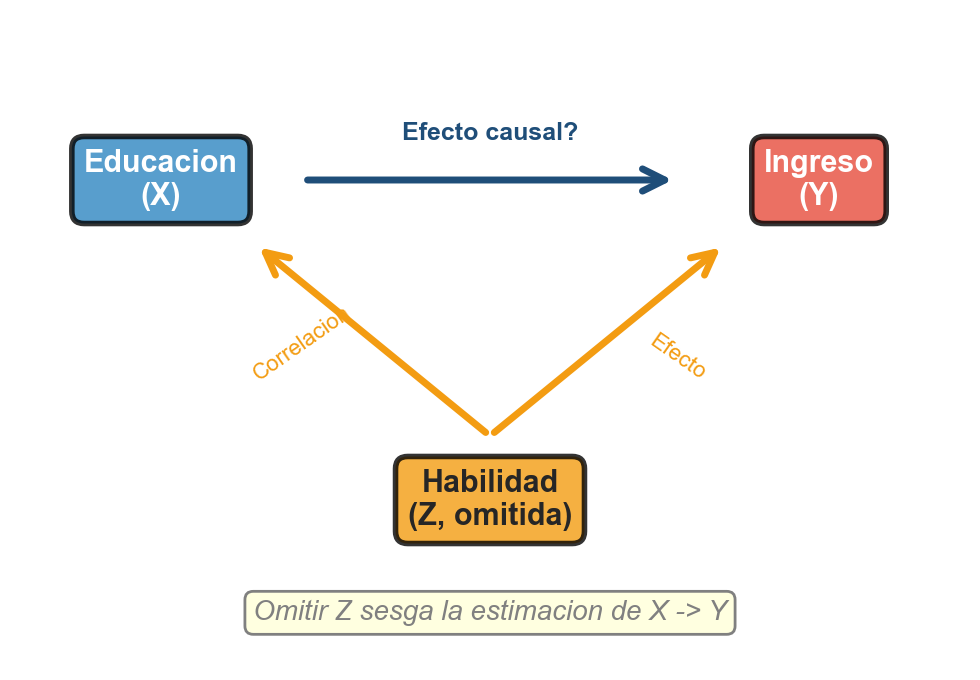
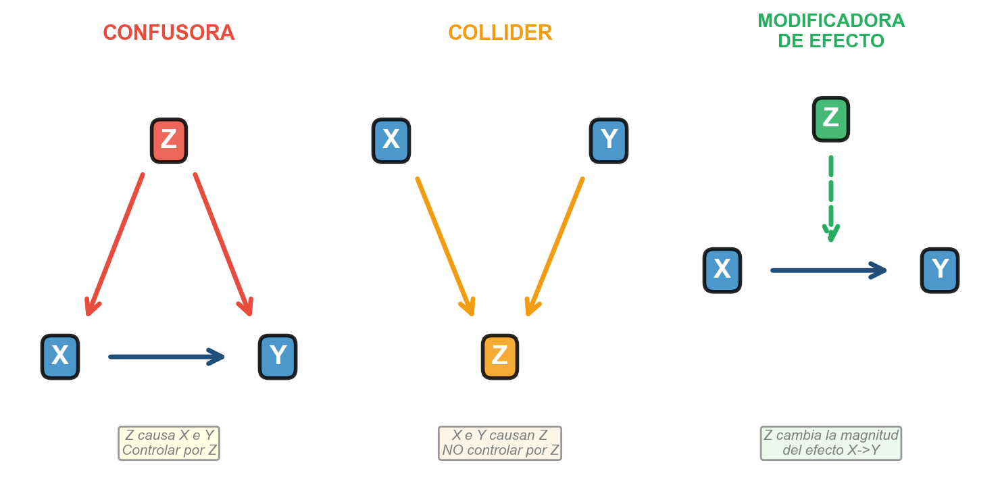
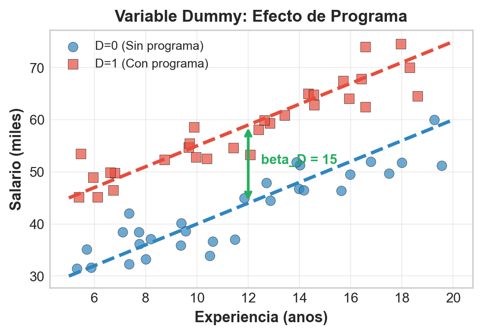
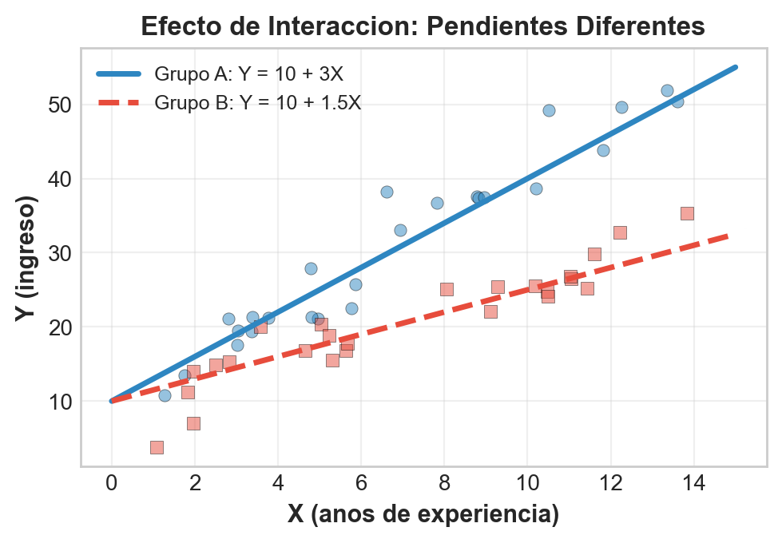
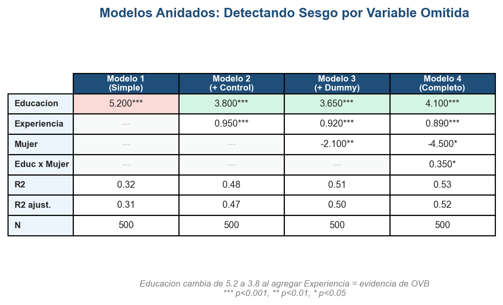
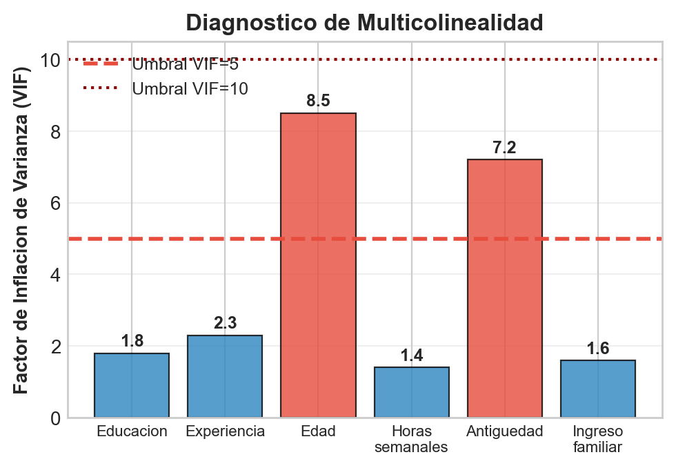

```{r}
#| label: setup
#| echo: false
library(tidyverse)
library(knitr)
library(broom)
library(plotly)
library(car)
library(lmtest)
library(sandwich)
library(modelsummary)
theme_set(theme_minimal(base_size = 13))
options(knitr.kable.NA = "")
azul <- "#1F4E79"; celeste <- "#2E86C1"; rojo <- "#E74C3C"; verde <- "#27AE60"; naranja <- "#F39C12"; morado <- "#8E44AD"
# En HTML (revealjs) los graficos se vuelven interactivos con plotly;
# en Beamer (PDF) se mantienen estaticos.
es_html <- knitr::is_html_output()
interactivo <- function(p) {
  if (es_html) plotly::config(plotly::ggplotly(p), displayModeBar = FALSE) else p
}

# Datos simulados: mercado laboral (educacion, experiencia, genero)
# DGP conocido -> permite evaluar cada especificacion contra la "verdad"
set.seed(42)
n <- 200
datos <- tibble(
  educacion = pmax(rnorm(n, mean = 13, sd = 3), 8),
  experiencia = pmax(rnorm(n, mean = 15, sd = 10), 0),
  mujer = rbinom(n, size = 1, prob = 0.5),
  log_ingreso = 9 + 0.15 * educacion + 0.08 * experiencia +
    0.25 * mujer - 0.04 * educacion * mujer + rnorm(n, sd = 0.3),
  ingreso = exp(log_ingreso),
  ingreso_miles = ingreso / 1000,
  genero = factor(mujer, levels = c(0, 1), labels = c("Hombre", "Mujer"))
)
```

## Panorama de la sesión

| Bloque | Concepto clave | Herramienta en R |
|---|---|---|
| Del simple al múltiple | efecto parcial, *ceteris paribus* | `lm(y ~ x1 + x2)` |
| Sesgo de variable omitida | fórmula y dirección del sesgo | simulación, modelos anidados |
| Estructuras causales | confusora, collider, mediadora | DAGs |
| Dummies e interacciones | categoría de referencia, efecto heterogéneo | `factor()`, `x1 * x2` |
| Inferencia conjunta | $R^2$ ajustado, prueba F | `anova()`, `glance()` |
| Diagnósticos | VIF, residuos, heterocedasticidad | `vif()`, `bptest()`, `vcovHC()` |

::: {.callout-note appearance="simple"}
**Datos de trabajo:** microdatos simulados de mercado laboral (n = 200): educación, experiencia, género e ingreso. Como el modelo generador es conocido, podremos comparar cada especificación contra el **efecto verdadero** — el lujo que nunca tenemos con datos reales.
:::

## Del modelo simple al múltiple

**Regresión simple:** todo lo que no es $X$ queda escondido en el error
$$Y = \beta_0 + \beta_1 X + \varepsilon$$

**Regresión múltiple:** los controles salen del error y entran al modelo
$$Y = \beta_0 + \beta_1 X_1 + \beta_2 X_2 + \cdots + \beta_k X_k + \varepsilon, \qquad \hat{\boldsymbol{\beta}} = (\mathbf{X}^\top\mathbf{X})^{-1}\mathbf{X}^\top\mathbf{Y}$$

- $\beta_j$ es el **efecto parcial** de $X_j$ sobre $Y$, manteniendo constantes los demás regresores (*ceteris paribus*): comparar **comparables**.
- Requisitos: $(\mathbf{X}^\top\mathbf{X})$ invertible (sin colinealidad perfecta) y **exogeneidad**, $E[\varepsilon \mid \mathbf{X}] = 0$.
- En evaluación de políticas, la pregunta nunca es "¿qué variables suben el $R^2$?" sino "¿qué controles necesito para aislar el efecto causal?".

## Datos de trabajo: un mercado laboral simulado

Modelo generador (la "verdad" que intentaremos recuperar):

$$\log(\text{Ingreso}) = 9 + 0.15\,\text{Educ} + 0.08\,\text{Exper} + 0.25\,\text{Mujer} - 0.04\,(\text{Educ} \times \text{Mujer}) + \varepsilon$$

```{r}
#| label: tabla-datos
#| echo: false
datos %>%
  select(educacion, experiencia, genero, log_ingreso, ingreso) %>%
  head(4) %>%
  mutate(ingreso = round(ingreso)) %>%
  kable(digits = 1)
```

- Retorno verdadero a la educación: **15% por año** para hombres y **11%** para mujeres (hay interacción).
- La experiencia suma un 8% por año; el error tiene DE 0.3 (heterogeneidad no observada).

## Sesgo de variable omitida: la anatomía del problema

:::: {.columns}

::: {.column width="44%"}
```{r}
#| label: img-ovb-dag
#| echo: false
#| out.width: "96%"

```
:::

::: {.column width="56%"}
**Modelo verdadero:** $Y = \beta_0 + \beta_1 X + \beta_2 Z + \varepsilon$

**Modelo corto (omite $Z$):** $Y = \beta_0 + \beta_1 X + u$

Hay sesgo **solo si se cumplen ambas**:

1. $Z$ afecta a $Y$: $\beta_2 \neq 0$
2. $Z$ se correlaciona con $X$: $\text{Cov}(X, Z) \neq 0$

$$\text{Sesgo}(\hat{\beta}_1) = \beta_2 \cdot \frac{\text{Cov}(X, Z)}{\text{Var}(X)}$$

El estimador queda **sesgado e inconsistente**: más datos no arreglan el problema.
:::

::::

## ¿Hacia dónde apunta el sesgo?

La fórmula del sesgo permite **firmar** el error antes de tener los datos:

| Efecto de $Z$ sobre $Y$ | $\text{Cov}(X, Z) > 0$ | $\text{Cov}(X, Z) < 0$ |
|---|---|---|
| $\beta_2 > 0$ | Sesgo **positivo**: sobreestima | Sesgo **negativo**: subestima |
| $\beta_2 < 0$ | Sesgo **negativo**: subestima | Sesgo **positivo**: sobreestima |

::: {.callout-important appearance="simple"}
**Ejemplo clásico:** retorno a la educación omitiendo *habilidad*. La habilidad aumenta el salario ($\beta_2 > 0$) y se correlaciona positivamente con los años de estudio ($\text{Cov} > 0$) $\Rightarrow$ el modelo corto **exagera** el retorno a la educación. Antes de estimar, ya sabemos en qué dirección desconfiar.
:::

## Simulación: el modelo corto exagera el retorno

```{r}
#| label: sim-ovb
set.seed(123); n_s <- 300
sim <- tibble(
  habilidad = rnorm(n_s),
  educ = 12 + 1.5 * habilidad + rnorm(n_s, 0, 1.5),
  log_sal = 8 + 0.08 * educ + 0.35 * habilidad + rnorm(n_s, 0, 0.25))
corto <- lm(log_sal ~ educ, data = sim)
largo <- lm(log_sal ~ educ + habilidad, data = sim)
```

```{r}
#| label: tabla-ovb
#| echo: false
tibble(
  Modelo = c("Verdadero (DGP)", "Corto: omite habilidad", "Largo: controla habilidad"),
  `Coef. educación` = c(0.080, coef(corto)["educ"], coef(largo)["educ"])
) %>% kable(digits = 3)
```

El sesgo observado ($0.183 - 0.073 = 0.110$) coincide con la fórmula: $0.35 \times \text{Cov}(\text{educ}, \text{hab}) / \text{Var}(\text{educ}) \approx 0.111$.

## La confusora a la vista: dos rectas, dos historias

:::: {.columns}

::: {.column width="46%"}
```{r}
#| label: code-ovb-scatter
#| eval: false
b <- coef(largo)
ggplot(sim,
       aes(educ, log_sal)) +
  geom_point(aes(color = habilidad),
             alpha = .8) +
  geom_smooth(method = "lm",
              se = FALSE,
              color = rojo) +
  geom_abline(intercept = b[1],
              slope = b[2],
              color = verde,
              linewidth = 1.1) +
  scale_color_gradient(
    low = "#F9E79F", high = azul)
```

Recta **roja**: modelo corto (pendiente 0.18). Recta **verde**: modelo largo, a habilidad media (pendiente 0.07). La educación "hereda" el efecto de la habilidad omitida.
:::

::: {.column width="54%"}
```{r}
#| label: plot-ovb-scatter
#| echo: false
#| fig-width: 5.6
#| fig-height: 3.9
#| out.width: "100%"
b <- coef(largo)
interactivo(
  ggplot(sim, aes(educ, log_sal)) +
    geom_point(aes(color = habilidad), alpha = .8, size = 1.6) +
    geom_smooth(method = "lm", se = FALSE, color = rojo, linewidth = 1.1) +
    geom_abline(intercept = b[1], slope = b[2],
                color = verde, linewidth = 1.1) +
    scale_color_gradient(low = "#F9E79F", high = azul) +
    labs(x = "Años de educación", y = "log(salario)",
         color = "Habilidad")
)
```
:::

::::

## Tres estructuras causales: el DAG decide

```{r}
#| label: img-dag
#| echo: false
#| out.width: "80%"

```

La misma variable $Z$ exige acciones **opuestas** según su rol causal: el diagrama, no la correlación, dicta la especificación.

## Confusora: controlar, siempre

:::: {.columns}

::: {.column width="50%"}
**Estructura:** $X \leftarrow Z \rightarrow Y$

**Cómo reconocerla:**

- $Z$ está asociada con $X$ (la exposición)
- $Z$ afecta a $Y$ por un canal propio
- $Z$ **no** es consecuencia de $X$ (ocurre "antes")

**Acción:** incluir $Z$ en el modelo. Controlar **cierra** el camino espurio $X \leftarrow Z \rightarrow Y$.
:::

::: {.column width="50%"}
::: {.callout-tip appearance="simple"}
**Política pública:** ¿la educación ($X$) aumenta el ingreso ($Y$)? El nivel socioeconómico familiar ($Z$) financia más años de estudio **y** abre redes laborales. Sin controlar por $Z$, atribuimos a la escuela lo que hace la cuna.
:::

::: {.callout-note appearance="simple"}
Lo mismo con un **programa de empleo**: si los municipios más pobres reciben más cobertura, la pobreza comunal confunde el efecto del programa sobre la empleabilidad.
:::
:::

::::

## Collider: controlar introduce sesgo

:::: {.columns}

::: {.column width="46%"}
**Estructura:** $X \rightarrow Z \leftarrow Y$

- $Z$ es **consecuencia común** de $X$ y de $Y$
- Sin controlar: no hay sesgo
- Condicionar en $Z$ **abre** un camino espurio (paradoja de Berkson)

**Ejemplo:** una beca se asigna por mérito académico **o** por vulnerabilidad. Entre los becados, mérito y vulnerabilidad se correlacionan **negativamente** aunque en la población sean independientes.
:::

::: {.column width="54%"}
```{r}
#| label: plot-berkson
#| echo: false
#| fig-width: 5.4
#| fig-height: 3.5
#| out.width: "100%"
set.seed(7)
beca <- tibble(
  merito = rnorm(400),
  vulnerabilidad = rnorm(400),
  estado = ifelse(merito + vulnerabilidad + rnorm(400, 0, .4) > 1,
                  "Becado", "No becado"))
p <- ggplot(beca, aes(merito, vulnerabilidad, color = estado)) +
  geom_point(alpha = .6, size = 1.5) +
  geom_smooth(data = filter(beca, estado == "Becado"),
              method = "lm", se = FALSE, color = rojo, linewidth = 1.1) +
  scale_color_manual(values = c("Becado" = naranja, "No becado" = "grey65")) +
  labs(x = "Mérito académico (z)", y = "Vulnerabilidad (z)",
       color = NULL, title = "Analizar solo becados inventa una correlación") +
  theme(legend.position = "top")
interactivo(p)
```
:::

::::

## Mediadora: depende de la pregunta

**Estructura:** $X \rightarrow Z \rightarrow Y$ — la variable $Z$ es parte del **mecanismo** por el que $X$ actúa.

- **Efecto total** de $X$ (lo que suele importar para decidir la política): **no** controlar por $Z$.
- **Efecto directo** (¿queda efecto fuera del mecanismo?): controlar por $Z$, sabiendo que se descuenta el canal mediado.

::: {.callout-warning appearance="simple"}
**Política pública:** capacitación laboral ($X$) $\rightarrow$ empleo formal ($Z$) $\rightarrow$ ingreso ($Y$). Si evaluamos la capacitación "controlando por empleo", borramos justamente el canal por el que el programa funciona y concluimos, erróneamente, que "no tiene efecto".
:::

La **modificadora de efecto** es distinta: no está en el camino causal, pero cambia la magnitud del efecto de $X$ — se modela con una **interacción** (lo veremos en unas slides).

## ¿Controlar o no controlar? Hoja de ruta

| Rol de $Z$ | Estructura | ¿Controlar? | Costo de equivocarse |
|---|---|---|---|
| Confusora | $X \leftarrow Z \rightarrow Y$ | **Sí, siempre** | Omitirla $\Rightarrow$ OVB |
| Collider | $X \rightarrow Z \leftarrow Y$ | **No, nunca** | Controlar abre camino espurio |
| Mediadora | $X \rightarrow Z \rightarrow Y$ | Total: no · Directo: sí | Controlar absorbe el efecto |
| Modificadora | $Z$ altera el efecto $X \rightarrow Y$ | Interacción $X \times Z$ | Sin ella, solo efecto promedio |

::: {.callout-important appearance="simple"}
Criterio práctico: **dibujar el DAG antes de escribir `lm()`**. No todo lo que correlaciona con $X$ e $Y$ es un control válido — la lista de covariables es una decisión causal, no estadística.
:::

## Variables dummy: categorías en la regresión

:::: {.columns}

::: {.column width="50%"}
$$\text{Mujer}_i = \begin{cases} 1 & \text{si mujer} \\ 0 & \text{si hombre} \end{cases}$$

$$Y = \beta_0 + \beta_1 \text{Educ} + \beta_2 \text{Mujer} + \varepsilon$$

- $\beta_0$: intercepto de la **categoría de referencia** (hombres)
- $\beta_2$: brecha promedio mujer–hombre, a igual educación
- Con $C$ categorías se crean $C-1$ dummies; la omitida es la base (`relevel()` la cambia)
:::

::: {.column width="50%"}
```{r}
#| label: img-dummy
#| echo: false
#| out.width: "100%"

```
:::

::::

## Dummy en R: brecha de género condicional

```{r}
#| label: mod-dummy
m3 <- lm(log_ingreso ~ educacion + experiencia + mujer, data = datos)
tidy(m3) %>% kable(digits = 3)
```

- La dummy desplaza el **intercepto**: dos rectas paralelas, separadas por $\hat{\beta}_{\text{mujer}} = -0.256$.
- En un modelo log-lineal: las mujeres ganan $e^{-0.256}-1 \approx -23\%$ **a igual educación y experiencia**.
- Ojo: es la brecha **promedio**; el DGP tiene interacción, así que la brecha real varía con la educación.

## Interacciones: el efecto marginal deja de ser constante

:::: {.columns}

::: {.column width="52%"}
$$Y = \beta_0 + \beta_1 \text{Educ} + \beta_2 \text{Mujer} + \beta_3 (\text{Educ} \times \text{Mujer}) + \varepsilon$$

El efecto de la educación ahora **depende** del género:

$$\frac{\partial Y}{\partial \text{Educ}} = \beta_1 + \beta_3 \cdot \text{Mujer}$$

- $\beta_1$: retorno para **hombres** (base)
- $\beta_1 + \beta_3$: retorno para **mujeres**
- $\beta_2$: brecha de intercepto cuando $\text{Educ} = 0$ (extrapolación: interpretar con cautela)
:::

::: {.column width="48%"}
```{r}
#| label: img-interaccion
#| echo: false
#| out.width: "100%"

```
:::

::::

## Interacción en R: retornos distintos por género

```{r}
#| label: mod-interaccion
m4 <- lm(log_ingreso ~ educacion * mujer + experiencia, data = datos)
tidy(m4) %>% kable(digits = 3)
```

- Retorno hombres: **15.9%** por año; retorno mujeres: $0.159 - 0.053 =$ **10.6%** (DGP: 15% y 11%).
- $\hat{\beta}_3 = -0.053$ con $p = 0.001$: el género es una **modificadora de efecto** del retorno educativo.
- Implicancia de política: un subsidio educativo uniforme genera ganancias **heterogéneas** por grupo.

## Rectas paralelas (dummy) vs pendientes distintas (interacción)

:::: {.columns}

::: {.column width="46%"}
```{r}
#| label: code-rectas
#| eval: false
grid <- expand_grid(
  educacion = seq(8, 20, .5),
  mujer = c(0, 1),
  experiencia = 15)
pred <- bind_rows(
  mutate(grid,
    m = "Solo dummy",
    y = predict(m3, grid)),
  mutate(grid,
    m = "Con interacción",
    y = predict(m4, grid)))
ggplot(pred,
       aes(educacion, y,
           color = factor(mujer))) +
  geom_line(linewidth = 1.1) +
  facet_wrap(~ m)
```
:::

::: {.column width="54%"}
```{r}
#| label: plot-rectas
#| echo: false
#| fig-width: 5.6
#| fig-height: 3.9
#| out.width: "100%"
grid <- expand_grid(educacion = seq(8, 20, .5), mujer = c(0, 1),
                    experiencia = 15)
pred <- bind_rows(
  mutate(grid, m = "Solo dummy: paralelas", y = predict(m3, grid)),
  mutate(grid, m = "Con interacción: divergen", y = predict(m4, grid))) %>%
  mutate(m = factor(m, levels = c("Solo dummy: paralelas",
                                  "Con interacción: divergen")))
interactivo(
  ggplot(pred, aes(educacion, y, color = factor(mujer, labels = c("Hombre", "Mujer")))) +
    geom_line(linewidth = 1.1) +
    facet_wrap(~ m) +
    scale_x_continuous(breaks = seq(8, 20, 4)) +
    scale_color_manual(values = c(Hombre = celeste, Mujer = rojo)) +
    labs(x = "Años de educación", y = "log(ingreso) predicho", color = NULL) +
    theme(legend.position = "top")
)
```
:::

::::

## $R^2$ ajustado: pagar por cada parámetro

$$R^2_{\text{aj}} = 1 - (1 - R^2)\,\frac{n-1}{n-k-1}$$

```{r}
#| label: mod-anidados
m1 <- lm(log_ingreso ~ educacion, data = datos)
m2 <- lm(log_ingreso ~ educacion + experiencia, data = datos)
list(M1 = m1, M2 = m2, M3 = m3, M4 = m4) %>%
  map_dfr(glance, .id = "Modelo") %>%
  select(Modelo, r.squared, adj.r.squared, AIC) %>% kable(digits = 3)
```

- El $R^2$ **nunca baja** al agregar regresores: no sirve para elegir entre especificaciones.
- El ajustado (y AIC/BIC) penaliza parámetros: premia el ajuste **parsimonioso**.
- Un $R^2$ alto no valida el modelo causal: un collider también "sube el $R^2$".

## Prueba F: significancia conjunta

$$H_0: \beta_{q_1} = \cdots = \beta_{q_m} = 0 \qquad F = \frac{(R^2_{nr} - R^2_{r})/q}{(1 - R^2_{nr})/(n-k-1)} \sim F_{q,\,n-k-1}$$

```{r}
#| label: test-f
anova(m3, m4) %>% tidy() %>%
  mutate(Modelo = c("M3 (restringido)", "M4 (+ interacción)")) %>%
  select(Modelo, df.residual, rss, statistic, p.value) %>% kable(digits = 3)
```

- `anova(m3, m4)` contrasta modelos **anidados**: ¿aportan las variables extra en conjunto?
- Aquí $F = 11.2$, $p = 0.001$: la interacción educación $\times$ género mejora el modelo.
- Uso típico: bloques de dummies (regiones, cohortes) donde ningún coeficiente individual "brilla" pero el bloque sí importa.

## Modelos anidados: la tabla que delata el OVB

```{r}
#| label: img-anidados
#| echo: false
#| out.width: "58%"

```

Señal de OVB: el coeficiente de interés **cambia sustancialmente** (regla práctica: más de 20%) al sumar un control con sentido teórico. Estabilidad del coeficiente = especificación robusta.

## Estabilidad del coeficiente de educación

:::: {.columns}

::: {.column width="46%"}
```{r}
#| label: code-coefs
#| eval: false
coefs <- list(M1 = m1, M2 = m2,
              M3 = m3, M4 = m4) %>%
  map_dfr(
    ~ tidy(.x, conf.int = TRUE),
    .id = "modelo") %>%
  filter(term == "educacion")
ggplot(coefs,
       aes(modelo, estimate)) +
  geom_pointrange(
    aes(ymin = conf.low,
        ymax = conf.high),
    color = azul) +
  geom_hline(yintercept = 0.15,
             linetype = "dashed",
             color = rojo)
```

La línea roja es el retorno verdadero del grupo base (0.15). En M4 el coeficiente es el retorno de **hombres**; en M1–M3, un promedio.
:::

::: {.column width="54%"}
```{r}
#| label: plot-coefs
#| echo: false
#| fig-width: 5.6
#| fig-height: 3.9
#| out.width: "100%"
coefs <- list(M1 = m1, M2 = m2, M3 = m3, M4 = m4) %>%
  map_dfr(~ tidy(.x, conf.int = TRUE), .id = "modelo") %>%
  filter(term == "educacion")
interactivo(
  ggplot(coefs, aes(modelo, estimate)) +
    geom_pointrange(aes(ymin = conf.low, ymax = conf.high),
                    color = azul, linewidth = .9, size = .55) +
    geom_hline(yintercept = 0.15, linetype = "dashed", color = rojo) +
    labs(x = NULL, y = "Coeficiente de educación (IC 95%)")
)
```
:::

::::

## Tabla profesional de modelos con `modelsummary`

```{r}
#| label: tabla-modelsummary
#| echo: false
modelsummary(
  list("M1" = m1, "M3" = m3, "M4" = m4),
  output = "markdown", stars = TRUE,
  coef_map = c(educacion = "Educación", experiencia = "Experiencia",
               mujer = "Mujer", "educacion:mujer" = "Educación × Mujer"),
  gof_map = c("nobs", "r.squared", "adj.r.squared"))
```

Código: `modelsummary(list(m1, m3, m4), stars = TRUE)`.

## Multicolinealidad: síntoma y medición (VIF)

$$\text{Var}(\hat{\beta}_j) = \frac{\sigma^2}{(1 - R_j^2)\sum_i (X_{ij} - \bar{X}_j)^2} \qquad \text{VIF}_j = \frac{1}{1 - R_j^2}$$

```{r}
#| label: vif-calc
vif(m3)
set.seed(99)
datos2 <- datos %>% mutate(edad = 6 + educacion + experiencia + rnorm(n, 0, 2))
vif(lm(log_ingreso ~ educacion + experiencia + edad + mujer, data = datos2))
```

Agregar `edad` (que es casi $6 + \text{educ} + \text{exper}$) dispara el VIF de `experiencia` y `edad` por sobre 20: la misma información entra dos veces y los EE explotan.

## VIF: qué hacer y qué no hacer

:::: {.columns}

::: {.column width="48%"}
```{r}
#| label: img-vif
#| echo: false
#| out.width: "100%"

```
:::

::: {.column width="52%"}
**Qué hacer** (VIF > 10 en un control):

- Eliminar redundancias **por teoría** (edad vs experiencia miden lo mismo)
- Combinar variables en índices
- Aceptarla si solo afecta controles, no la variable de interés

**Qué NO hacer:**

- Botar la **variable de interés** o una confusora clave por su VIF
- Tratarla como sesgo: la multicolinealidad **no sesga**, solo reduce precisión
- "Resolverla" con selección automática por p-valores
:::

::::

## Diagnóstico de residuos: los tres gráficos de rigor

```{r}
#| label: plot-diagnosticos
#| echo: false
#| fig-height: 3.2
std <- rstandard(m3)
ddf <- bind_rows(
  tibble(x = fitted(m3), y = residuals(m3), panel = "1 · Residuos vs ajustados"),
  tibble(x = qnorm(ppoints(length(std))), y = sort(std), panel = "2 · Q-Q normal"),
  tibble(x = fitted(m3), y = sqrt(abs(std)), panel = "3 · Escala-localización"))
refs_h <- tibble(panel = "1 · Residuos vs ajustados", yint = 0)
refs_qq <- tibble(panel = "2 · Q-Q normal", x = c(-2.8, 2.8), y = c(-2.8, 2.8))
p <- ggplot(ddf, aes(x, y)) +
  geom_point(alpha = .5, color = celeste, size = 1.2) +
  geom_hline(data = refs_h, aes(yintercept = yint),
             color = rojo, linetype = "dashed") +
  geom_line(data = refs_qq, aes(x, y), color = rojo, linetype = "dashed") +
  facet_wrap(~ panel, scales = "free") +
  labs(x = NULL, y = NULL)
interactivo(p)
```

**1:** media cero y sin patrón $\Rightarrow$ forma funcional correcta. **2:** puntos sobre la diagonal $\Rightarrow$ normalidad. **3:** banda horizontal $\Rightarrow$ varianza constante. En R base: `plot(m3)`.

## Heterocedasticidad: el abanico en los residuos

```{r}
#| label: plot-heteroced
#| echo: false
#| fig-height: 3.2
m_niv <- lm(ingreso_miles ~ educacion + experiencia + mujer, data = datos)
het <- bind_rows(
  tibble(ajustados = fitted(m_niv), residuos = residuals(m_niv),
         modelo = "Ingreso en niveles: abanico"),
  tibble(ajustados = fitted(m3), residuos = residuals(m3),
         modelo = "log(ingreso): varianza estable")) %>%
  mutate(modelo = factor(modelo, levels = c("Ingreso en niveles: abanico",
                                            "log(ingreso): varianza estable")))
p <- ggplot(het, aes(ajustados, residuos)) +
  geom_point(alpha = .5, color = celeste, size = 1.3) +
  geom_hline(yintercept = 0, linetype = "dashed", color = rojo) +
  facet_wrap(~ modelo, scales = "free") +
  labs(x = "Valores ajustados", y = "Residuos")
interactivo(p)
```

Con $\text{Var}(\varepsilon_i)$ creciente, MCO sigue siendo **insesgado**, pero los EE clásicos son inválidos: los t y los IC mienten. Típico en ingresos, gasto municipal, matrícula.

## Breusch-Pagan y errores estándar robustos

```{r}
#| label: bp-robusto
m_niv <- lm(ingreso_miles ~ educacion + experiencia + mujer, data = datos)
bptest(m_niv)
```

```{r}
#| label: tabla-robusto
#| echo: false
tibble(
  Término = names(coef(m_niv)),
  Estimación = coef(m_niv),
  `EE clásico` = sqrt(diag(vcov(m_niv))),
  `EE robusto (HC1)` = sqrt(diag(vcovHC(m_niv, type = "HC1")))
) %>% filter(Término != "(Intercept)") %>% kable(digits = 1)
```

- BP rechaza $H_0$ ($p < 0.001$): inferir con `coeftest(m_niv, vcov = vcovHC(m_niv, "HC1"))` — cambia el EE, no $\hat{\beta}$.
- Alternativa aquí: modelar $\log(\text{ingreso})$ — el BP sobre `m3` ya no rechaza ($p = 0.81$).

## Qué NO hacer en regresión múltiple

| Práctica | Por qué falla | Alternativa |
|---|---|---|
| Controlar por colliders o mediadores | Introduce sesgo / borra el efecto | DAG antes de `lm()` |
| *Kitchen sink*: meter todo lo disponible | Colliders, VIF alto, sobreajuste | Controles justificados causalmente |
| Elegir variables por las estrellitas | p-hacking; invalida la inferencia | Especificación por teoría + robustez |
| Perseguir el $R^2$ máximo | $R^2$ no mide causalidad | Pregunta causal y diseño |
| Ignorar la heterocedasticidad | EE y p-valores inválidos | EE robustos, logs |

::: {.callout-warning appearance="simple"}
Una regresión con 30 controles no es "más rigurosa": cada control es una **afirmación causal** que hay que poder defender.
:::

## Síntesis: checklist del análisis de regresión múltiple

:::: {.columns}

::: {.column width="55%"}
**Antes y después de `lm()`**

1. Dibujar el DAG: confusoras sí, colliders no, mediadoras según la pregunta
2. Firmar el sesgo esperado con la fórmula del OVB
3. Reportar modelos anidados y la estabilidad del coeficiente de interés
4. Dummies con categoría de referencia explícita; interacciones para heterogeneidad
5. F para bloques; $R^2$ ajustado / AIC para parsimonia
6. VIF, residuos y Breusch-Pagan; EE robustos si corresponde
:::

::: {.column width="45%"}
**Funciones R de esta sesión**

`lm()` `tidy()` `glance()` `predict()` `anova()` `relevel()` `car::vif()` `lmtest::bptest()` `lmtest::coeftest()` `sandwich::vcovHC()` `modelsummary()`

**Próxima sesión:** práctica integradora en R con datos reales.
:::

::::

## Ejercicio para practicar (30 min)

Con `data("wage1", package = "wooldridge")` (526 trabajadores, EE.UU.):

1. Estime los modelos anidados: M1 `lwage ~ educ`; M2 `+ exper + tenure`; M3 `+ female`; M4 `lwage ~ educ * female + exper + tenure`.
2. ¿Cambia el retorno a la educación más de 20% entre M1 y M2? ¿Qué confusora explica el cambio y cuál es la dirección del sesgo según la fórmula?
3. Contraste M3 vs M4 con `anova()`. Si la interacción es significativa, ¿qué rol causal juega `female`?
4. Calcule `vif()` en M3 y aplique `bptest()`. Si hay heterocedasticidad, reestime los EE con `vcovHC()` y compare la inferencia.
5. Presente M1–M4 con `modelsummary()`: ¿cuál especificación defendería ante un comité de política pública y por qué?

::: {.callout-note appearance="simple"}
**Referencias:** Wooldridge, *Introductory Econometrics* (caps. 3–8) · Angrist & Pischke, *Mostly Harmless Econometrics* (cap. 3) · Cunningham, *Causal Inference: The Mixtape* (DAGs) · Huntington-Klein, *The Effect*.
:::
