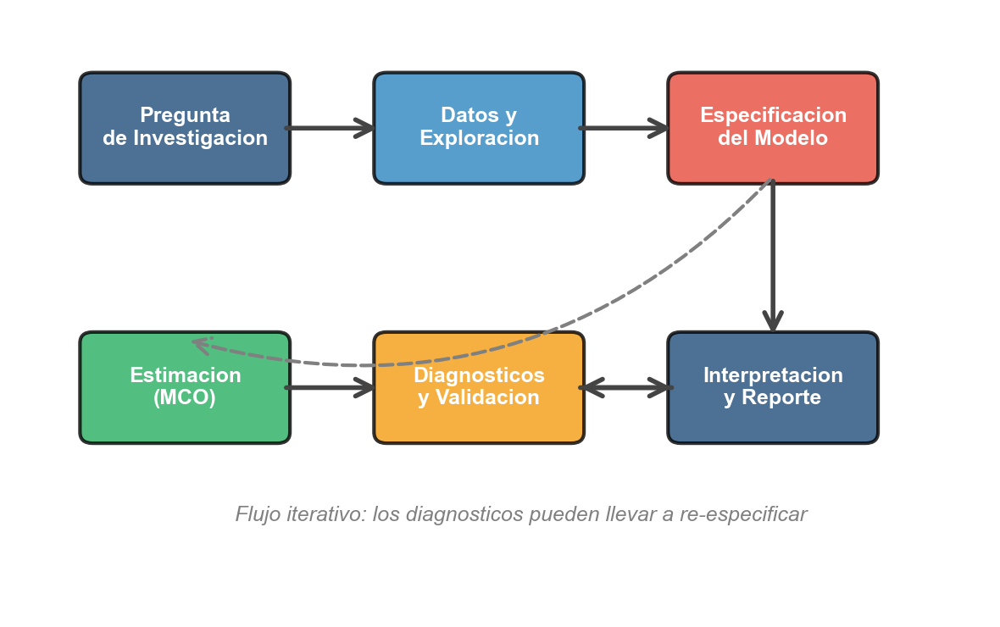

```{r}
#| label: setup
#| echo: false
library(tidyverse)
library(knitr)
library(broom)
library(lmtest)
library(modelsummary)
library(plotly)
theme_set(theme_minimal(base_size = 13))
azul <- "#1F4E79"; celeste <- "#2E86C1"; rojo <- "#E74C3C"; verde <- "#27AE60"; naranja <- "#F39C12"
# En HTML (revealjs) los graficos se vuelven interactivos con plotly;
# en Beamer (PDF) se mantienen estaticos.
es_html <- knitr::is_html_output()
interactivo <- function(p) {
  if (es_html) plotly::config(plotly::ggplotly(p), displayModeBar = FALSE) else p
}
```

## Panorama de la sesión

| Paso del análisis | Qué se hace | Herramienta en R |
|---|---|---|
| Pregunta y datos | pregunta, carga, diccionario | `read_csv()`, `glimpse()` |
| Inspección y limpieza | NA, valores imposibles | `filter()`, `drop_na()` |
| Descriptivos y gráficos | tabla por grupo, gráficos | `summarise()`, `ggplot2` |
| Contrastes previos | t, proporciones, chi-cuadrado | `t.test()`, `prop.test()` |
| Regresión simple | estimación, logs, IC, predicción | `lm()`, `broom`, `predict()` |
| Diagnóstico | residuos, Breusch-Pagan, Shapiro | `bptest()`, `shapiro.test()` |
| Informe | tabla final, lectura crítica | `modelsummary()` |

::: {.callout-note appearance="simple"}
**Datos de trabajo:** encuesta simulada de 150 hogares. Ventaja de simular: conocemos el proceso generador y al final compararemos lo **estimado** con lo **verdadero**.
:::

## El mapa: hoy recorremos el flujo completo

:::: {.columns}

::: {.column width="55%"}
```{r}
#| label: img-flujo-mapa
#| echo: false
#| out.width: "100%"

```
:::

::: {.column width="45%"}
- Las sesiones 1 y 2 dieron la teoría: **contrastes de hipótesis** y **MCO**.
- Hoy las integramos en **un solo caso**, de la pregunta de política al informe.
- Cada slide es un paso preciso: su código, su salida y una línea de interpretación.
- La regla de la práctica: **ningún número se reporta sin haber pasado por este flujo**.
:::

::::

## Paso 1 · Pregunta de política y estrategia empírica

| Elemento | En nuestro caso |
|---|---|
| Pregunta de política | ¿Cuánto mayor es el ingreso asociado a un año más de educación? |
| Variable dependiente ($Y$) | ingreso mensual del hogar (USD) |
| Variable explicativa ($X$) | años de educación del jefe de hogar |
| Parámetro objetivo | $\beta_1$ en $Y = \beta_0 + \beta_1 X + u$ |
| Contrastes previos | brechas por género y situación laboral (sesión 1) |
| Producto final | tabla de regresión + lectura crítica |

::: {.callout-warning appearance="simple"}
$\beta_1$ medirá **asociación**. Si además es causal (o no) se discute en el Paso 13 — y la respuesta honesta será "todavía no lo sabemos".
:::

## Paso 2 · Cargar datos reales: los formatos usuales

```{r}
#| label: code-carga
#| eval: false
# CSV (readr, parte del tidyverse)
encuesta <- read_csv("encuesta_hogares.csv")

# Excel
library(readxl)
encuesta <- read_excel("encuesta.xlsx", sheet = "datos")

# Stata / SPSS (archivos de encuestas oficiales)
library(haven)
encuesta <- read_dta("casen.dta")

# Directamente desde una URL
encuesta <- read_csv("https://ejemplo.org/datos.csv")
```

- Verificar siempre la **codificación** (UTF-8) y los **códigos de valores perdidos** (-99, 999, "NS/NR") que cada encuesta define en su manual.
- Hoy, en lugar de cargar, **simulamos** la encuesta: así controlamos la verdad.

## Paso 2 · La encuesta: 150 hogares simulados

```{r}
#| label: crea-encuesta
set.seed(2026)
n <- 150
encuesta <- tibble(
  educacion = round(pmin(pmax(rnorm(n, 13, 3), 4), 21)),
  genero    = sample(c("Hombre", "Mujer"), n, replace = TRUE, prob = c(0.52, 0.48)),
  region    = sample(c("Norte", "Centro", "Sur"), n, replace = TRUE,
                     prob = c(0.30, 0.45, 0.25)),
  empleo    = sample(c("Empleado", "Desempleado"), n, replace = TRUE,
                     prob = c(0.85, 0.15)),
  ingresos  = round(exp(6.2 + 0.09 * educacion + 0.15 * (genero == "Hombre") -
                        0.35 * (empleo == "Desempleado") + rnorm(n, 0, 0.30)))
)
encuesta$ingresos[c(17, 84)] <- NA   # dos hogares no reportan ingreso
encuesta$educacion[131] <- 99        # un error de digitacion
```

El proceso generador es **log-lineal**: el retorno verdadero de la educación es **9% por año**. Como en la vida real, la base llega con problemas sembrados: dos NA y un valor imposible.

## Diccionario de variables

| Variable | Tipo | Valores | Rol en el análisis |
|---|---|---|---|
| `ingresos` | continua de razón | USD mensuales | dependiente ($Y$) |
| `educacion` | discreta | 4–21 años | explicativa ($X$) |
| `genero` | nominal | Hombre / Mujer | contraste de brechas |
| `region` | nominal | Norte / Centro / Sur | contraste chi-cuadrado |
| `empleo` | nominal | Empleado / Desempleado | proporciones y brechas |

::: {.callout-tip appearance="simple"}
El diccionario se escribe **antes** de tocar los datos: define unidades, rangos válidos y el rol de cada variable. Sin él, no hay forma de detectar el `99` de educación como error.
:::

## Paso 3 · Inspección: ¿qué llegó en la base?

```{r}
#| label: inspeccion-glimpse
glimpse(encuesta)
```

- `educacion` e `ingresos` son numéricas; las otras tres, texto (categóricas).
- `glimpse()` muestra tipo y primeros valores de cada columna en una pantalla.
- Todavía **no** calculamos nada: primero hay que validar rangos y valores perdidos.

## Paso 3 · Limpieza: NA y valores imposibles

```{r}
#| label: limpieza-na
colSums(is.na(encuesta))       # ¿cuantos NA por variable?
range(encuesta$educacion)      # el maximo 99 es imposible
encuesta <- encuesta %>%
  filter(educacion <= 22) %>%  # elimina el error de digitacion
  drop_na()                    # elimina los ingresos no reportados
nrow(encuesta)
```

- Quedan **147 de 150** hogares: cada exclusión se **documenta** (cuántos, por qué).
- Regla de oro: nunca eliminar observaciones "en silencio" — el informe final debe poder reproducirse desde la base cruda.

## Paso 4 · Descriptivos: la tabla por grupo

```{r}
#| label: tabla-descriptiva
encuesta %>% group_by(genero) %>%
  summarise(n = n(), media = mean(ingresos), mediana = median(ingresos),
            de = sd(ingresos), educ_media = mean(educacion)) %>%
  mutate(across(where(is.numeric), ~ round(.x, 1))) %>%
  kable()
```

- La brecha de medias es de **105 USD** a favor de los hombres: ¿señal o ruido muestral? El Paso 6 lo contrasta formalmente.
- En ambos grupos la mediana está bajo la media: distribuciones con **cola derecha**.

## Paso 5 · La distribución del ingreso

:::: {.columns}

::: {.column width="46%"}
```{r}
#| label: code-hist-ing
#| eval: false
media_i   <- mean(encuesta$ingresos)
mediana_i <- median(encuesta$ingresos)

ggplot(encuesta, aes(x = ingresos)) +
  geom_histogram(bins = 22,
                 fill = celeste,
                 color = "white") +
  geom_vline(xintercept = media_i,
             color = rojo) +
  geom_vline(xintercept = mediana_i,
             color = verde) +
  labs(x = "Ingreso mensual (USD)",
       y = "N° de hogares")
```

Media (rojo) a la derecha de la mediana (verde): **sesgo positivo**, típico de ingresos. Anticipa la forma log del Paso 8.
:::

::: {.column width="54%"}
```{r}
#| label: plot-hist-ing
#| echo: false
#| fig-width: 5.6
#| fig-height: 3.9
#| out.width: "100%"
media_i   <- mean(encuesta$ingresos)
mediana_i <- median(encuesta$ingresos)
interactivo(
  ggplot(encuesta, aes(x = ingresos)) +
    geom_histogram(bins = 22, fill = celeste, color = "white") +
    geom_vline(xintercept = media_i, color = rojo, linewidth = 1) +
    geom_vline(xintercept = mediana_i, color = verde, linewidth = 1) +
    labs(x = "Ingreso mensual (USD)", y = "N° de hogares")
)
```
:::

::::

## Paso 5 · Educación e ingresos: el scatter clave

:::: {.columns}

::: {.column width="46%"}
```{r}
#| label: code-scatter-edu
#| eval: false
ggplot(encuesta,
       aes(x = educacion,
           y = ingresos)) +
  geom_jitter(width = 0.2,
              alpha = 0.5,
              color = azul) +
  geom_smooth(method = "lm",
              color = rojo) +
  labs(x = "Años de educación",
       y = "Ingreso mensual (USD)")
```

La recta MCO resume la asociación: pendiente positiva y nítida ($r = 0.61$). `geom_jitter()` separa los puntos apilados en cada año de educación.
:::

::: {.column width="54%"}
```{r}
#| label: plot-scatter-edu
#| echo: false
#| fig-width: 5.6
#| fig-height: 3.9
#| out.width: "100%"
interactivo(
  ggplot(encuesta, aes(x = educacion, y = ingresos)) +
    geom_jitter(width = 0.2, alpha = 0.5, color = azul) +
    geom_smooth(method = "lm", color = rojo) +
    labs(x = "Años de educación", y = "Ingreso mensual (USD)")
)
```
:::

::::

## Paso 6 · ¿Brecha por género? Prueba t de Welch

$H_0: \mu_H = \mu_M$ vs $H_1: \mu_H \neq \mu_M$, con $\alpha = 0.05$ (sesión 1).

```{r}
#| label: ttest-genero
t_gen <- t.test(ingresos ~ genero, data = encuesta)
tidy(t_gen) %>%
  select(estimate1, estimate2, statistic, p.value, conf.low, conf.high) %>%
  kable(digits = 3, col.names = c("media H", "media M", "t", "valor-p",
                                  "IC inf", "IC sup"))
```

- Con $p = 0.45$ **no se rechaza** $H_0$: la brecha de 105 USD es indistinguible del ruido.
- El IC 95% $[-170, 381]$ es ancho: con $n \approx 74$ por grupo la **potencia** es baja. Ausencia de evidencia no es evidencia de ausencia (el generador sí premia 15% a los hombres).

## Paso 6 · La brecha vista en el gráfico

:::: {.columns}

::: {.column width="46%"}
```{r}
#| label: code-box-gen
#| eval: false
ggplot(encuesta,
       aes(x = genero, y = ingresos,
           fill = genero)) +
  geom_boxplot(alpha = .6,
               outlier.color = rojo) +
  geom_jitter(width = .15,
              alpha = .3) +
  labs(x = NULL,
       y = "Ingreso mensual (USD)") +
  theme(legend.position = "none")
```

Las cajas se **superponen** casi por completo: la imagen es coherente con el $p = 0.45$ de la prueba t. Gráfico y contraste deben contarse la misma historia.
:::

::: {.column width="54%"}
```{r}
#| label: plot-box-gen
#| echo: false
#| fig-width: 5.6
#| fig-height: 3.9
#| out.width: "100%"
interactivo(
  ggplot(encuesta, aes(x = genero, y = ingresos, fill = genero)) +
    geom_boxplot(alpha = .6, outlier.color = rojo) +
    geom_jitter(width = .15, alpha = .3) +
    labs(x = NULL, y = "Ingreso mensual (USD)") +
    theme(legend.position = "none")
)
```
:::

::::

## Paso 6 · Desempleo: prueba de proporciones

¿La tasa de desempleo de la muestra difiere de la referencia nacional del 10%? $H_0: p = 0.10$.

```{r}
#| label: prop-desempleo
tab_empleo <- table(encuesta$empleo)
tab_empleo
prop.test(tab_empleo["Desempleado"], sum(tab_empleo), p = 0.10) %>%
  tidy() %>%
  select(estimate, statistic, p.value, conf.low, conf.high) %>%
  kable(digits = 3)
```

Con $\hat{p} = 0.177$ y $p = 0.003$ **se rechaza** $H_0$: la zona encuestada tiene un desempleo significativamente mayor que la referencia — dato relevante para focalizar el programa.

## Paso 6 · ¿Empleo y región asociados? Chi-cuadrado

```{r}
#| label: chi-tabla
tab_er <- table(encuesta$empleo, encuesta$region)
kable(tab_er)
```

```{r}
#| label: chi-prueba
chisq.test(tab_er) %>% tidy() %>% kable(digits = 3)
```

Con $p = 0.141$ **no se rechaza** la independencia: el desempleo no se concentra en una región. Requisito verificado: todas las frecuencias esperadas superan 5.

## Paso 7 · Primera regresión: lm()

$$\text{ingresos}_i = \beta_0 + \beta_1 \, \text{educacion}_i + u_i$$

```{r}
#| label: reg-niveles
m1 <- lm(ingresos ~ educacion, data = encuesta)
tidy(m1) %>%
  mutate(across(c(estimate, std.error, statistic), ~ round(.x, 1)),
         p.value = format.pval(p.value, digits = 2, eps = 0.001)) %>%
  kable()
```

- Nunca reportar el `summary()` completo: `broom::tidy()` entrega los coeficientes como tabla ordenada, lista para el informe.
- La ecuación estimada: $\widehat{\text{ingresos}} = -350 + 166.1 \cdot \text{educacion}$.

## Paso 7 · Interpretación de los coeficientes

$$\widehat{\text{ingresos}} = -350 + 166.1 \cdot \text{educacion}$$

- **Pendiente** ($\hat{\beta}_1 = 166$): cada año adicional de educación se **asocia** con 166 USD más de ingreso mensual promedio. Es la cifra que responde la pregunta de política — en niveles.
- **Intercepto** ($\hat{\beta}_0 = -350$): el "ingreso con 0 años de educación" es una **extrapolación sin soporte** — la educación mínima observada es 4 años. No se interpreta (y su $p = 0.15$ lo confirma irrelevante).
- Las unidades importan: $\hat{\beta}_1$ está en **USD por año de educación**; si $Y$ estuviera en miles, el coeficiente sería 0.166.

::: {.callout-important appearance="simple"}
Decir "se asocia" no es modestia retórica: es la diferencia entre describir la encuesta y afirmar que **más aulas producen** 166 USD. Lo segundo requiere el Paso 13.
:::

## Paso 8 · Forma funcional: el modelo en logs

```{r}
#| label: reg-log
m2 <- lm(log(ingresos) ~ educacion, data = encuesta)
tidy(m2) %>%
  mutate(across(c(estimate, std.error, statistic), ~ round(.x, 3)),
         p.value = format.pval(p.value, digits = 2, eps = 0.001)) %>%
  kable()
```

- Modelo **log-nivel**: $100 \cdot \hat{\beta}_1 \approx 8.5\%$ más de ingreso por año adicional de educación (una *semi-elasticidad*, el clásico retorno de Mincer).
- El generador usaba **9%**: la regresión lo recupera dentro del error muestral.
- El log respeta la naturaleza multiplicativa del ingreso y domará los residuos (Paso 12).

## Paso 9 · Bondad de ajuste: R²

```{r}
#| label: ajuste-glance
glance(m1) %>%
  select(r.squared, adj.r.squared, sigma, statistic, nobs) %>%
  kable(digits = 3, col.names = c("R2", "R2 ajustado", "sigma", "F", "n"))
```

- La educación explica el **36.9%** de la varianza del ingreso; el resto es heterogeneidad no modelada (experiencia, sector, suerte).
- $\hat{\sigma} = 670$ USD: el error típico de predicción del modelo en niveles.
- Un $R^2$ "bajo" **no invalida** el modelo para estimar $\beta_1$; y no comparar $R^2$ entre `m1` y `m2`: sus variables dependientes son distintas (niveles vs log).

## Paso 10 · Inferencia sobre β1: t e intervalo

$H_0: \beta_1 = 0$ (la educación no se asocia al ingreso) vs $H_1: \beta_1 \neq 0$.

```{r}
#| label: inferencia-beta1
tidy(m1, conf.int = TRUE) %>%
  filter(term == "educacion") %>%
  select(term, estimate, std.error, statistic, conf.low, conf.high) %>%
  kable(digits = 1)
```

- El estadístico es el de la sesión 1: $t = \hat{\beta}_1 / ee(\hat{\beta}_1) = 166.1 / 18 = 9.2$, con $p < 0.001$: **se rechaza** $H_0$ con holgura.
- Lectura equivalente: el IC 95% $[130, 202]$ **no contiene el cero**.
- La inferencia asume los supuestos MCO — que aún no verificamos (Paso 12): la tabla se firma solo después del diagnóstico.

## Paso 11 · Predicción: puntual y por intervalo

¿Qué ingreso predice el modelo para un hogar con 16 años de educación?

```{r}
#| label: prediccion-ic
nuevo <- tibble(educacion = 16)
predict(m1, nuevo, interval = "confidence")
predict(m1, nuevo, interval = "prediction")
```

- Puntual: **2.306 USD**. IC de **confianza** $[2.152, 2.461]$: dónde está el ingreso *promedio* de los hogares con 16 años.
- IC de **predicción** $[974, 3.639]$: dónde caerá un *hogar individual* — mucho más ancho porque suma la varianza de $u$.
- Error frecuente en informes: usar el IC de confianza para prometer resultados a nivel individual.

## Paso 12 · Diagnóstico visual: residuos

:::: {.columns}

::: {.column width="46%"}
```{r}
#| label: code-resid-m1
#| eval: false
diag1 <- tibble(
  ajustado = fitted(m1),
  residuo  = resid(m1))

ggplot(diag1,
       aes(ajustado, residuo)) +
  geom_point(alpha = .5,
             color = azul) +
  geom_hline(yintercept = 0,
             linetype = "dashed") +
  geom_smooth(se = FALSE,
              color = naranja) +
  labs(x = "Valores ajustados",
       y = "Residuos")
```

El **abanico** que se abre hacia la derecha es heterocedasticidad: la varianza del ingreso crece con su nivel.
:::

::: {.column width="54%"}
```{r}
#| label: plot-resid-m1
#| echo: false
#| fig-width: 5.6
#| fig-height: 3.9
#| out.width: "100%"
diag1 <- tibble(ajustado = fitted(m1), residuo = resid(m1))
interactivo(
  ggplot(diag1, aes(ajustado, residuo)) +
    geom_point(alpha = .5, color = azul) +
    geom_hline(yintercept = 0, linetype = "dashed") +
    geom_smooth(se = FALSE, color = naranja) +
    labs(x = "Valores ajustados", y = "Residuos")
)
```
:::

::::

## Paso 12 · Pruebas formales de los supuestos

```{r}
#| label: pruebas-formales
list("Shapiro (niveles)" = shapiro.test(resid(m1)),
     "Shapiro (log)"     = shapiro.test(resid(m2)),
     "Breusch-Pagan (niveles)" = bptest(m1),
     "Breusch-Pagan (log)"     = bptest(m2)) %>%
  map_df(tidy, .id = "prueba") %>%
  select(prueba, statistic, p.value) %>%
  mutate(statistic = round(statistic, 2), p.value = signif(p.value, 2)) %>%
  kable()
```

- En **niveles** se rechazan normalidad y homocedasticidad: la inferencia clásica de `m1` queda en duda.
- El **log** corrige la heterocedasticidad (BP: $p = 0.59$); la normalidad queda justa, pero con $n = 147$ el TCL protege los IC. Decisión: **reportar el modelo log** (próxima sesión: errores robustos con `sandwich`).

## Bonus · ggplotly(): interactividad en una línea

:::: {.columns}

::: {.column width="46%"}
```{r}
#| label: code-ggplotly
#| eval: false
library(plotly)

p <- ggplot(encuesta,
       aes(educacion, ingresos,
           color = empleo)) +
  geom_jitter(width = .2,
              alpha = .6) +
  labs(x = "Años de educación",
       y = "Ingreso (USD)")

ggplotly(p)   # eso es todo
```

`ggplotly()` convierte cualquier ggplot en un gráfico interactivo (tooltip, zoom, filtro por leyenda). Todas las figuras de esta sesión usan ese truco en la versión HTML; en el PDF quedan estáticas.
:::

::: {.column width="54%"}
```{r}
#| label: plot-ggplotly
#| echo: false
#| fig-width: 5.6
#| fig-height: 3.9
#| out.width: "100%"
interactivo(
  ggplot(encuesta, aes(educacion, ingresos, color = empleo)) +
    geom_jitter(width = .2, alpha = .6) +
    scale_color_manual(values = c(Empleado = celeste, Desempleado = rojo)) +
    labs(x = "Años de educación", y = "Ingreso (USD)", color = NULL) +
    theme(legend.position = "bottom")
)
```
:::

::::

## Paso 13 · ¿Es causal el 8.5%? Lectura crítica

| Amenaza | Mecanismo en este caso | Efecto sobre $\hat{\beta}_1$ |
|---|---|---|
| Variable omitida | la habilidad eleva educación e ingresos a la vez | sesgo al alza |
| Causalidad inversa | familias con más ingreso compran más educación | sesgo al alza |
| Selección muestral | los NA de ingreso rara vez son aleatorios | dirección incierta |
| Error de medición en $X$ | años de educación auto-reportados | atenuación (hacia 0) |

::: {.callout-important appearance="simple"}
Aquí conocemos el generador y el 8.5% **sí** es (casi) el efecto verdadero — lujo que los datos reales no dan. Con encuestas reales, pasar de asociación a causa exige **diseño**: experimentos, variables instrumentales, discontinuidades (sesiones siguientes del doctorado).
:::

## Paso 14 · Mini-informe: la tabla final

```{r}
#| label: informe-modelsummary
modelsummary(list("Ingresos (USD)" = m1, "log(Ingresos)" = m2),
             output = "markdown", fmt = 2,
             stars = c("*" = .05, "**" = .01, "***" = .001),
             gof_map = c("nobs", "r.squared"))
```

**Cómo se redacta:** "Cada año adicional de educación se asocia con ingresos 8.5% mayores (IC 95%: 6.6–10.3%; $p < 0.001$; $n = 147$). La estimación es asociativa, no causal."

## Síntesis: checklist del análisis integrador

:::: {.columns}

::: {.column width="55%"}
**Antes de entregar un informe**

1. Pregunta y parámetro objetivo definidos a priori
2. Diccionario de variables y exclusiones documentadas
3. Tabla descriptiva por grupo (siempre con $n$)
4. Gráfico exploratorio antes de cualquier modelo
5. Contrastes previos con hipótesis explícitas
6. Coeficientes interpretados en sus unidades
7. Diagnóstico de residuos antes de firmar la inferencia
8. Asociación y causalidad claramente separadas
:::

::: {.column width="45%"}
**Funciones de la sesión**

`glimpse()` `drop_na()` `t.test()` `prop.test()` `chisq.test()` `lm()` `tidy()` `glance()` `confint()` `predict()` `bptest()` `shapiro.test()` `ggplotly()` `modelsummary()`

**Próxima sesión:** Práctica Parte 2 — regresión múltiple, variables dummy, interacciones y errores robustos.
:::

::::

## Ejercicio para practicar (30 min)

Replique el flujo completo con datos **reales**: `data("wage1", package = "wooldridge")` (526 trabajadores, EE.UU. 1976; salario por hora `wage`, educación `educ`, mujer `female`).

1. Escriba el diccionario de `wage`, `educ`, `female` y revise NA y rangos.
2. Construya la tabla descriptiva de `wage` por género (n, media, mediana, DE).
3. Contraste la brecha salarial por género con la prueba t de Welch e interprete el IC.
4. Estime `wage ~ educ` y `log(wage) ~ educ`; interprete $\hat{\beta}_1$ en cada métrica y compare el retorno con el 8.5% de la encuesta simulada.
5. Grafique residuos vs ajustados y aplique `bptest()` y `shapiro.test()` a ambos modelos. ¿Cuál reportaría?
6. Prediga el salario con 16 años de educación con IC de confianza y de predicción, y explique la diferencia entre ambos a un tomador de decisiones.

::: {.callout-note appearance="simple"}
**Referencias:** Wooldridge, *Introductory Econometrics* (caps. 2, 4 y apéndice C) · Stock & Watson, *Introduction to Econometrics* (caps. 4–5) · Wickham & Grolemund, *R for Data Science* (importación y EDA).
:::
