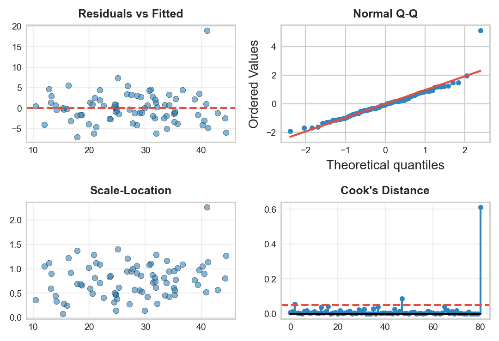

```{r}
#| label: setup
#| echo: false
library(tidyverse)
library(knitr)
library(scales)
library(broom)
library(car)
library(lmtest)
library(sandwich)
library(modelsummary)
library(plotly)
theme_set(theme_minimal(base_size = 13))
azul <- "#1F4E79"; celeste <- "#2E86C1"; rojo <- "#E74C3C"; verde <- "#27AE60"; naranja <- "#F39C12"; morado <- "#8E44AD"
# En HTML (revealjs) los graficos se vuelven interactivos con plotly;
# en Beamer (PDF) se mantienen estaticos.
es_html <- knitr::is_html_output()
interactivo <- function(p) {
  if (es_html) plotly::config(plotly::ggplotly(p), displayModeBar = FALSE) else p
}
```

## Panorama de la sesión

| Bloque | Concepto clave | Herramienta en R |
|---|---|---|
| Del simple al múltiple | sesgo de variable omitida | `lm()`, `broom::tidy()` |
| Categóricas e interacciones | categoría base, efectos marginales | `factor()`, `educacion * genero` |
| Contraste de modelos | prueba F de modelos anidados | `anova()` |
| Diagnósticos | VIF, residuos, Breusch-Pagan | `car::vif()`, `lmtest::bptest()` |
| Robustez | errores estándar HC | `sandwich::vcovHC()`, `coeftest()` |
| Reporte | tabla de modelos, escenarios | `modelsummary()`, `predict()` |

::: {.callout-note appearance="simple"}
**Continuación de la Parte 1:** allí exploramos datos, hicimos pruebas de hipótesis y regresión simple. Hoy completamos el flujo econométrico con **regresión múltiple**: especificar, diagnosticar, corregir y reportar — todo sobre un mismo caso.
:::

## El caso: retornos a la educación y brechas salariales

**Pregunta de política:** ¿cuánto aumenta el salario un año adicional de educación, y difiere ese retorno entre hombres y mujeres?

| Variable | Tipo | Papel en el análisis |
|---|---|---|
| `salario` (miles de pesos) | continua | dependiente ($Y$) |
| `educacion` (años) | continua | regresor de interés |
| `experiencia`, `edad` (años) | continuas | controles |
| `genero` (Mujer/Hombre) | binaria | dummy + interacción |
| `region` (Sur/Centro/Norte) | categórica | dummies de control |
| `sector` (3 categorías) | categórica | reservada para el ejercicio |

Trabajamos con una encuesta laboral **simulada** (n = 250): conocer el modelo verdadero nos permite verificar si cada técnica recupera lo que debería.

## Simulación: el modelo verdadero es conocido

```{r}
#| label: crear-datos
set.seed(42)
n <- 250
datos <- tibble(
  genero = sample(c("Mujer", "Hombre"), n, replace = TRUE,
                  prob = c(.45, .55)),
  region = sample(c("Sur", "Centro", "Norte"), n, replace = TRUE,
                  prob = c(.35, .35, .30)),
  sector = sample(c("Servicios", "Industria", "Tecnología"), n,
                  replace = TRUE, prob = c(.40, .35, .25)),
  edad = round(rnorm(n, mean = 40, sd = 10)),
  educacion = round(rnorm(n, mean = 13, sd = 3), 1),
  experiencia = round(pmax(edad - educacion - 6 + rnorm(n, 0, 4), 0), 1),
  salario = round(pmax(800,
    2200 + 320 * educacion + 125 * experiencia +
      200 * (genero == "Hombre") +
      150 * (region == "Centro") + 280 * (region == "Norte") +
      950 * (genero == "Hombre") * (educacion - 13) / 3 +
      rnorm(n, mean = 0, sd = 450)))
)
```

- Retorno "verdadero" de la educación: **320** para mujeres y 320 + 950/3 $\approx$ **637** para hombres; primas regionales de 150 (Centro) y 280 (Norte); ruido con DE 450.
- La experiencia sigue la identidad de Mincer: `experiencia` $\approx$ `edad` $-$ `educacion` $-$ 6 — quienes estudian más acumulan **menos** experiencia a la misma edad.

## Dónde estamos en el flujo econométrico

:::: {.columns}

::: {.column width="55%"}
```{r}
#| label: img-flujo
#| echo: false
#| out.width: "100%"
knitr::include_graphics("figuras/flujo_econometria.png")
```
:::

::: {.column width="45%"}
- **Parte 1:** exploración, pruebas de hipótesis, regresión simple (pasos 1–4).
- **Hoy:** especificación múltiple, diagnósticos, correcciones y presentación (pasos 5–8).
- El flujo **no es lineal**: los diagnósticos suelen devolvernos a la especificación.
- Meta de la sesión: terminar con una tabla de modelos, un gráfico de coeficientes y un mini-informe defendible.
:::

::::

## Exploración: ¿hay brecha salarial a simple vista?

```{r}
#| label: tabla-grupos
bind_rows(
  datos %>% group_by(grupo = genero) %>%
    summarise(n = n(), media = mean(salario),
              mediana = median(salario), de = sd(salario)),
  datos %>% group_by(grupo = region) %>%
    summarise(n = n(), media = mean(salario),
              mediana = median(salario), de = sd(salario))
) %>% kable(digits = 0)
```

La brecha **cruda** de género es de apenas ~50 mil pesos (9.105 vs 9.057) y las medianas casi coinciden. Guarde este dato: la regresión múltiple contará una historia mucho menos tranquilizadora.

## Exploración gráfica: educación y salario

:::: {.columns}

::: {.column width="46%"}
```{r}
#| label: code-scatter-edu
#| eval: false
ggplot(datos,
       aes(x = educacion,
           y = salario)) +
  geom_point(alpha = .5,
             color = celeste) +
  geom_smooth(method = "lm",
              color = rojo) +
  scale_y_continuous(
    labels = scales::comma) +
  labs(x = "Años de educación",
       y = "Salario (miles de $)")
```

Relación positiva y aproximadamente lineal, pero con **mucha dispersión**: la recta simple deja fuera experiencia, género y región.
:::

::: {.column width="54%"}
```{r}
#| label: plot-scatter-edu
#| echo: false
#| fig-width: 5.6
#| fig-height: 3.9
#| out.width: "100%"
interactivo(
  ggplot(datos, aes(x = educacion, y = salario)) +
    geom_point(alpha = .5, color = celeste) +
    geom_smooth(method = "lm", color = rojo) +
    scale_y_continuous(labels = scales::comma) +
    labs(x = "Años de educación", y = "Salario (miles de $)")
)
```
:::

::::

## Punto de partida: el modelo simple (sesión 2)

```{r}
#| label: mod-simple
m1 <- lm(salario ~ educacion, data = datos)
tidy(m1) %>% kable(digits = 2)
```

- La pendiente dice **380** mil pesos por año de educación, con $R^2$ = `r round(glance(m1)$r.squared, 2)`: dos tercios de la variación quedan sin explicar.
- ¿Es 380 el retorno de la educación? Solo si `educacion` no se correlaciona con nada más que afecte al salario — y sabemos que sí (la experiencia).

## Sesgo de variable omitida en acción

Si el modelo verdadero incluye la experiencia pero la omitimos: $E[\hat{\beta}_{corto}] = \beta_{educ} + \beta_{exper} \cdot \delta$, donde $\delta$ es la pendiente de `experiencia ~ educacion`.

```{r}
#| label: ovb-demo
corto <- lm(salario ~ educacion, data = datos)
largo <- lm(salario ~ educacion + experiencia, data = datos)
delta <- coef(lm(experiencia ~ educacion, data = datos))["educacion"]
round(c(corto = unname(coef(corto)["educacion"]),
        largo = unname(coef(largo)["educacion"]),
        sesgo_formula = unname(coef(largo)["experiencia"] * delta)), 1)
```

- Cada año extra de educación "cuesta" un año de experiencia ($\delta \approx -1.1$) y la experiencia paga ~124: el corto **subestima** el retorno en ~132 (380 vs 512).

::: {.callout-important appearance="simple"}
El sesgo puede ir en **cualquier dirección**: aquí es negativo; si la variable omitida fuera la habilidad, sería positivo. Agregar un control se justifica cuando se correlaciona con el regresor de interés **y** afecta a $Y$.
:::

## El modelo múltiple base: ceteris paribus

```{r}
#| label: mod-multiple
m2 <- lm(salario ~ educacion + experiencia + edad, data = datos)
tidy(m2) %>% kable(digits = 2)
```

- Cada $\beta_j$ es ahora el efecto de $X_j$ **manteniendo constantes** los demás regresores: 512 por año de educación a experiencia y edad fijas.
- `edad` es ~0 y no significativa: en el modelo verdadero no tiene efecto directo (opera solo vía experiencia). Un control puede "sobrar" — la teoría decide, no el $R^2$.
- $R^2$ ajustado = `r round(glance(m2)$adj.r.squared, 3)`: penaliza regresores extra; úselo para comparar especificaciones.

## Variables dummy: factores y categoría de referencia

```{r}
#| label: dummies-relevel
datos <- datos %>%
  mutate(genero = factor(genero, levels = c("Mujer", "Hombre")),
         region = factor(region, levels = c("Sur", "Centro", "Norte")))
contrasts(datos$region)
```

- R convierte factores en dummies y **omite la primera categoría** (la base): incluir las tres regiones más el intercepto sería colinealidad perfecta (la "trampa de la dummy").
- Si deja las variables como texto, la base se elige por **orden alfabético** (aquí serían "Centro" y "Hombre"): fije la base con `factor(levels = ...)` para que sea la categoría de comparación relevante.
- Cada coeficiente dummy se lee **contra la base**, no contra el promedio.

## Modelo con género y región

```{r}
#| label: mod-dummies
m3 <- lm(salario ~ educacion + experiencia + edad + genero + region,
         data = datos)
tidy(m3) %>% kable(digits = 2)
```

- `regionCentro` y `regionNorte`: primas de 260 y 383 mil pesos **respecto del Sur**, a igual educación, experiencia, edad y género.
- `generoHombre` $\approx$ 31 y no significativo: condicionando en lo demás, ¿la brecha de género desapareció? Cuidado — un promedio puede esconder heterogeneidad.

## Interacción: ¿el retorno difiere por género?

```{r}
#| label: mod-interaccion
m4 <- lm(salario ~ educacion * genero + experiencia + edad + region,
         data = datos)
tidy(m4) %>% filter(str_detect(term, "educacion|genero")) %>%
  kable(digits = 2)
```

- `educacion * genero` expande a efectos principales **más** interacción (`:` estima solo la interacción).
- `educacion` (341) es el retorno para la categoría base (**mujeres**); la interacción (299, $p < 0.001$) es el retorno **adicional** de los hombres.
- `generoHombre` = $-3739$ **no** es "la brecha de género": es la brecha extrapolada a `educacion = 0`, fuera del rango de los datos. Con interacciones, las dummies se evalúan donde la otra variable vale cero.

## Visualizar la interacción

:::: {.columns}

::: {.column width="46%"}
```{r}
#| label: code-plot-inter
#| eval: false
ggplot(datos,
       aes(x = educacion,
           y = salario,
           color = genero)) +
  geom_point(alpha = .45) +
  geom_smooth(method = "lm",
              se = FALSE,
              linewidth = 1.1) +
  labs(x = "Años de educación",
       y = "Salario (miles de $)",
       color = NULL)
```

Dos rectas con **pendientes distintas**: la brecha de género se abre con la educación y se invierte en niveles bajos. Por eso la brecha cruda parecía nula.
:::

::: {.column width="54%"}
```{r}
#| label: plot-inter
#| echo: false
#| fig-width: 5.6
#| fig-height: 3.9
#| out.width: "100%"
interactivo(
  ggplot(datos, aes(x = educacion, y = salario, color = genero)) +
    geom_point(alpha = .45) +
    geom_smooth(method = "lm", se = FALSE, linewidth = 1.1) +
    scale_color_manual(values = c(Mujer = naranja, Hombre = celeste)) +
    labs(x = "Años de educación", y = "Salario (miles de $)",
         color = NULL) +
    theme(legend.position = "top")
)
```
:::

::::

## Efectos marginales: el retorno para cada grupo

```{r}
#| label: efectos-marginales
b <- coef(m4); V <- vcov(m4)
int <- "educacion:generoHombre"
ret_h <- b["educacion"] + b[int]
se_h <- sqrt(V["educacion", "educacion"] + V[int, int] +
               2 * V["educacion", int])
tibble(grupo = c("Mujeres", "Hombres"),
       retorno = c(b["educacion"], ret_h),
       ee = c(sqrt(V["educacion", "educacion"]), se_h)) %>%
  mutate(ic_95 = paste0("[", round(retorno - 1.96 * ee), "; ",
                        round(retorno + 1.96 * ee), "]")) %>%
  kable(digits = 1)
```

- El EE del retorno masculino ($\hat{\beta}_1 + \hat{\beta}_3$) requiere la **covarianza** de los coeficientes (`vcov()`), no la suma de los EE.
- Los IC recuperan los valores verdaderos (320 y 637). La desigualdad opera vía **retornos**, no como desplazamiento parejo: en la educación media la brecha de nivel es ~26 y no significativa.

## ¿La interacción mejora el modelo? Prueba F anidada

$H_0$: $\beta_{educ \times hombre} = 0$ (M3 basta) vs $H_1$: la interacción pertenece al modelo.

```{r}
#| label: f-anidada
print(anova(m3, m4), signif.stars = FALSE)
```

- $F(1, 242) = 203$, $p < 0.001$: se rechaza $H_0$ — la interacción reduce la suma de cuadrados residual de forma abrumadora.
- Con **una** restricción, $F = t^2$ del coeficiente; la fuerza de `anova()` es contrastar **bloques** de restricciones (p. ej., todas las dummies de región a la vez).
- Requisito: modelos **anidados**, misma muestra y misma $Y$.

## Multicolinealidad: factor de inflación de varianza

```{r}
#| label: vif-m3
vif(m3) %>% kable(digits = 2)
```

- $VIF_j = 1/(1 - R^2_j)$, con $R^2_j$ de regresar $X_j$ sobre los demás regresores. Reglas usuales: preocupa sobre 5–10.
- `experiencia` (7.1) y `edad` (6.7): casi colineales por la identidad `experiencia` $\approx$ `edad` $-$ `educacion` $-$ 6. Consecuencia: **EE inflados** en esos coeficientes — no hay sesgo.
- Remedio aquí: eliminar `edad` (teóricamente redundante y no significativa). Nota: interacciones y polinomios inflan el VIF **mecánicamente**; por eso se evalúa en M3, no en M4.

## Diagnóstico visual: el panel de plot(lm)

:::: {.columns}

::: {.column width="52%"}
```{r}
#| label: img-diagnosticos
#| echo: false
#| out.width: "100%"

```
:::

::: {.column width="48%"}
`plot(m4)` produce los cuatro clásicos:

- **Residuos vs ajustados:** linealidad y homocedasticidad.
- **QQ normal:** normalidad de los residuos.
- **Scale-Location:** varianza constante (versión estandarizada).
- **Residuos vs leverage:** observaciones influyentes (distancia de Cook).

Los replicaremos con `broom::augment()` + `ggplot2`, que permite personalizar e interactuar.
:::

::::

## Residuos vs ajustados: la radiografía del modelo

:::: {.columns}

::: {.column width="46%"}
```{r}
#| label: code-resid-fit
#| eval: false
diag_m4 <- augment(m4)

ggplot(diag_m4,
       aes(x = .fitted,
           y = .resid)) +
  geom_point(alpha = .5,
             color = celeste) +
  geom_hline(yintercept = 0,
             linetype = "dashed") +
  geom_smooth(se = FALSE,
              color = rojo) +
  labs(x = "Valores ajustados",
       y = "Residuos")
```

Buscamos una **nube sin forma** en torno a cero: curvatura sugiere forma funcional errada; un embudo, heterocedasticidad.
:::

::: {.column width="54%"}
```{r}
#| label: plot-resid-fit
#| echo: false
#| fig-width: 5.6
#| fig-height: 3.9
#| out.width: "100%"
diag_m4 <- augment(m4)
interactivo(
  ggplot(diag_m4, aes(x = .fitted, y = .resid)) +
    geom_point(alpha = .5, color = celeste) +
    geom_hline(yintercept = 0, linetype = "dashed") +
    geom_smooth(se = FALSE, color = rojo) +
    labs(x = "Valores ajustados", y = "Residuos")
)
```
:::

::::

## QQ-plot: ¿residuos aproximadamente normales?

:::: {.columns}

::: {.column width="46%"}
```{r}
#| label: code-qq
#| eval: false
qq <- tibble(
  teorico =
    qnorm(ppoints(nobs(m4))),
  muestral = sort(resid(m4)))

ggplot(qq,
       aes(x = teorico,
           y = muestral)) +
  geom_point(alpha = .5,
             color = celeste) +
  geom_line(aes(y = sd(muestral) *
                  teorico),
            color = rojo) +
  labs(x = "Cuantiles teóricos",
       y = "Cuantiles muestrales")
```

Puntos sobre la recta (pendiente = DE de los residuos) indican normalidad. Colas que se despegan son el patrón típico con salarios reales — motivo para pasar a `log(salario)`.
:::

::: {.column width="54%"}
```{r}
#| label: plot-qq
#| echo: false
#| fig-width: 5.6
#| fig-height: 3.9
#| out.width: "100%"
qq <- tibble(teorico = qnorm(ppoints(nobs(m4))),
             muestral = sort(resid(m4)))
interactivo(
  ggplot(qq, aes(x = teorico, y = muestral)) +
    geom_point(alpha = .5, color = celeste) +
    geom_line(aes(y = sd(muestral) * teorico), color = rojo,
              linewidth = 1) +
    labs(x = "Cuantiles teóricos", y = "Cuantiles muestrales")
)
```
:::

::::

Aquí `shapiro.test(residuals(m4))` da $p$ = `r round(shapiro.test(residuals(m4))$p.value, 2)`: no se rechaza la normalidad. Con n = 250, además, la inferencia sobre $\beta$ descansa en el TCL, no en la normalidad exacta.

## Heterocedasticidad: prueba de Breusch-Pagan

$H_0$: varianza del error constante (homocedasticidad) vs $H_1$: la varianza depende de los regresores.

```{r}
#| label: bp-test
bptest(m4)
```

- $p$ = 0.13: no se rechaza $H_0$ — coherente con un DGP de varianza constante.
- Si se rechazara: $\hat{\beta}$ sigue **insesgado**, pero los EE clásicos quedan mal calculados y toda la inferencia (t, F, IC) pierde validez.
- Con datos reales de salarios la heterocedasticidad es la **norma**, no la excepción: la práctica estándar es reportar errores robustos siempre.

## Errores estándar robustos: sandwich + lmtest

```{r}
#| label: robustos-coeftest
ct <- coeftest(m4, vcov = vcovHC(m4, type = "HC1"))
ct[c("educacion", "educacion:generoHombre"), ]
```

- `vcovHC()` estima la matriz de varianzas tipo "sándwich" de White, válida con heterocedasticidad de forma desconocida.
- Variantes: `HC1` (la de Stata, estándar en economía), `HC3` (más conservadora, recomendada con n pequeño).
- Los errores robustos cambian EE, t y p — **jamás** los coeficientes: la estimación MCO es la misma.

## SE clásicos vs robustos: la comparación

```{r}
#| label: robustos-tabla
tibble(termino = names(coef(m4)), beta = coef(m4),
       se_mco = sqrt(diag(vcov(m4))),
       se_hc1 = sqrt(diag(vcovHC(m4, type = "HC1")))) %>%
  mutate(razon = se_hc1 / se_mco) %>%
  filter(str_detect(termino, "educacion|genero|experiencia")) %>%
  kable(digits = 2)
```

- Razones entre 0.96 y 1.06: clásicos y robustos casi coinciden, como anticipó Breusch-Pagan.
- Una razón lejos de 1 en datos reales es señal de heterocedasticidad relevante (o de mala especificación): reporte los robustos y revise la forma funcional.

## La tabla final: tres modelos con modelsummary

\scriptsize

```{r}
#| label: tabla-modelos
modelsummary(list("(1) Simple" = m1, "(2) Controles" = m3,
                  "(3) Interacción" = m4),
             coef_omit = "Intercept|edad|region",
             gof_map = c("nobs", "r.squared", "adj.r.squared"),
             stars = TRUE)
```

\normalsize

## Gráfico de coeficientes: geom_pointrange

:::: {.columns}

::: {.column width="46%"}
```{r}
#| label: code-coefplot
#| eval: false
coefs <- tidy(m4,
              conf.int = TRUE) %>%
  filter(!term %in%
    c("(Intercept)",
      "generoHombre"))

ggplot(coefs,
       aes(x = estimate,
           y = reorder(term,
                       estimate))) +
  geom_vline(xintercept = 0,
             linetype = "dashed") +
  geom_pointrange(
    aes(xmin = conf.low,
        xmax = conf.high),
    color = azul) +
  labs(x = "Coeficiente (IC 95%)",
       y = NULL)
```
:::

::: {.column width="54%"}
```{r}
#| label: plot-coefplot
#| echo: false
#| fig-width: 5.6
#| fig-height: 3.9
#| out.width: "100%"
coefs <- tidy(m4, conf.int = TRUE) %>%
  filter(!term %in% c("(Intercept)", "generoHombre"))
interactivo(
  ggplot(coefs, aes(x = estimate, y = reorder(term, estimate))) +
    geom_vline(xintercept = 0, linetype = "dashed", color = "grey40") +
    geom_pointrange(aes(xmin = conf.low, xmax = conf.high),
                    color = azul) +
    labs(x = "Coeficiente (IC 95%)", y = NULL)
)
```

Se omite `generoHombre` ($-3739$) por escala: recuerde que es la brecha en `educacion = 0`, no un efecto interpretable.
:::

::::

## Escenarios de política con predict()

```{r}
#| label: escenarios-pred
esc <- crossing(genero = c("Mujer", "Hombre"),
                educacion = c(12, 16)) %>%
  mutate(region = "Sur", experiencia = mean(datos$experiencia),
         edad = mean(datos$edad))
esc %>% select(genero, educacion) %>%
  bind_cols(as_tibble(predict(m4, esc, interval = "confidence"))) %>%
  kable(digits = 0)
```

- Pasar de 12 a 16 años de educación se asocia con +1.365 mil para mujeres y +2.561 mil para hombres: una expansión educativa **amplía** la brecha si los retornos difieren.
- `interval = "confidence"` acota la **media condicional**; para un individuo use `"prediction"` (mucho más ancho: incluye el ruido $u$).

## De la asociación a la causalidad

| Amenaza | En este caso | Diseño que la enfrenta |
|---|---|---|
| Variable omitida no observable | habilidad y redes familiares afectan educación y salario | RCT, loterías de acceso; efectos fijos de panel |
| Endogeneidad de la educación | costos y preferencias determinan cuánto se estudia | IV: distancia a universidades (Card, 1995) |
| Selección muestral | solo observamos salarios de quienes trabajan | corrección de Heckman |
| Reglas de asignación | puntajes de corte en becas y admisión | regresión discontinua |

::: {.callout-important appearance="simple"}
Nuestros $\beta$ describen **medias condicionales**. "Controlar por observables" no elimina el sesgo por no observables: sin un diseño de identificación, el retorno estimado no es un parámetro causal — dígalo explícitamente en el informe.
:::

## El mini-informe: estructura y párrafo de resultados

1. **Pregunta y datos:** qué se estima, con qué muestra y por qué importa.
2. **Especificación:** modelo poblacional y justificación teórica de cada control.
3. **Resultados:** tabla de 2–3 modelos con EE robustos y estrellas.
4. **Diagnósticos:** VIF, residuos, Breusch-Pagan — y qué se hizo al respecto.
5. **Magnitudes:** efectos marginales por grupo y escenarios con `predict()`.
6. **Limitaciones:** qué diseño haría falta para una lectura causal.

::: {.callout-tip appearance="simple"}
**Párrafo de ejemplo:** "Un año adicional de educación se asocia con `r round(coef(m4)["educacion"])` mil pesos más de salario para las mujeres y `r round(coef(m4)["educacion"] + coef(m4)["educacion:generoHombre"])` para los hombres; la diferencia de retornos (`r round(coef(m4)["educacion:generoHombre"])`, $p < 0.001$) sobrevive controles de experiencia, edad y región ($R^2$ aj. = `r round(glance(m4)$adj.r.squared, 2)`, n = 250). No hay evidencia de heterocedasticidad (BP, $p$ = `r round(bptest(m4)$p.value, 2)`) y los EE robustos coinciden con los clásicos. Estas cifras describen asociaciones condicionales, no efectos causales."
:::

## Checklist econométrico completo

:::: {.columns}

::: {.column width="55%"}
**Antes de dar por cerrado un análisis**

1. Pregunta y modelo poblacional definidos *antes* de estimar
2. Exploración: distribuciones, grupos, correlaciones
3. Controles justificados por teoría (lógica del SVO)
4. Categorías base explícitas en todos los factores
5. Interacciones donde la teoría lo sugiera + efectos marginales
6. Especificaciones comparadas con F anidada y $R^2$ ajustado
7. VIF, residuos vs ajustados, QQ, Breusch-Pagan
8. EE robustos (HC1/HC3) como estándar de reporte
9. Tabla de modelos + gráfico de coeficientes + escenarios
10. Limitaciones causales declaradas
:::

::: {.column width="45%"}
**Funciones R de esta sesión**

`lm()` `factor()` `contrasts()` `tidy()` `glance()` `augment()` `anova()` `vif()` `bptest()` `vcovHC()` `coeftest()` `modelsummary()` `predict()` `crossing()`

**Cierre de la nivelación:** con este flujo dominado, el paso siguiente son los diseños de identificación — panel, IV, diferencias en diferencias y regresión discontinua.
:::

::::

## Ejercicio para practicar (30 min)

Con datos reales: `data(wage1, package = "wooldridge")` (526 trabajadores, EE.UU.).

1. Estime `log(wage) ~ educ` y luego agregue `exper` y `tenure`. ¿Cómo y por qué cambia el retorno de la educación? Conéctelo con la fórmula del SVO.
2. Agregue `female` y la interacción `educ * female`. Interprete los tres coeficientes clave y calcule el retorno para cada grupo con su EE (use `vcov()`).
3. Contraste con `anova()` si la interacción y las dummies adicionales aportan en bloque.
4. Ejecute `vif()`, el gráfico de residuos vs ajustados y `bptest()`. ¿Necesita errores robustos? Compare EE clásicos vs `HC1` en una tabla.
5. Presente 3 especificaciones con `modelsummary()` y un gráfico de coeficientes con `geom_pointrange()`.
6. Prediga el salario esperado de una mujer con 16 años de educación (`predict()` con IC) y cierre con un párrafo: ¿qué impediría leer su estimación como causal?

::: {.callout-note appearance="simple"}
**Referencias:** Wooldridge, *Introductory Econometrics* (caps. 3–8) · Stock & Watson, *Introduction to Econometrics* (caps. 4–9) · Angrist & Pischke, *Mostly Harmless Econometrics* (cap. 3) · Card (1995), "Using Geographic Variation in College Proximity".
:::
