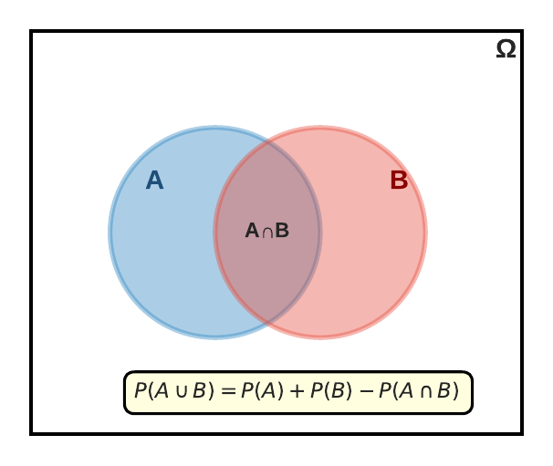
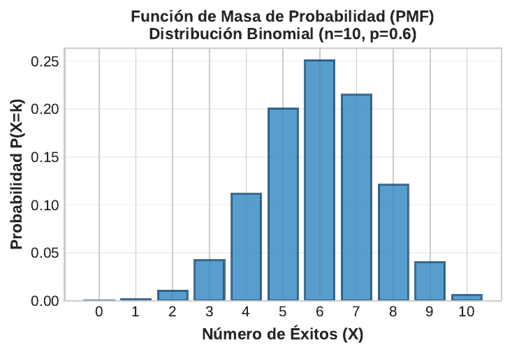

```{r}
#| label: setup
#| echo: false
library(tidyverse)
library(knitr)
library(plotly)
theme_set(theme_minimal(base_size = 13))
azul <- "#1F4E79"; celeste <- "#2E86C1"; rojo <- "#E74C3C"; verde <- "#27AE60"; naranja <- "#F39C12"
# En HTML (revealjs) los graficos se vuelven interactivos con plotly;
# en Beamer (PDF) se mantienen estaticos.
es_html <- knitr::is_html_output()
interactivo <- function(p) {
  if (es_html) plotly::config(plotly::ggplotly(p), displayModeBar = FALSE) else p
}
```

## Panorama de la sesión

| Bloque | Concepto clave | Herramienta en R |
|---|---|---|
| Fundamentos | Espacio muestral, eventos, axiomas | `sample()` |
| Reglas | Adición, complemento, multiplicación | aritmética vectorizada |
| Condicional | Conjunta, marginal, condicional, independencia | `table()`, `prop.table()` |
| Bayes | Prior, verosimilitud, posterior | cálculo directo, `rbinom()` |
| Simulación | Monte Carlo, ley de grandes números | `set.seed()`, `cumsum()` |
| Aplicaciones | Diagnóstico, focalización, fraude | `ggplot2` |

::: {.callout-note appearance="simple"}
**Idea de la sesión:** la probabilidad es el lenguaje de la incertidumbre. Toda decisión de política — focalizar un subsidio, activar una alerta de fraude, interpretar un test — es una apuesta condicionada a información parcial.
:::

## Experimento aleatorio, espacio muestral y eventos

- **Experimento aleatorio:** proceso cuyo resultado no puede predecirse con certeza, pero cuyos resultados posibles son conocidos.
- **Espacio muestral** $\Omega$: conjunto de todos los resultados posibles.
- **Evento** $A \subseteq \Omega$: subconjunto de resultados. Evento seguro: $\Omega$; imposible: $\emptyset$.

| Experimento | Espacio muestral $\Omega$ | Evento de interés $A$ |
|---|---|---|
| Lanzar un dado | $\{1, 2, 3, 4, 5, 6\}$ | par $= \{2, 4, 6\}$ |
| Encuestar un hogar | {recibe subsidio, no recibe} | recibe |
| Fiscalizar una empresa | {cumple, no cumple} | no cumple |
| Seguir a un beneficiario | {termina el programa, deserta} | deserta |

::: {.callout-tip appearance="simple"}
Definir $\Omega$ con precisión es el primer paso de todo modelo: ¿qué cuenta como "deserción"? ¿Quiénes componen la población fiscalizable? Ambigüedad aquí invalida cualquier probabilidad posterior.
:::

## Operaciones entre eventos: el diagrama de Venn

:::: {.columns}

::: {.column width="48%"}
```{r}
#| label: plot-venn
#| echo: false
#| out.width: "100%"

```
:::

::: {.column width="52%"}
**Álgebra de eventos:**

- **Unión** $A \cup B$: ocurre $A$ **o** $B$ (o ambos)
- **Intersección** $A \cap B$: ocurren $A$ **y** $B$
- **Complemento** $A^c$: no ocurre $A$
- **Disjuntos**: $A \cap B = \emptyset$ (no pueden ocurrir juntos)

**Leyes de De Morgan:**
$$(A \cup B)^c = A^c \cap B^c$$
$$(A \cap B)^c = A^c \cup B^c$$

"No recibe ningún beneficio" $=$ "no recibe A **y** no recibe B".
:::

::::

## Axiomas de Kolmogorov: las tres reglas del juego

Una medida de probabilidad es una función $P$ que asigna un número a cada evento y cumple:

| Axioma | Enunciado |
|---|---|
| 1. No negatividad | $P(A) \geq 0$ para todo evento $A$ |
| 2. Normalización | $P(\Omega) = 1$ |
| 3. Aditividad | Si $A_1, A_2, \ldots$ son disjuntos: $P\left(\bigcup_i A_i\right) = \sum_i P(A_i)$ |

**Consecuencias inmediatas** (todo lo demás se deriva de estos tres axiomas):

$$P(\emptyset) = 0 \qquad P(A^c) = 1 - P(A) \qquad A \subseteq B \Rightarrow P(A) \leq P(B) \qquad P(A) \leq 1$$

::: {.callout-important appearance="simple"}
Si un informe reporta probabilidades que suman más de 1 sobre categorías excluyentes, o "riesgos" negativos, viola los axiomas: el error es de construcción, no de interpretación.
:::

## ¿Qué es una probabilidad? Tres interpretaciones

| Enfoque | Definición | Ejemplo en políticas públicas |
|---|---|---|
| Clásica (Laplace) | casos favorables / casos posibles | dado justo: $P(\text{par}) = 3/6$ |
| Frecuentista | límite de la frecuencia relativa al repetir el experimento | tasa histórica de deserción escolar |
| Subjetiva (bayesiana) | grado de creencia coherente, actualizable con evidencia | prob. de que una reforma se apruebe este año |

- Las tres obedecen los **mismos axiomas**: difieren en qué se puede modelar, no en la matemática.
- Eventos únicos (¿se aprobará la reforma?) no tienen frecuencia: solo admiten lectura bayesiana.
- Esta sesión usa las tres: conteo (tablas), frecuencia (simulación) y actualización (Bayes).

## Reglas de adición y complemento

$$P(A \cup B) = P(A) + P(B) - P(A \cap B) \qquad \qquad P(A^c) = 1 - P(A)$$

**Ejemplo:** en una comuna, 30% de los hogares recibe subsidio de vivienda ($A$), 25% recibe apoyo alimentario ($B$) y 10% recibe ambos.

```{r}
#| label: code-adicion
pA <- 0.30; pB <- 0.25; pAB <- 0.10
c(al_menos_uno = pA + pB - pAB,
  solo_vivienda = pA - pAB,
  ninguno = 1 - (pA + pB - pAB))
```

- Sumar $0.30 + 0.25 = 0.55$ **sobreestima**: cuenta dos veces al 10% que recibe ambos.
- Solo si $A$ y $B$ son disjuntos vale $P(A \cup B) = P(A) + P(B)$.
- El complemento es el atajo clásico: $P(\text{al menos un beneficio}) = 1 - P(\text{ninguno})$.

## Ley de grandes números: frecuencia → probabilidad

:::: {.columns}

::: {.column width="46%"}
```{r}
#| label: code-lln
#| eval: false
set.seed(2026)
n <- 10000
dado <- sample(1:6, n,
               replace = TRUE)
frec <- cumsum(dado == 6) / (1:n)
tibble(n = 1:n, frec = frec) %>%
  ggplot(aes(n, frec)) +
  geom_line(color = celeste) +
  geom_hline(yintercept = 1/6,
             color = rojo,
             linetype = "dashed") +
  scale_x_log10(
    labels = scales::comma) +
  labs(x = "N° lanzamientos (log)",
       y = "Frecuencia de 'sale 6'")
```
:::

::: {.column width="54%"}
```{r}
#| label: plot-lln
#| echo: false
#| fig-width: 5.6
#| fig-height: 3.9
#| out.width: "100%"
set.seed(2026)
n <- 10000
dado <- sample(1:6, n, replace = TRUE)
frec <- cumsum(dado == 6) / (1:n)
interactivo(
  tibble(n = 1:n, frec = frec) %>%
    ggplot(aes(n, frec)) +
    geom_line(color = celeste) +
    geom_hline(yintercept = 1/6, color = rojo,
               linetype = "dashed") +
    scale_x_log10(labels = scales::comma) +
    labs(x = "N° lanzamientos (log)",
         y = "Frecuencia de 'sale 6'")
)
```
:::

::::

Con $n$ pequeño la frecuencia fluctúa violentamente; con $n$ grande converge a $1/6 \approx 0.167$. Este es el puente entre datos y probabilidad — y la base de toda simulación **Monte Carlo**.

## Conjunta, marginal y condicional: el mapa de conceptos

| Concepto | Notación | Pregunta que responde | En una tabla de datos |
|---|---|---|---|
| Conjunta | $P(A \cap B)$ | ¿Ambos a la vez? | celda / total |
| Marginal | $P(A)$ | ¿$A$, ignorando $B$? | total de fila / total |
| Condicional | $P(A \mid B)$ | ¿$A$, entre quienes tienen $B$? | celda / total de columna |

**Conexiones fundamentales:**

$$P(A \mid B) = \frac{P(A \cap B)}{P(B)}, \; P(B) > 0 \qquad \qquad P(A) = \sum_i P(A \cap B_i)$$

Condicionar **reduce el espacio muestral**: al saber que $B$ ocurrió, el universo relevante ya no es $\Omega$ sino $B$.

## Tabla de contingencia: encuesta de 500 ciudadanos

**Escenario:** encuesta sobre intención de voto ($V$) en la elección municipal y educación superior ($E$).

```{r}
#| label: tabla-voto
#| echo: false
tibble(
  ` ` = c("Vota", "No vota", "Total"),
  `Educación superior` = c(140, 180, 320),
  `Sin educación superior` = c(70, 110, 180),
  `Total` = c(210, 290, 500)
) %>% kable()
```

- La tabla de contingencia es el **estimador empírico** de toda la estructura de probabilidad: conjuntas, marginales y condicionales salen de ella por división.
- Preguntas que responderemos: ¿$P(V)$? ¿$P(V \mid E)$? ¿Son $V$ y $E$ independientes?

## De conteos a probabilidades: la distribución conjunta

```{r}
#| label: plot-heatmap
#| echo: false
#| fig-height: 3.0
conj <- tibble(
  voto = rep(c("Vota", "No vota"), each = 2),
  educ = rep(c("Ed. superior", "Sin ed. superior"), 2),
  n = c(140, 70, 180, 110)
) %>% mutate(p = n / 500)
p <- ggplot(conj, aes(educ, voto, fill = p)) +
  geom_tile(color = "white", linewidth = 2) +
  geom_text(aes(label = paste0(scales::percent(p, accuracy = 0.1), " (n = ", n, ")")),
            color = "white", size = 4.6, fontface = "bold") +
  scale_fill_gradient(low = "#5DADE2", high = azul, guide = "none") +
  labs(x = NULL, y = NULL, title = "Probabilidades conjuntas: cada celda / 500") +
  theme(panel.grid = element_blank(), axis.text = element_text(size = 12))
interactivo(p)
```

Las cuatro conjuntas suman 1. Las **marginales** se obtienen sumando: $P(V) = 0.28 + 0.14 = 0.42$; $P(E) = 0.28 + 0.36 = 0.64$.

## Probabilidad condicional: condicionar cambia el universo

$$P(V \mid E) = \frac{P(V \cap E)}{P(E)} = \frac{140/500}{320/500} = \frac{140}{320} = 0.4375$$

:::: {.columns}

::: {.column width="52%"}
```{r}
#| label: code-cond
round(c(P_V = 210/500,
        P_V_dado_E = 140/320,
        P_V_dado_noE = 70/180), 3)
```

- Condicionar en $E$ apenas mueve la probabilidad ($0.42 \to 0.44$): la asociación es **débil**.
- Condicionar no es simétrico: $P(E \mid V) = 140/210 = 0.667 \neq P(V \mid E)$.
:::

::: {.column width="48%"}
```{r}
#| label: plot-cond
#| echo: false
#| fig-width: 5
#| fig-height: 3.3
#| out.width: "100%"
et2 <- c("P(V)", "P(V | E)", "P(V | no E)")
p <- tibble(g = factor(et2, levels = et2),
            p = c(210/500, 140/320, 70/180)) %>%
  ggplot(aes(g, p, fill = g)) +
  geom_col(width = 0.6, show.legend = FALSE) +
  geom_text(aes(label = scales::percent(p, accuracy = 0.1)),
            vjust = -0.4, color = azul, size = 4.6) +
  scale_fill_manual(values = c(celeste, verde, naranja)) +
  scale_y_continuous(labels = scales::percent, limits = c(0, 0.55)) +
  labs(x = NULL, y = "Probabilidad")
interactivo(p)
```
:::

::::

## Independencia: definición y verificación empírica

**Definición:** $A$ y $B$ son independientes si $P(A \cap B) = P(A) \cdot P(B)$, o equivalentemente $P(A \mid B) = P(A)$: saber $B$ no cambia la probabilidad de $A$.

**Verificación en la encuesta:**

$$P(V \cap E) = 0.28 \qquad \text{vs} \qquad P(V) \cdot P(E) = 0.42 \times 0.64 = 0.2688$$

```{r}
#| label: code-indep
tabla <- matrix(c(140, 70, 180, 110),
                nrow = 2, byrow = TRUE)
round(chisq.test(tabla)$p.value, 3)
```

- No son exactamente independientes, pero la brecha es pequeña y **compatible con el azar** (p $\approx$ 0.34 con n = 500): no hay evidencia contra la independencia.

::: {.callout-warning appearance="simple"}
Asociación no es causalidad, e independencia estadística no implica irrelevancia sustantiva: una tercera variable (edad, ingreso) puede ocultar o inflar la relación observada.
:::

## Regla del producto: muestreo sin reemplazo

$$P(A \cap B) = P(A \mid B) \cdot P(B) = P(B \mid A) \cdot P(A)$$

**Regla en cadena:** $P(A_1 \cap A_2 \cap A_3) = P(A_1) \cdot P(A_2 \mid A_1) \cdot P(A_3 \mid A_1 \cap A_2)$

**Ejemplo — auditoría:** de 20 expedientes, 4 tienen irregularidades. Se auditan 2 al azar **sin reemplazo**:

$$P(\text{ambos irregulares}) = \frac{4}{20} \times \frac{3}{19} = 0.032$$

```{r}
#| label: code-producto
round(c(dos_irregulares = (4/20) * (3/19),
        al_menos_uno = 1 - (16/20) * (15/19)), 3)
```

- La segunda extracción **depende** de la primera: el condicional $3/19$ registra que ya salió un irregular.
- Si los eventos fueran independientes: $P(A \cap B) = P(A) \cdot P(B)$ — caso especial, no regla general.

## Ley de probabilidad total: promediar sobre una partición

Si $B_1, \ldots, B_k$ particionan $\Omega$ (disjuntos y exhaustivos):

$$P(A) = \sum_{i=1}^{k} P(A \mid B_i) \cdot P(B_i)$$

**Ejemplo:** deserción ($D$) en un programa nacional implementado en tres regiones.

| Región | Peso $P(B_i)$ | Deserción $P(D \mid B_i)$ | Aporte $P(D \cap B_i)$ |
|---|:-:|:-:|:-:|
| Norte | 0.20 | 0.15 | 0.030 |
| Centro | 0.50 | 0.08 | 0.040 |
| Sur | 0.30 | 0.12 | 0.036 |
| **Total** | 1.00 | — | $P(D) = 0.106$ |

La tasa nacional (10.6%) es un **promedio ponderado** de las tasas regionales. Y de regalo, ya podemos invertir: $P(\text{Norte} \mid D) = 0.030/0.106 = 0.28$ — el Norte aporta 28% de la deserción con solo 20% de los beneficiarios.

## Teorema de Bayes: derivación en tres pasos

**Paso 1 — la regla del producto, escrita en ambos sentidos:**

$$P(A \cap B) = P(A \mid B) \cdot P(B) \qquad \qquad P(A \cap B) = P(B \mid A) \cdot P(A)$$

**Paso 2 — igualar y despejar:**

$$P(B \mid A) = \frac{P(A \mid B) \cdot P(B)}{P(A)}$$

**Paso 3 — expandir $P(A)$ con probabilidad total** (forma general, con partición $B_1, \ldots, B_k$):

$$P(B_j \mid A) = \frac{P(A \mid B_j) \cdot P(B_j)}{\sum_{i=1}^{k} P(A \mid B_i) \cdot P(B_i)}$$

**Nomenclatura:** $P(B)$ = *prior* · $P(A \mid B)$ = *verosimilitud* · $P(A)$ = *evidencia* · $P(B \mid A)$ = *posterior*. Bayes es la regla para **actualizar creencias con datos**.

## El árbol del test diagnóstico

**Test para una enfermedad:** prevalencia 0.01, sensibilidad 0.95, especificidad 0.90.

```{r}
#| label: plot-arbol
#| echo: false
#| fig-height: 3.0
#| out.width: "78%"
seg <- tibble(
  x0 = c(0.10, 0.10, 1.18, 1.18, 1.18, 1.18),
  y0 = c(0.50, 0.50, 0.78, 0.78, 0.22, 0.22),
  x1 = c(0.84, 0.84, 1.92, 1.92, 1.92, 1.92),
  y1 = c(0.78, 0.22, 0.95, 0.61, 0.39, 0.05))
ggplot() +
  geom_segment(data = seg, aes(x = x0, y = y0, xend = x1, yend = y1),
               color = "gray55", linewidth = 0.7) +
  annotate("label", x = 0, y = 0.50, label = "Población", size = 4.4,
           fill = "#EAF2F8", color = azul, fontface = "bold") +
  annotate("label", x = 1.0, y = 0.78, label = "Enferma", size = 4,
           fill = rojo, color = "white", fontface = "bold") +
  annotate("label", x = 1.0, y = 0.22, label = "Sana", size = 4,
           fill = celeste, color = "white", fontface = "bold") +
  annotate("text", x = 0.42, y = 0.71, label = "0.01", size = 3.8, color = "gray30") +
  annotate("text", x = 0.42, y = 0.29, label = "0.99", size = 3.8, color = "gray30") +
  annotate("text", x = 1.42, y = 0.92, label = "sens. 0.95", size = 3.6, color = "gray30") +
  annotate("text", x = 1.46, y = 0.64, label = "0.05", size = 3.6, color = "gray30") +
  annotate("text", x = 1.42, y = 0.36, label = "1 - esp. 0.10", size = 3.6, color = "gray30") +
  annotate("text", x = 1.46, y = 0.08, label = "esp. 0.90", size = 3.6, color = "gray30") +
  annotate("text", x = 2.0, y = 0.95, label = "Test +:  0.01 · 0.95 = 0.0095",
           hjust = 0, size = 4.2, color = rojo, fontface = "bold") +
  annotate("text", x = 2.0, y = 0.61, label = "Test -:  0.01 · 0.05 = 0.0005",
           hjust = 0, size = 4.2, color = "gray45") +
  annotate("text", x = 2.0, y = 0.39, label = "Test +:  0.99 · 0.10 = 0.0990",
           hjust = 0, size = 4.2, color = naranja, fontface = "bold") +
  annotate("text", x = 2.0, y = 0.05, label = "Test -:  0.99 · 0.90 = 0.8910",
           hjust = 0, size = 4.2, color = "gray45") +
  coord_cartesian(xlim = c(-0.18, 3.55), ylim = c(-0.03, 1.03)) +
  theme_void()
```

Las ramas "Test +" suman la evidencia $P(+) = 0.0095 + 0.0990 = 0.1085$: los **falsos positivos superan 10 a 1** a los verdaderos.

## P(Enferma | +): el cálculo completo

**Probabilidad total** (denominador de Bayes):

$$P(+) = 0.95 \times 0.01 + 0.10 \times 0.99 = 0.1085$$

**Teorema de Bayes:**

$$P(\text{Enf} \mid +) = \frac{0.95 \times 0.01}{0.1085} = 0.0876$$

```{r}
#| label: code-bayes-calc
prev <- 0.01; sens <- 0.95; esp <- 0.90
p_pos <- sens * prev + (1 - esp) * (1 - prev)
round(c(P_positivo = p_pos,
        P_enf_dado_pos = sens * prev / p_pos), 4)
```

::: {.callout-important appearance="simple"}
Un test con 95% de sensibilidad entrega solo **8.8% de certeza**: de cada 100 positivos, 91 son falsas alarmas. Ignorar la prevalencia es el error de **negligencia de la tasa base**.
:::

## Frecuencias naturales: la misma respuesta sin fórmulas

Imagine **10.000 personas** con las mismas tasas (prevalencia 1%, sensibilidad 95%, especificidad 90%):

```{r}
#| label: tabla-frecnat
#| echo: false
tibble(
  ` ` = c("Enfermas (100)", "Sanas (9.900)", "Total"),
  `Test +` = c("95", "990", "1.085"),
  `Test -` = c("5", "8.910", "8.915"),
  `Total` = c("100", "9.900", "10.000")
) %>% kable(align = "lrrr")
```

$$P(\text{Enf} \mid +) = \frac{95}{95 + 990} = \frac{95}{1.085} = 0.0876$$

- De cada 1.085 alertas positivas, solo 95 son reales: la baja prevalencia hace que las 990 falsas alarmas de la población sana dominen.
- Gigerenzer: presentar riesgos como **frecuencias naturales** ("95 de cada 1.085") reduce drásticamente los errores de interpretación de médicos, jueces y policymakers.

## Prior → posterior: incluso un test excelente decepciona

:::: {.columns}

::: {.column width="48%"}
```{r}
#| label: plot-bayespng
#| echo: false
#| out.width: "100%"
knitr::include_graphics("figuras/bayes_ejemplo.png")
```
:::

::: {.column width="52%"}
**Un test mejor que el anterior** (sensibilidad 99%, especificidad 95%), misma prevalencia de 1%:

- Prior: $P(\text{Enf}) = 1\%$
- Posterior: $P(\text{Enf} \mid +) \approx 16.6\%$

**Implicancia de política:** en tamizajes masivos de baja prevalencia (cáncer, fraude, dopaje), la mayoría de los positivos serán falsos **aunque el instrumento sea excelente**.

**Solución bayesiana:** repetir el test solo al grupo positivo. Con prior 16.6%, un segundo positivo independiente eleva el posterior a $\approx 80\%$: *el posterior de hoy es el prior de mañana*.
:::

::::

## El posterior depende de la prevalencia

```{r}
#| label: plot-prevalencia
#| echo: false
#| fig-height: 3.2
sens <- 0.95
grid <- crossing(prev = seq(0.001, 0.5, 0.001),
                 fp = c(0.10, 0.05, 0.01)) %>%
  mutate(post = sens * prev / (sens * prev + fp * (1 - prev)),
         tasa = factor(paste0("Falsos positivos = ", scales::percent(fp)),
                       levels = paste0("Falsos positivos = ",
                                       scales::percent(c(0.10, 0.05, 0.01)))))
p <- ggplot(grid, aes(prev, post, color = tasa)) +
  geom_line(linewidth = 1.1) +
  geom_abline(slope = 1, intercept = 0, linetype = "dotted", color = "gray50") +
  geom_vline(xintercept = 0.01, linetype = "dashed", color = "gray40") +
  annotate("text", x = 0.035, y = 0.97, label = "prev. = 1%", color = "gray30", size = 4) +
  annotate("text", x = 0.42, y = 0.36, label = "posterior = prior", color = "gray45", size = 3.8) +
  scale_color_manual(values = c(naranja, celeste, verde)) +
  scale_x_continuous(labels = scales::percent) +
  scale_y_continuous(labels = scales::percent) +
  labs(x = "Prevalencia (prior)", y = "P(Enf | +) (posterior)", color = NULL) +
  theme(legend.position = "top")
interactivo(p)
```

Con prevalencia 1%: posterior de 8.8% (FP 10%), 16% (FP 5%) y 49% (FP 1%). Toda curva sobre la diagonal punteada indica que el test **sí aporta información** — pero cuánto, depende del prior.

## La falacia del fiscal

**El error:** confundir $P(\text{evidencia} \mid \text{inocente})$ con $P(\text{inocente} \mid \text{evidencia})$ — la "confusión de la inversa", el mismo error del test diagnóstico.

**Ejemplo clásico (ADN):** la muestra del sitio coincide con el acusado y el perito declara que la probabilidad de coincidencia por azar es 1 en 1.000.000.

| Cantidad | Valor |
|---|---|
| $P(\text{coincidencia} \mid \text{inocente})$ | 1 / 1.000.000 |
| Población plausible de la ciudad | 5.000.000 |
| Coincidencias inocentes esperadas | $\approx 5$ |
| $P(\text{culpable} \mid \text{coincidencia})$ sin otra evidencia | $\approx 1/6 \approx 17\%$ |

::: {.callout-important appearance="simple"}
El fiscal presenta "1 en un millón" como si fuera la probabilidad de inocencia; Bayes muestra que, sin más evidencia, hay $\approx 6$ personas compatibles y la culpabilidad es $\approx 17\%$. El mismo razonamiento aplica a alertas algorítmicas de fraude y a la vigilancia predictiva.
:::

## Aplicación: detección de fraude en programas sociales

:::: {.columns}

::: {.column width="46%"}
```{r}
#| label: code-fraude
#| eval: false
prev <- 0.02; sens <- 0.90
fp <- c(0.05, 0.02, 0.01, 0.005)
post <- sens * prev /
  (sens * prev + fp * (1 - prev))
et <- scales::percent(fp, 0.1)
tibble(
  tasa = factor(et, levels = et),
  post = post) %>%
  ggplot(aes(tasa, post)) +
  geom_col(fill = celeste,
           width = 0.6) +
  geom_text(aes(label =
    scales::percent(post, 1)),
    vjust = -0.4, color = azul) +
  scale_y_continuous(
    labels = scales::percent,
    limits = c(0, 0.95)) +
  labs(x = "Tasa falsos positivos",
       y = "P(fraude | alerta)")
```
:::

::: {.column width="54%"}
```{r}
#| label: plot-fraude
#| echo: false
#| fig-width: 5.6
#| fig-height: 3.9
#| out.width: "100%"
prev <- 0.02; sens <- 0.90
fp <- c(0.05, 0.02, 0.01, 0.005)
post <- sens * prev / (sens * prev + fp * (1 - prev))
et <- scales::percent(fp, 0.1)
interactivo(
  tibble(tasa = factor(et, levels = et), post = post) %>%
    ggplot(aes(tasa, post)) +
    geom_col(fill = celeste, width = 0.6) +
    geom_text(aes(label = scales::percent(post, 1)),
              vjust = -0.4, color = azul) +
    scale_y_continuous(labels = scales::percent,
                       limits = c(0, 0.95)) +
    labs(x = "Tasa falsos positivos",
         y = "P(fraude | alerta)")
)
```
:::

::::

Algoritmo antifraude: 2% de fraude, sensibilidad 90%. **Reducir los falsos positivos rinde más que subir la sensibilidad**: cada alerta falsa es un beneficiario legítimo suspendido.

## Verificación Monte Carlo del Teorema de Bayes

Simulamos 100.000 personas con las tasas del test diagnóstico y contamos, entre los positivos, cuántos están realmente enfermos:

```{r}
#| label: code-montecarlo
set.seed(123)
n <- 100000
enfermo <- rbinom(n, 1, 0.01)
p_test <- ifelse(enfermo == 1, 0.95, 0.10)
positivo <- rbinom(n, 1, p_test)
round(c(P_pos_simulada = mean(positivo),
        P_enf_dado_pos_simulada = mean(enfermo[positivo == 1]),
        teorico = 0.0876), 4)
```

- La frecuencia simulada coincide con el valor teórico: la **ley de grandes números** en acción.
- Método general: cuando la fórmula es intratable (modelos jerárquicos, sistemas complejos), **simular es calcular**. Es la base del análisis bayesiano computacional moderno (MCMC).

## De eventos a variables aleatorias

:::: {.columns}

::: {.column width="48%"}
```{r}
#| label: plot-pmfpng
#| echo: false
#| out.width: "100%"

```
:::

::: {.column width="52%"}
**Variable aleatoria:** función que asigna un número a cada resultado, $X: \Omega \to \mathbb{R}$.

**Función de masa de probabilidad (PMF):**
$$P(X = k) \geq 0, \qquad \sum_k P(X = k) = 1$$

**Ejemplo:** 10 egresados de un programa de empleo, cada uno consigue trabajo con $p = 0.6$ de forma independiente. $X$ = n° de colocados:

$$X \sim \text{Binomial}(10,\, 0.6), \qquad E(X) = np = 6$$

La figura muestra su PMF: el resultado más probable es 6, pero valores entre 4 y 8 concentran casi toda la masa.
:::

::::

## Errores comunes al razonar con incertidumbre

| Error | Ejemplo | Corrección |
|---|---|---|
| Negligencia de la tasa base | "El test es 95% sensible, luego estoy 95% enfermo" | Teorema de Bayes con el prior |
| Falacia del fiscal | Condenar porque $P(\text{evidencia} \mid \text{inocente})$ es pequeña | Calcular $P(\text{inocente} \mid \text{evidencia})$ |
| Confusión de la inversa | Reportar $P(A \mid B)$ como si fuera $P(B \mid A)$ | Tabla de frecuencias naturales |
| Asumir independencia | Multiplicar riesgos correlacionados | Verificar $P(A \cap B) = P(A)P(B)$ |
| Sumar sin restar intersección | Proporciones que suman más de 100% | Inclusión-exclusión |
| Asociación leída como causa | "La educación causa el voto" desde una tabla | Diseños causales (econometría) |

## Síntesis: qué llevarse de esta sesión

:::: {.columns}

::: {.column width="55%"}
**Checklist para razonar con probabilidades**

1. Definir $\Omega$ y los eventos sin ambigüedad
2. Distinguir conjunta, marginal y condicional
3. Nunca asumir independencia: verificarla
4. Ante un condicional invertido, aplicar Bayes
5. Comunicar con frecuencias naturales
6. Simular (Monte Carlo) para verificar cálculos
7. Recordar: el posterior depende del prior
:::

::: {.column width="45%"}
**Funciones R de esta sesión**

`sample()` `rbinom()` `cumsum()` `mean()` `table()` `prop.table()` `chisq.test()` `set.seed()` `ifelse()` `crossing()`

**Fórmula estrella:**
$$P(B \mid A) = \frac{P(A \mid B) P(B)}{P(A)}$$

**Próxima sesión:** distribuciones de probabilidad (Binomial, Poisson, Normal).
:::

::::

## Ejercicio para practicar (30 min)

**Escenario:** test de drogas para conductores de transporte escolar. Prevalencia de consumo: 0.5%; sensibilidad: 98%; especificidad: 97%.

1. Dibuje el árbol de probabilidades y calcule $P(+)$ con la ley de probabilidad total.
2. Calcule $P(\text{consumo} \mid +)$ con el Teorema de Bayes. ¿Le sorprende el resultado?
3. Construya la tabla de frecuencias naturales para 100.000 conductores y verifique el valor.
4. ¿Desde qué prevalencia el posterior supera 50%? (Pista: iguale verdaderos y falsos positivos.)
5. Simule el escenario en R con `rbinom()` (n = 100.000, con `set.seed()`) y compare con el valor teórico.
6. Discuta: ¿qué protocolo recomendaría tras un positivo — despido inmediato o test confirmatorio? Justifique con los números.

::: {.callout-note appearance="simple"}
**Referencias:** Blitzstein & Hwang, *Introduction to Probability* (caps. 1–2) · Gigerenzer, *Calculated Risks* · Illowsky & Dean, *Introductory Statistics* (caps. 3–4).
:::
