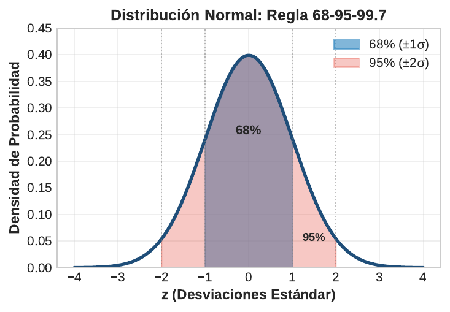
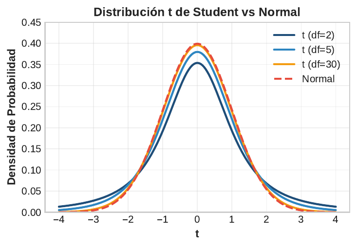

```{r}
#| label: setup
#| echo: false
library(tidyverse)
library(knitr)
library(plotly)
theme_set(theme_minimal(base_size = 13))
azul <- "#1F4E79"; celeste <- "#2E86C1"; rojo <- "#E74C3C"; verde <- "#27AE60"; naranja <- "#F39C12"
# En HTML (revealjs) los graficos se vuelven interactivos con plotly;
# en Beamer (PDF) se mantienen estaticos.
es_html <- knitr::is_html_output()
interactivo <- function(p) {
  if (es_html) plotly::config(plotly::ggplotly(p), displayModeBar = FALSE) else p
}
```

## Panorama de la sesión

| Bloque | Concepto clave | Herramienta en R |
|---|---|---|
| Variable aleatoria | Discreta vs continua; PMF, PDF, CDF | `dbinom()`, `pnorm()` |
| Esperanza y varianza | $E(X)$, $Var(X)$ de una v.a. | `sum(x * p)` |
| Discretas | Bernoulli, Binomial, Poisson | `dbinom()`, `dpois()` |
| Continuas | Normal, estandarización Z, t de Student | `pnorm()`, `qt()` |
| Familia d/p/q/r | densidad, acumulada, cuantil, simulación | `qnorm()`, `rnorm()` |
| TLC | distribución muestral y error estándar | `replicate()` |

::: {.callout-note appearance="simple"}
**Idea de la sesión:** las distribuciones son los *modelos generadores* de los datos de política pública: encuestas (Binomial), delitos por comuna (Poisson), ingresos (log-normal), medias muestrales (Normal, gracias al TLC). Elegir bien la distribución es elegir bien el error estándar.
:::

## Variable aleatoria: del fenómeno social al número

Una **variable aleatoria** asigna un número a cada resultado de un fenómeno incierto: $X:\Omega \to \mathbb{R}$.

- **Discreta**: valores contables (0, 1, 2, ...) — se describe con una PMF.
- **Continua**: cualquier valor en un intervalo — se describe con una PDF.

| Fenómeno de política pública | Valores de $X$ | Tipo | Modelo natural |
|---|---|---|---|
| Un hogar apoya (o no) una reforma | 0, 1 | Discreta binaria | Bernoulli |
| Apoyos en una muestra de $n$ hogares | 0, 1, ..., $n$ | Discreta acotada | Binomial |
| Delitos en una comuna por semana | 0, 1, 2, ... (sin tope) | Discreta de conteo | Poisson |
| Ingreso de un hogar | reales positivos | Continua | Normal (en log) |
| Media de una encuesta | reales | Continua | Normal (por el TLC) |

## PMF, PDF y CDF: tres formas de describir una v.a.

| Función | Aplica a | Qué entrega | En R |
|---|---|---|---|
| PMF: $P(X = x)$ | Discretas | Probabilidad de cada valor exacto | `dbinom()`, `dpois()` |
| PDF: $f(x)$ | Continuas | Densidad: la probabilidad es un área | `dnorm()`, `dt()` |
| CDF: $F(x) = P(X \le x)$ | Ambas | Probabilidad acumulada hasta $x$ | `pnorm()`, `pbinom()` |

::: {.callout-important appearance="simple"}
En una v.a. continua $P(X = x) = 0$ para cualquier valor puntual: solo las áreas tienen probabilidad, $P(a < X < b) = F(b) - F(a)$. Por eso `dnorm()` entrega *alturas de densidad*, no probabilidades.
:::

## Anatomía de una PMF: Binomial(10, 0.6)

:::: {.columns}

::: {.column width="48%"}
```{r}
#| label: plot-pmf-estatica
#| echo: false
#| out.width: "100%"
knitr::include_graphics("figuras/pmf_ejemplo.png")
```
:::

::: {.column width="52%"}
**Lectura de la figura** ($X$ = personas que aprueban una política entre 10 encuestadas, $p = 0.6$):

- Cada barra es $P(X = k)$: una probabilidad entre 0 y 1.
- Las 11 barras **suman exactamente 1**.
- El máximo está cerca de $E(X) = np = 6$.
- En R: `dbinom(6, 10, 0.6)` = `r round(dbinom(6, 10, 0.6), 3)`.
:::

::::

## PDF vs CDF: dos vistas de la misma probabilidad

```{r}
#| label: plot-pdf-cdf
#| echo: false
#| fig-height: 3.0
xs <- seq(200, 1400, 2)
vpdf <- "PDF: probabilidad = area"
vcdf <- "CDF: probabilidad = altura"
lv <- c(vpdf, vcdf)
d <- bind_rows(
  tibble(x = xs, y = dnorm(xs, 800, 200), vista = vpdf),
  tibble(x = xs, y = pnorm(xs, 800, 200), vista = vcdf)) %>%
  mutate(vista = factor(vista, lv))
seg <- tibble(x = c(600, 200), xend = c(600, 600), y = c(0, 0.159),
              yend = c(0.159, 0.159), vista = factor(vcdf, lv))
pt <- tibble(x = 600, y = 0.159, vista = factor(vcdf, lv))
txt <- tibble(x = c(440, 400), y = c(0.00042, 0.28),
              lab = c("area = 0.16", "F(600) = 0.16"),
              vista = factor(lv, lv))
p <- ggplot(d, aes(x, y)) +
  geom_area(data = filter(d, vista == vpdf & x <= 600),
            fill = celeste, alpha = 0.6) +
  geom_line(color = azul, linewidth = 1) +
  geom_segment(data = seg, aes(x = x, xend = xend, y = y, yend = yend),
               linetype = "dashed", color = rojo) +
  geom_point(data = pt, aes(x, y), color = rojo, size = 2.5) +
  geom_text(data = filter(txt, vista == vpdf), aes(x, y, label = lab),
            color = azul, size = 4) +
  geom_text(data = filter(txt, vista == vcdf), aes(x, y, label = lab),
            color = rojo, size = 4) +
  facet_wrap(~ vista, scales = "free_y") +
  labs(x = "Ingreso (miles de $)", y = NULL)
interactivo(p)
```

Con ingresos $\sim N(800, 200^2)$: el área a la izquierda de 600 en la PDF **es** la altura de la CDF en 600. `pnorm()` calcula siempre esa área izquierda.

## Esperanza y varianza de una variable aleatoria

$$E(X) = \sum_x x \, P(X = x), \qquad Var(X) = \sum_x (x - \mu)^2 \, P(X = x)$$

En continuas se reemplaza la suma por una integral. La esperanza es el **promedio poblacional de largo plazo**; la varianza, su incertidumbre.

```{r}
#| label: esperanza
x <- 0:3                              # atenciones anuales por beneficiario
p <- c(0.20, 0.35, 0.30, 0.15)        # sus probabilidades
mu <- sum(x * p)
round(c(esperanza = mu, varianza = sum((x - mu)^2 * p),
        de = sqrt(sum((x - mu)^2 * p))), 2)
```

Con 10.000 beneficiarios, el programa espera unas 14.000 atenciones al año: la **esperanza dimensiona el presupuesto**; la varianza, el margen de seguridad.

## Bernoulli: el ensayo sí/no de las encuestas

:::: {.columns}

::: {.column width="52%"}
$$P(X = x) = p^x (1-p)^{1-x}, \quad x \in \{0, 1\}$$

$$E(X) = p, \qquad Var(X) = p(1-p)$$

- Un solo ensayo con dos resultados: apoya / no apoya, ocupado / desocupado, aprueba / reprueba.
- Es el **ladrillo básico**: la Binomial suma $n$ Bernoullis independientes.
- Si $p = 0.6$: $P(X=1) = 0.6$, $P(X=0) = 0.4$.
:::

::: {.column width="48%"}
```{r}
#| label: plot-var-bernoulli
#| echo: false
#| fig-width: 5
#| fig-height: 3.4
#| out.width: "100%"
p <- tibble(p = seq(0, 1, 0.01), v = p * (1 - p)) %>%
  ggplot(aes(p, v)) +
  geom_line(color = azul, linewidth = 1.2) +
  geom_vline(xintercept = 0.5, linetype = "dashed", color = rojo) +
  annotate("text", x = 0.5, y = 0.27, label = "maximo en p = 0.5",
           color = rojo, size = 4.2) +
  coord_cartesian(ylim = c(0, 0.29)) +
  labs(x = "p", y = "Var(X) = p(1-p)",
       title = "La incertidumbre es maxima en p = 0.5")
interactivo(p)
```

Por eso las encuestas reportan su margen de error en el "peor caso" $p = 0.5$.
:::

::::

## Binomial: contar éxitos en n ensayos

$$P(X = k) = \binom{n}{k} p^k (1-p)^{n-k}, \qquad E(X) = np, \qquad Var(X) = np(1-p)$$

**Supuestos:** $n$ fijo y conocido, ensayos independientes, $p$ constante entre ensayos.

```{r}
#| label: binom-momentos
n <- 30; p <- 0.7    # 30 hogares; 70% con acceso a internet
round(c(esperanza = n * p, de = sqrt(n * p * (1 - p)),
        p_igual_20 = dbinom(20, n, p),
        p_25_o_mas = 1 - pbinom(24, n, p)), 3)
```

En una muestra de 30 hogares esperamos 21 con acceso (DE = 2.5); observar 25 o más ocurre solo el 8% de las veces si $p$ realmente es 0.7.

## La PMF Binomial en R: dbinom()

:::: {.columns}

::: {.column width="46%"}
```{r}
#| label: code-binom
#| eval: false
n <- 30; p <- 0.7
df <- tibble(k = 0:n,
             prob = dbinom(k, n, p))
ggplot(df, aes(k, prob)) +
  geom_col(fill = celeste,
           color = "white") +
  geom_vline(xintercept = n * p,
             color = rojo,
             linetype = "dashed",
             linewidth = 1) +
  labs(x = "Hogares con internet (k)",
       y = "P(X = k)")
```

`dbinom(k, n, p)` evalúa la PMF en cada valor de `k`; la línea roja marca $E(X) = np = 21$.
:::

::: {.column width="54%"}
```{r}
#| label: plot-binom
#| echo: false
#| fig-width: 5.6
#| fig-height: 3.9
#| out.width: "100%"
n <- 30; p <- 0.7
df <- tibble(k = 0:n, prob = dbinom(k, n, p))
interactivo(
  ggplot(df, aes(k, prob)) +
    geom_col(fill = celeste, color = "white") +
    geom_vline(xintercept = n * p, color = rojo,
               linetype = "dashed", linewidth = 1) +
    labs(x = "Hogares con internet (k)", y = "P(X = k)")
)
```
:::

::::

## Binomial: el efecto de n y p

```{r}
#| label: plot-binom-facetas
#| echo: false
#| fig-height: 3.3
bin <- crossing(n = c(10, 50), p = c(0.2, 0.5, 0.8)) %>%
  mutate(datos = map2(n, p, \(n, p) tibble(k = 0:n, prob = dbinom(0:n, n, p)))) %>%
  unnest(datos) %>%
  mutate(fila = fct_inorder(paste0("n = ", n)),
         col = fct_inorder(paste0("p = ", p)))
p <- ggplot(bin, aes(k, prob)) +
  geom_col(fill = celeste, width = 0.9) +
  facet_grid(fila ~ col, scales = "free") +
  labs(x = "Numero de exitos (k)", y = "P(X = k)")
interactivo(p)
```

$p$ controla la **asimetría** (lejos de 0.5, la PMF se sesga) y $n$ la **concentración**: al crecer $n$, la distribución se centra en $np$ y toma forma de campana — un anticipo del TLC.

## Poisson: la distribución de los eventos raros

:::: {.columns}

::: {.column width="55%"}
$$P(X = k) = \frac{e^{-\lambda} \lambda^k}{k!}, \quad k = 0, 1, 2, \ldots$$

$$E(X) = Var(X) = \lambda$$

- Cuenta eventos en un intervalo fijo de tiempo o espacio, con **tasa constante** $\lambda$ y eventos independientes.
- No hay un $n$ máximo: el conteo es abierto.
- **Aplicaciones:** delitos por comuna-semana, accidentes de tránsito, llegadas a una urgencia, brotes epidémicos.
:::

::: {.column width="45%"}
```{r}
#| label: plot-binpois-estatica
#| echo: false
#| out.width: "100%"
knitr::include_graphics("figuras/binomial_poisson.png")
```

Dos modelos de conteo: la Binomial está acotada por $n$; la Poisson solo depende de la tasa $\lambda$.
:::

::::

## Poisson en R: delitos por comuna

:::: {.columns}

::: {.column width="50%"}
```{r}
#| label: code-pois
lambda <- 3   # delitos por semana
round(c(p_0 = dpois(0, lambda),
        p_3 = dpois(3, lambda),
        p_6_o_mas =
          1 - ppois(5, lambda)), 3)
```

Una semana con **6 o más delitos** ocurre el 8.4% de las veces aun si nada cambió. Antes de anunciar una "ola delictual" (o un refuerzo policial), hay que descartar la fluctuación esperable.
:::

::: {.column width="50%"}
```{r}
#| label: plot-pois-cola
#| echo: false
#| fig-width: 5
#| fig-height: 3.6
#| out.width: "100%"
d <- tibble(k = 0:12, prob = dpois(k, 3))
p <- ggplot(d, aes(k, prob)) +
  geom_col(data = filter(d, k < 6), fill = celeste, color = "white") +
  geom_col(data = filter(d, k >= 6), fill = rojo, color = "white") +
  annotate("text", x = 8.7, y = 0.07,
           label = "P(X >= 6) = 0.084", color = rojo, size = 4.4) +
  scale_x_continuous(breaks = seq(0, 12, 2)) +
  labs(x = "Delitos en la semana (k)", y = "P(X = k)",
       title = "Poisson(3): la cola de semanas malas")
interactivo(p)
```
:::

::::

## Poisson al variar la tasa $\lambda$

```{r}
#| label: plot-pois-facetas
#| echo: false
#| fig-height: 3.0
pois <- crossing(lambda = c(1, 4, 10), k = 0:22) %>%
  mutate(prob = dpois(k, lambda),
         etq = fct_inorder(paste0("lambda = ", lambda)))
p <- ggplot(pois, aes(k, prob)) +
  geom_col(fill = celeste, width = 0.9) +
  facet_wrap(~ etq, scales = "free_y") +
  labs(x = "Numero de eventos (k)", y = "P(X = k)")
interactivo(p)
```

Al crecer $\lambda$ la distribución se desplaza, se ensancha (recordar: varianza $= \lambda$) y se vuelve casi simétrica. La igualdad media = varianza (**equidispersión**) es un supuesto verificable: los delitos suelen estar *sobredispersos*, lo que motiva la binomial negativa en el curso de econometría.

## De la Binomial a la Poisson: la ley de eventos raros

```{r}
#| label: plot-aprox-poisson
#| echo: false
#| fig-height: 3.0
k <- 0:14
aprox <- bind_rows(
  tibble(k, prob = dbinom(k, 1000, 0.005), dist = "Binomial(1000, 0.005)"),
  tibble(k, prob = dpois(k, 5), dist = "Poisson(5)"))
p <- ggplot(aprox, aes(k, prob, fill = dist)) +
  geom_col(position = "dodge", width = 0.8) +
  scale_fill_manual(values = c(azul, naranja)) +
  labs(x = "Numero de casos (k)", y = "P(X = k)", fill = NULL) +
  theme(legend.position = "top")
interactivo(p)
```

Si $n \to \infty$ y $p \to 0$ con $np = \lambda$ fijo, la Binomial converge a Poisson($\lambda$). Ejemplo: 1.000 licitaciones con probabilidad 0.005 de irregularidad — el número de casos es Poisson(5): **un parámetro en vez de dos**, sin necesidad de conocer $n$.

## Normal: definición y parámetros

:::: {.columns}

::: {.column width="50%"}
$$f(x) = \frac{1}{\sigma\sqrt{2\pi}} \exp\!\left(-\frac{(x-\mu)^2}{2\sigma^2}\right)$$

**Notación:** $X \sim N(\mu, \sigma^2)$

- Simétrica y unimodal: media = mediana = moda.
- $\mu$ **desplaza** la curva; $\sigma$ la **ensancha**.
- Surge cuando muchas causas pequeñas e independientes se *suman* — por eso reaparece en el TLC.
:::

::: {.column width="50%"}
```{r}
#| label: plot-normales
#| echo: false
#| fig-width: 5
#| fig-height: 3.6
#| out.width: "100%"
xs <- seq(0, 1500, 2)
nn <- bind_rows(
  tibble(x = xs, dens = dnorm(xs, 800, 200), par = "N(800, 200)"),
  tibble(x = xs, dens = dnorm(xs, 800, 100), par = "N(800, 100)"),
  tibble(x = xs, dens = dnorm(xs, 600, 200), par = "N(600, 200)"))
p <- ggplot(nn, aes(x, dens, color = par)) +
  geom_line(linewidth = 1) +
  scale_color_manual(values = c(naranja, celeste, azul)) +
  labs(x = "Ingreso (miles de $)", y = "Densidad", color = NULL,
       title = "mu desplaza, sigma ensancha") +
  theme(legend.position = "top")
interactivo(p)
```
:::

::::

## La regla empírica 68-95-99.7

:::: {.columns}

::: {.column width="48%"}
```{r}
#| label: plot-normal-estatica
#| echo: false
#| out.width: "100%"

```
:::

::: {.column width="52%"}
Para cualquier $N(\mu, \sigma^2)$:

- **68%** de los casos en $[\mu - \sigma,\; \mu + \sigma]$
- **95%** en $[\mu - 2\sigma,\; \mu + 2\sigma]$
- **99.7%** en $[\mu - 3\sigma,\; \mu + 3\sigma]$

Con ingresos $\sim N(800, 200^2)$: el 95% de los hogares está entre 400 y 1.200 mil $.

Un valor a más de $3\sigma$ es rarísimo: en datos administrativos, primero sospeche **error de digitación**.
:::

::::

## Estandarización: todo se compara en unidades Z

$$Z = \frac{X - \mu}{\sigma} \sim N(0, 1) \quad \Rightarrow \quad \text{"a cuántas DE está } x \text{ de la media"}$$

- Lleva cualquier normal a la **normal estándar** $N(0,1)$: una sola escala de referencia.
- Permite comparar variables con unidades distintas: puntaje de un test vs ingreso.

```{r}
#| label: zscore
# Puntaje municipal ~ N(500, 100); un municipio obtiene 620
round(c(z = (620 - 500) / 100,
        via_original = pnorm(620, mean = 500, sd = 100),
        via_z = pnorm(1.2)), 3)
```

Ambas vías coinciden: el municipio supera al **88.5%** de los municipios. Estandarizar no cambia la probabilidad, solo la unidad de medida.

## pnorm(): probabilidades como áreas

:::: {.columns}

::: {.column width="46%"}
```{r}
#| label: code-pnorm
mu <- 800; s <- 200
round(c(
  bajo_600 = pnorm(600, mu, s),
  sobre_1000 =
    1 - pnorm(1000, mu, s),
  entre = pnorm(1000, mu, s) -
    pnorm(600, mu, s)), 3)
```

`pnorm()` entrega **siempre el área a la izquierda**: la cola derecha es `1 - pnorm()` y un tramo es la resta de dos acumuladas.
:::

::: {.column width="54%"}
```{r}
#| label: plot-pnorm-areas
#| echo: false
#| fig-width: 5.6
#| fig-height: 3.9
#| out.width: "100%"
xs <- seq(200, 1400, 1)
zonas <- tibble(x = xs, dens = dnorm(xs, 800, 200))
p <- ggplot(zonas, aes(x, dens)) +
  geom_area(data = filter(zonas, x <= 600), fill = rojo, alpha = 0.75) +
  geom_area(data = filter(zonas, x >= 600 & x <= 1000),
            fill = celeste, alpha = 0.75) +
  geom_area(data = filter(zonas, x >= 1000), fill = naranja, alpha = 0.75) +
  geom_line(color = azul, linewidth = 1) +
  annotate("text", x = 490, y = 0.00030, label = "16%", color = "white", size = 4.5) +
  annotate("text", x = 800, y = 0.00080, label = "68%", color = "white", size = 5.5) +
  annotate("text", x = 1110, y = 0.00030, label = "16%", color = "white", size = 4.5) +
  labs(x = "Ingreso (miles de $)", y = "Densidad",
       title = "Ingresos ~ N(800, 200): tres areas, tres pnorm()")
interactivo(p)
```
:::

::::

## La familia d / p / q / r: una gramática para toda distribución

| Prefijo | Pregunta | Normal | Binomial | Poisson |
|---|---|---|---|---|
| `d` | $P(X=k)$ / densidad | `dnorm()` | `dbinom()` | `dpois()` |
| `p` | $P(X \le x)$ (CDF) | `pnorm()` | `pbinom()` | `ppois()` |
| `q` | cuantil de prob. $p$ | `qnorm()` | `qbinom()` | `qpois()` |
| `r` | simular $n$ valores | `rnorm()` | `rbinom()` | `rpois()` |

```{r}
#| label: dpqr
set.seed(42)
round(c(d = dnorm(0), p = pnorm(1.96), q = qnorm(0.975), r = rnorm(1)), 3)
```

La misma lógica cubre la t (`dt`, `pt`, `qt`, `rt`) y toda distribución de R; `p` y `q` son **inversas** entre sí.

## qnorm(): del porcentaje al umbral de focalización

:::: {.columns}

::: {.column width="46%"}
```{r}
#| label: code-qnorm
mu <- 800; s <- 200
# Umbral del 20% mas pobre
q20 <- qnorm(0.20, mu, s)
# pnorm invierte a qnorm
round(c(umbral = q20,
        check = pnorm(q20, mu, s)),
      3)
```

La pregunta de focalización — *¿bajo qué ingreso está el 20% más pobre?* — es exactamente un **cuantil**: el umbral de elegibilidad del programa es 632 mil $.
:::

::: {.column width="54%"}
```{r}
#| label: plot-qnorm-foco
#| echo: false
#| fig-width: 5.6
#| fig-height: 3.9
#| out.width: "100%"
q20 <- qnorm(0.20, 800, 200)
dfoc <- tibble(x = seq(200, 1400, 1), dens = dnorm(x, 800, 200))
p <- ggplot(dfoc, aes(x, dens)) +
  geom_area(data = filter(dfoc, x <= q20), fill = verde, alpha = 0.65) +
  geom_line(color = azul, linewidth = 1) +
  geom_vline(xintercept = q20, color = rojo, linetype = "dashed", linewidth = 1) +
  annotate("text", x = 470, y = 0.00030, label = "20%", color = verde, size = 5) +
  annotate("text", x = q20 + 260, y = 0.0018,
           label = "umbral = qnorm(0.20) = 632", color = rojo, size = 4.2) +
  labs(x = "Ingreso (miles de $)", y = "Densidad",
       title = "Focalizar = cortar en un cuantil")
interactivo(p)
```
:::

::::

## t de Student: la normal con colas pesadas

:::: {.columns}

::: {.column width="52%"}
$$T = \frac{Z}{\sqrt{V/\nu}} \sim t_\nu, \quad Z \sim N(0,1),\; V \sim \chi^2_\nu$$

- Aparece al estimar $\mu$ con $\sigma$ **desconocida**: $\dfrac{\bar{X} - \mu}{s/\sqrt{n}} \sim t_{n-1}$.
- Simétrica en 0, pero con **colas más pesadas**: reconoce la incertidumbre extra de estimar $s$.
- $\nu$ = grados de libertad; si $\nu \to \infty$, $t_\nu \to N(0,1)$.
- Uso típico: pilotos y programas nuevos con **muestras pequeñas**.
:::

::: {.column width="48%"}
```{r}
#| label: plot-t-estatica
#| echo: false
#| out.width: "100%"

```

Con pocos grados de libertad, los valores extremos son mucho más probables que bajo la normal.
:::

::::

## t vs normal: cuánto pesan las colas

```{r}
#| label: plot-t-normal
#| echo: false
#| fig-height: 2.5
xs <- seq(-4.5, 4.5, 0.01)
tt <- bind_rows(
  tibble(x = xs, dens = dnorm(xs), dist = "Normal(0,1)"),
  tibble(x = xs, dens = dt(xs, 3), dist = "t (df = 3)"),
  tibble(x = xs, dens = dt(xs, 10), dist = "t (df = 10)"))
p <- ggplot(tt, aes(x, dens, color = dist)) +
  geom_line(linewidth = 0.9) +
  scale_color_manual(values = c("Normal(0,1)" = azul, "t (df = 3)" = rojo,
                                "t (df = 10)" = naranja)) +
  labs(x = "x", y = "Densidad", color = NULL) +
  theme(legend.position = "top")
interactivo(p)
```

```{r}
#| label: qt-criticos
round(c(t_df3 = qt(.975, 3), t_df10 = qt(.975, 10),
        t_df30 = qt(.975, 30), normal = qnorm(.975)), 2)
```

Con df = 3 el valor crítico al 95% es **3.18**, no 1.96: con muestras pequeñas los intervalos deben ser más anchos.

## Teorema del Límite Central: el enunciado

:::: {.columns}

::: {.column width="55%"}
Si $X_1, \ldots, X_n$ son iid con media $\mu$ y varianza $\sigma^2$ finitas:

$$\bar{X}_n \xrightarrow{d} N\!\left(\mu, \frac{\sigma^2}{n}\right)$$

**sin importar la forma** de la distribución original.

- Justifica usar la normal para medias de encuestas, aunque los ingresos sean sesgados o los datos sean conteos.
- Base de los intervalos de confianza y tests de la Sesión 4.
- Requiere independencia y varianza finita — no es magia.
:::

::: {.column width="45%"}
```{r}
#| label: plot-tlc-estatica
#| echo: false
#| out.width: "100%"
knitr::include_graphics("figuras/tlc_simulacion.png")
```

Población uniforme (nada normal) y, aun así, las medias muestrales se acampanan al crecer $n$.
:::

::::

## TLC en acción: simulación desde una población sesgada

:::: {.columns}

::: {.column width="46%"}
```{r}
#| label: code-tlc
#| eval: false
set.seed(123)
sim <- crossing(n = c(2, 10, 50),
                rep = 1:3000) %>%
  mutate(
    media = map_dbl(n, \(k)
      mean(rexp(k, rate = 1/5))),
    etq = fct_inorder(
      paste0("n = ", n)))
ggplot(sim, aes(media)) +
  geom_histogram(bins = 40,
                 fill = celeste,
                 color = "white") +
  facet_wrap(~ etq,
             scales = "free") +
  labs(x = "Media muestral",
       y = "Frecuencia")
```

Población: tiempos de espera Exponencial (media 5 días), fuertemente sesgada.
:::

::: {.column width="54%"}
```{r}
#| label: plot-tlc
#| echo: false
#| fig-width: 5.6
#| fig-height: 3.9
#| out.width: "100%"
set.seed(123)
sim <- crossing(n = c(2, 10, 50), rep = 1:3000) %>%
  mutate(media = map_dbl(n, \(k) mean(rexp(k, rate = 1/5))),
         etq = fct_inorder(paste0("n = ", n)))
interactivo(
  ggplot(sim, aes(media)) +
    geom_histogram(bins = 40, fill = celeste, color = "white") +
    facet_wrap(~ etq, scales = "free") +
    labs(x = "Media muestral", y = "Frecuencia")
)
```

Con $n = 2$ las medias heredan el sesgo; con $n = 50$ ya son campanas centradas en 5. Es el TLC operando sobre una población **nada** normal.
:::

::::

## Distribución muestral de la media y error estándar

:::: {.columns}

::: {.column width="48%"}
```{r}
#| label: plot-muestral-estatica
#| echo: false
#| out.width: "100%"
knitr::include_graphics("figuras/distribucion_muestral.png")
```
:::

::: {.column width="52%"}
La media muestral es una **variable aleatoria**: cambia de muestra en muestra. Su DE se llama **error estándar**:

$$EE(\bar{X}) = \frac{\sigma}{\sqrt{n}}$$

- Mide la precisión del *estimador*, no la dispersión de los individuos.
- Cae con $\sqrt{n}$: **cuadruplicar** la encuesta solo reduce el EE a la **mitad** — el costo de la precisión crece rápido.
- Margen de error al 95%: $\pm 1.96 \cdot EE$.
:::

::::

## ¿Qué distribución para qué problema de política pública?

| Pregunta | Variable | Distribución | Función R |
|---|---|---|---|
| Hogar apoya la reforma (sí/no) | binaria 0/1 | Bernoulli | `rbinom(size = 1)` |
| Apoyos entre $n$ encuestados | conteo acotado | Binomial | `dbinom()` |
| Delitos por comuna-semana | conteo sin tope | Poisson | `dpois()` |
| Ingreso o puntaje individual | continua | Normal (o log-normal) | `pnorm()` |
| Media, $n$ pequeño, $\sigma$ desconocida | continua | t de Student | `qt()` |
| Media, $n$ grande | continua | Normal (por TLC) | `qnorm()` |

::: {.callout-important appearance="simple"}
La distribución elegida determina el **error estándar**: tratar un conteo Poisson como normal subestima la probabilidad de semanas extremas.
:::

## Síntesis: qué debe quedar de esta sesión

:::: {.columns}

::: {.column width="55%"}
**Checklist conceptual**

1. Clasificar la v.a.: ¿discreta o continua?
2. Elegir la distribución y **justificar sus supuestos** (independencia, $p$ constante, tasa constante).
3. Reportar $E(X)$ y $Var(X)$ del modelo.
4. Calcular probabilidades con `d`/`p`, umbrales con `q`, simular con `r`.
5. Estandarizar ($Z$) para comparar escalas distintas.
6. Usar t si $n$ es pequeño y $\sigma$ desconocida.
7. Invocar el TLC para medias: $EE = \sigma/\sqrt{n}$.
:::

::: {.column width="45%"}
**Funciones R de esta sesión**

`dbinom()` `pbinom()` `rbinom()` `dpois()` `ppois()` `rpois()` `dnorm()` `pnorm()` `qnorm()` `rnorm()` `qt()` `rt()` `rexp()` `replicate()` `set.seed()`

**Próxima sesión:** estimación puntual e intervalos de confianza — usaremos la distribución muestral y el error estándar como materia prima.
:::

::::

## Ejercicio para practicar (30 min)

Con las herramientas de hoy (use `set.seed(2026)`):

1. Puntajes de un test docente $\sim N(70, 10^2)$: calcule $P(X > 85)$ y el percentil 90 con `pnorm()` y `qnorm()`.
2. Para muestras de $n = 25$ docentes: escriba la distribución de $\bar{X}$, su EE, y calcule $P(\bar{X} > 74)$.
3. Delitos comunales $\sim$ Poisson(4): calcule $P(X = 0)$ y $P(X \ge 8)$; simule 52 semanas con `rpois()` y compare media y varianza muestrales con $\lambda$.
4. Encuesta de $n = 200$ con $p = 0.55$ de apoyo: obtenga $E(X)$, DE y $P(X \ge 110)$ con `pbinom()`. ¿Le parece razonable aproximar con una normal? Justifique con la forma de la PMF.
5. Repita la simulación del TLC reemplazando `rexp()` por `rpois(k, 4)`. ¿Con qué $n$ las medias ya se ven normales?

::: {.callout-note appearance="simple"}
**Referencias:** Wasserman, *All of Statistics* (caps. 2–5) · Illowsky & Dean, *Introductory Statistics* (caps. 4–7) · Wickham & Grolemund, *R for Data Science* · Cheatsheet "Distributions in R" (Posit).
:::
