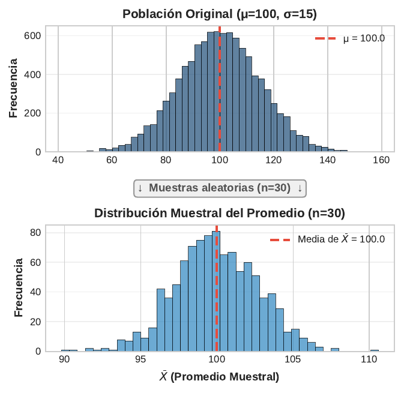
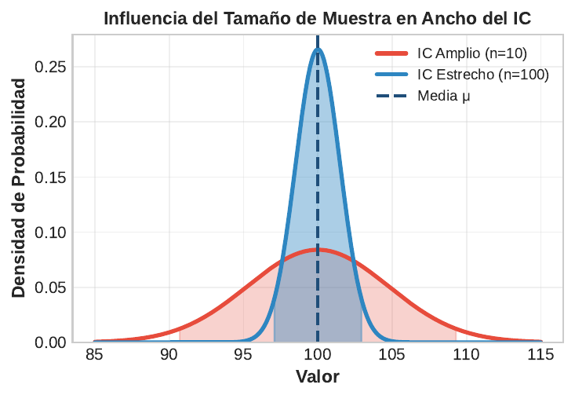
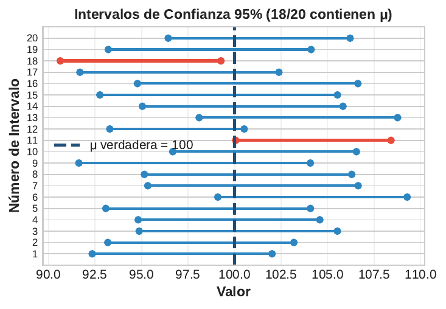

```{r}
#| label: setup
#| echo: false
library(tidyverse)
library(gapminder)
library(moments)
library(knitr)
library(broom)
library(plotly)
theme_set(theme_minimal(base_size = 13))
azul <- "#1F4E79"; celeste <- "#2E86C1"; rojo <- "#E74C3C"; verde <- "#27AE60"; naranja <- "#F39C12"
# En HTML (revealjs) los graficos se vuelven interactivos con plotly;
# en Beamer (PDF) se mantienen estaticos.
es_html <- knitr::is_html_output()
interactivo <- function(p) {
  if (es_html) plotly::config(plotly::ggplotly(p), displayModeBar = FALSE) else p
}
# Escenario de trabajo: evaluacion de un programa de empleo
set.seed(123)
poblacion <- rlnorm(50000, meanlog = 6.2, sdlog = 0.5)  # ingresos (miles de $)
mu_pob <- mean(poblacion); sigma_pob <- sd(poblacion)
set.seed(42)
encuesta <- sample(poblacion, 200)                      # encuesta a beneficiarios
set.seed(7)
programa <- tibble(
  grupo = rep(c("Control", "Tratado"), each = 120),
  ingreso = c(rnorm(120, 520, 90), rnorm(120, 565, 90))
)
set.seed(21)
gestion <- tibble(municipio = 1:35, antes = rnorm(35, 62, 8)) %>%
  mutate(despues = antes + rnorm(35, 3, 4))
```

## Panorama de la sesión

| Bloque | Concepto clave | Herramienta en R |
|---|---|---|
| Fundamentos | Población vs muestra, distribución muestral, SE | `sample()`, `replicate()` |
| Estimación | IC para media y proporción, con z y con t | `qt()`, `t.test()`, `prop.test()` |
| Interpretación | Cobertura, ancho del IC, lecturas correctas | simulación |
| Contraste | $H_0$/$H_1$, valor-p, errores I y II, potencia | `t.test()`, `power.t.test()` |
| Comparación | Dos grupos independientes y pareados | `t.test()`, `paired = TRUE` |
| Relevancia | Tamaño del efecto, d de Cohen | cálculo manual, `broom::tidy()` |

::: {.callout-note appearance="simple"}
**Escenario de trabajo:** evaluación de un programa de empleo: encuesta de ingresos (n = 200), tratados vs control (120 y 120) y 35 municipios antes/después. Datos simulados con `set.seed()` — todo es reproducible.
:::

## Población vs muestra, parámetro vs estadístico

| | Población | Muestra |
|---|---|---|
| Objeto | Todos los hogares del país | Los $n$ hogares encuestados |
| Media | $\mu$ (parámetro) | $\bar{x}$ (estadístico) |
| Desviación estándar | $\sigma$ | $s$ |
| Proporción | $p$ | $\hat{p}$ |
| Naturaleza | Fijos y desconocidos | Aleatorios: cambian con cada muestra |
| Papel en la inferencia | Lo que queremos conocer | Lo que efectivamente calculamos |

::: {.callout-note appearance="simple"}
**Inferencia estadística** = usar el estadístico (conocido) para aprender del parámetro (desconocido), cuantificando la incertidumbre. La CASEN entrevista ~70 mil hogares para hablar de ~6,5 millones: toda cifra oficial de pobreza es un estadístico, no un parámetro.
:::

## La distribución muestral: el concepto clave

:::: {.columns}

::: {.column width="48%"}
```{r}
#| label: png-dist-muestral
#| echo: false
#| out.width: "100%"

```
:::

::: {.column width="52%"}
**Es la distribución del estadístico $\bar{x}$ a través de todas las muestras posibles de tamaño $n$.**

- Su centro es el parámetro: $E[\bar{x}] = \mu$ (la media muestral es un estimador **insesgado**)
- Es mucho más concentrada que la distribución de los datos
- Su desviación estándar tiene nombre propio: **error estándar**
- No confundir: distribución de los **datos** (arriba) vs distribución de las **medias** (abajo)
:::

::::

## Teorema del Límite Central: la garantía

:::: {.columns}

::: {.column width="52%"}
```{r}
#| label: png-tlc
#| echo: false
#| out.width: "100%"
knitr::include_graphics("figuras/tlc_simulacion.png")
```
:::

::: {.column width="48%"}
$$\bar{X} \sim N\!\left(\mu, \frac{\sigma^2}{n}\right) \text{ (aprox., } n \text{ grande)}$$

- Vale **aunque la población no sea normal** (aquí: uniforme)
- Regla práctica: $n \geq 30$ suele bastar; con asimetría fuerte, se necesita más
- Es lo que autoriza usar $z$ y $t$ con variables de encuesta (ingreso, gasto), que casi nunca son normales
:::

::::

## Error estándar: la precisión de la media muestral

:::: {.columns}

::: {.column width="48%"}
$$SE_{\bar{x}} = \frac{\sigma}{\sqrt{n}} \qquad \widehat{SE}_{\bar{x}} = \frac{s}{\sqrt{n}}$$

- Decrece con $\sqrt{n}$: rendimientos decrecientes
- $n = 25 \to SE = \sigma/5$; $n = 100 \to \sigma/10$; $n = 400 \to \sigma/20$
- **Reducir el SE a la mitad exige cuadruplicar la muestra**: la precisión cuesta presupuesto
- Como $\sigma$ es desconocida, en la práctica se estima con $s$
:::

::: {.column width="52%"}
```{r}
#| label: png-ancho-ic
#| echo: false
#| out.width: "100%"

```
:::

::::

## Simulación: ingresos sesgados, medias normales

```{r}
#| label: plot-sim-muestral
#| echo: false
#| fig-height: 3.2
set.seed(99)
medias_sim <- replicate(3000, mean(sample(poblacion, 100)))
dsim <- bind_rows(
  tibble(valor = poblacion, panel = "Población: 50.000 ingresos (sesgo = 1.7)"),
  tibble(valor = medias_sim, panel = "3.000 medias muestrales (n = 100)")
) %>%
  mutate(panel = factor(panel, levels = c(
    "Población: 50.000 ingresos (sesgo = 1.7)",
    "3.000 medias muestrales (n = 100)")))
p <- ggplot(dsim, aes(valor, fill = panel)) +
  geom_histogram(bins = 60, color = "white", show.legend = FALSE) +
  geom_vline(xintercept = mu_pob, color = rojo, linetype = "dashed", linewidth = 0.9) +
  scale_fill_manual(values = c(naranja, celeste)) +
  facet_wrap(~panel, scales = "free") +
  labs(x = "Ingreso mensual (miles de $)", y = NULL)
interactivo(p)
```

SE teórico $\sigma/\sqrt{100} =$ `r round(sigma_pob/10, 1)`; SE simulado = `r round(sd(medias_sim), 1)`. Con $n = 100$, la distribución de $\bar{x}$ es normal y está centrada en $\mu =$ `r round(mu_pob)` aunque los ingresos tengan sesgo `r round(skewness(poblacion), 1)`.

## Anatomía del intervalo de confianza

:::: {.columns}

::: {.column width="46%"}
$$\text{IC} = \underbrace{\bar{x}}_{\text{estimador}} \pm \underbrace{z^* \text{ o } t^*}_{\text{crítico}} \times \underbrace{SE}_{\text{precisión}}$$

Valores críticos $z^*$ según confianza:

- 90% → $z^* = 1.645$
- 95% → $z^* = 1.96$
- 99% → $z^* = 2.576$

Más confianza → crítico mayor → intervalo más ancho.
:::

::: {.column width="54%"}
```{r}
#| label: png-ic
#| echo: false
#| out.width: "100%"

```

Cada muestra produce un intervalo distinto: la "confianza" es una propiedad del **procedimiento**, no de un intervalo particular.
:::

::::

## ¿Crítico z o t? Depende de si conocemos la varianza

:::: {.columns}

::: {.column width="50%"}
- $\sigma$ **conocida** (caso de libro): usar $z$; casi nunca ocurre
- $\sigma$ **desconocida** (caso real): estimarla con $s$ y usar $t$ con $n-1$ grados de libertad
- La $t$ tiene **colas más pesadas**: paga la incertidumbre extra de estimar $\sigma$
- Con $n \geq 30$ son casi iguales: $t^*_{29} = 2.045$ vs $z^* = 1.96$
:::

::: {.column width="50%"}
```{r}
#| label: plot-z-vs-t
#| echo: false
#| fig-width: 5
#| fig-height: 3.4
#| out.width: "100%"
xg <- seq(-4, 4, 0.01)
df_zt <- bind_rows(
  tibble(x = xg, dens = dnorm(xg), dist = "Normal (z)"),
  tibble(x = xg, dens = dt(xg, 4), dist = "t con 4 gl"),
  tibble(x = xg, dens = dt(xg, 29), dist = "t con 29 gl")
) %>%
  mutate(dist = factor(dist, levels = c("Normal (z)", "t con 4 gl", "t con 29 gl")))
p <- ggplot(df_zt, aes(x, dens, color = dist)) +
  geom_line(linewidth = 0.9) +
  scale_color_manual(values = c(azul, rojo, naranja)) +
  labs(x = "Estadístico estandarizado", y = "Densidad", color = NULL) +
  theme(legend.position = "top")
interactivo(p)
```
:::

::::

## IC para la media en R: a mano con qt() y con t.test()

```{r}
#| label: code-ic-media
n <- length(encuesta)                       # 200 beneficiarios encuestados
media <- mean(encuesta); s <- sd(encuesta)
t_crit <- qt(0.975, df = n - 1)
round(c(media = media, SE = s / sqrt(n), t_critico = t_crit), 2)
round(media + c(-1, 1) * t_crit * s / sqrt(n), 1)   # IC 95% manual
round(as.numeric(t.test(encuesta)$conf.int), 1)     # IC 95% con t.test()
```

- Con 95% de confianza, el ingreso medio de los beneficiarios está entre 531 y 613 mil $: mismo resultado a mano y con `t.test()`.
- Para otro nivel: `t.test(encuesta, conf.level = 0.99)` ensancha el intervalo.

## Interpretación del IC 95%: una correcta, tres incorrectas

| Afirmación sobre un IC 95% = (a, b) | Veredicto |
|---|---|
| "El 95% de los intervalos construidos con este procedimiento contiene $\mu$" | **Correcta** |
| "Hay 95% de probabilidad de que $\mu$ esté entre a y b" | Incorrecta: $\mu$ es fijo; este intervalo ya lo contiene o no |
| "El 95% de los hogares tiene ingreso entre a y b" | Incorrecta: confunde el IC con la dispersión de los datos |
| "El 95% de las medias de futuras muestras caerá entre a y b" | Incorrecta: eso requeriría un intervalo distinto (de predicción) |

::: {.callout-important appearance="simple"}
La probabilidad vive en el **procedimiento de muestreo**, no en el intervalo ya calculado. La frase "con 95% de confianza, $\mu$ está en (a, b)" es la convención aceptada para comunicar exactamente eso.
:::

## Cobertura: 100 intervalos al 95%

```{r}
#| label: plot-cobertura
#| echo: false
#| fig-height: 3.2
set.seed(2026)
sims_cob <- map_dfr(1:100, function(i) {
  m <- sample(poblacion, 50)
  ic <- t.test(m)$conf.int
  tibble(id = i, inf = ic[1], sup = ic[2], media = mean(m))
}) %>%
  mutate(estado = factor(inf <= mu_pob & mu_pob <= sup,
                         levels = c(TRUE, FALSE),
                         labels = c("Contiene la media poblacional", "No la contiene")))
p <- ggplot(sims_cob, aes(x = id)) +
  geom_segment(aes(xend = id, y = inf, yend = sup, color = estado), linewidth = 0.8) +
  geom_point(aes(y = media, color = estado), size = 0.7) +
  geom_hline(yintercept = mu_pob, color = azul, linetype = "dashed", linewidth = 0.9) +
  scale_color_manual(values = c("Contiene la media poblacional" = celeste,
                                "No la contiene" = rojo)) +
  labs(x = "Muestra (n = 50 cada una)", y = "Ingreso (miles de $)", color = NULL,
       title = "Cada segmento es el IC 95% de una muestra distinta") +
  theme(legend.position = "top")
interactivo(p)
```

En esta corrida, `r sum(sims_cob$estado == "Contiene la media poblacional")` de 100 intervalos contienen $\mu$ (línea azul). Repetido indefinidamente, el porcentaje converge a 95: eso —y solo eso— significa "95% de confianza".

## El ancho del IC: efecto de n y del nivel de confianza

:::: {.columns}

::: {.column width="46%"}
```{r}
#| label: code-ancho
#| eval: false
g <- crossing(
    n = seq(10, 500, 5),
    conf = c(.90, .95, .99)) %>%
  mutate(
    t_c = qt(1 - (1 - conf)/2,
             df = n - 1),
    ancho = 2 * t_c *
      sigma_pob / sqrt(n))
ggplot(g, aes(n, ancho,
       color = factor(conf))) +
  geom_line(linewidth = 1) +
  labs(x = "Tamaño muestral n",
       y = "Ancho del IC",
       color = "Confianza")
```

El ancho cae con $\sqrt{n}$: pasar de $n = 100$ a $n = 400$ apenas lo reduce a la mitad. Y exigir 99% en vez de 90% lo ensancha ~57%.
:::

::: {.column width="54%"}
```{r}
#| label: plot-ancho
#| echo: false
#| fig-width: 5.6
#| fig-height: 3.9
#| out.width: "100%"
g <- crossing(n = seq(10, 500, 5), conf = c(.90, .95, .99)) %>%
  mutate(t_c = qt(1 - (1 - conf)/2, df = n - 1),
         ancho = 2 * t_c * sigma_pob / sqrt(n))
interactivo(
  ggplot(g, aes(n, ancho, color = factor(conf))) +
    geom_line(linewidth = 1) +
    scale_color_manual(values = c(verde, celeste, rojo),
                       labels = c("90%", "95%", "99%")) +
    labs(x = "Tamaño muestral n", y = "Ancho del IC (miles de $)",
         color = "Confianza")
)
```
:::

::::

## IC para una proporción: el margen de error de las encuestas

$$\hat{p} \pm z^* \sqrt{\frac{\hat{p}(1-\hat{p})}{n}}$$

```{r}
#| label: code-ic-prop
x <- 280; n <- 500                      # 280 de 500 apoyan la reforma
p_hat <- x / n
ee <- sqrt(p_hat * (1 - p_hat) / n)
round(c(p_hat = p_hat, SE = ee, margen_95 = 1.96 * ee), 3)
round(as.numeric(prop.test(x, n)$conf.int), 3)   # IC de Wilson
```

::: {.callout-tip appearance="simple"}
El "margen de error de $\pm 3$ puntos" que reportan las encuestas es este IC al 95% en el peor caso ($\hat{p} = 0.5$): exige $n = (1.96/0.03)^2 \times 0.25 \approx 1067$ casos. `prop.test()` usa el método de Wilson, más preciso que Wald cuando $\hat{p}$ se acerca a 0 o 1.
:::

## La lógica de la prueba de hipótesis en cuatro pasos

| Paso | Qué se hace | Ejemplo (programa de empleo) |
|---|---|---|
| 1. Hipótesis | $H_0$: no hay efecto; $H_1$: sí lo hay | $H_0: \mu = 500$ vs $H_1: \mu \neq 500$ |
| 2. Nivel $\alpha$ | Fijar la tasa tolerada de falsos positivos **antes** de ver los datos | $\alpha = 0.05$ |
| 3. Estadístico | Medir a cuántos SE está el dato de lo que dice $H_0$ | $t = (\bar{x} - 500)/(s/\sqrt{n})$ |
| 4. Valor-p y decisión | Probabilidad de algo tan extremo si $H_0$ fuera cierta | $p < \alpha \to$ rechazar $H_0$ |

::: {.callout-note appearance="simple"}
$H_0$ es la hipótesis del escepticismo ("el programa no cambió nada"). La carga de la prueba recae en los datos: solo la abandonamos cuando lo observado sería suficientemente improbable bajo ella.
:::

## El valor-p en un dibujo

```{r}
#| label: plot-valor-p
#| echo: false
#| fig-height: 3.0
xg <- seq(-4, 4, 0.01)
dens_t <- tibble(x = xg, d = dt(xg, 199))
p <- ggplot(dens_t, aes(x, d)) +
  geom_area(data = filter(dens_t, x >= 2.2), fill = rojo, alpha = .6) +
  geom_area(data = filter(dens_t, x <= -2.2), fill = rojo, alpha = .6) +
  geom_line(color = azul, linewidth = 1) +
  geom_vline(xintercept = c(-2.2, 2.2), linetype = "dashed", color = rojo) +
  annotate("text", x = 2.95, y = 0.055, label = "área = p/2", color = rojo, size = 4.3) +
  annotate("text", x = -2.95, y = 0.055, label = "área = p/2", color = rojo, size = 4.3) +
  annotate("text", x = 0, y = 0.16, label = "Distribución de t\nsi H0 es cierta", color = azul, size = 4.3) +
  annotate("text", x = 2.3, y = 0.38, label = "t observado = 2.2", color = rojo, size = 4.1, hjust = 0) +
  labs(x = "Estadístico t", y = "Densidad bajo H0")
interactivo(p)
```

El valor-p es el área en las colas más allá del estadístico observado, calculada **bajo** $H_0$. Ejemplo: $t = 2.2$ con 199 gl da $p =$ `r round(2 * pt(-2.2, 199), 3)`: si $H_0$ fuera cierta, solo el 3% de las muestras daría algo tan extremo.

## Prueba t de una muestra: ¿superó el programa la línea base?

Antes del programa, el ingreso medio era **500 mil $**. Encuesta a 200 beneficiarios:

```{r}
#| label: code-t-una
tt1 <- t.test(encuesta, mu = 500)
tt1
```

$t = 3.45$: la media observada está a 3.45 SE de 500; $p < 0.001 \to$ se rechaza $H_0$. El IC (531, 613) **excluye** 500: prueba e intervalo cuentan la misma historia.

## Qué es y qué NO es el valor-p

| Afirmación | Veredicto |
|---|---|
| Probabilidad de datos tan extremos como los observados, si $H_0$ es cierta | **Eso es exactamente el valor-p** |
| Probabilidad de que $H_0$ sea cierta | No: $H_0$ no tiene probabilidad frecuentista |
| Probabilidad de que el hallazgo se deba al azar | No: esa lectura invierte el condicional |
| $1 - p$ = probabilidad de que $H_1$ sea cierta | No |
| $p > 0.05$ demuestra que no hay efecto | No: ausencia de evidencia no es evidencia de ausencia |
| $p < 0.05$ implica un efecto grande o importante | No: con $n$ enorme, efectos triviales dan p diminutos |

::: {.callout-important appearance="simple"}
Declaración de la ASA (Wasserstein & Lazar, 2016): el valor-p **no mide** el tamaño ni la importancia de un efecto, y ninguna decisión de política debería basarse solo en si $p$ cruza 0.05.
:::

## Dos muestras independientes: tratados vs control

Evaluación con grupo de comparación: 120 tratados y 120 controles; resultado = ingreso mensual (miles de $).

```{r}
#| label: code-t-dos
tt2 <- t.test(ingreso ~ grupo, data = programa)   # Welch por defecto
tidy(tt2) %>%
  transmute(dif = estimate, t = statistic, gl = parameter,
            p = p.value, ic_inf = conf.low, ic_sup = conf.high) %>%
  kable(digits = 3)
```

- `dif` = media(Control) - media(Tratado) = -35: R resta en el orden de los niveles del factor; los tratados ganan en promedio 35 mil $ más.
- El IC de la diferencia excluye el 0 → diferencia significativa al 5%. El test de Welch (default) no exige varianzas iguales.

## Ver la comparación: distribuciones y diferencia con su IC

```{r}
#| label: plot-dos-grupos
#| echo: false
#| fig-height: 3.3
niveles_panel <- c("Ingreso por grupo", "Diferencia e IC 95%")
dif_df <- tidy(tt2) %>%
  transmute(grupo = "Tratado - Control", dif = -estimate,
            inf = -conf.high, sup = -conf.low,
            panel = factor("Diferencia e IC 95%", levels = niveles_panel))
prog_p <- programa %>%
  mutate(panel = factor("Ingreso por grupo", levels = niveles_panel))
p <- ggplot() +
  geom_jitter(data = prog_p, aes(grupo, ingreso, color = grupo),
              width = .12, alpha = .3, size = 1, show.legend = FALSE) +
  geom_boxplot(data = prog_p, aes(grupo, ingreso, fill = grupo),
               alpha = .6, width = .45, outlier.shape = NA, show.legend = FALSE) +
  geom_hline(data = dif_df, aes(yintercept = 0), linetype = "dashed", color = rojo) +
  geom_errorbar(data = dif_df, aes(x = grupo, ymin = inf, ymax = sup),
                width = .12, color = azul, linewidth = 1) +
  geom_point(data = dif_df, aes(grupo, dif), color = azul, size = 3) +
  facet_wrap(~panel, scales = "free") +
  scale_fill_manual(values = c(Control = naranja, Tratado = celeste)) +
  scale_color_manual(values = c(Control = naranja, Tratado = celeste)) +
  labs(x = NULL, y = "Miles de $")
interactivo(p)
```

El panel derecho es el resumen inferencial completo: no solo dice "p = 0.002", muestra la **magnitud** (35 mil $) y su **incertidumbre** (IC 13 a 57). Si el IC tocara el 0, la diferencia no sería distinguible del azar muestral.

## Prueba pareada: los mismos municipios antes y después

:::: {.columns}

::: {.column width="48%"}
```{r}
#| label: code-pareada
tp <- t.test(gestion$despues,
             gestion$antes,
             paired = TRUE)
round(c(dif = unname(tp$estimate),
        as.numeric(tp$conf.int)), 2)
signif(tp$p.value, 2)
```

- Cada municipio es su **propio control**: se analizan las 35 diferencias internas
- Elimina la variabilidad entre municipios → SE menor, más potencia
- Equivale a una prueba t de una muestra sobre las diferencias
:::

::: {.column width="52%"}
```{r}
#| label: plot-pareada
#| echo: false
#| fig-width: 5
#| fig-height: 3.5
#| out.width: "100%"
glargo <- gestion %>%
  pivot_longer(c(antes, despues), names_to = "momento", values_to = "indice") %>%
  mutate(momento = factor(momento, levels = c("antes", "despues"),
                          labels = c("Antes", "Después")))
p <- ggplot(glargo, aes(momento, indice, group = municipio)) +
  geom_line(alpha = 0.35, color = celeste) +
  geom_point(size = 1.4, color = azul, alpha = 0.6) +
  stat_summary(aes(group = 1), fun = mean, geom = "line",
               color = rojo, linewidth = 1.2) +
  labs(x = NULL, y = "Índice de gestión (0-100)",
       title = "35 municipios; línea roja = promedio")
interactivo(p)
```
:::

::::

## Errores Tipo I y Tipo II: la tabla de decisiones

| Decisión | $H_0$ cierta (programa sin efecto) | $H_0$ falsa (programa con efecto) |
|---|---|---|
| Rechazar $H_0$ | **Error Tipo I** — prob. $\alpha$ (falso positivo) | Acierto: **potencia** $= 1 - \beta$ |
| No rechazar $H_0$ | Acierto — prob. $1 - \alpha$ | **Error Tipo II** — prob. $\beta$ (falso negativo) |

::: {.callout-important appearance="simple"}
En política pública los costos son asimétricos: el Tipo I **financia y escala un programa inútil**; el Tipo II **cancela uno efectivo**. $\alpha$ se fija por convención (0.05); $\beta$ depende del tamaño del efecto, de $n$ y de $\alpha$, y se controla **diseñando** el estudio.
:::

## Error I, error II y potencia en un dibujo

```{r}
#| label: plot-errores
#| echo: false
#| fig-height: 3.2
xg <- seq(-4, 6.5, 0.01)
crit <- qnorm(0.95)
curvas_h <- bind_rows(
  tibble(x = xg, dens = dnorm(xg), hip = "H0"),
  tibble(x = xg, dens = dnorm(xg, 2.5), hip = "H1"))
p <- ggplot(curvas_h, aes(x, dens, group = hip)) +
  geom_area(data = filter(curvas_h, hip == "H1", x >= crit),
            fill = verde, alpha = .35) +
  geom_area(data = filter(curvas_h, hip == "H1", x < crit),
            fill = naranja, alpha = .55) +
  geom_area(data = filter(curvas_h, hip == "H0", x >= crit),
            fill = rojo, alpha = .75) +
  geom_line(aes(color = hip), linewidth = 1, show.legend = FALSE) +
  geom_vline(xintercept = crit, linetype = "dashed", color = azul) +
  scale_color_manual(values = c(H0 = azul, H1 = verde)) +
  annotate("text", x = -1.7, y = 0.35, label = "H0: sin efecto", color = azul, size = 4.4) +
  annotate("text", x = 4.35, y = 0.35, label = "H1: efecto real", color = verde, size = 4.4) +
  annotate("text", x = 1.68, y = 0.44, label = "valor crítico", color = azul, size = 3.8, hjust = 0) +
  annotate("text", x = 3.55, y = 0.30, label = "rojo: alfa = 0.05 (error I)", color = rojo, size = 4, hjust = 0) +
  annotate("text", x = 3.55, y = 0.26, label = "naranja: beta = 0.20 (error II)", color = naranja, size = 4, hjust = 0) +
  annotate("text", x = 3.55, y = 0.22, label = "verde: potencia = 0.80", color = verde, size = 4, hjust = 0) +
  coord_cartesian(ylim = c(0, 0.46)) +
  labs(x = "Estadístico de prueba", y = "Densidad")
interactivo(p)
```

Contraste unilateral con $\alpha = 0.05$. Mover el crítico a la izquierda reduce $\beta$ pero infla los falsos positivos: la única forma de bajar **ambos** errores a la vez es aumentar $n$ o estudiar efectos más grandes.

## Curva de potencia: qué efectos podemos detectar

:::: {.columns}

::: {.column width="46%"}
```{r}
#| label: code-potencia
#| eval: false
curvas <- crossing(
    d = seq(0.1, 1.2, 0.02),
    n = c(30, 64, 120)) %>%
  mutate(pow = map2_dbl(d, n,
    ~power.t.test(n = .y,
                  delta = .x,
                  sd = 1)$power))
ggplot(curvas, aes(d, pow,
       color = factor(n))) +
  geom_line(linewidth = 1) +
  geom_hline(yintercept = 0.8,
             linetype = "dashed") +
  labs(x = "Efecto (d de Cohen)",
       y = "Potencia",
       color = "n por grupo")
```

Con $n = 64$ por grupo hay 80% de potencia para $d = 0.5$; con $n = 30$, solo efectos $d \geq 0.75$ se detectan con esa seguridad.
:::

::: {.column width="54%"}
```{r}
#| label: plot-potencia
#| echo: false
#| fig-width: 5.6
#| fig-height: 3.9
#| out.width: "100%"
curvas <- crossing(d = seq(0.1, 1.2, 0.02), n = c(30, 64, 120)) %>%
  mutate(pow = map2_dbl(d, n,
    ~power.t.test(n = .y, delta = .x, sd = 1)$power))
interactivo(
  ggplot(curvas, aes(d, pow, color = factor(n))) +
    geom_line(linewidth = 1) +
    geom_hline(yintercept = 0.8, linetype = "dashed") +
    scale_color_manual(values = c(naranja, celeste, azul)) +
    labs(x = "Efecto (d de Cohen)", y = "Potencia",
         color = "n por grupo")
)
```
:::

::::

## Significancia no es relevancia: el tamaño del efecto

$$d = \frac{\bar{x}_1 - \bar{x}_2}{s_{\text{combinada}}}$$

```{r}
#| label: code-cohen
resumen <- programa %>% group_by(grupo) %>%
  summarise(m = mean(ingreso), s = sd(ingreso))
s_pool <- sqrt(mean(resumen$s^2))
round(c(dif = diff(resumen$m), s_comb = s_pool,
        d_cohen = diff(resumen$m) / s_pool), 2)
```

| $d$ | Convención | Lectura en evaluación |
|---|---|---|
| 0.2 | Pequeño | Real, pero exige muestras grandes |
| 0.5 | Mediano | Diferencia apreciable |
| 0.8 | Grande | Raro en programas sociales |

El programa logra $d = 0.41$ con $p = 0.002$: significativo **y** de magnitud reportable.

## Con n suficiente, todo se vuelve "significativo"

```{r}
#| label: plot-p-vs-n
#| echo: false
#| fig-height: 3.0
df_pn <- crossing(n = seq(20, 4000, 20), d = c(0.05, 0.2, 0.5)) %>%
  mutate(t = d * sqrt(n / 2), p = 2 * pt(-t, df = 2 * n - 2),
         efecto = paste0("d = ", d))
p <- ggplot(df_pn, aes(n, p, color = efecto)) +
  geom_line(linewidth = 1) +
  geom_hline(yintercept = 0.05, linetype = "dashed", color = rojo) +
  annotate("text", x = 3700, y = 0.09, label = "p = 0.05", color = rojo, size = 4) +
  scale_y_log10(breaks = c(1e-6, 1e-4, 0.01, 1),
                labels = c("0.000001", "0.0001", "0.01", "1")) +
  coord_cartesian(ylim = c(1e-6, 1)) +
  scale_color_manual(values = c(rojo, naranja, celeste)) +
  labs(x = "n por grupo", y = "Valor-p (escala log)", color = NULL,
       title = "Valor-p si la diferencia observada igualara a la verdadera") +
  theme(legend.position = "top")
interactivo(p)
```

Un efecto trivial de $d = 0.05$ cruza $p < 0.05$ con ~3.100 casos por grupo. El valor-p mezcla tamaño del efecto con tamaño muestral: repórtelo siempre junto a $d$ y su IC.

## Inferencia y evaluación de políticas públicas

| Pregunta de política | Herramienta de esta sesión | Cuidado principal |
|---|---|---|
| ¿Cuál es el ingreso medio de los beneficiarios? | IC para la media | Representatividad y no respuesta |
| ¿Qué apoyo ciudadano tiene la reforma? | IC para proporción | Margen de error y diseño muestral |
| ¿El programa cambió el resultado? | t de dos muestras + d de Cohen | Significancia no es causalidad |
| ¿Mejoraron las mismas unidades? | Prueba pareada | Regresión a la media; falta contrafactual |
| ¿Cuántos casos necesita el piloto? | Análisis de potencia | Hacerlo **antes** de recolectar datos |

::: {.callout-warning appearance="simple"}
Rechazar $H_0$ solo dice que la diferencia no es atribuible al azar muestral; **no** dice que el programa la causó. Atribuir causalidad exige diseño (aleatorización, grupo de control válido): el puente hacia el curso de econometría.
:::

## Errores comunes en inferencia

| Error | Consecuencia | Corrección |
|---|---|---|
| Leer p como P($H_0$ cierta) | Sobreconfianza en el hallazgo | p = P(datos extremos dado $H_0$) |
| "No significativo" = "sin efecto" | Cancelar programas mal evaluados | Reportar potencia e IC |
| Probar hasta lograr p < 0.05 (p-hacking) | Falsos positivos inflados | Preregistro; corrección por pruebas múltiples |
| Leer el IC como rango de los datos | Confunde precisión con dispersión | El IC habla de $\mu$, no de individuos |
| Ignorar el diseño muestral complejo | SE subestimados | Ponderadores y errores por conglomerado |
| Reportar solo p, sin tamaño de efecto | Relevancia desconocida | d de Cohen + IC de la diferencia |

## Síntesis: qué debe salir en su reporte

:::: {.columns}

::: {.column width="55%"}
**Checklist inferencial**

1. Toda estimación puntual acompañada de su IC
2. Cobertura interpretada sobre el procedimiento, no el intervalo
3. Hipótesis y $\alpha$ definidos antes de ver los datos
4. Valor-p junto a tamaño de efecto ($d$) e IC de la diferencia
5. Potencia calculada en la etapa de diseño, no después
6. Distinguir: significancia estadística, relevancia práctica, causalidad
:::

::: {.column width="45%"}
**Funciones R de esta sesión**

`t.test()` `prop.test()` `qt()` `qnorm()` `pt()` `power.t.test()` `broom::tidy()` `sample()` `replicate()` `crossing()`

**Próxima sesión:** taller práctico integrador — de los datos crudos al reporte inferencial completo en R.
:::

::::

## Ejercicio para practicar (30 min)

Con `gapminder` filtrado al año **2007**:

1. Construya el IC 95% para la esperanza de vida media en África. Redacte su interpretación con la cobertura correcta.
2. Pruebe $H_0: \mu = 60$ años para África con `t.test()`. Reporte t, valor-p e IC: ¿son coherentes entre sí?
3. Compare América vs Asia en `lifeExp` con una prueba t de dos muestras y calcule la d de Cohen. ¿La diferencia es relevante además de significativa?
4. Estime la proporción de países del mundo con `lifeExp > 70` y su IC 95% con `prop.test()`.
5. Con `power.t.test()`: ¿cuántos países por grupo se necesitan para detectar $d = 0.4$ con potencia 80%?

::: {.callout-note appearance="simple"}
**Referencias:** Illowsky & Dean, *Introductory Statistics* (caps. 8–10) · Wasserstein & Lazar (2016), "The ASA Statement on p-Values", *The American Statistician* · Diez, Barr & Çetinkaya-Rundel, *OpenIntro Statistics* (caps. 5–7).
:::
