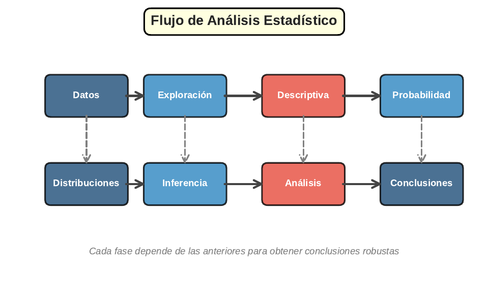

```{r}
#| label: setup
#| echo: false
library(tidyverse)
library(gapminder)
library(moments)
library(knitr)
library(plotly)
theme_set(theme_minimal(base_size = 13))
azul <- "#1F4E79"; celeste <- "#2E86C1"; rojo <- "#E74C3C"; verde <- "#27AE60"; naranja <- "#F39C12"
set.seed(2026)
# En HTML (revealjs) los graficos se vuelven interactivos con plotly;
# en Beamer (PDF) se mantienen estaticos.
es_html <- knitr::is_html_output()
interactivo <- function(p) {
  if (es_html) plotly::config(plotly::ggplotly(p), displayModeBar = FALSE) else p
}
```

## Panorama de la sesión

| Bloque | Pasos | Integra | Herramientas en R |
|---|:-:|---|---|
| Pregunta y datos | 1–2 | Sesión 1 | `glimpse()`, `summary()` |
| Preparación | 3 | Sesión 1 | `filter()`, `mutate()`, `log()` |
| Descripción y gráficos | 4–5 | Sesión 1 | `group_by()`, `ggplot2` + `plotly` |
| Outliers y supuestos | 6–7 | Sesiones 1–3 | regla IQR, QQ-plot, `shapiro.test()` |
| Inferencia | 8–10 | Sesión 4 | `t.test()`, d de Cohen |
| Reporte | 11–13 | Todas | `kable()`, conclusiones, reproducibilidad |

::: {.callout-note appearance="simple"}
**Formato de hoy:** práctica guiada. Un análisis completo con `gapminder` (142 países, 2007), de la pregunta de política al informe final. Cada slide es un paso ejecutable: código, salida e interpretación.
:::

## El mapa completo: de los datos crudos al informe

```{r}
#| label: mapa-flujo
#| echo: false
#| out.width: "58%"

```

**Pipeline:** datos → exploración → descriptiva → supuestos → inferencia → conclusiones.

## Paso 1 · La pregunta en términos de política pública

:::: {.columns}

::: {.column width="52%"}
**De la política a la estadística**

- **Pregunta de política:** ¿cuán grande es la brecha de longevidad entre países ricos y pobres, y se alcanzó la meta internacional de 70 años de vida?
- **Pregunta estadística 1:** ¿la esperanza de vida media mundial en 2007 difiere de 70 años?
- **Pregunta estadística 2:** ¿difiere la esperanza de vida media entre países de PIB alto y PIB bajo?
:::

::: {.column width="48%"}
**Hipótesis declaradas ANTES de mirar los datos**

- Prueba 1: $H_0: \mu = 70$ vs $H_1: \mu \neq 70$
- Prueba 2: $H_0: \mu_{alto} = \mu_{bajo}$ vs $H_1: \mu_{alto} \neq \mu_{bajo}$
- Nivel de significancia: $\alpha = 0.05$
- Estimador central: media muestral con IC 95%
:::

::::

::: {.callout-important appearance="simple"}
Hipótesis y $\alpha$ se fijan **antes** del análisis. Elegir la prueba después de ver los resultados invalida el p-valor (Sesión 4).
:::

## Paso 2 · Carga e inspección de datos

```{r}
#| label: paso-carga
#| output-location: column
library(gapminder)
glimpse(gapminder)
```

- 1.704 filas = 142 países × 12 años (panel balanceado)
- `country`, `continent`: **nominales** (factores)
- `lifeExp`, `gdpPercap`: **continuas de razón**
- `pop`: **discreta de razón**; `year`: intervalo

## Paso 2 · Control de calidad antes de analizar

```{r}
#| label: paso-calidad
c(filas = nrow(gapminder),
  paises = n_distinct(gapminder$country),
  anios = n_distinct(gapminder$year),
  na_total = sum(is.na(gapminder)))
```

```{r}
#| label: paso-calidad-rango
range(gapminder$year)
summary(gapminder$lifeExp)[c(1, 6)]
```

Sin valores faltantes y sin valores imposibles (mínimo 23.6 años corresponde a Ruanda 1992, un valor real documentado). Fijamos el corte transversal en **2007**.

## Paso 3 · Limpieza y transformación

```{r}
#| label: paso-limpieza
datos <- gapminder %>%
  filter(year == 2007) %>%
  mutate(log_pib = log(gdpPercap),
         grupo_pib = if_else(
           gdpPercap >= median(gdpPercap),
           "PIB alto", "PIB bajo"))
datos %>% count(grupo_pib)
```

- `filter()`: solo el año 2007 (n = 142 países)
- `log()`: doma el sesgo derecho del PIB (Sesión 1)
- `grupo_pib`: corte por la **mediana** (6.124 USD) → dos grupos de 71 países; la mediana es robusta a los outliers de PIB

## Paso 4 · Descriptivos por grupo

```{r}
#| label: paso-descriptivos
datos %>% group_by(continent) %>%
  summarise(n = n(), media = mean(lifeExp), de = sd(lifeExp),
            mediana = median(lifeExp), iqr = IQR(lifeExp)) %>%
  mutate(across(where(is.numeric), ~round(.x, 1))) %>% kable()
```

África queda **20+ años** por debajo del resto y además es el continente más heterogéneo (DE = 9.6). Reportar siempre **n, media, DE, mediana e IQR** por grupo antes de cualquier prueba.

## Paso 5 · Gráfico 1: la distribución de la variable clave

:::: {.columns}

::: {.column width="46%"}
```{r}
#| label: code-hist5
#| eval: false
p <- ggplot(datos, aes(x = lifeExp)) +
  geom_histogram(bins = 18,
                 fill = celeste,
                 color = "white") +
  geom_vline(
    xintercept = mean(datos$lifeExp),
    color = rojo, linewidth = 1,
    linetype = "dashed") +
  labs(x = "Esperanza de vida (años)",
       y = "N° de países")
ggplotly(p)  # interactivo en HTML
```

`ggplotly(p)` vuelve interactivo cualquier ggplot en HTML; en PDF queda estático. Cola izquierda: media (67.0) < mediana (71.9).
:::

::: {.column width="54%"}
```{r}
#| label: plot-hist5
#| echo: false
#| fig-width: 5.6
#| fig-height: 3.9
#| out.width: "100%"
interactivo(
  ggplot(datos, aes(x = lifeExp)) +
    geom_histogram(bins = 18, fill = celeste, color = "white") +
    geom_vline(xintercept = mean(datos$lifeExp), color = rojo,
               linewidth = 1, linetype = "dashed") +
    labs(x = "Esperanza de vida (años)", y = "N° de países")
)
```
:::

::::

## Paso 5 · Gráfico 2: comparación entre continentes

:::: {.columns}

::: {.column width="46%"}
```{r}
#| label: code-box5
#| eval: false
ggplot(datos,
       aes(x = reorder(continent,
                       lifeExp, median),
           y = lifeExp,
           fill = continent)) +
  geom_boxplot(alpha = .7,
               outlier.color = rojo) +
  geom_jitter(width = .12,
              alpha = .3, size = 1) +
  labs(x = NULL,
       y = "Esperanza de vida (años)") +
  theme(legend.position = "none")
```

Ordenar por mediana facilita la lectura. África muestra la mayor dispersión y solapa poco con Europa.
:::

::: {.column width="54%"}
```{r}
#| label: plot-box5
#| echo: false
#| fig-width: 5.6
#| fig-height: 3.9
#| out.width: "100%"
interactivo(
  ggplot(datos, aes(x = reorder(continent, lifeExp, median),
                    y = lifeExp, fill = continent)) +
    geom_boxplot(alpha = .7, outlier.color = rojo) +
    geom_jitter(width = .12, alpha = .3, size = 1) +
    labs(x = NULL, y = "Esperanza de vida (años)") +
    theme(legend.position = "none")
)
```
:::

::::

## Paso 5 · Gráfico 3: la relación PIB–vida

:::: {.columns}

::: {.column width="46%"}
```{r}
#| label: code-scatter5
#| eval: false
ggplot(datos,
       aes(x = log_pib, y = lifeExp)) +
  geom_point(aes(color = grupo_pib),
             alpha = .7, size = 2) +
  geom_smooth(method = "lm",
              color = azul) +
  scale_color_manual(
    values = c(celeste, naranja)) +
  labs(x = "log(PIB per cápita)",
       y = "Esperanza de vida (años)",
       color = NULL) +
  theme(legend.position = "bottom")
```

Relación aproximadamente lineal **en logs**: justifica la transformación del Paso 3. En HTML, el tooltip identifica cada país.
:::

::: {.column width="54%"}
```{r}
#| label: plot-scatter5
#| echo: false
#| fig-width: 5.6
#| fig-height: 3.9
#| out.width: "100%"
interactivo(
  ggplot(datos, aes(x = log_pib, y = lifeExp)) +
    geom_point(aes(color = grupo_pib, text = country),
               alpha = .7, size = 2) +
    geom_smooth(method = "lm", color = azul) +
    scale_color_manual(values = c(celeste, naranja)) +
    labs(x = "log(PIB per cápita)",
         y = "Esperanza de vida (años)", color = NULL) +
    theme(legend.position = "bottom")
)
```
:::

::::

## Paso 5 · Gráfico 4: los dos grupos a contrastar

:::: {.columns}

::: {.column width="46%"}
```{r}
#| label: code-dens5
#| eval: false
ggplot(datos,
       aes(x = lifeExp,
           fill = grupo_pib)) +
  geom_density(alpha = .55,
               color = NA) +
  scale_fill_manual(
    values = c(celeste, naranja)) +
  labs(x = "Esperanza de vida (años)",
       y = "Densidad", fill = NULL) +
  theme(legend.position = "top")
```

Separación clara entre grupos, con solapamiento parcial: exactamente lo que la prueba t del Paso 9 va a cuantificar.
:::

::: {.column width="54%"}
```{r}
#| label: plot-dens5
#| echo: false
#| fig-width: 5.6
#| fig-height: 3.9
#| out.width: "100%"
interactivo(
  ggplot(datos, aes(x = lifeExp, fill = grupo_pib)) +
    geom_density(alpha = .55, color = NA) +
    scale_fill_manual(values = c(celeste, naranja)) +
    labs(x = "Esperanza de vida (años)",
         y = "Densidad", fill = NULL) +
    theme(legend.position = "top")
)
```
:::

::::

## Paso 6 · Detección de outliers

:::: {.columns}

::: {.column width="55%"}
```{r}
#| label: paso-outliers
Q1 <- quantile(datos$gdpPercap, .25)
Q3 <- quantile(datos$gdpPercap, .75)
lim <- Q3 + 1.5 * IQR(datos$gdpPercap)
datos %>% filter(gdpPercap > lim) %>%
  select(country, gdpPercap) %>%
  arrange(desc(gdpPercap)) %>%
  mutate(gdpPercap = round(gdpPercap))
```
:::

::: {.column width="45%"}
**Decisión documentada**

1. Los 4 valores son **reales**, no errores.
2. Se **conservan**: eliminar países sesgaría el análisis.
3. El corte por **mediana** del Paso 3 ya es robusto a ellos.
4. En `lifeExp` la regla IQR no marca ningún outlier.
:::

::::

::: {.callout-tip appearance="simple"}
Protocolo de la Sesión 1: verificar, documentar, analizar con y sin, y preferir medidas robustas. Nunca eliminar en silencio.
:::

## Paso 7 · Normalidad I: el QQ-plot

:::: {.columns}

::: {.column width="46%"}
```{r}
#| label: code-qq5
#| eval: false
ggplot(datos,
       aes(sample = lifeExp)) +
  stat_qq(color = celeste,
          size = 2, alpha = .7) +
  stat_qq_line(color = rojo,
               linewidth = 1) +
  labs(
    x = "Cuantiles teóricos N(0,1)",
    y = "Cuantiles muestrales")
```

La cola izquierda se despega de la recta: el sesgo negativo visto en el histograma, ahora contra la referencia normal.
:::

::: {.column width="54%"}
```{r}
#| label: plot-qq5
#| echo: false
#| fig-width: 5.6
#| fig-height: 3.9
#| out.width: "100%"
ggplot(datos, aes(sample = lifeExp)) +
  stat_qq(color = celeste, size = 2, alpha = .7) +
  stat_qq_line(color = rojo, linewidth = 1) +
  labs(x = "Cuantiles teóricos N(0,1)",
       y = "Cuantiles muestrales")
```
:::

::::

## Paso 7 · Normalidad II: prueba de Shapiro-Wilk

```{r}
#| label: paso-shapiro
sw <- shapiro.test(datos$lifeExp)
round(c(W = unname(sw$statistic), p = sw$p.value), 4)
```

```{r}
#| label: paso-shapiro-grupo
datos %>% group_by(grupo_pib) %>%
  summarise(p_shapiro = shapiro.test(lifeExp)$p.value)
```

- Se **rechaza** la normalidad global y en ambos grupos (p < 0.01).
- Pero la prueba t infiere sobre **medias**: con n = 71 por grupo, el TLC (Sesión 3) garantiza normalidad aproximada de $\bar{X}$.
- Conclusión metodológica: reportar el diagnóstico y seguir con t de Welch.

## Paso 8 · Intervalo de confianza para la media

```{r}
#| label: paso-ic
ic <- t.test(datos$lifeExp, conf.level = 0.95)
round(c(media = unname(ic$estimate),
        li = ic$conf.int[1], ls = ic$conf.int[2]), 2)
```

```{r}
#| label: paso-ic-manual
n <- nrow(datos)
ee <- sd(datos$lifeExp) / sqrt(n)
round(mean(datos$lifeExp) + qt(c(.025, .975), n - 1) * ee, 2)
```

`t.test()` automatiza la fórmula $\bar{x} \pm t_{0.975,\,n-1} \cdot s/\sqrt{n}$ de la Sesión 4: ambas rutas dan **[65.0; 69.0]**. El procedimiento captura a $\mu$ en el 95% de las muestras posibles.

## Paso 8 · IC por continente: el gráfico de reporte

:::: {.columns}

::: {.column width="46%"}
```{r}
#| label: code-icgrupo
#| eval: false
ic_g <- datos %>%
  group_by(continent) %>%
  summarise(
    m = mean(lifeExp),
    ee = sd(lifeExp) / sqrt(n()),
    tq = qt(.975, n() - 1))
ggplot(ic_g,
       aes(x = m,
           y = reorder(continent, m))) +
  geom_pointrange(
    aes(xmin = m - tq * ee,
        xmax = m + tq * ee),
    color = azul, linewidth = .9) +
  labs(x = "Media e IC 95% (años)",
       y = NULL)
```
:::

::: {.column width="54%"}
```{r}
#| label: plot-icgrupo
#| echo: false
#| fig-width: 5.6
#| fig-height: 3.9
#| out.width: "100%"
interactivo({
  ic_g <- datos %>% group_by(continent) %>%
    summarise(m = mean(lifeExp), ee = sd(lifeExp) / sqrt(n()),
              tq = qt(.975, n() - 1))
  ggplot(ic_g, aes(x = m, y = reorder(continent, m))) +
    geom_pointrange(aes(xmin = m - tq * ee, xmax = m + tq * ee),
                    color = azul, linewidth = .9) +
    labs(x = "Media e IC 95% (años)", y = NULL)
})
```

El IC de Oceanía es engañosamente angosto: con n = 2 el error estándar casi no tiene información. El n manda.
:::

::::

## Paso 9 · Prueba t de una muestra: ¿se alcanzó la meta?

```{r}
#| label: paso-t-una
t1 <- t.test(datos$lifeExp, mu = 70)
t1
```

Con t = -2.95 y p = 0.004 < $\alpha$, se **rechaza** $H_0$: la media mundial 2007 (67.0 años) quedó significativamente **por debajo** de la meta de 70. El IC [65.0; 69.0] no contiene 70 — misma conclusión por dos vías.

## Paso 9 · Prueba t de dos muestras: la brecha de ingreso

```{r}
#| label: paso-t-dos-medias
datos %>% group_by(grupo_pib) %>%
  summarise(n = n(), media = round(mean(lifeExp), 1),
            de = round(sd(lifeExp), 1))
```

```{r}
#| label: paso-t-dos
t2 <- t.test(lifeExp ~ grupo_pib, data = datos)
round(c(dif = -diff(unname(t2$estimate)), li = t2$conf.int[1],
        ls = t2$conf.int[2], t = unname(t2$statistic)), 2)
```

Los países de PIB alto viven **16.7 años más** (IC 95%: [13.7; 19.6]; p = 1.2e-20 < 0.001). `t.test()` usa **Welch** por defecto: no exige varianzas iguales (DE 6.6 vs 10.4).

## Paso 10 · Tamaño del efecto: ¿la diferencia importa?

```{r}
#| label: paso-efecto
g <- datos %>% group_by(grupo_pib) %>%
  summarise(n = n(), m = mean(lifeExp), s = sd(lifeExp))
sp <- sqrt(((g$n[1] - 1) * g$s[1]^2 + (g$n[2] - 1) * g$s[2]^2) /
             (sum(g$n) - 2))
d <- (g$m[1] - g$m[2]) / sp
round(c(dif_medias = g$m[1] - g$m[2], sd_conjunta = sp, cohen_d = d), 2)
```

| $|d|$ de referencia | Magnitud (Cohen) | Lectura |
|:-:|---|---|
| 0.2 | Pequeño | Detectable solo con muestras grandes |
| 0.5 | Mediano | Visible al inspeccionar los datos |
| 0.8 | Grande | Diferencia evidente entre grupos |
| **1.90 (este caso)** | Muy grande | Brecha de primer orden para política |

Con n grande, casi todo es "significativo": el **d** dice si además es **relevante**.

## Paso 11 · La tabla final de resultados

```{r}
#| label: paso-tabla-final
tibble(
  Resultado = c("Media mundial 2007",
                "Prueba t vs meta de 70 años",
                "Brecha PIB alto - PIB bajo",
                "Tamaño del efecto"),
  Valor = c(
    sprintf("%.1f años [%.1f; %.1f]", ic$estimate,
            ic$conf.int[1], ic$conf.int[2]),
    sprintf("t = %.2f; p = %.3f", t1$statistic, t1$p.value),
    sprintf("%.1f años [%.1f; %.1f]; p < 0.001",
            -diff(unname(t2$estimate)),
            t2$conf.int[1], t2$conf.int[2]),
    sprintf("d = %.2f (muy grande)", d))) %>% kable()
```

**Estimación, IC y p-valor** por pregunta: el mínimo exigible de un informe técnico.

## Paso 12 · Conclusiones estilo informe de política

::: {.callout-note appearance="simple"}
**Párrafo de resultados (ejemplo redactado):** "En 2007 la esperanza de vida promedio mundial fue de 67.0 años (IC 95%: 65.0–69.0), significativamente por debajo de la meta de 70 años (p = 0.004). Los países del grupo de PIB alto vivieron en promedio 16.7 años más que los del grupo de PIB bajo (IC 95%: 13.7–19.6; p < 0.001), una brecha de magnitud muy grande (d = 1.90). Estos resultados describen una asociación: no permiten afirmar que aumentar el PIB **cause** mayor longevidad."
:::

**Anatomía del párrafo — cada frase aporta un elemento:**

- **Estimación puntual** con su unidad (67.0 años; 16.7 años)
- **Incertidumbre**: IC 95% siempre junto a la estimación
- **Decisión**: p-valor contra el $\alpha$ declarado en el Paso 1
- **Magnitud**: tamaño del efecto, no solo significancia
- **Alcance**: asociación $\neq$ causalidad (curso de econometría)

## Paso 13 · Checklist de reproducibilidad

:::: {.columns}

::: {.column width="52%"}
**Antes de entregar el informe**

1. Un script único que corre de arriba abajo sin errores
2. `set.seed()` antes de cualquier simulación o muestreo
3. Datos crudos intactos; toda limpieza queda en código
4. Decisiones documentadas (outliers, cortes, transformaciones)
5. Versiones registradas: R, paquetes (`sessionInfo()`)
6. Texto, código y resultados en un solo documento Quarto
:::

::: {.column width="48%"}
**Por qué importa en políticas públicas**

- Las decisiones basadas en evidencia deben ser **auditables**
- Otro analista debe llegar al **mismo número** con los mismos datos
- Los errores se detectan releyendo **código**, no recuerdos
:::

::::

```{r}
#| label: paso-repro
set.seed(2026)
R.version.string
```

## Síntesis: qué integró cada paso

:::: {.columns}

::: {.column width="55%"}
**El flujo en una mirada**

1. Pregunta e hipótesis **antes** de los datos (S4)
2. Inspección, tipos de variables y calidad (S1)
3. Transformación log y grupos por mediana (S1)
4. Descriptivos y 4 gráficos exploratorios (S1)
5. Outliers documentados, no eliminados (S1)
6. Normalidad: QQ-plot + Shapiro; TLC al rescate (S2–S3)
7. IC, pruebas t, tamaño del efecto (S4)
8. Tabla final, párrafo de política, reproducibilidad
:::

::: {.column width="45%"}
**Funciones R de esta sesión**

`glimpse()` `filter()` `mutate()` `count()` `group_by()` `summarise()` `quantile()` `shapiro.test()` `qt()` `t.test()` `kable()` `sprintf()` `stat_qq()` `geom_pointrange()` `ggplotly()`

**Próxima etapa:** curso de econometría — regresión lineal, del "¿difieren?" al "¿cuánto y bajo qué condiciones?".
:::

::::

## Ejercicio para practicar (30 min)

Replique el flujo completo con `gapminder` filtrado al año **1987**:

1. Formule una pregunta de política y sus dos hipótesis ($\alpha = 0.05$) antes de tocar los datos.
2. Cree `grupo_pib` por mediana de ese año y construya la tabla de descriptivos por grupo.
3. Genere histograma, boxplot por continente y QQ-plot. ¿Cambia el diagnóstico de normalidad?
4. Pruebe $H_0: \mu = 65$ para la media mundial de 1987 y contraste los dos grupos de PIB con Welch.
5. Calcule d de Cohen, arme la tabla final y redacte el párrafo de resultados estilo informe.

::: {.callout-note appearance="simple"}
**Referencias:** Wickham & Grolemund, *R for Data Science* (caps. 7 y 27) · Illowsky & Dean, *Introductory Statistics* (caps. 8–10) · Cohen (1988), *Statistical Power Analysis* · Documentación de `gapminder` y `plotly`.
:::
