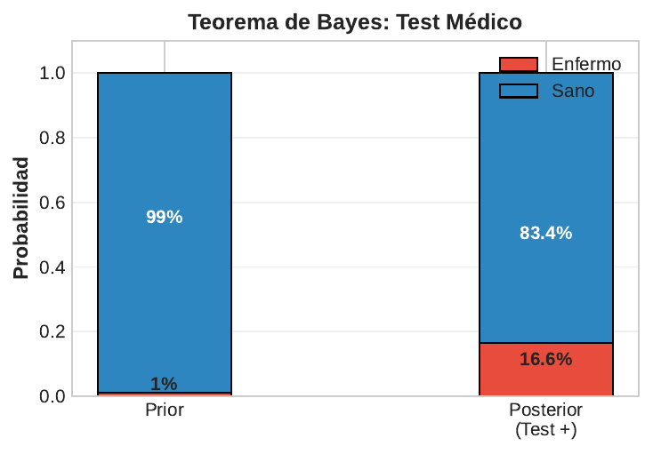
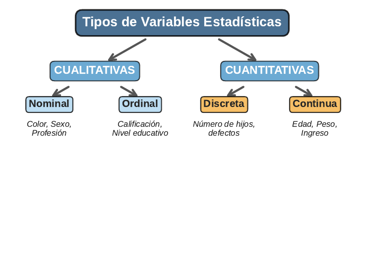

```{r}
#| label: setup
#| echo: false
library(tidyverse)
library(knitr)
library(plotly)
theme_set(theme_minimal(base_size = 13))
azul <- "#1F4E79"; celeste <- "#2E86C1"; rojo <- "#E74C3C"; verde <- "#27AE60"; naranja <- "#F39C12"
# En HTML (revealjs) los graficos se vuelven interactivos con plotly;
# en Beamer (PDF) se mantienen estaticos.
es_html <- knitr::is_html_output()
interactivo <- function(p) {
  if (es_html) plotly::config(plotly::ggplotly(p), displayModeBar = FALSE) else p
}
```

## Panorama de la sesión

| Bloque | Concepto formal | Ejemplo aplicado |
|---|---|---|
| Espacio muestral y eventos | $\Omega$, $A \subseteq \Omega$, álgebra de conjuntos | Hogar consigue empleo o no |
| Axiomas de Kolmogorov | $P(\Omega)=1$, aditividad numerable | Propiedades demostradas paso a paso |
| Condicional, total y Bayes | $P(A \mid B) = P(A \cap B)/P(B)$ | Programa de empleo, focalización |
| Independencia | $P(A \cap B) = P(A)\,P(B)$ | ¿El programa "no informa" sobre el empleo? |
| Variable aleatoria | $X:\Omega \to \mathbb{R}$ | Postulaciones aceptadas |
| PMF, CDF y densidad | $p(x)$, $F(x)$, $f(x)$ | Tiempos de espera en oficinas públicas |

::: {.callout-note appearance="simple"}
**Metodología de todo el curso:** cada concepto abre con su definición formal, sigue con la intuición y cierra con un ejemplo de políticas públicas resuelto **paso a paso**, verificado en R.
:::

## Experimento aleatorio y espacio muestral

**Definiciones.** Un **experimento aleatorio** es un procedimiento cuyo resultado no puede predecirse con certeza, pero cuyo conjunto de resultados posibles se conoce de antemano; ese conjunto es el **espacio muestral** $\Omega$. Un **evento** $A \subseteq \Omega$ **ocurre** si el resultado observado cumple $\omega \in A$.

$$\Omega = \{\omega : \omega \text{ es un resultado posible del experimento}\}$$

| Experimento | $\Omega$ | Un evento $A$ |
|---|---|---|
| Encuestar un hogar: ¿consiguió empleo? | $\{S, N\}$ | $\{S\}$ |
| Lanzar una moneda dos veces | $\{CC, CS, SC, SS\}$ | "al menos una cara" $= \{CC, CS, SC\}$ |
| Postular a 3 fondos concursables | $\{0, 1, 2, 3\}$ | "acepta más de una" $= \{2, 3\}$ |
| Medir el ingreso mensual de un hogar | $[0, \infty)$ | "bajo la línea de pobreza" $= [0, L)$ |

## Interpretación frecuentista: la probabilidad como límite

Si repetimos el experimento $n$ veces en condiciones idénticas y $n_A$ es el número de veces que ocurre $A$:

$$P(A) = \lim_{n \to \infty} \frac{n_A}{n}$$

```{r}
#| label: plot-frecuencia
#| echo: false
#| fig-height: 2.6
set.seed(123)
sim <- tibble(n = 1:1000, exito = rbinom(1000, 1, 0.42)) %>%
  mutate(frec = cummean(exito))
p <- ggplot(sim, aes(x = n, y = frec)) +
  geom_line(color = celeste, linewidth = 0.7) +
  geom_hline(yintercept = 0.42, color = rojo, linetype = "dashed", linewidth = 0.9) +
  annotate("text", x = 880, y = 0.48, label = "P(E) = 0.42", color = rojo, size = 4.5) +
  coord_cartesian(ylim = c(0.2, 0.7)) +
  labs(x = "Número de hogares observados (n)", y = "Frecuencia relativa",
       title = "Proporción acumulada de hogares con empleo (simulación)")
interactivo(p)
```

Con pocos hogares la frecuencia oscila fuerte; con muchos se estabiliza — la lógica detrás del **tamaño muestral** de las encuestas.

## Eventos como conjuntos: las cuatro operaciones

:::: {.columns}

::: {.column width="46%"}
```{r}
#| label: venn-png
#| echo: false
#| out.width: "100%"
knitr::include_graphics("figuras/diagrama_venn.png")
```
:::

::: {.column width="54%"}
**Operaciones sobre eventos $A, B \subseteq \Omega$:**

- **Unión** $A \cup B = \{\omega : \omega \in A \text{ o } \omega \in B\}$ — ocurre *al menos uno*.
- **Intersección** $A \cap B = \{\omega : \omega \in A \text{ y } \omega \in B\}$ — ocurren *ambos*.
- **Complemento** $A^c = \Omega \setminus A$ — *no* ocurre $A$.
- **Diferencia** $A \setminus B = A \cap B^c$ — ocurre $A$ *pero no* $B$.

La fórmula del recuadro en la figura, $P(A \cup B) = P(A) + P(B) - P(A \cap B)$, la **demostraremos** en unos minutos a partir de los axiomas.
:::

::::

## Diccionario: lenguaje natural y notación de conjuntos

| Frase en lenguaje natural | Notación |
|---|:-:|
| "ocurre $A$ o $B$ (o ambos)" | $A \cup B$ |
| "ocurren $A$ y $B$ a la vez" | $A \cap B$ |
| "no ocurre $A$" | $A^c$ |
| "ocurre $A$ pero no $B$" | $A \setminus B = A \cap B^c$ |
| "no ocurre ninguno de los dos" | $(A \cup B)^c = A^c \cap B^c$ |
| "no ocurren ambos a la vez" | $(A \cap B)^c = A^c \cup B^c$ |
| "$A$ y $B$ son incompatibles" | $A \cap B = \varnothing$ |

::: {.callout-tip appearance="simple"}
Las filas 5 y 6 son las **leyes de De Morgan**: el complemento intercambia uniones con intersecciones. Traducir bien el enunciado verbal a conjuntos es el paso donde más errores se cometen en los ejercicios.
:::

## Axiomas de Kolmogorov (1933)

Una **medida de probabilidad** es una función $P$ que asigna a cada evento $A \subseteq \Omega$ un número $P(A)$, y que satisface exactamente tres axiomas:

$$\textbf{A1 (No negatividad):}\quad P(A) \ge 0 \ \text{ para todo evento } A$$

$$\textbf{A2 (Normalización):}\quad P(\Omega) = 1$$

$$\textbf{A3 (Aditividad numerable):}\quad A_1, A_2, \dots \text{ disjuntos dos a dos} \;\Rightarrow\; P\!\left(\bigcup_{i=1}^{\infty} A_i\right) = \sum_{i=1}^{\infty} P(A_i)$$

**Qué significa esto:** toda la teoría de probabilidad —Bayes, la ley de los grandes números, la inferencia que verán en Métodos Cuantitativos— se deduce de estas tres reglas.

**Caso equiprobable:** si $\Omega$ es finito y todos los resultados pesan igual, $P(A) = \dfrac{|A|}{|\Omega|}$ (casos favorables sobre casos posibles).

## Propiedades derivadas (1/2): vacío y complemento

**Propiedad 1: $P(\varnothing) = 0$.** Como $\Omega$ y $\varnothing$ son disjuntos y $\Omega \cup \varnothing = \Omega$:

$$\begin{aligned}
1 &= P(\Omega) = P(\Omega \cup \varnothing) && \text{(A2 y unión con el vacío)}\\
  &= P(\Omega) + P(\varnothing) = 1 + P(\varnothing) && \text{(A3, eventos disjuntos)}\\
\Rightarrow\; P(\varnothing) &= 0 && \blacksquare
\end{aligned}$$

**Propiedad 2: $P(A^c) = 1 - P(A)$.** Como $A \cup A^c = \Omega$ con $A \cap A^c = \varnothing$:

$$\begin{aligned}
1 &= P(\Omega) = P(A \cup A^c) && \text{(A2)}\\
  &= P(A) + P(A^c) && \text{(A3, disjuntos)}\\
\Rightarrow\; P(A^c) &= 1 - P(A) && \blacksquare
\end{aligned}$$

**Qué significa esto:** si la probabilidad de que un hogar consiga empleo es $0.42$, la de que **no** lo consiga es $1 - 0.42 = 0.58$ — no hace falta contarlo de nuevo.

## Propiedades derivadas (2/2): monotonía y regla de adición

**Propiedad 3 (Monotonía): $A \subseteq B \Rightarrow P(A) \le P(B)$.** Descomponemos $B$ en partes disjuntas:

$$\begin{aligned}
B &= A \cup (B \setminus A), \quad A \cap (B \setminus A) = \varnothing\\
P(B) &= P(A) + P(B \setminus A) \ge P(A) && \text{(A3 y luego A1)} \quad \blacksquare
\end{aligned}$$

**Propiedad 4 (Regla de adición).** Descomponemos $A \cup B$ y $B$ en eventos disjuntos:

$$\begin{aligned}
A \cup B &= A \cup (B \setminus A) \;\Rightarrow\; P(A \cup B) = P(A) + P(B \setminus A)\\
B &= (A \cap B) \cup (B \setminus A) \;\Rightarrow\; P(B \setminus A) = P(B) - P(A \cap B)\\
\Rightarrow\; P(A \cup B) &= P(A) + P(B) - P(A \cap B) \quad \blacksquare
\end{aligned}$$

**Qué significa esto:** al sumar $P(A) + P(B)$, los resultados de $A \cap B$ se cuentan dos veces; la fórmula descuenta ese doble conteo exactamente una vez.

## El ejemplo maestro: programa de capacitación y empleo

Una municipalidad siguió a **500 hogares**. Definimos el experimento "elegir un hogar al azar" ($\Omega$ = los 500 hogares, equiprobables) y los eventos:

- $T$ = "el hogar participó en el programa de capacitación laboral"
- $E$ = "el hogar consiguió empleo formal dentro del año"

| | Consiguió empleo ($E$) | No consiguió ($E^c$) | Total |
|---|:-:|:-:|:-:|
| Participó ($T$) | 120 | 80 | **200** |
| No participó ($T^c$) | 90 | 210 | **300** |
| **Total** | **210** | **290** | **500** |

**Pregunta empírica:** ¿los participantes consiguen empleo con mayor probabilidad que los no participantes? Esta tabla alimentará *todas* las definiciones que siguen.

## Paso a paso: probabilidades conjuntas y marginales

**Paso 1 — Conjuntas** (celda sobre total, modelo equiprobable $P(A) = |A|/|\Omega|$):

$$P(T \cap E) = \tfrac{120}{500} = 0.24 \qquad P(T \cap E^c) = \tfrac{80}{500} = 0.16$$

$$P(T^c \cap E) = \tfrac{90}{500} = 0.18 \qquad P(T^c \cap E^c) = \tfrac{210}{500} = 0.42$$

**Paso 2 — Marginales** (sumar las conjuntas de cada fila o columna, que son disjuntas): $P(T) = 0.24 + 0.16 = 0.40$ y $P(E) = 0.24 + 0.18 = 0.42$.

**Paso 3 — Verificación con la regla de adición:** $P(T \cup E) = 0.40 + 0.42 - 0.24 = \boxed{0.58}$.

| | $E$ | $E^c$ | Marginal |
|---|:-:|:-:|:-:|
| $T$ | 0.24 | 0.16 | **0.40** |
| $T^c$ | 0.18 | 0.42 | **0.60** |
| **Marginal** | **0.42** | **0.58** | **1.00** |

## Probabilidad condicional: la definición central del curso

$$P(A \mid B) = \frac{P(A \cap B)}{P(B)}, \qquad \text{definida solo si } P(B) > 0$$

**Intuición:** saber que ocurrió $B$ *reduce* el espacio muestral de $\Omega$ a $B$; el cociente re-escala las probabilidades para que el nuevo total sea 1.

**Resultado formal:** para $B$ fijo, la función $A \mapsto P(A \mid B)$ es en sí misma una medida de probabilidad — cumple A1, A2 y A3. Por eso todo lo demostrado hoy vale también "condicional en $B$".

::: {.callout-important appearance="simple"}
$P(A \mid B)$ y $P(B \mid A)$ son objetos **distintos** con denominadores distintos. Confundirlos es la *falacia del fiscal*: la probabilidad de la evidencia dado inocente no es la probabilidad de inocente dado la evidencia. Lo veremos en números con el Teorema de Bayes.
:::

## Paso a paso: condicionales en la tabla de empleo

:::: {.columns}

::: {.column width="50%"}
**Paso 1 —** condicional entre participantes:

$$P(E \mid T) = \frac{P(E \cap T)}{P(T)} = \frac{0.24}{0.40} = 0.60$$

**Paso 2 —** entre no participantes:

$$P(E \mid T^c) = \frac{P(E \cap T^c)}{P(T^c)} = \frac{0.18}{0.60} = 0.30$$

**Paso 3 —** la condicional "invertida":

$$P(T \mid E) = \frac{0.24}{0.42} \approx 0.571 \ne P(E \mid T)$$
:::

::: {.column width="50%"}
```{r}
#| label: plot-condicional
#| echo: false
#| fig-width: 5
#| fig-height: 3.4
#| out.width: "100%"
df <- tibble(
  grupo = factor(c("Participantes", "No participantes", "Marginal"),
                 levels = c("Participantes", "No participantes", "Marginal")),
  prob = c(0.60, 0.30, 0.42))
p <- ggplot(df, aes(x = grupo, y = prob, fill = grupo)) +
  geom_col(width = 0.6, show.legend = FALSE) +
  geom_text(aes(label = sprintf("%.2f", prob)), vjust = -0.4, size = 5, color = azul) +
  scale_fill_manual(values = c(celeste, naranja, "grey60")) +
  scale_y_continuous(limits = c(0, 0.75)) +
  labs(x = NULL, y = "P(consigue empleo)",
       title = "Probabilidad de empleo según participación")
interactivo(p)
```
:::

::::

**Interpretación de política:** la probabilidad de empleo se duplica entre participantes ($0.60$ vs $0.30$). Es una **asociación**, no todavía un efecto causal: puede haber autoselección.

## Regla del producto y regla de la cadena

Despejando $P(A \cap B)$ de la definición de condicional (regla del **producto**):

$$P(A \cap B) = P(B)\,P(A \mid B) = P(A)\,P(B \mid A)$$

Iterando, se obtiene la regla de la **cadena** para $n$ eventos:

$$P(A_1 \cap A_2 \cap A_3) = P(A_1)\,P(A_2 \mid A_1)\,P(A_3 \mid A_1 \cap A_2)$$

**Ejemplo paso a paso — beca en tres etapas.** Con $P(A_1) = 0.60$ (requisitos), $P(A_2 \mid A_1) = 0.50$ (adjudicación) y $P(A_3 \mid A_1 \cap A_2) = 0.40$ (completar el programa):

$$\begin{aligned}
P(A_1 \cap A_2 \cap A_3) &= P(A_1)\,P(A_2 \mid A_1)\,P(A_3 \mid A_1 \cap A_2)\\
&= 0.60 \times 0.50 \times 0.40 = \boxed{0.12}
\end{aligned}$$

**Qué significa esto:** solo el $12\%$ de la cohorte llega al final; cada etapa se condiciona en las anteriores.

## Ley de probabilidad total

**Definición (partición).** Los eventos $A_1, \dots, A_k$ forman una **partición** de $\Omega$ si son disjuntos dos a dos ($A_i \cap A_j = \varnothing$ para $i \ne j$), cubren todo ($\bigcup_{i=1}^{k} A_i = \Omega$) y $P(A_i) > 0$.

**Teorema.** Para cualquier evento $B$:

$$P(B) = \sum_{i=1}^{k} P(B \mid A_i)\,P(A_i)$$

**Demostración (3 líneas).**

$$\begin{aligned}
B &= B \cap \Omega = B \cap \left(\textstyle\bigcup_i A_i\right) = \textstyle\bigcup_i (B \cap A_i) && \text{(distributividad)}\\
P(B) &= \textstyle\sum_i P(B \cap A_i) && \text{(A3: los } B \cap A_i \text{ son disjuntos)}\\
&= \textstyle\sum_i P(B \mid A_i)\,P(A_i) && \text{(regla del producto)} \quad \blacksquare
\end{aligned}$$

**Qué significa esto:** $P(B)$ es un **promedio ponderado** de las condicionales, con pesos dados por el tamaño de cada pedazo de la partición.

## Paso a paso: deserción de un programa nacional

:::: {.columns}

::: {.column width="52%"}
**Enunciado.** Un programa opera en tres macrozonas. La distribución de beneficiarios es Norte $25\%$, Centro $45\%$, Sur $30\%$; las tasas de deserción ($D$) por zona son $0.08$, $0.12$ y $0.20$.

**Paso 1 —** identificar la partición: $\{N, C, S\}$.

**Paso 2 —** aplicar la ley de probabilidad total:

$$\begin{aligned}
P(D) &= P(D \mid N)P(N) + P(D \mid C)P(C)\\
&\quad + P(D \mid S)P(S)\\
&= 0.08(0.25) + 0.12(0.45) + 0.20(0.30)\\
&= 0.020 + 0.054 + 0.060 = \boxed{0.134}
\end{aligned}$$
:::

::: {.column width="48%"}
```{r}
#| label: plot-total
#| echo: false
#| fig-width: 5
#| fig-height: 3.5
#| out.width: "100%"
df <- tibble(
  zona = factor(c("Norte", "Centro", "Sur", "Total"),
                levels = c("Norte", "Centro", "Sur", "Total")),
  aporte = c(0.020, 0.054, 0.060, 0.134),
  tipo = c("Aporte", "Aporte", "Aporte", "Total"))
p <- ggplot(df, aes(x = zona, y = aporte, fill = tipo)) +
  geom_col(width = 0.6, show.legend = FALSE) +
  geom_text(aes(label = sprintf("%.3f", aporte)), vjust = -0.4, size = 4.5, color = azul) +
  scale_fill_manual(values = c(Aporte = celeste, Total = azul)) +
  scale_y_continuous(limits = c(0, 0.16)) +
  labs(x = NULL, y = "Aporte a P(D)",
       title = "P(D) = suma de aportes por zona")
interactivo(p)
```
:::

::::

**Qué significa esto:** la tasa nacional ($13.4\%$) no es el promedio simple de las tasas zonales ($13.3\%$ sería con pesos iguales); pondera por dónde están los beneficiarios.

## Teorema de Bayes: derivación formal en 3 pasos

Sea $\{A_1, \dots, A_k\}$ una partición de $\Omega$ y $B$ un evento con $P(B) > 0$.

$$\begin{aligned}
\textbf{Paso 1 (definición):}\quad & P(A_j \mid B) = \frac{P(A_j \cap B)}{P(B)}\\
\textbf{Paso 2 (producto):}\quad & P(A_j \cap B) = P(B \mid A_j)\,P(A_j)\\
\textbf{Paso 3 (prob. total):}\quad & P(A_j \mid B) = \frac{P(B \mid A_j)\,P(A_j)}{\sum_{i=1}^{k} P(B \mid A_i)\,P(A_i)} \quad \blacksquare
\end{aligned}$$

**Terminología:** $P(A_j)$ es la *prior*, $P(B \mid A_j)$ la *verosimilitud* y $P(A_j \mid B)$ la *posterior*. Bayes "invierte" la condicional: pasa de $P(\text{dato} \mid \text{estado})$ a $P(\text{estado} \mid \text{dato})$.

**Aplicación inmediata** (deserción): ¿de qué zona proviene un desertor típico?

$$P(S \mid D) = \frac{P(D \mid S)P(S)}{P(D)} = \frac{0.060}{0.134} \approx \boxed{0.448}$$

El Sur aporta el $30\%$ de los beneficiarios pero casi el $45\%$ de los desertores.

## Bayes paso a paso: focalización de un subsidio (1/2)

**Enunciado.** Un instrumento de focalización clasifica hogares como vulnerables ($+$) o no ($-$). Se sabe que:

- **Prevalencia:** $P(V) = 0.10$ — el $10\%$ de los hogares es efectivamente vulnerable.
- **Sensibilidad:** $P(+ \mid V) = 0.90$ — detecta al $90\%$ de los vulnerables.
- **Especificidad:** $P(- \mid V^c) = 0.85$, de modo que $P(+ \mid V^c) = 1 - 0.85 = 0.15$.

**Pregunta:** si el instrumento clasifica a un hogar como vulnerable, ¿cuál es la probabilidad de que lo sea de verdad, $P(V \mid +)$?

**Paso 1 — Numerador** (regla del producto):

$$P(+ \cap V) = P(+ \mid V)\,P(V) = 0.90 \times 0.10 = 0.090$$

**Paso 2 — Denominador** (ley de probabilidad total con la partición $\{V, V^c\}$):

$$P(+) = P(+ \mid V)P(V) + P(+ \mid V^c)P(V^c) = 0.90(0.10) + 0.15(0.90) = 0.090 + 0.135 = 0.225$$

## Bayes paso a paso: focalización de un subsidio (2/2)

**Paso 3 — Posterior** (Teorema de Bayes):

$$P(V \mid +) = \frac{P(+ \mid V)\,P(V)}{P(+)} = \frac{0.090}{0.225} = \boxed{0.40}$$

**El mismo cálculo en frecuencias naturales** (1.000 hogares):

| | Clasificado $+$ | Clasificado $-$ | Total |
|---|:-:|:-:|:-:|
| Vulnerable ($V$) | 90 | 10 | 100 |
| No vulnerable ($V^c$) | 135 | 765 | 900 |
| **Total** | **225** | **775** | **1.000** |

De los $225$ clasificados $+$, solo $90$ son vulnerables: $90/225 = 0.40$; el otro $60\%$ es **error de inclusión**. Verificación en R:

```{r}
#| label: ej-bayes-verifica
round(0.90 * 0.10 / (0.90 * 0.10 + 0.15 * 0.90), 3)
```

## Prior vs posterior: la evidencia actualiza, no reemplaza

:::: {.columns}

::: {.column width="50%"}
```{r}
#| label: plot-priorpost
#| echo: false
#| fig-width: 5
#| fig-height: 3.4
#| out.width: "100%"
df <- tibble(
  etapa = factor(c("Prior P(V)", "Posterior P(V | +)"),
                 levels = c("Prior P(V)", "Posterior P(V | +)")),
  prob = c(0.10, 0.40))
p <- ggplot(df, aes(x = etapa, y = prob, fill = etapa)) +
  geom_col(width = 0.55, show.legend = FALSE) +
  geom_text(aes(label = sprintf("%.2f", prob)), vjust = -0.4, size = 5.5, color = azul) +
  scale_fill_manual(values = c(celeste, rojo)) +
  scale_y_continuous(limits = c(0, 0.5)) +
  labs(x = NULL, y = "Probabilidad",
       title = "Focalización: prior vs posterior")
interactivo(p)
```
:::

::: {.column width="50%"}
```{r}
#| label: bayes-png
#| echo: false
#| out.width: "92%"

```
:::

::::

**Lectura de la figura derecha** (test médico): con prevalencia $1\%$, sensibilidad $99\%$ y especificidad $95\%$, $P(\text{enfermo} \mid +) = \frac{0.0099}{0.0594} \approx 0.167$. Un test "casi perfecto" acierta solo 1 de cada 6 positivos cuando la condición es rara.

## El posterior depende de la prevalencia

```{r}
#| label: plot-prevalencia
#| echo: false
#| fig-height: 3.1
df <- tibble(prev = seq(0.005, 0.60, by = 0.005)) %>%
  mutate(post = 0.90 * prev / (0.90 * prev + 0.15 * (1 - prev)))
pts <- tibble(prev = c(0.01, 0.10, 0.30), post = c(0.057, 0.400, 0.720))
p <- ggplot(df, aes(x = prev, y = post)) +
  geom_line(color = azul, linewidth = 1.1) +
  geom_abline(slope = 1, intercept = 0, linetype = "dotted", color = "grey50") +
  geom_point(data = pts, color = rojo, size = 3) +
  annotate("text", x = 0.10, y = 0.50, label = "prev 0.10 -> post 0.40", color = rojo, size = 4.2) +
  annotate("text", x = 0.34, y = 0.63, label = "prev 0.30 -> post 0.72", color = rojo, size = 4.2) +
  labs(x = "Prevalencia P(V)", y = "Posterior P(V | +)",
       title = "Mismo instrumento (sens 0.90, espec 0.85), distinta poblacion")
interactivo(p)
```

**Implicancia de diseño:** el mismo instrumento aplicado a una población de baja prevalencia (barrido universal) genera muchos más errores de inclusión que aplicado a una población pre-filtrada. La curva punteada es la referencia "posterior $=$ prior".

## Independencia: definición y equivalencia

**Definición.** Los eventos $A$ y $B$ son **independientes** (notación $A \perp B$) si

$$P(A \cap B) = P(A)\,P(B)$$

**Equivalencia con la condicional** (si $P(B) > 0$):

$$\begin{aligned}
P(A \mid B) &= \frac{P(A \cap B)}{P(B)} = \frac{P(A)\,P(B)}{P(B)} = P(A)
\end{aligned}$$

y simétricamente $P(B \mid A) = P(B)$ si $P(A) > 0$.

**Qué significa esto:** saber que ocurrió $B$ **no cambia** la probabilidad de $A$ — la información sobre $B$ es inútil para predecir $A$. Es el supuesto detrás del *muestreo aleatorio* ("las respuestas de dos hogares sorteados no se informan mutuamente") y de la *asignación aleatoria* en experimentos.

**Propiedad útil:** si $A \perp B$, también $A \perp B^c$, $A^c \perp B$ y $A^c \perp B^c$.

## Error común: independencia no es exclusión mutua

| Propiedad | Independientes | Mutuamente excluyentes |
|---|---|---|
| Definición | $P(A \cap B) = P(A)P(B)$ | $A \cap B = \varnothing$ |
| $P(A \cap B)$ | $P(A)P(B) > 0$ si ambas $> 0$ | $0$ siempre |
| $P(A \mid B)$ | $= P(A)$: saber $B$ no informa | $= 0$: saber $B$ **descarta** $A$ |
| ¿Pueden ocurrir juntos? | Sí | Nunca |
| Ejemplo | Empleo de dos hogares sorteados | "Quintil I" y "Quintil V" del mismo hogar |

**Demostración del contraste.** Si $A \cap B = \varnothing$ con $P(A) > 0$ y $P(B) > 0$:

$$P(A \cap B) = 0 \ne P(A)\,P(B) > 0$$

Eventos excluyentes con probabilidad positiva son **máximamente dependientes**: observar uno elimina al otro. Solo pueden ser ambas cosas si $P(A) = 0$ o $P(B) = 0$.

## Paso a paso: ¿son independientes $T$ y $E$ en la tabla?

**Paso 1 —** probabilidad conjunta observada: $P(T \cap E) = \dfrac{120}{500} = 0.24$

**Paso 2 —** producto de marginales (lo que valdría bajo independencia): $P(T)\,P(E) = 0.40 \times 0.42 = 0.168$

**Paso 3 —** comparar:

$$P(T \cap E) = 0.24 \ne 0.168 = P(T)\,P(E) \;\Rightarrow\; T \text{ y } E \text{ son dependientes}$$

Equivalentemente, $P(E \mid T) = 0.60 \ne 0.42 = P(E)$: participar "informa" sobre el empleo.

```{r}
#| label: ej-indep-verifica
round(c(P_TyE = 120/500, P_T_x_P_E = (200/500) * (210/500),
        P_E_dado_T = 120/200, P_E = 210/500), 3)
```

**Ojo:** dependencia estadística $\ne$ causalidad: la brecha $0.60$ vs $0.30$ puede reflejar autoselección; separarlas es el objetivo de los diseños causales de Métodos Cuantitativos.

## Variable aleatoria: una función, no un número

**Definición.** Una **variable aleatoria** es una función que asigna un número real a cada resultado del experimento:

$$X : \Omega \to \mathbb{R}, \qquad \omega \mapsto X(\omega)$$

Los eventos sobre $X$ son **preimágenes**: $\{X = x\} = \{\omega \in \Omega : X(\omega) = x\}$, y su probabilidad es la del conjunto de resultados que se mapean a $x$.

**Ejemplo explícito de mapeo.** Encuestamos 2 hogares; cada uno recibe ($S$) o no recibe ($N$) el subsidio. Sea $X$ = "número de hogares que reciben":

| $\omega \in \Omega$ | $SS$ | $SN$ | $NS$ | $NN$ |
|---|:-:|:-:|:-:|:-:|
| $X(\omega)$ | 2 | 1 | 1 | 0 |

Así, $\{X = 1\} = \{SN, NS\}$ y por lo tanto $P(X = 1) = P(\{SN\}) + P(\{NS\})$.

**Qué significa esto:** $X$ traduce resultados a números para hacer aritmética; la aleatoriedad vive en $\omega$, la función $X$ es fija.

## Variables discretas y continuas

:::: {.columns}

::: {.column width="46%"}
```{r}
#| label: tipos-png
#| echo: false
#| out.width: "100%"

```
:::

::: {.column width="54%"}
**Discreta:** su **soporte** (valores con probabilidad positiva) es finito o numerable.

- N° de postulaciones aceptadas: $\{0,1,2,3\}$
- N° de delitos por comuna al mes: $\{0,1,2,\dots\}$
- Se describe con la **PMF** $p(x)$.

**Continua:** toma valores en intervalos de $\mathbb{R}$ (soporte no numerable) y $P(X = x) = 0$ para todo $x$.

- Ingreso del hogar, tiempo de espera, tasa de pobreza comunal.
- Se describe con la **densidad** $f(x)$.

La **CDF** $F(x)$ existe y caracteriza la distribución en **ambos** casos.
:::

::::

## Función de masa de probabilidad (PMF)

**Definición.** Para $X$ discreta con soporte $\mathcal{S} = \{x_1, x_2, \dots\}$, la PMF es $p(x) = P(X = x)$, y debe cumplir **dos condiciones**:

$$\text{(i)}\;\; p(x) \ge 0 \ \ \forall x \qquad\qquad \text{(ii)}\;\; \sum_{x \in \mathcal{S}} p(x) = 1$$

**Ejemplo.** $X$ = número de postulaciones aceptadas entre 3 fondos concursables:

| $x$ | 0 | 1 | 2 | 3 |
|---|:-:|:-:|:-:|:-:|
| $p(x)$ | 0.35 | 0.30 | 0.20 | 0.15 |

**Verificación de validez:**

$$\text{(i) todos } \ge 0 \quad \checkmark \qquad \text{(ii)}\;\; 0.35 + 0.30 + 0.20 + 0.15 = 1.00 \quad \checkmark$$

**Qué significa esto:** la PMF reparte exactamente 1; toda probabilidad se obtiene **sumando** masas.

## Paso a paso: probabilidades desde la PMF

:::: {.columns}

::: {.column width="50%"}
**Pregunta 1:** $P(X \le 2)$

$$\begin{aligned}
P(X \le 2) &= p(0) + p(1) + p(2)\\
&= 0.35 + 0.30 + 0.20\\
&= \boxed{0.85}
\end{aligned}$$

**Pregunta 2:** $P(X > 1)$, por dos vías:

$$\begin{aligned}
P(X > 1) &= p(2) + p(3) = 0.35\\
P(X > 1) &= 1 - P(X \le 1)\\
&= 1 - 0.65 = \boxed{0.35}
\end{aligned}$$
:::

::: {.column width="50%"}
```{r}
#| label: plot-pmf
#| echo: false
#| fig-width: 5
#| fig-height: 3.4
#| out.width: "100%"
df <- tibble(x = 0:3, p = c(0.35, 0.30, 0.20, 0.15),
             zona = c("X <= 2", "X <= 2", "X <= 2", "X = 3"))
p <- ggplot(df, aes(x = x, y = p, fill = zona)) +
  geom_col(width = 0.55) +
  geom_text(aes(label = sprintf("%.2f", p)), vjust = -0.4, size = 4.8, color = azul) +
  scale_fill_manual(values = c(celeste, "grey70")) +
  scale_y_continuous(limits = c(0, 0.42)) +
  labs(x = "x = postulaciones aceptadas", y = "p(x)", fill = NULL,
       title = "PMF: P(X <= 2) = suma de barras azules") +
  theme(legend.position = "top")
interactivo(p)
```
:::

::::

```{r}
#| label: ej-pmf-verifica
p <- c(0.35, 0.30, 0.20, 0.15)
c(suma = sum(p), P_le_2 = sum(p[1:3]), P_gt_1 = sum(p[3:4]))
```

## Función de distribución acumulada (CDF)

**Definición.** Para cualquier variable aleatoria $X$ (discreta o continua):

$$F(x) = P(X \le x), \qquad x \in \mathbb{R}$$

**Propiedades que toda CDF cumple:**

1. **Monótona no decreciente:** $x_1 < x_2 \Rightarrow F(x_1) \le F(x_2)$ (monotonía de $P$).
2. **Límites:** $\lim_{x \to -\infty} F(x) = 0$ y $\lim_{x \to +\infty} F(x) = 1$.
3. **Continua por la derecha:** $\lim_{h \downarrow 0} F(x + h) = F(x)$.
4. **Regla de intervalos:** $P(a < X \le b) = F(b) - F(a)$.

**Para nuestra PMF** (postulaciones aceptadas), acumulando $p(x)$:

| Intervalo | $x < 0$ | $0 \le x < 1$ | $1 \le x < 2$ | $2 \le x < 3$ | $x \ge 3$ |
|---|:-:|:-:|:-:|:-:|:-:|
| $F(x)$ | 0 | 0.35 | 0.65 | 0.85 | 1 |

En discretas, $F$ es una **escalera**: salta $p(x)$ en cada punto del soporte y es plana entre ellos.

## La CDF escalera en R con geom_step

:::: {.columns}

::: {.column width="46%"}
```{r}
#| label: code-cdf
#| eval: false
esc <- tibble(
  x = c(-1, 0, 1, 2, 3, 4),
  Fx = c(0, .35, .65, .85, 1, 1))

ggplot(esc, aes(x, Fx)) +
  geom_step(direction = "hv",
            color = azul,
            linewidth = 1) +
  geom_point(
    data = filter(esc, x %in% 0:3),
    color = rojo, size = 2.5) +
  labs(x = "x", y = "F(x)")
```

`direction = "hv"`: horizontal y luego vertical — la forma correcta de la escalera. Los puntos rojos marcan el valor de $F$ **en** el salto (continuidad por la derecha).
:::

::: {.column width="54%"}
```{r}
#| label: plot-cdf
#| echo: false
#| fig-width: 5.6
#| fig-height: 3.9
#| out.width: "100%"
esc <- tibble(
  x = c(-1, 0, 1, 2, 3, 4),
  Fx = c(0, .35, .65, .85, 1, 1))
interactivo(
  ggplot(esc, aes(x, Fx)) +
    geom_step(direction = "hv", color = azul, linewidth = 1) +
    geom_point(data = filter(esc, x %in% 0:3),
               color = rojo, size = 2.5) +
    labs(x = "x", y = "F(x)",
         title = "CDF de las postulaciones aceptadas")
)
```
:::

::::

Lectura directa: $F(2) = 0.85$ reproduce el $P(X \le 2)$ que calculamos sumando la PMF.

## Variables continuas: la función de densidad

**Definición.** $X$ es (absolutamente) continua si existe $f(x) \ge 0$ tal que

$$F(x) = \int_{-\infty}^{x} f(t)\,dt \qquad\Longleftrightarrow\qquad f(x) = F'(x) \ \text{ donde } F \text{ es derivable}$$

con $\int_{-\infty}^{\infty} f(x)\,dx = 1$. Las probabilidades son **áreas**: $P(a \le X \le b) = \int_a^b f(x)\,dx$.

**¿Por qué $P(X = x) = 0$?** Para todo $\varepsilon > 0$, por monotonía:

$$\begin{aligned}
0 \le P(X = x) &\le P(x - \varepsilon < X \le x) = F(x) - F(x - \varepsilon)\\
&\to 0 \ \text{ cuando } \varepsilon \to 0 \quad \text{(porque } F \text{ es continua)} \quad \blacksquare
\end{aligned}$$

**Consecuencias importantes:**

- En continuas, $P(a \le X \le b) = P(a < X < b)$: los bordes no aportan probabilidad.
- $f(x)$ **no** es una probabilidad (puede superar 1); solo sus **integrales** lo son.

## Paso a paso: la distribución Uniforme(0, 10)

:::: {.columns}

::: {.column width="50%"}
**Enunciado.** El tiempo de espera $X$ (minutos) en una oficina de atención es Uniforme en $[0, 10]$:

$$f(x) = \tfrac{1}{10}, \quad 0 \le x \le 10 \ \text{ (y 0 fuera)}$$

**Paso 1 —** validez: $\int_0^{10} \tfrac{1}{10}\,dx = \tfrac{10}{10} = 1$ $\checkmark$

**Paso 2 —** $P(2 \le X \le 5)$ como integral:

$$\begin{aligned}
P(2 \le X \le 5) &= \int_2^5 \frac{1}{10}\,dx = \left[\frac{x}{10}\right]_2^5\\
&= \frac{5}{10} - \frac{2}{10} = \boxed{0.30}
\end{aligned}$$

**Paso 3 —** $P(X = 4) = \int_4^4 \tfrac{1}{10}\,dx = 0$.
:::

::: {.column width="50%"}
```{r}
#| label: plot-area
#| echo: false
#| fig-width: 5
#| fig-height: 3.4
#| out.width: "100%"
df <- tibble(x = seq(-0.5, 10.5, 0.01),
             f = if_else(x >= 0 & x <= 10, 0.1, 0))
sombra <- filter(df, x >= 2, x <= 5)
p <- ggplot(df, aes(x, f)) +
  geom_area(data = sombra, fill = celeste, alpha = 0.7) +
  geom_line(color = azul, linewidth = 1.1) +
  annotate("text", x = 3.5, y = 0.05, label = "Area = 0.30",
           color = azul, size = 5) +
  coord_cartesian(ylim = c(0, 0.15)) +
  labs(x = "x = minutos de espera", y = "f(x)",
       title = "P(2 <= X <= 5) es el area bajo f")
interactivo(p)
```
:::

::::

```{r}
#| label: ej-unif-verifica
round(punif(5, 0, 10) - punif(2, 0, 10), 2)
```

## Mapa del curso: dónde se usa lo de hoy

| Sesión | Tema | Usa de esta sesión |
|---|---|---|
| Hoy, bloque 2 | Distribuciones, $\mathbb{E}(X)$ y $\operatorname{Var}(X)$ | PMF, densidad, CDF |
| Día 2, bloque 1 | Muestreo, ley de grandes números, TCL | Independencia, frecuencia relativa |
| Día 2, bloque 2 | Intervalos de confianza y pruebas de hipótesis | CDF, complemento, condicional |
| Métodos Cuantitativos | Regresión: $\mathbb{E}(Y \mid X)$, inferencia causal | Condicional, independencia, Bayes |

**Las tres ideas que deben quedar hoy:**

1. La probabilidad es una **medida sobre conjuntos**: tres axiomas bastan y el resto se demuestra.
2. **Condicionar es re-normalizar**; Bayes invierte condicionales con producto y probabilidad total.
3. Una variable aleatoria es una **función** $X:\Omega \to \mathbb{R}$; PMF, CDF y densidad la describen.

## Ejercicios propuestos (para el descanso)

1. Con $P(A) = 0.55$, $P(B) = 0.35$ y $P(A \cap B) = 0.20$: calcule $P(A \cup B)$ y $P(A \mid B)$, y determine si $A$ y $B$ son independientes.
2. Un test de elegibilidad tiene prevalencia $P(C) = 0.05$, sensibilidad $0.85$ y especificidad $0.90$. Calcule $P(C \mid +)$ con los tres pasos de Bayes.
3. Sea $p(x) = 0.40, 0.30, 0.20, 0.10$ para $x = 0, 1, 2, 3$. Verifique que es una PMF válida y calcule $F(1)$ y $P(X \ge 2)$.
4. $X \sim \text{Uniforme}(0, 20)$: escriba $f(x)$ y calcule $P(5 \le X \le 12)$ y $P(X = 8)$.

**Respuestas:**

1. $P(A \cup B) = 0.55 + 0.35 - 0.20 = 0.70$; $P(A \mid B) = 0.20/0.35 \approx 0.571$; no independientes: $P(A)P(B) = 0.1925 \ne 0.20$.
2. $P(C \mid +) = \frac{0.85 \times 0.05}{0.85(0.05) + 0.10(0.95)} = 0.0425/0.1375 \approx 0.309$.
3. Suma $= 1.00$ $\checkmark$; $F(1) = 0.70$; $P(X \ge 2) = 0.30$.
4. $f(x) = 1/20$ en $[0, 20]$; $P(5 \le X \le 12) = 7/20 = 0.35$; $P(X = 8) = 0$.

**Referencias:** Casella & Berger, *Statistical Inference* (cap. 1) · Wasserman, *All of Statistics* (caps. 1–2) · Illowsky & Dean, *Introductory Statistics* (caps. 3–5).
