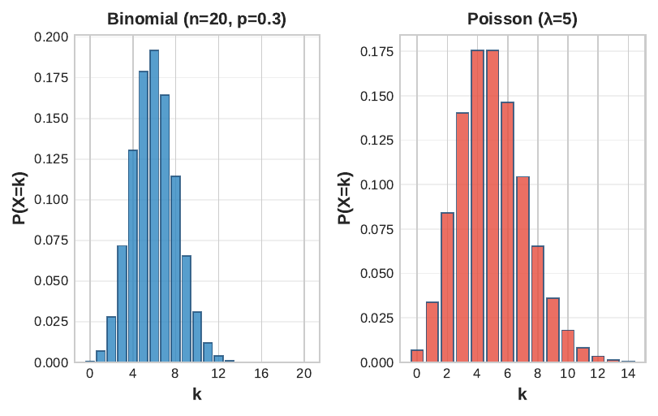

```{r}
#| label: setup
#| echo: false
library(tidyverse)
library(knitr)
library(plotly)
theme_set(theme_minimal(base_size = 13))
azul <- "#1F4E79"; celeste <- "#2E86C1"; rojo <- "#E74C3C"; verde <- "#27AE60"; naranja <- "#F39C12"
# En HTML (revealjs) los graficos se vuelven interactivos con plotly;
# en Beamer (PDF) se mantienen estaticos.
es_html <- knitr::is_html_output()
interactivo <- function(p) {
  if (es_html) plotly::config(plotly::ggplotly(p), displayModeBar = FALSE) else p
}
```

## Panorama de la sesión

| Bloque | Concepto clave | Herramienta en R |
|---|---|---|
| Esperanza | $\mathbb{E}[X]$ como centro de masa; linealidad | `sum(x*p)`, `weighted.mean()` |
| Varianza | $\operatorname{Var}(X)=\mathbb{E}[X^2]-\mu^2$; propiedades | `sum((x-mu)^2*p)` |
| Covarianza | Signo, cuadrantes; correlación $\rho$ | `cov()`, `cor()` |
| Bernoulli y Binomial | $\mathbb{E}[X]=np$, $\operatorname{Var}(X)=np(1-p)$ | `dbinom()`, `pbinom()` |
| Normal | Densidad; estandarización $Z=(X-\mu)/\sigma$ | `dnorm()`, `pnorm()` |
| Intervalos y cuantiles | $P(a<X<b)$; pregunta inversa | `pnorm()`, `qnorm()` |

::: {.callout-note appearance="simple"}
**Hilo conductor:** toda evaluación de una política opera sobre resultados inciertos. La esperanza resume el resultado promedio, la varianza mide el riesgo, y la Normal permite calcular probabilidades exactas de eventos de interés (pobreza, elegibilidad, resultados adversos).
:::

## Variable aleatoria: del experimento al número

:::: {.columns}

::: {.column width="55%"}
**Definición.** Una variable aleatoria es una función
$$X:\Omega \to \mathbb{R}$$
que asigna un número a cada resultado del experimento.

- **Discreta**: toma valores contables; su ley es la función de masa de probabilidad (PMF)
$$p(x_i)=P(X=x_i), \qquad \sum_i p(x_i)=1$$
- **Continua**: su ley es una densidad $f(x)\ge 0$ con
$$\int_{-\infty}^{\infty} f(x)\,dx = 1, \quad P(a\le X\le b)=\int_a^b f(x)\,dx$$
:::

::: {.column width="45%"}
```{r}
#| label: plot-pmf-img
#| echo: false
#| out.width: "100%"
knitr::include_graphics("figuras/pmf_ejemplo.png")
```

**En políticas públicas:** número de hijos de un hogar (discreta), ingreso per cápita (continua), indicador de estar empleado (discreta binaria).
:::

::::

## Esperanza: definición formal

**Definición.** La esperanza (o valor esperado) de $X$ es

$$\mathbb{E}[X] = \sum_{i} x_i\, p(x_i) \quad \text{(discreta)}, \qquad \mathbb{E}[X] = \int_{-\infty}^{\infty} x\, f(x)\,dx \quad \text{(continua)}$$

- Es el **promedio ponderado** de los valores posibles, con las probabilidades como pesos.
- Físicamente: si colocamos masa $p(x_i)$ en el punto $x_i$ de una barra, $\mathbb{E}[X]$ es el **centro de masa** — el punto donde la barra queda en equilibrio.
- No es necesariamente un valor posible de $X$: es el promedio al que convergen las realizaciones si el experimento se repite muchas veces (ley de los grandes números, Sesión 3).

**Qué significa esto:** en políticas públicas, $\mathbb{E}[X]$ es el resultado promedio por beneficiario que produciría el programa si se implementara a gran escala.

::: {.callout-tip title="Intuición" appearance="simple"}
La esperanza es el "precio justo" de una lotería: el número donde se estaciona el promedio de los resultados cuando el juego se repite muchas veces.
:::

## La esperanza como centro de masa

```{r}
#| label: plot-esperanza
#| echo: false
#| fig-height: 3.0
d_ex <- tibble(x = c(-4, 5, 12), p = c(0.2, 0.5, 0.3))
mu_ex <- sum(d_ex$x * d_ex$p)
p <- ggplot(d_ex, aes(x = x, y = p)) +
  geom_segment(aes(xend = x, y = 0, yend = p), color = celeste, linewidth = 1.4) +
  geom_point(aes(size = p), color = azul, show.legend = FALSE) +
  geom_hline(yintercept = 0, color = "grey40") +
  geom_segment(x = mu_ex, xend = mu_ex, y = 0.4, yend = 0.02,
               color = rojo, linewidth = 1, arrow = arrow(length = unit(0.25, "cm"))) +
  annotate("text", x = mu_ex + 0.4, y = 0.45,
           label = paste0("E[X] = ", mu_ex, ": punto de equilibrio"),
           color = rojo, size = 4.5, hjust = 0) +
  scale_size(range = c(3, 7)) +
  scale_x_continuous(breaks = c(-4, 0, 5, 12)) +
  labs(x = "Beneficio neto x (miles de USD)", y = "Masa de probabilidad p(x)",
       title = "Masas p(x) sobre una barra: E[X] la equilibra")
interactivo(p)
```

La masa en $x=-4$ (escenario adverso) "tira" el equilibrio hacia la izquierda: por eso $\mathbb{E}[X]=5.3$ queda apenas por sobre el escenario moderado $x=5$, y no en el promedio simple de los tres valores (4.33).

## Ejemplo resuelto: beneficio esperado de un programa

Un programa de capacitación laboral genera un beneficio neto por participante $X$ (miles de USD) según el escenario macroeconómico:

| Escenario | $x_i$ | $p(x_i)$ | Paso 1: $x_i \cdot p(x_i)$ |
|---|---:|---:|---:|
| Favorable | 12 | 0.3 | $12 \times 0.3 = 3.6$ |
| Moderado | 5 | 0.5 | $5 \times 0.5 = 2.5$ |
| Adverso | $-4$ | 0.2 | $-4 \times 0.2 = -0.8$ |

**Paso 2 — sumar los productos:**
$$\mathbb{E}[X] = 3.6 + 2.5 - 0.8 = \boxed{5.3 \text{ miles de USD}}$$

```{r}
#| label: ej-esperanza
x <- c(12, 5, -4); p <- c(0.3, 0.5, 0.2)
sum(x * p)
```

**Interpretación:** si el programa atiende a muchos participantes, el beneficio promedio será de 5.3 mil USD por persona — aunque un 20% de las veces el resultado individual sea una pérdida.

## Linealidad de la esperanza: demostración

**Propiedad.** Para constantes $a, b \in \mathbb{R}$: $\;\mathbb{E}[aX+b] = a\,\mathbb{E}[X] + b$. Demostración (caso discreto):

$$\begin{aligned}
\mathbb{E}[aX+b] &= \sum_i (a x_i + b)\, p(x_i) && \text{definición de esperanza} \\
&= \sum_i a x_i\, p(x_i) + \sum_i b\, p(x_i) && \text{separar la suma} \\
&= a \sum_i x_i\, p(x_i) + b \sum_i p(x_i) && \text{sacar constantes} \\
&= a\,\mathbb{E}[X] + b \cdot 1 = a\,\mathbb{E}[X] + b && \textstyle\sum_i p(x_i)=1
\end{aligned}$$

**Aditividad.** Además, para cualesquiera $X, Y$ (sin exigir independencia): $\mathbb{E}[X+Y]=\mathbb{E}[X]+\mathbb{E}[Y]$.

```{r}
#| label: ej-linealidad
c(directo = sum((0.9 * x - 1) * p), por_linealidad = 0.9 * 5.3 - 1)  # Y = 0.9X - 1
```

**Qué significa esto:** un impuesto proporcional o un costo fijo transforman $\mathbb{E}$ con la misma regla.

## Varianza: definición formal

**Definición.** Con $\mu = \mathbb{E}[X]$, la varianza es la desviación cuadrática esperada respecto de la media:

$$\operatorname{Var}(X) = \mathbb{E}\big[(X-\mu)^2\big] = \sum_i (x_i-\mu)^2\, p(x_i) \quad \text{o} \quad \int_{-\infty}^{\infty} (x-\mu)^2 f(x)\,dx$$

**Desviación estándar.** $\sigma = \operatorname{DE}(X) = \sqrt{\operatorname{Var}(X)}$.

- $\operatorname{Var}(X) \ge 0$ siempre, y $\operatorname{Var}(X)=0$ solo si $X$ es constante.
- La varianza queda en **unidades al cuadrado** (USD$^2$, años$^2$): difícil de interpretar.
- La desviación estándar vuelve a las **unidades originales**: es la medida que se reporta.

**Qué significa esto:** dos programas pueden prometer el mismo beneficio esperado y diferir radicalmente en riesgo; la varianza es la medida formal de esa incertidumbre.

::: {.callout-tip title="Intuición" appearance="simple"}
La media dice qué esperar; la varianza dice cuánto fiarse de esa promesa: mide el "me puede ir muy distinto del promedio".
:::

## Derivación: la fórmula alternativa de la varianza

Expandiendo el cuadrado y aplicando linealidad de la esperanza:

$$\begin{aligned}
\operatorname{Var}(X) &= \mathbb{E}\big[(X-\mu)^2\big] && \text{definición} \\
&= \mathbb{E}\big[X^2 - 2\mu X + \mu^2\big] && \text{expandir el cuadrado} \\
&= \mathbb{E}[X^2] - 2\mu\,\mathbb{E}[X] + \mu^2 && \text{linealidad } (\mu \text{ es constante}) \\
&= \mathbb{E}[X^2] - 2\mu \cdot \mu + \mu^2 && \mathbb{E}[X]=\mu \\
&= \boxed{\mathbb{E}[X^2] - \mu^2}
\end{aligned}$$

**Qué significa esto:** para calcular la varianza bastan dos cantidades — el segundo momento $\mathbb{E}[X^2]$ y la media al cuadrado. Es la fórmula operativa: evita restar $\mu$ valor por valor y reaparecerá idéntica en la covarianza.

## Propiedad: $\operatorname{Var}(aX+b) = a^2\operatorname{Var}(X)$, demostrada

Sea $\mu = \mathbb{E}[X]$; por linealidad, $\mathbb{E}[aX+b] = a\mu + b$. Entonces:

$$\begin{aligned}
\operatorname{Var}(aX+b) &= \mathbb{E}\big[(aX+b-\mathbb{E}[aX+b])^2\big] && \text{definición} \\
&= \mathbb{E}\big[(aX + b - a\mu - b)^2\big] && \text{sustituir } \mathbb{E}[aX+b] \\
&= \mathbb{E}\big[a^2(X-\mu)^2\big] && \text{los } b \text{ se cancelan; factorizar} \\
&= a^2\,\mathbb{E}\big[(X-\mu)^2\big] = a^2\operatorname{Var}(X) && \text{linealidad}
\end{aligned}$$

- Sumar una constante $b$ **no cambia** la dispersión (solo desplaza la distribución).
- $\operatorname{DE}(aX+b) = |a|\,\operatorname{DE}(X)$: la DE escala en valor absoluto.

```{r}
#| label: ej-varprop
# Continuando: Var(X) = 30.81  =>  Var(0.9X - 1) = 0.81 * 30.81
c(directo = sum((0.9 * x - 1 - 3.77)^2 * p), por_propiedad = 0.9^2 * 30.81)
```

## Ejemplo resuelto: varianza del beneficio del programa

Continuamos con $\mu = \mathbb{E}[X] = 5.3$. **Paso 1** — desviaciones y cuadrados; **Paso 2** — ponderar por $p(x_i)$:

| Escenario | $x_i$ | $x_i - \mu$ | $(x_i-\mu)^2$ | $(x_i-\mu)^2\, p(x_i)$ |
|---|---:|---:|---:|---:|
| Favorable | 12 | 6.7 | 44.89 | 13.467 |
| Moderado | 5 | $-0.3$ | 0.09 | 0.045 |
| Adverso | $-4$ | $-9.3$ | 86.49 | 17.298 |

**Paso 3 — sumar:** $\operatorname{Var}(X) = 13.467 + 0.045 + 17.298 = \boxed{30.81}$, luego $\sigma = \sqrt{30.81} \approx 5.55$.

**Verificación con la fórmula alternativa:** $\mathbb{E}[X^2] = 144(0.3) + 25(0.5) + 16(0.2) = 58.9$, y $58.9 - 5.3^2 = 58.9 - 28.09 = 30.81$. Coinciden.

```{r}
#| label: ej-varianza
c(def = sum((x - 5.3)^2 * p), alternativa = sum(x^2 * p) - 5.3^2, de = sqrt(30.81)) |> round(3)
```

## Covarianza: definición y fórmula alternativa

**Definición.** Con $\mu_X = \mathbb{E}[X]$ y $\mu_Y = \mathbb{E}[Y]$:

$$\operatorname{Cov}(X,Y) = \mathbb{E}\big[(X-\mu_X)(Y-\mu_Y)\big]$$

Expandiendo el producto y aplicando linealidad (misma lógica que en la varianza):

$$\begin{aligned}
\operatorname{Cov}(X,Y) &= \mathbb{E}\big[XY - \mu_X Y - \mu_Y X + \mu_X \mu_Y\big] \\
&= \mathbb{E}[XY] - \mu_X\,\mathbb{E}[Y] - \mu_Y\,\mathbb{E}[X] + \mu_X \mu_Y \\
&= \boxed{\mathbb{E}[XY] - \mu_X\,\mu_Y}
\end{aligned}$$

- $\operatorname{Cov}(X,X) = \operatorname{Var}(X)$: la varianza es un caso particular.
- Si $X$ e $Y$ son independientes, $\mathbb{E}[XY]=\mu_X\mu_Y$ y por tanto $\operatorname{Cov}(X,Y)=0$. **El recíproco es falso.**

**Qué significa esto:** la covarianza mide si $X$ e $Y$ se desvían de sus medias *en la misma dirección* (signo positivo) o en direcciones opuestas (signo negativo).

:::: {.content-visible when-format="html"}
::: {.callout-tip title="Intuición" appearance="simple"}
La covarianza pregunta si dos variables "se mueven juntas": cuando una está por encima de su promedio, ¿la otra también tiende a estarlo?
:::
::::

## El signo de la covarianza: los cuatro cuadrantes

```{r}
#| label: plot-cuadrantes
#| echo: false
#| fig-height: 3.3
set.seed(21)
n <- 120
inv <- rnorm(n, 100, 25)
asis <- 70 + 0.15 * inv + rnorm(n, 0, 4)
dq <- tibble(inv, asis) %>%
  mutate(signo = if_else((inv - mean(inv)) * (asis - mean(asis)) > 0,
                         "producto (+)", "producto (-)"))
p <- ggplot(dq, aes(inv, asis, color = signo)) +
  geom_point(alpha = 0.75, size = 2) +
  geom_vline(xintercept = mean(dq$inv), color = azul, linetype = "dashed") +
  geom_hline(yintercept = mean(dq$asis), color = azul, linetype = "dashed") +
  annotate("text", x = 145, y = 92, label = "(+)(+) suma", color = verde, size = 4.2) +
  annotate("text", x = 48, y = 74, label = "(-)(-) suma", color = verde, size = 4.2) +
  annotate("text", x = 48, y = 92, label = "(-)(+) resta", color = rojo, size = 4.2) +
  annotate("text", x = 145, y = 74, label = "(+)(-) resta", color = rojo, size = 4.2) +
  scale_color_manual(values = c(`producto (+)` = verde, `producto (-)` = rojo)) +
  labs(x = "Inversión social per cápita (miles de $)", y = "Asistencia escolar (%)",
       color = NULL, title = "Comunas: las medias dividen el plano en 4 cuadrantes") +
  theme(legend.position = "top")
interactivo(p)
```

Cada punto aporta $(x_i-\bar{x})(y_i-\bar{y})$: positivo en los cuadrantes de concordancia, negativo en los de discordancia. Aquí dominan los verdes, así que $\operatorname{Cov} > 0$: las comunas que invierten más tienden a tener mayor asistencia.

## Correlación: la covarianza estandarizada

:::: {.columns}

::: {.column width="50%"}
**Problema:** la covarianza depende de las unidades; su magnitud no es interpretable. **Solución:** dividir por las DE.

$$\rho_{XY} = \frac{\operatorname{Cov}(X,Y)}{\sigma_X\, \sigma_Y}, \qquad -1 \le \rho_{XY} \le 1$$

- La cota $|\rho|\le 1$ sale de Cauchy–Schwarz: $|\operatorname{Cov}(X,Y)| \le \sigma_X \sigma_Y$.
- $\rho = \pm 1$ si y solo si $Y = aX+b$ exactamente.
- $\rho$ es **adimensional**: pesos o dólares dan lo mismo.
- Mide solo asociación **lineal**: $\rho \approx 0$ no descarta relaciones no lineales fuertes.
:::

::: {.column width="50%"}
```{r}
#| label: plot-correlacion
#| echo: false
#| fig-width: 5
#| fig-height: 3.6
#| out.width: "100%"
set.seed(33)
sim_rho <- function(r, n = 150) {
  x <- rnorm(n)
  tibble(x = x, y = r * x + sqrt(1 - r^2) * rnorm(n),
         panel = paste0("rho = ", r))
}
d_rho <- bind_rows(sim_rho(-0.9), sim_rho(0.3), sim_rho(0.95)) %>%
  mutate(panel = factor(panel, levels = c("rho = -0.9", "rho = 0.3", "rho = 0.95")))
p <- ggplot(d_rho, aes(x, y)) +
  geom_point(alpha = .5, size = 1.1, color = celeste) +
  facet_wrap(~panel, nrow = 2, scales = "free") +
  labs(x = NULL, y = NULL, title = "Tres intensidades de asociación lineal")
interactivo(p)
```
:::

::::

**Qué significa esto:** $\rho$ compara la fuerza de asociación entre pares de variables medidos en unidades distintas — ingreso y escolaridad, inversión y asistencia — en una escala común.

:::: {.content-visible when-format="html"}
::: {.callout-tip title="Intuición" appearance="simple"}
La correlación es la covarianza "sin unidades": 1 y $-1$ son línea perfecta, 0 es ausencia de relación lineal — aunque puede haber relación no lineal escondida.
:::
::::

## Ejemplo bivariado (1/2): tabla conjunta y marginales

$X$ = participó en capacitación (0/1); $Y$ = obtuvo empleo formal (0/1). Distribución conjunta $p(x,y)$:

| | $Y=0$ | $Y=1$ | $p_X(x)$ |
|---|---:|---:|---:|
| $X=0$ | 0.30 | 0.20 | **0.50** |
| $X=1$ | 0.15 | 0.35 | **0.50** |
| $p_Y(y)$ | **0.45** | **0.55** | 1.00 |

**Paso 1 — marginales:** sumar filas y columnas: $p_X(1) = 0.15+0.35 = 0.50$; $\;p_Y(1) = 0.20+0.35 = 0.55$.

**Paso 2 — esperanzas** (variables binarias: la esperanza es la probabilidad del 1):
$$\mathbb{E}[X] = 0(0.5) + 1(0.5) = 0.50, \qquad \mathbb{E}[Y] = 0(0.45) + 1(0.55) = 0.55$$

**Lectura:** la mitad de la muestra se capacitó y el 55% obtuvo empleo formal. ¿Están asociadas ambas variables? Eso lo responde la covarianza.

## Ejemplo bivariado (2/2): $\mathbb{E}[XY]$, covarianza y $\rho$

**Paso 3 —** $\mathbb{E}[XY] = \sum_{x}\sum_{y} x\,y\,p(x,y)$: solo la celda $(1,1)$ aporta (las demás tienen $x\,y=0$):
$$\mathbb{E}[XY] = 1 \cdot 1 \cdot 0.35 = 0.35$$

**Paso 4 — covarianza** con la fórmula alternativa:
$$\begin{aligned}
\operatorname{Cov}(X,Y) &= \mathbb{E}[XY] - \mu_X \mu_Y \\
&= 0.35 - (0.50)(0.55) = 0.35 - 0.275 = \boxed{0.075}
\end{aligned}$$

**Paso 5 — correlación** (Bernoulli: $\operatorname{Var} = p(1-p)$, ver dos slides más adelante):
$$\operatorname{Var}(X) = 0.5(0.5) = 0.25, \quad \operatorname{Var}(Y) = 0.55(0.45) = 0.2475$$
$$\rho = \frac{0.075}{\sqrt{0.25 \times 0.2475}} = \frac{0.075}{0.2487} = \boxed{0.302}$$

```{r}
#| label: ej-bivariada
pxy <- c(p00 = .30, p01 = .20, p10 = .15, p11 = .35)
c(EXY = unname(pxy["p11"]), cov = .35 - .5 * .55, rho = .075 / sqrt(.25 * .2475)) |> round(3)
```

## El ejemplo bivariado como diagrama de Venn

:::: {.columns}

::: {.column width="55%"}
```{r}
#| label: plot-venn-bivariado
#| echo: false
#| fig-width: 5.4
#| fig-height: 3.1
#| out.width: "100%"
venn_df <- tibble(x0 = c(-0.55, 0.55), y0 = 0, r = 1.05,
                  evento = c("A", "B"))
ggplot() +
  ggforce::geom_circle(data = venn_df,
                       aes(x0 = x0, y0 = y0, r = r, fill = evento),
                       alpha = 0.35, color = "grey35", linewidth = 0.4,
                       show.legend = FALSE) +
  scale_fill_manual(values = c(A = celeste, B = naranja)) +
  annotate("text", x = -1.05, y = 0, label = "0.15", size = 5, color = azul) +
  annotate("text", x = 0, y = 0, label = "0.35", size = 5.5,
           fontface = "bold", color = azul) +
  annotate("text", x = 1.05, y = 0, label = "0.20", size = 5, color = azul) +
  annotate("text", x = -1.15, y = 1.35, label = "A: se capacitó (0.50)",
           size = 4.3, color = azul) +
  annotate("text", x = 1.15, y = 1.35, label = "B: empleo formal (0.55)",
           size = 4.3, color = naranja) +
  annotate("text", x = 1.9, y = -1.3, label = "ninguno: 0.30",
           size = 4.1, color = "grey40") +
  coord_fixed(xlim = c(-2.5, 2.7), ylim = c(-1.55, 1.6)) +
  theme_void()
```
:::

::: {.column width="45%"}
- La celda $(1,1)$ de la tabla es la **intersección**: $P(A \cap B) = 0.35$, que aquí es $\mathbb{E}[XY]$.
- Bajo independencia el traslape sería $0.50 \times 0.55 = 0.275$.
- El traslape observado (0.35) **excede** ese valor en $0.075$: exactamente la covarianza.
:::

::::

::: {.callout-tip title="Intuición" appearance="simple"}
Con variables binarias, la covarianza es el "exceso de traslape": cuánto más se superponen los dos eventos respecto de lo que ocurriría si fueran independientes.
:::

## $\operatorname{Var}(X+Y)$: demostración

Sea $\mu_X = \mathbb{E}[X]$, $\mu_Y = \mathbb{E}[Y]$; por aditividad, $\mathbb{E}[X+Y] = \mu_X + \mu_Y$. Entonces:

$$\begin{aligned}
\operatorname{Var}(X+Y) &= \mathbb{E}\big[(X+Y-\mu_X-\mu_Y)^2\big] \\
&= \mathbb{E}\big[\{(X-\mu_X)+(Y-\mu_Y)\}^2\big] && \text{reagrupar} \\
&= \mathbb{E}\big[(X-\mu_X)^2\big] + \mathbb{E}\big[(Y-\mu_Y)^2\big] + 2\,\mathbb{E}\big[(X-\mu_X)(Y-\mu_Y)\big] \\
&= \boxed{\operatorname{Var}(X) + \operatorname{Var}(Y) + 2\operatorname{Cov}(X,Y)}
\end{aligned}$$

**Caso independiente:** $\operatorname{Cov}(X,Y)=0 \Rightarrow \operatorname{Var}(X+Y) = \operatorname{Var}(X) + \operatorname{Var}(Y)$. Las varianzas **se suman, nunca las DE**.

```{r}
#| label: ej-varsuma
s <- c(0, 1, 1, 2)  # S = X + Y en el ejemplo bivariado
c(directa = sum(s^2 * pxy) - sum(s * pxy)^2, formula = .25 + .2475 + 2 * .075)
```

**Qué significa esto:** la covarianza positiva **amplifica** el riesgo del agregado: diversificar exige baja covarianza.

## Bernoulli: el bloque básico, derivado paso a paso

**Definición.** $X \sim \operatorname{Bernoulli}(p)$ si $X \in \{0, 1\}$ con $P(X=1)=p$ y $P(X=0)=1-p$. Modela todo indicador binario: estar empleado, ser pobre, aprobar, votar.

**Esperanza:**
$$\mathbb{E}[X] = 0 \cdot (1-p) + 1 \cdot p = \boxed{p}$$

**Varianza** — como $X^2 = X$ (pues $0^2=0$ y $1^2=1$), el segundo momento es inmediato:

$$\begin{aligned}
\mathbb{E}[X^2] &= 0^2(1-p) + 1^2 p = p \\
\operatorname{Var}(X) &= \mathbb{E}[X^2] - \big(\mathbb{E}[X]\big)^2 = p - p^2 = \boxed{p(1-p)}
\end{aligned}$$

- La varianza es máxima en $p = 0.5$ (incertidumbre total) y nula en $p \in \{0, 1\}$ (certeza).
- **Ejemplo:** si la tasa de empleo formal es $p = 0.55$, entonces $\operatorname{Var}(Y) = 0.55 \times 0.45 = 0.2475$ — exactamente el valor usado en el ejemplo bivariado.

:::: {.content-visible when-format="html"}
::: {.callout-tip title="Intuición" appearance="simple"}
Una moneda cargada es el átomo de la estadística: todo indicador binario — empleado o no, pobre o no — es esa misma moneda con distinta carga.
:::
::::

## Binomial: suma de Bernoullis independientes

:::: {.columns}

::: {.column width="55%"}
**Definición.** Si $X_1, \dots, X_n$ son Bernoulli($p$) **independientes**, entonces $X = \sum_{i=1}^n X_i \sim \operatorname{Bin}(n, p)$ cuenta los éxitos en $n$ ensayos:

$$P(X = k) = \binom{n}{k} p^k (1-p)^{n-k}$$

**Momentos, sin calcular la PMF** — por linealidad y por independencia:

$$\begin{aligned}
\mathbb{E}[X] &= \sum_{i=1}^n \mathbb{E}[X_i] = \boxed{np} \\
\operatorname{Var}(X) &= \sum_{i=1}^n \operatorname{Var}(X_i) = \boxed{np(1-p)}
\end{aligned}$$
:::

::: {.column width="45%"}
```{r}
#| label: plot-binpois-img
#| echo: false
#| out.width: "100%"

```

**Qué significa esto:** las propiedades de la suma (linealidad, varianzas que se suman bajo independencia) entregan $\mathbb{E}$ y $\operatorname{Var}$ sin una sola combinatoria. Con $n$ grande y $p$ pequeño, la Binomial se aproxima por la Poisson.
:::

::::

## La PMF Binomial en R: auditoría de licitaciones

:::: {.columns}

::: {.column width="46%"}
```{r}
#| label: code-binom
#| eval: false
# 10 licitaciones auditadas;
# p = 0.3 de irregularidad
d <- tibble(k = 0:10,
            pk = dbinom(0:10, 10, .3))
ggplot(d, aes(k, pk,
       fill = k >= 5)) +
  geom_col(show.legend = FALSE) +
  scale_fill_manual(
    values = c(celeste, rojo)) +
  scale_x_continuous(
    breaks = 0:10) +
  labs(x = "k irregularidades",
       y = "P(X = k)")

1 - pbinom(4, 10, .3)  # P(X >= 5)
```
:::

::: {.column width="54%"}
```{r}
#| label: plot-binom
#| echo: false
#| fig-width: 5.6
#| fig-height: 3.9
#| out.width: "100%"
d_b <- tibble(k = 0:10, pk = dbinom(0:10, 10, .3))
interactivo(
  ggplot(d_b, aes(k, pk, fill = k >= 5)) +
    geom_col(show.legend = FALSE) +
    scale_fill_manual(values = c(`FALSE` = celeste, `TRUE` = rojo)) +
    scale_x_continuous(breaks = 0:10) +
    labs(x = "k irregularidades", y = "P(X = k)",
         title = "X ~ Bin(10, 0.3): E[X] = 3, DE = 1.45")
)
```
:::

::::

Con $X \sim \operatorname{Bin}(10, 0.3)$: $\mathbb{E}[X] = 3$, $\operatorname{Var}(X) = 2.1$. La zona roja es $P(X \ge 5) = 1 - P(X \le 4) = 0.15$: el estándar de alerta se activaría en un 15% de las auditorías aunque nada haya empeorado.

## Laboratorio: Binomial

Mueva los controles y observe cómo la masa de probabilidad se desplaza hacia $np$ y se ensancha según $np(1-p)$.

::: {.content-visible when-format="html"}

```{=html}
<div style="display:flex; gap:1.5em; align-items:center; flex-wrap:wrap; font-size:0.62em; margin-bottom:0.3em;">
  <label>Ensayos n: <input type="range" id="lab3-n" min="1" max="60" step="1" value="10" style="width:170px; vertical-align:middle;"> <span id="lab3-n-val"></span></label>
  <label>Prob. de éxito p: <input type="range" id="lab3-p" min="0.05" max="0.95" step="0.01" value="0.30" style="width:170px; vertical-align:middle;"> <span id="lab3-p-val"></span></label>
</div>
<div id="lab3-plot" style="width:100%; height:400px;"></div>
<div id="lab3-lectura" style="font-size:0.6em; color:#1F4E79; font-weight:600;"></div>
<script>
(function() {
  function dibujar() {
    var n = parseInt(document.getElementById('lab3-n').value, 10);
    var p = parseFloat(document.getElementById('lab3-p').value);
    document.getElementById('lab3-n-val').textContent = n;
    document.getElementById('lab3-p-val').textContent = p.toFixed(2);
    var ks = [], pk = [];
    var cur = Math.pow(1 - p, n);
    for (var k = 0; k <= n; k++) {
      ks.push(k); pk.push(cur);
      cur = cur * (n - k) / (k + 1) * p / (1 - p);
    }
    var media = n * p, varianza = n * p * (1 - p);
    Plotly.react('lab3-plot', [
      {x: ks, y: pk, type: 'bar', marker: {color: '#2E86C1'}, name: 'P(X = k)'},
      {x: [media, media], y: [0, 1], type: 'scatter', mode: 'lines',
       line: {color: '#E74C3C', width: 2, dash: 'dash'}, name: 'E[X] = np'}
    ], {
      margin: {t: 10, r: 20, b: 40, l: 50},
      xaxis: {range: [-1, 61], title: {text: 'k éxitos'}},
      yaxis: {range: [0, 1], title: {text: 'P(X = k)'}},
      showlegend: false, bargap: 0.15
    }, {displayModeBar: false});
    document.getElementById('lab3-lectura').textContent =
      'E[X] = np = ' + media.toFixed(2) + '  |  Var(X) = np(1-p) = ' + varianza.toFixed(2) +
      '  |  DE = ' + Math.sqrt(varianza).toFixed(2) + '  (línea roja: la media np)';
  }
  function init() {
    if (typeof Plotly === 'undefined') { setTimeout(init, 200); return; }
    ['lab3-n', 'lab3-p'].forEach(function(id){ document.getElementById(id).addEventListener('input', dibujar); });
    dibujar();
  }
  if (document.readyState === 'complete') { init(); } else { window.addEventListener('load', init); }
})();
</script>
```

:::

::: {.content-visible unless-format="html"}
```{r}
#| label: pdf-lab-binom
#| echo: false
#| fig-height: 2.6
#| fig-width: 8
#| out.width: "92%"
d_lab3 <- bind_rows(
  tibble(k = 0:30, pk = dbinom(0:30, 10, .3), panel = "n = 10, p = 0.3"),
  tibble(k = 0:30, pk = dbinom(0:30, 30, .3), panel = "n = 30, p = 0.3"),
  tibble(k = 0:30, pk = dbinom(0:30, 30, .7), panel = "n = 30, p = 0.7"))
d_mu3 <- tibble(panel = unique(d_lab3$panel), np = c(3, 9, 21))
ggplot(d_lab3, aes(k, pk)) +
  geom_col(fill = celeste, width = .85) +
  geom_vline(data = d_mu3, aes(xintercept = np),
             color = rojo, linetype = "dashed", linewidth = 0.7) +
  facet_wrap(~panel, nrow = 1) +
  labs(x = "k éxitos", y = "P(X = k)")
```

En la versión HTML, dos deslizadores controlan $n$ y $p$: al crecer $n$ la masa se centra en $np$ (línea roja) y se ensancha como $np(1-p)$; al mover $p$ la forma pasa de asimétrica a simétrica en $p = 0.5$.
:::

## La distribución Normal: densidad completa

:::: {.columns}

::: {.column width="55%"}
**Definición.** $X \sim N(\mu, \sigma^2)$ si su densidad es

$$f(x) = \frac{1}{\sigma\sqrt{2\pi}}\, \exp\!\left(-\frac{(x-\mu)^2}{2\sigma^2}\right)$$

para $x \in \mathbb{R}$, con $\mu \in \mathbb{R}$ y $\sigma > 0$.

**Propiedades formales:**

- $\mathbb{E}[X]=\mu$; $\operatorname{Var}(X)=\sigma^2$.
- **Simetría** en torno a $\mu$: media = mediana = moda.
- **Puntos de inflexión** exactamente en $x = \mu \pm \sigma$ (donde $f''(x)=0$).
- **Cierre lineal:** $aX + b \sim N(a\mu + b,\; a^2\sigma^2)$; la suma de normales independientes es normal.
:::

::: {.column width="45%"}
```{r}
#| label: plot-normal
#| echo: false
#| fig-width: 5
#| fig-height: 3.6
#| out.width: "100%"
xx <- seq(-4, 4, length.out = 300)
dn <- tibble(x = xx, f = dnorm(xx))
p <- ggplot(dn, aes(x, f)) +
  geom_line(color = azul, linewidth = 1.1) +
  geom_point(data = filter(dn, abs(abs(x) - 1) < .015),
             color = rojo, size = 3) +
  geom_vline(xintercept = c(-1, 1), linetype = "dotted", color = rojo) +
  annotate("text", x = 2.4, y = 0.26,
           label = "inflexión en mu ± sigma", color = rojo, size = 4.2) +
  labs(x = "x (en unidades de sigma desde mu)", y = "f(x)",
       title = "Densidad N(0, 1)")
interactivo(p)
```
:::

::::

## Laboratorio: la normal y sus parámetros

Mueva los controles: $\mu$ desplaza la curva sin deformarla; $\sigma$ la aplana y ensancha. Los puntos rojos son los puntos de inflexión, siempre en $\mu \pm \sigma$.

::: {.content-visible when-format="html"}

```{=html}
<div style="display:flex; gap:1.5em; align-items:center; flex-wrap:wrap; font-size:0.62em; margin-bottom:0.3em;">
  <label>Media &mu;: <input type="range" id="lab1-mu" min="-3" max="3" step="0.1" value="0" style="width:170px; vertical-align:middle;"> <span id="lab1-mu-val"></span></label>
  <label>Desv. est. &sigma;: <input type="range" id="lab1-sigma" min="0.4" max="3" step="0.05" value="1" style="width:170px; vertical-align:middle;"> <span id="lab1-sigma-val"></span></label>
</div>
<div id="lab1-plot" style="width:100%; height:400px;"></div>
<div id="lab1-lectura" style="font-size:0.6em; color:#1F4E79; font-weight:600;"></div>
<script>
(function() {
  function dnorm(x, mu, s) {
    return Math.exp(-0.5 * Math.pow((x - mu) / s, 2)) / (s * Math.sqrt(2 * Math.PI));
  }
  function dibujar() {
    var mu = parseFloat(document.getElementById('lab1-mu').value);
    var s  = parseFloat(document.getElementById('lab1-sigma').value);
    document.getElementById('lab1-mu-val').textContent = mu.toFixed(1);
    document.getElementById('lab1-sigma-val').textContent = s.toFixed(2);
    var xs = [], ys = [];
    for (var i = 0; i <= 400; i++) {
      var x = -8 + 16 * i / 400;
      xs.push(x); ys.push(dnorm(x, mu, s));
    }
    Plotly.react('lab1-plot', [
      {x: xs, y: ys, type: 'scatter', mode: 'lines',
       line: {color: '#1F4E79', width: 3}, name: 'f(x)'},
      {x: [mu, mu], y: [0, dnorm(mu, mu, s)], type: 'scatter', mode: 'lines',
       line: {color: '#F39C12', width: 2, dash: 'dash'}, name: 'mu'},
      {x: [mu - s, mu + s], y: [dnorm(mu - s, mu, s), dnorm(mu + s, mu, s)],
       type: 'scatter', mode: 'markers',
       marker: {color: '#E74C3C', size: 10}, name: 'inflexión'}
    ], {
      margin: {t: 10, r: 20, b: 40, l: 50},
      xaxis: {range: [-8, 8], title: {text: 'x'}},
      yaxis: {range: [0, 1.05], title: {text: 'f(x)'}},
      showlegend: false
    }, {displayModeBar: false});
    document.getElementById('lab1-lectura').textContent =
      'Puntos de inflexión: mu - sigma = ' + (mu - s).toFixed(2) +
      '  y  mu + sigma = ' + (mu + s).toFixed(2) +
      '  |  altura máxima f(mu) = ' + dnorm(mu, mu, s).toFixed(3);
  }
  function init() {
    if (typeof Plotly === 'undefined') { setTimeout(init, 200); return; }
    ['lab1-mu', 'lab1-sigma'].forEach(function(id){ document.getElementById(id).addEventListener('input', dibujar); });
    dibujar();
  }
  if (document.readyState === 'complete') { init(); } else { window.addEventListener('load', init); }
})();
</script>
```

:::

::: {.content-visible unless-format="html"}
```{r}
#| label: pdf-lab-normal
#| echo: false
#| fig-height: 2.7
#| fig-width: 7.5
#| out.width: "80%"
xx_l1 <- seq(-8, 8, length.out = 400)
d_lab1 <- bind_rows(
  tibble(x = xx_l1, f = dnorm(xx_l1, 0, 1),   curva = "N(0, 1)"),
  tibble(x = xx_l1, f = dnorm(xx_l1, 1.5, 1), curva = "N(1.5, 1)"),
  tibble(x = xx_l1, f = dnorm(xx_l1, 0, 2),   curva = "N(0, 2²)"))
d_inf1 <- tibble(x = c(-1, 1, 0.5, 2.5, -2, 2),
                 f = c(dnorm(-1), dnorm(1), dnorm(-1), dnorm(1),
                       dnorm(-2, 0, 2), dnorm(2, 0, 2)))
ggplot(d_lab1, aes(x, f, color = curva)) +
  geom_line(linewidth = 1) +
  geom_point(data = d_inf1, aes(x, f), inherit.aes = FALSE,
             color = rojo, size = 2) +
  scale_color_manual(values = c(`N(0, 1)` = azul, `N(1.5, 1)` = naranja,
                                `N(0, 2²)` = celeste)) +
  labs(x = "x", y = "f(x)", color = NULL) +
  theme(legend.position = "top")
```

En la versión HTML, dos deslizadores controlan $\mu$ y $\sigma$ en vivo; aquí se muestran tres configuraciones. En todas, los puntos de inflexión (rojos) caen en $\mu \pm \sigma$.
:::

## La regla empírica 68–95–99.7

```{r}
#| label: plot-regla-img
#| echo: false
#| out.width: "46%"
knitr::include_graphics("figuras/distribucion_normal.png")
```

- $P(\mu - \sigma < X < \mu + \sigma) = 0.683$; $\;P(\mu - 2\sigma < X < \mu + 2\sigma) = 0.954$; $\;P(\mu - 3\sigma < X < \mu + 3\sigma) = 0.997$.
- Más de $2\sigma$ desde la media es raro (menos del 5%); más de $3\sigma$, excepcional: una escuela a $3\sigma$ bajo la media nacional no es ruido muestral — amerita intervención.

:::: {.content-visible when-format="html"}
::: {.callout-tip title="Intuición" appearance="simple"}
En una normal casi todo ocurre cerca del centro: 2 de cada 3 observaciones caen a menos de una desviación de la media, y salirse de tres es noticia, no ruido.
:::
::::

## Estandarización: $Z = (X-\mu)/\sigma$, demostrada

**Definición.** Si $X$ tiene media $\mu$ y DE $\sigma$, su versión estandarizada es $Z = \dfrac{X-\mu}{\sigma} = \dfrac{1}{\sigma}X - \dfrac{\mu}{\sigma}$.

**Demostración de $\mathbb{E}[Z]=0$ y $\operatorname{Var}(Z)=1$** (solo linealidad y $\operatorname{Var}(aX+b)=a^2\operatorname{Var}(X)$):

$$\begin{aligned}
\mathbb{E}[Z] &= \mathbb{E}\!\left[\tfrac{1}{\sigma}X - \tfrac{\mu}{\sigma}\right] = \tfrac{1}{\sigma}\,\mathbb{E}[X] - \tfrac{\mu}{\sigma} = \tfrac{\mu}{\sigma} - \tfrac{\mu}{\sigma} = 0 \\
\operatorname{Var}(Z) &= \operatorname{Var}\!\left(\tfrac{1}{\sigma}X - \tfrac{\mu}{\sigma}\right) = \tfrac{1}{\sigma^2}\operatorname{Var}(X) = \tfrac{\sigma^2}{\sigma^2} = 1
\end{aligned}$$

Si además $X \sim N(\mu, \sigma^2)$, el cierre lineal implica $Z \sim N(0,1)$: la **normal estándar**.

**Qué significa esto:** toda pregunta sobre cualquier normal se traduce a una sola distribución tabulada. $Z$ responde "¿a cuántas desviaciones estándar de la media está este valor?" — la moneda común de la sesión 1 (z-scores), ahora con distribución exacta.

::: {.callout-tip title="Intuición" appearance="simple"}
Estandarizar es cambiar la regla de medir: en vez de pesos o puntos, todo se expresa en "desviaciones desde la media", una moneda común para comparar variables distintas.
:::

## La función $\Phi$ y el cálculo de intervalos

**Definición.** $\Phi(z) = P(Z \le z)$ con $Z \sim N(0,1)$; en R, `pnorm(z)`. Por simetría, $\Phi(-z) = 1 - \Phi(z)$.

| $z$ | 0 | 0.84 | 1 | 1.28 | 1.645 | 1.96 | 2 |
|---|---:|---:|---:|---:|---:|---:|---:|
| $\Phi(z)$ | 0.500 | 0.800 | 0.841 | 0.900 | 0.950 | 0.975 | 0.977 |

**Receta general** para $X \sim N(\mu, \sigma^2)$ — estandarizar ambos extremos:

$$P(a < X < b) = P\!\left(\frac{a-\mu}{\sigma} < Z < \frac{b-\mu}{\sigma}\right) = \Phi\!\left(\frac{b-\mu}{\sigma}\right) - \Phi\!\left(\frac{a-\mu}{\sigma}\right)$$

- Cola izquierda: $P(X < b) = \Phi\big((b-\mu)/\sigma\big)$; cola derecha: $P(X > a) = 1 - \Phi\big((a-\mu)/\sigma\big)$.
- En R: `pnorm(b, mu, sigma) - pnorm(a, mu, sigma)`, sin estandarizar a mano. La inversa $\Phi^{-1}$ es `qnorm()`.

:::: {.content-visible when-format="html"}
::: {.callout-tip title="Intuición" appearance="simple"}
La función $\Phi$ responde una sola pregunta: ¿qué fracción de la población queda a la izquierda de este valor? Todo cálculo normal se reduce a leer esa fracción dos veces y restar.
:::
::::

## Ejemplo 1 (1/2): puntaje de focalización, paso a paso

El puntaje de focalización socioeconómica de los hogares se distribuye $X \sim N(520,\, 80^2)$. Un subsidio exige puntaje **bajo 440**. ¿Qué fracción de hogares es elegible?

**Paso 1 — estandarizar el umbral:**
$$z = \frac{440 - 520}{80} = \frac{-80}{80} = -1$$

**Paso 2 — usar $\Phi$ y la simetría:**
$$P(X < 440) = \Phi(-1) = 1 - \Phi(1) = 1 - 0.8413 = \boxed{0.1587}$$

**Paso 3 — pregunta de intervalo:** ¿qué fracción está entre 440 y 600 (no elegible, pero vulnerable)?
$$P(440 < X < 600) = \Phi\!\left(\tfrac{600-520}{80}\right) - \Phi\!\left(\tfrac{440-520}{80}\right) = \Phi(1) - \Phi(-1) = 0.8413 - 0.1587 = \boxed{0.6827}$$

```{r}
#| label: ej-normal1
c(elegible = pnorm(440, 520, 80), franja = pnorm(600, 520, 80) - pnorm(440, 520, 80)) |> round(4)
```

## Ejemplo 1 (2/2): las áreas bajo la curva

```{r}
#| label: plot-ej1
#| echo: false
#| fig-height: 3.1
xx <- seq(240, 800, length.out = 400)
d1 <- tibble(x = xx, f = dnorm(xx, 520, 80))
p <- ggplot(d1, aes(x, f)) +
  geom_area(data = filter(d1, x <= 440), fill = rojo, alpha = .65) +
  geom_area(data = filter(d1, x >= 440, x <= 600), fill = celeste, alpha = .5) +
  geom_line(color = azul, linewidth = 1) +
  geom_vline(xintercept = c(440, 600), linetype = "dashed", color = "grey40") +
  annotate("text", x = 360, y = 0.0006, label = "0.1587", color = rojo, size = 4.6) +
  annotate("text", x = 520, y = 0.0019, label = "0.6827", color = azul, size = 4.6) +
  annotate("text", x = 680, y = 0.00085, label = "0.1587", color = "grey40", size = 4.6) +
  labs(x = "Puntaje de focalización", y = "Densidad",
       title = "X ~ N(520, 80²): elegibles (rojo) y franja 440-600 (celeste)")
interactivo(p)
```

**Lectura de política:** con el umbral en 440 el subsidio cubre al 15.9% más vulnerable; la franja celeste (68.3%) concentra a los hogares que quedan fuera por poco — el grupo donde los errores de exclusión son más probables.

## Laboratorio: probabilidad de un intervalo

El puntaje de focalización es $X \sim N(\mu, \sigma^2)$. Mueva $\mu$, $\sigma$ y el umbral $a$: el área roja es la fracción elegible $P(X < a) = \Phi\big((a-\mu)/\sigma\big)$. Con $\mu = 520$, $\sigma = 80$ y $a = 440$ se recupera el 0.1587 del ejemplo.

::: {.content-visible when-format="html"}

```{=html}
<div style="display:flex; gap:1.2em; align-items:center; flex-wrap:wrap; font-size:0.62em; margin-bottom:0.3em;">
  <label>Media &mu;: <input type="range" id="lab2-mu" min="420" max="620" step="5" value="520" style="width:150px; vertical-align:middle;"> <span id="lab2-mu-val"></span></label>
  <label>Desv. est. &sigma;: <input type="range" id="lab2-sigma" min="40" max="160" step="5" value="80" style="width:150px; vertical-align:middle;"> <span id="lab2-sigma-val"></span></label>
  <label>Umbral a: <input type="range" id="lab2-a" min="300" max="700" step="5" value="440" style="width:150px; vertical-align:middle;"> <span id="lab2-a-val"></span></label>
</div>
<div id="lab2-plot" style="width:100%; height:400px;"></div>
<div id="lab2-lectura" style="font-size:0.6em; color:#1F4E79; font-weight:600;"></div>
<script>
(function() {
  function dnorm(x, mu, s) {
    return Math.exp(-0.5 * Math.pow((x - mu) / s, 2)) / (s * Math.sqrt(2 * Math.PI));
  }
  function erf(x) {  // aproximación de Abramowitz-Stegun 7.1.26
    var sg = x < 0 ? -1 : 1;
    x = Math.abs(x);
    var t = 1 / (1 + 0.3275911 * x);
    var y = 1 - ((((1.061405429 * t - 1.453152027) * t + 1.421413741) * t
              - 0.284496736) * t + 0.254829592) * t * Math.exp(-x * x);
    return sg * y;
  }
  function phi(z) { return 0.5 * (1 + erf(z / Math.SQRT2)); }
  function dibujar() {
    var mu = parseFloat(document.getElementById('lab2-mu').value);
    var s  = parseFloat(document.getElementById('lab2-sigma').value);
    var a  = parseFloat(document.getElementById('lab2-a').value);
    document.getElementById('lab2-mu-val').textContent = mu.toFixed(0);
    document.getElementById('lab2-sigma-val').textContent = s.toFixed(0);
    document.getElementById('lab2-a-val').textContent = a.toFixed(0);
    var xs = [], ys = [], xa = [], ya = [];
    for (var i = 0; i <= 500; i++) {
      var x = 150 + (900 - 150) * i / 500;
      var f = dnorm(x, mu, s);
      xs.push(x); ys.push(f);
      if (x <= a) { xa.push(x); ya.push(f); }
    }
    xa.push(a); ya.push(dnorm(a, mu, s));
    var z = (a - mu) / s, prob = phi(z);
    Plotly.react('lab2-plot', [
      {x: xa, y: ya, type: 'scatter', mode: 'lines', fill: 'tozeroy',
       fillcolor: 'rgba(231,76,60,0.45)', line: {color: '#E74C3C', width: 1},
       name: 'P(X < a)'},
      {x: xs, y: ys, type: 'scatter', mode: 'lines',
       line: {color: '#1F4E79', width: 3}, name: 'f(x)'},
      {x: [a, a], y: [0, 0.0105], type: 'scatter', mode: 'lines',
       line: {color: '#F39C12', width: 2, dash: 'dash'}, name: 'umbral a'}
    ], {
      margin: {t: 10, r: 20, b: 40, l: 55},
      xaxis: {range: [150, 900], title: {text: 'Puntaje de focalización'}},
      yaxis: {range: [0, 0.0105], title: {text: 'Densidad'}},
      showlegend: false
    }, {displayModeBar: false});
    document.getElementById('lab2-lectura').textContent =
      'z = (a - mu)/sigma = ' + z.toFixed(3) +
      '  |  P(X < a) = Phi(z) = ' + prob.toFixed(4) +
      '  →  ' + (100 * prob).toFixed(1) + '% de hogares elegibles';
  }
  function init() {
    if (typeof Plotly === 'undefined') { setTimeout(init, 200); return; }
    ['lab2-mu', 'lab2-sigma', 'lab2-a'].forEach(function(id){ document.getElementById(id).addEventListener('input', dibujar); });
    dibujar();
  }
  if (document.readyState === 'complete') { init(); } else { window.addEventListener('load', init); }
})();
</script>
```

:::

::: {.content-visible unless-format="html"}
```{r}
#| label: pdf-lab-intervalo
#| echo: false
#| fig-height: 2.6
#| fig-width: 8
#| out.width: "88%"
xx_l2 <- seq(150, 900, length.out = 500)
d_lab2 <- bind_rows(
  tibble(x = xx_l2, f = dnorm(xx_l2, 520, 80), a = 440,
         panel = "a = 440: P(X < a) = 0.159"),
  tibble(x = xx_l2, f = dnorm(xx_l2, 520, 80), a = 520,
         panel = "a = 520: P(X < a) = 0.500"))
ggplot(d_lab2, aes(x, f)) +
  geom_area(data = filter(d_lab2, x <= a), fill = rojo, alpha = .55) +
  geom_line(color = azul, linewidth = 0.9) +
  geom_vline(aes(xintercept = a), linetype = "dashed", color = naranja) +
  facet_wrap(~panel, nrow = 1) +
  labs(x = "Puntaje de focalización", y = "Densidad")
```

En la versión HTML, tres deslizadores controlan $\mu$, $\sigma$ y el umbral $a$ en vivo: subir $a$ o aumentar $\sigma$ (cuando $a < \mu$) amplía la fracción elegible; el valor exacto siempre es $\Phi\big((a-\mu)/\sigma\big)$.
:::

## Ejemplo 2 (1/2): probabilidad de pobreza, paso a paso

Suponga que el ingreso mensual per cápita de una comuna se distribuye $X \sim N(450,\, 150^2)$ (miles de pesos) y la línea de pobreza es $L = 240$. ¿Qué proporción de personas es pobre?

**Paso 1 — estandarizar la línea de pobreza:**
$$z = \frac{240 - 450}{150} = \frac{-210}{150} = -1.4$$

**Paso 2 — evaluar la cola izquierda:**
$$P(X < 240) = \Phi(-1.4) = 1 - \Phi(1.4) = 1 - 0.9192 = \boxed{0.0808}$$

**Paso 3 — franja vulnerable** (sobre la línea pero bajo la media):
$$P(240 < X < 450) = \Phi(0) - \Phi(-1.4) = 0.5 - 0.0808 = \boxed{0.4192}$$

```{r}
#| label: ej-normal2
c(pobreza = pnorm(240, 450, 150), vulnerable = pnorm(450, 450, 150) - pnorm(240, 450, 150)) |> round(4)
```

**Interpretación:** la tasa de pobreza implícita es 8.1%, pero un 41.9% adicional vive entre la línea y la media: pequeños shocks negativos pueden empujar a muchos hogares bajo la línea.

## Ejemplo 2 (2/2): el área en R con `geom_area` y `pnorm`

:::: {.columns}

::: {.column width="46%"}
```{r}
#| label: code-ej2
#| eval: false
xx <- seq(0, 900, 2)
d <- tibble(x = xx,
            f = dnorm(xx, 450, 150))
ggplot(d, aes(x, f)) +
  geom_area(
    data = filter(d, x <= 240),
    fill = rojo, alpha = .65) +
  geom_line(color = azul,
            linewidth = 1) +
  geom_vline(xintercept = 240,
             linetype = "dashed") +
  labs(x = "Ingreso (miles de $)",
       y = "Densidad")

pnorm(240, 450, 150)
#> 0.0808
```
:::

::: {.column width="54%"}
```{r}
#| label: plot-ej2
#| echo: false
#| fig-width: 5.6
#| fig-height: 3.9
#| out.width: "100%"
xx2 <- seq(0, 900, 2)
d2 <- tibble(x = xx2, f = dnorm(xx2, 450, 150))
interactivo(
  ggplot(d2, aes(x, f)) +
    geom_area(data = filter(d2, x <= 240), fill = rojo, alpha = .65) +
    geom_line(color = azul, linewidth = 1) +
    geom_vline(xintercept = 240, linetype = "dashed", color = "grey40") +
    annotate("text", x = 155, y = 0.00045, label = "0.0808",
             color = rojo, size = 4.6) +
    annotate("text", x = 245, y = 0.00265, label = "L = 240",
             color = "grey30", size = 4.2, hjust = 0) +
    labs(x = "Ingreso per cápita (miles de $)", y = "Densidad",
         title = "P(X < 240) con X ~ N(450, 150²)")
)
```
:::

::::

## Cuantiles con `qnorm`: la pregunta inversa

:::: {.columns}

::: {.column width="52%"}
**Pregunta:** ¿qué umbral de puntaje $u$ deja exactamente al **20% más vulnerable** dentro del subsidio? Buscamos $u$ tal que $P(X < u) = 0.20$, con $X \sim N(520, 80^2)$.

**Paso 1 — plantear con $\Phi$:**
$$\Phi\!\left(\frac{u - 520}{80}\right) = 0.20$$

**Paso 2 — invertir:** $\dfrac{u-520}{80} = \Phi^{-1}(0.20) = -0.8416$

**Paso 3 — despejar $u$:**
$$u = 520 + 80 \times (-0.8416) = \boxed{452.7}$$

```{r}
#| label: ej-qnorm
round(qnorm(0.20, 520, 80), 1)
```
:::

::: {.column width="48%"}
```{r}
#| label: plot-qnorm
#| echo: false
#| fig-width: 5
#| fig-height: 3.6
#| out.width: "100%"
u <- qnorm(0.20, 520, 80)
xx3 <- seq(240, 800, length.out = 400)
d3 <- tibble(x = xx3, f = dnorm(xx3, 520, 80))
p <- ggplot(d3, aes(x, f)) +
  geom_area(data = filter(d3, x <= u), fill = naranja, alpha = .7) +
  geom_line(color = azul, linewidth = 1) +
  geom_vline(xintercept = u, linetype = "dashed", color = naranja) +
  annotate("text", x = 395, y = 0.0008, label = "área = 0.20",
           color = "grey20", size = 4.4) +
  annotate("text", x = 660, y = 0.0035, label = "u = 452.7",
           color = naranja, size = 4.6) +
  labs(x = "Puntaje de focalización", y = "Densidad",
       title = "Cuantil 0.20 de N(520, 80²)")
interactivo(p)
```

`pnorm` va de valor a probabilidad; `qnorm` recorre el camino inverso: de cobertura deseada a umbral operativo.
:::

::::

## Aplicación: igual media, distinto riesgo

```{r}
#| label: plot-programas
#| echo: false
#| fig-height: 3.0
xx4 <- seq(-15, 35, length.out = 500)
d4 <- bind_rows(
  tibble(x = xx4, f = dnorm(xx4, 10, 3), programa = "A: N(10, 3²)"),
  tibble(x = xx4, f = dnorm(xx4, 10, 8), programa = "B: N(10, 8²)")
)
p <- ggplot(d4, aes(x, f, color = programa)) +
  geom_area(data = filter(d4, programa == "B: N(10, 8²)", x <= 0),
            aes(x, f), inherit.aes = FALSE, fill = rojo, alpha = .75) +
  geom_line(linewidth = 1) +
  geom_vline(xintercept = 0, linetype = "dashed", color = "grey40") +
  scale_color_manual(values = c(celeste, naranja)) +
  annotate("text", x = -7, y = 0.033, label = "P(B < 0) = 0.106", color = rojo, size = 4.4) +
  labs(x = "Efecto sobre el aprendizaje (puntos)", y = "Densidad", color = NULL,
       title = "Dos programas con E = 10: la varianza es el riesgo") +
  theme(legend.position = "top")
interactivo(p)
```

Ambos prometen $\mathbb{E} = 10$ puntos, pero $P(\text{efecto} < 0)$ difiere: $\Phi(-10/3) = 0.0004$ para A y $\Phi(-10/8) = \Phi(-1.25) = 0.1056$ para B — un riesgo de retroceso **246 veces mayor**. Elegir solo por la media ignora la mitad de la información relevante.

## Tabla resumen de fórmulas

| Concepto | Definición | Propiedades clave |
|---|---|---|
| Esperanza | $\mathbb{E}[X]=\sum x_i p(x_i)$ o $\int x f(x)dx$ | $\mathbb{E}[aX+b]=a\mathbb{E}[X]+b$; aditividad |
| Varianza | $\operatorname{Var}(X)=\mathbb{E}[(X-\mu)^2]$ | $=\mathbb{E}[X^2]-\mu^2$; $\operatorname{Var}(aX+b)=a^2\operatorname{Var}(X)$ |
| Covarianza | $\mathbb{E}[(X-\mu_X)(Y-\mu_Y)]$ | $=\mathbb{E}[XY]-\mu_X\mu_Y$; indep. $\Rightarrow$ 0 |
| Correlación | $\rho=\operatorname{Cov}(X,Y)/(\sigma_X\sigma_Y)$ | $-1\le\rho\le1$; adimensional; solo lineal |
| Var de la suma | $\operatorname{Var}(X)+\operatorname{Var}(Y)+2\operatorname{Cov}(X,Y)$ | indep.: varianzas se suman |
| Bernoulli / Binomial | $\mathbb{E}=p$, $\operatorname{Var}=p(1-p)$ / $np$, $np(1-p)$ | Binomial = suma de $n$ Bernoulli indep. |
| Normal | $Z=(X-\mu)/\sigma \sim N(0,1)$ | $P(a<X<b)=\Phi(\frac{b-\mu}{\sigma})-\Phi(\frac{a-\mu}{\sigma})$ |

**Próxima sesión:** distribuciones muestrales y Teorema Central del Límite.

## Ejercicios propuestos (con respuestas)

1. $X$ = proyectos aprobados por comuna, con $p(0)=0.2$, $p(1)=0.5$, $p(2)=0.3$. Calcule $\mathbb{E}[X]$ y $\operatorname{Var}(X)$ por ambas fórmulas. *(R: $\mathbb{E}[X]=1.1$; $\mathbb{E}[X^2]=1.7$; $\operatorname{Var}=1.7-1.21=0.49$; $\sigma=0.7$)*
2. Con el mismo $X$, sea $Y=3X-2$ (costo administrativo en MM$). Obtenga $\mathbb{E}[Y]$ y $\operatorname{Var}(Y)$ sin recalcular la distribución. *(R: $\mathbb{E}[Y]=3(1.1)-2=1.3$; $\operatorname{Var}(Y)=9(0.49)=4.41$)*
3. De 20 escuelas, cada una implementa bien un programa con $p=0.4$, independientes. Calcule $\mathbb{E}[X]$, $\operatorname{Var}(X)$ y $P(X\le 5)$ con `pbinom()`. *(R: $\mathbb{E}=8$; $\operatorname{Var}=4.8$; $P(X\le5)=0.1256$)*
4. El tiempo de espera en un consultorio es $X \sim N(300, 50^2)$ (minutos). Calcule $P(X>400)$, $P(250<X<350)$ y el cuantil 0.90. *(R: $1-\Phi(2)=0.0228$; $\Phi(1)-\Phi(-1)=0.6827$; $q_{0.90}=300+50(1.2816)=364.1$)*
5. Dos programas: $C \sim N(5, 1)$ y $D \sim N(5, 4)$. ¿Cuál tiene mayor probabilidad de efecto menor a 3? *(R: $P(C<3)=\Phi(-2)=0.0228$; $P(D<3)=\Phi(-1)=0.1587$: D cuadruplica con creces el riesgo)*

::: {.callout-note appearance="simple"}
**Referencias:** Wooldridge, *Introductory Econometrics* (Apéndices B y C) · Illowsky & Dean, *Introductory Statistics* (caps. 4–6) · Casella & Berger, *Statistical Inference* (cap. 2).
:::
