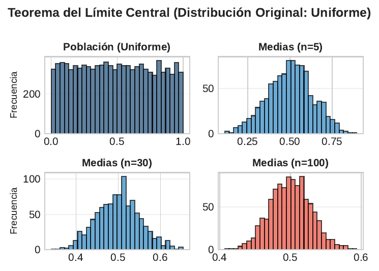
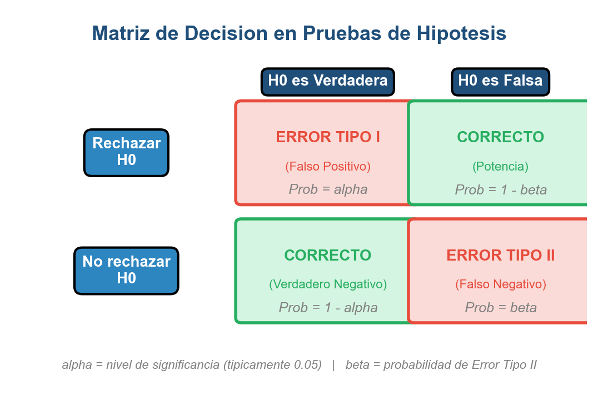

```{r}
#| label: setup
#| echo: false
library(tidyverse)
library(knitr)
library(broom)
library(plotly)
theme_set(theme_minimal(base_size = 13))
azul <- "#1F4E79"; celeste <- "#2E86C1"; rojo <- "#E74C3C"; verde <- "#27AE60"; naranja <- "#F39C12"
# En HTML (revealjs) los graficos se vuelven interactivos con plotly;
# en Beamer (PDF) se mantienen estaticos.
es_html <- knitr::is_html_output()
interactivo <- function(p) {
  if (es_html) plotly::config(plotly::ggplotly(p), displayModeBar = FALSE) else p
}
```

## Panorama de la sesión

| Bloque | Concepto clave | Herramienta en R |
|---|---|---|
| Muestreo | Población, muestra i.i.d., $\theta$ vs $\hat{\theta}$ | `sample()` |
| Distribución muestral | $\mathbb{E}[\bar{X}] = \mu$, $\operatorname{Var}(\bar{X}) = \sigma^2/n$ | `replicate()` |
| LGN y TCL | $\bar{X}_n \xrightarrow{p} \mu$ · fluctuaciones $\to N(0,1)$ | `cummean()`, simulación |
| Propiedades | Insesgadez, eficiencia, consistencia | `var()`, simulación |
| Intervalos | IC 95% con $z$ y con $t$ | `t.test()`, `qt()` |
| Contraste de hipótesis | 6 pasos, valor-p, errores I y II | `t.test()` |
| Potencia | $1-\beta$ y diseño muestral | `power.t.test()` |

::: {.callout-note appearance="simple"}
**La pregunta de la sesión:** observamos una muestra de $n$ unidades, pero la política pública se decide sobre la **población completa**. ¿Cómo saltamos de una a otra cuantificando la incertidumbre del salto?
:::

## De la población a la muestra: notación formal

**Población:** modelamos la variable de interés como $X \sim F$, con parámetro desconocido $\theta \in \Theta \subseteq \mathbb{R}^k$ (fijo, no aleatorio).

**Muestra aleatoria simple:** $X_1, X_2, \dots, X_n$ son **i.i.d.** (independientes e idénticamente distribuidas):

$$X_1, \dots, X_n \overset{\text{iid}}{\sim} F \iff P(X_1 \le x_1, \dots, X_n \le x_n) = \prod_{i=1}^{n} F(x_i)$$

- **Independientes:** conocer una observación no informa sobre las demás.
- **Idénticamente distribuidas:** todas provienen de la misma $F$, con $\mathbb{E}[X_i] = \mu$ y $\operatorname{Var}(X_i) = \sigma^2$ para todo $i$.

::: {.callout-tip appearance="simple"}
**Ejemplo:** la encuesta CASEN selecciona hogares con probabilidades conocidas para que los ingresos muestrales se comporten (aproximadamente) como extracciones i.i.d. de la distribución de ingresos de Chile. Un muestreo por conveniencia rompe el supuesto y toda la teoría que sigue.
:::

## Parámetro, estadístico y estimador

$$\theta = \text{parámetro (poblacional, fijo, desconocido)} \qquad \hat{\theta}_n = g(X_1, \dots, X_n) = \text{estimador}$$

Un **estadístico** es cualquier función de la muestra que **no depende de parámetros desconocidos**. Un **estimador** es el estadístico que usamos para aproximar $\theta$; su valor realizado $\hat{\theta}(x_1,\dots,x_n)$ es la **estimación**.

| Parámetro poblacional | Estimador muestral | En R |
|---|---|---|
| Media $\mu = \mathbb{E}[X]$ | $\bar{X}_n = \frac{1}{n}\sum_{i=1}^n X_i$ | `mean(x)` |
| Varianza $\sigma^2 = \operatorname{Var}(X)$ | $s^2 = \frac{1}{n-1}\sum_{i=1}^n (X_i - \bar{X})^2$ | `var(x)` |
| Proporción $p$ | $\hat{p} = \frac{1}{n}\sum_{i=1}^n \mathbb{1}(X_i = 1)$ | `mean(x == 1)` |
| Correlación $\rho$ | $r$ de Pearson | `cor(x, y)` |

**Que significa esto:** la tasa de pobreza *verdadera* de una región es $\theta$; la tasa calculada con la CASEN es $\hat{\theta}_n$. Nunca son idénticas — la inferencia mide cuánto pueden diferir.

::: {.content-visible when-format="html"}
::: {.callout-tip title="Intuición" appearance="simple"}
El parámetro es el blanco fijo en la pared; el estimador es la flecha que lanzamos, y cada muestra nueva es un lanzamiento distinto. Inferir es describir la puntería sin ver el blanco.
:::
:::

## La distribución muestral: el estimador ES una variable aleatoria

:::: {.columns}

::: {.column width="50%"}
Como $\hat{\theta}_n$ es función de variables aleatorias, **es una variable aleatoria**: cambia de muestra en muestra.

$$F_{\hat{\theta}_n}(t) = P\left(\hat{\theta}_n \le t\right)$$

es su **distribución muestral**: la distribución de los valores de $\hat{\theta}_n$ bajo muestreo repetido de tamaño $n$.

- Cada encuesta distinta entrega una media distinta.
- La distribución muestral describe ese abanico de resultados posibles.
- Toda la inferencia (IC, tests) se construye sobre ella.
:::

::: {.column width="50%"}
```{r}
#| label: plot-dist-muestral-png
#| echo: false
#| out.width: "100%"
knitr::include_graphics("figuras/distribucion_muestral.png")
```
:::

::::

::: {.content-visible when-format="html"}
::: {.callout-tip title="Intuición" appearance="simple"}
Si mil equipos hicieran la misma encuesta el mismo día, cada uno reportaría un promedio distinto: el histograma de esos mil promedios es la distribución muestral.
:::
:::

## Demostración: $\mathbb{E}[\bar{X}_n] = \mu$

Sean $X_1, \dots, X_n$ i.i.d. con $\mathbb{E}[X_i] = \mu$. Entonces:

$$\begin{aligned}
\mathbb{E}[\bar{X}_n] &= \mathbb{E}\left[\frac{1}{n}\sum_{i=1}^{n} X_i\right] \\[2pt]
&= \frac{1}{n}\,\mathbb{E}\left[\sum_{i=1}^{n} X_i\right] && \text{(la constante } 1/n \text{ sale de } \mathbb{E}) \\[2pt]
&= \frac{1}{n}\sum_{i=1}^{n} \mathbb{E}[X_i] && \text{(linealidad de la esperanza)} \\[2pt]
&= \frac{1}{n}\cdot n\mu = \mu && \text{(idéntica distribución)} \; \blacksquare
\end{aligned}$$

**Que significa esto:** el promedio muestral no apunta sistemáticamente ni por arriba ni por abajo de $\mu$. Si repitiéramos la encuesta miles de veces, el promedio de los promedios coincidiría con el parámetro. Nótese que solo usamos linealidad: **no** se necesita independencia ni normalidad.

::: {.content-visible when-format="html"}
::: {.callout-tip title="Intuición" appearance="simple"}
Insesgado no es acertar siempre: es que los errores hacia arriba y hacia abajo se cancelan en promedio, como una balanza bien calibrada que a veces marca de más y a veces de menos.
:::
:::

## Demostración: $\operatorname{Var}(\bar{X}_n) = \sigma^2 / n$

Ahora sí usamos la **independencia** (las covarianzas cruzadas se anulan):

$$\begin{aligned}
\operatorname{Var}(\bar{X}_n) &= \operatorname{Var}\left(\frac{1}{n}\sum_{i=1}^{n} X_i\right) = \frac{1}{n^2}\operatorname{Var}\left(\sum_{i=1}^{n} X_i\right) && \text{(}\operatorname{Var}(cY) = c^2 \operatorname{Var}(Y)\text{)} \\
&= \frac{1}{n^2}\left[\sum_{i=1}^{n}\operatorname{Var}(X_i) + \sum_{i \ne j}\operatorname{Cov}(X_i, X_j)\right] && \text{(varianza de una suma)} \\
&= \frac{1}{n^2}\sum_{i=1}^{n}\operatorname{Var}(X_i) = \frac{n\sigma^2}{n^2} = \frac{\sigma^2}{n} && \text{(indep.} \Rightarrow \operatorname{Cov} = 0\text{)} \; \blacksquare
\end{aligned}$$

**Error estándar:** $\operatorname{SE}(\bar{X}_n) = \sigma/\sqrt{n}$, la desviación estándar de la distribución muestral de $\bar{X}_n$.

**Que significa esto:** la precisión mejora con $\sqrt{n}$, no con $n$: para **duplicar** la precisión hay que **cuadruplicar** la muestra.

## Simulación: la distribución muestral en acción

```{r}
#| label: plot-sim-muestral
#| echo: false
#| fig-height: 3.2
set.seed(123)
pobl <- tibble(valor = rexp(20000, rate = 1/5),
               dist = "Población: dias de tramite, Exp(1/5), media 5")
medias <- tibble(valor = replicate(5000, mean(rexp(30, rate = 1/5))),
                 dist = "5.000 medias muestrales con n = 30")
df_sim <- bind_rows(pobl, medias) %>%
  mutate(dist = factor(dist, levels = c(
    "Población: dias de tramite, Exp(1/5), media 5",
    "5.000 medias muestrales con n = 30")))
p <- ggplot(df_sim, aes(x = valor)) +
  geom_histogram(bins = 45, fill = celeste, color = "white") +
  geom_vline(xintercept = 5, color = rojo, linetype = "dashed", linewidth = 0.9) +
  facet_wrap(~dist, scales = "free") +
  labs(x = "Dias de tramitacion", y = "Frecuencia")
interactivo(p)
```

Población **exponencial** (media $\mu = 5$, DE $\sigma = 5$, muy sesgada). Las medias de muestras con $n = 30$ se concentran alrededor de 5 con DE empírica $\approx 0.90$, casi idéntica al valor teórico $\sigma/\sqrt{n} = 5/\sqrt{30} \approx 0.91$ — y su forma ya es simétrica.

## Ley de los Grandes Números: enunciado formal

**Teorema (ley débil de los grandes números).** Sean $X_1, X_2, \dots$ i.i.d. con $\mathbb{E}[X_i] = \mu$ y $\operatorname{Var}(X_i) = \sigma^2 < \infty$. Entonces la media muestral **converge en probabilidad** al parámetro:

$$\bar{X}_n \xrightarrow{\;p\;} \mu \quad\Longleftrightarrow\quad \lim_{n\to\infty} P\!\left(\,|\bar{X}_n - \mu| > \varepsilon\,\right) = 0 \quad \text{para todo } \varepsilon > 0$$

**Demostración** (vía la desigualdad de Chebyshev), paso a paso:

$$\begin{aligned}
P\!\left(|\bar{X}_n - \mu| > \varepsilon\right) &\leq \frac{\operatorname{Var}(\bar{X}_n)}{\varepsilon^2} && \text{(Chebyshev sobre } \bar{X}_n\text{)} \\[2pt]
&= \frac{\sigma^2}{n\,\varepsilon^2} && \text{(ya demostramos } \operatorname{Var}(\bar{X}_n)=\sigma^2/n\text{)} \\[2pt]
&\xrightarrow[\;n \to \infty\;]{} 0 && \blacksquare
\end{aligned}$$

::: {.content-visible when-format="html"}
::: {.callout-tip title="Intuición" appearance="simple"}
Con suficientes observaciones, el azar "se promedia": la media muestral deja de ser una apuesta y se vuelve una medición del parámetro. Es la razón por la que encuestar 1.000 hogares informa sobre millones.
:::
:::

## LGN en acción: trayectorias de la media muestral

```{r}
#| label: plot-lgn-trayectorias
#| echo: false
#| fig-height: 3.2
set.seed(2026)
p_verdadero <- 0.6
tray <- map_dfr(1:5, function(k) {
  x <- rbinom(1000, 1, p_verdadero)
  tibble(encuestador = paste("Muestra", k), n = 1:1000, media = cummean(x))
})
p <- ggplot(tray, aes(n, media, color = encuestador)) +
  geom_line(linewidth = 0.6, alpha = 0.85) +
  geom_hline(yintercept = p_verdadero, linetype = "dashed", color = azul, linewidth = 1) +
  annotate("text", x = 930, y = 0.635, label = "p = 0.60", color = azul, size = 4.2) +
  scale_color_manual(values = c(celeste, naranja, verde, rojo, "#8E7CC3")) +
  coord_cartesian(ylim = c(0.3, 0.9)) +
  labs(x = "Tamaño muestral acumulado n", y = "Proporción muestral acumulada",
       color = NULL, title = "Cinco encuestas independientes: apoyo verdadero p = 0.60") +
  theme(legend.position = "none")
interactivo(p)
```

Cada trayectoria es una encuesta que crece: con $n$ pequeño las cinco difieren mucho; hacia $n = 1000$ **todas** están pegadas a $p = 0.60$. Eso — y solo eso — es lo que garantiza la LGN.

## Teorema Central del Límite: enunciado formal

**Teorema (Lindeberg–Lévy).** Sean $X_1, X_2, \dots$ i.i.d. con $\mathbb{E}[X_i] = \mu$ y $\operatorname{Var}(X_i) = \sigma^2 \in (0, \infty)$. Entonces

$$Z_n = \frac{\bar{X}_n - \mu}{\sigma/\sqrt{n}} \;\xrightarrow{\;d\;}\; \mathcal{N}(0, 1) \qquad (n \to \infty)$$

donde $\xrightarrow{d}$ denota **convergencia en distribución**: $\lim_{n\to\infty} P(Z_n \le z) = \Phi(z)$ para todo $z \in \mathbb{R}$.

**Hipótesis (todas necesarias):** (i) observaciones i.i.d.; (ii) media finita; (iii) **varianza finita**. No se exige normalidad ni simetría de $F$.

**Lectura en palabras:** cualquiera sea la forma de la población — ingresos sesgados, conteos, dicotómicas — la media muestral estandarizada se comporta como una normal estándar cuando $n$ es grande. En la práctica: $\bar{X}_n \overset{\text{aprox}}{\sim} \mathcal{N}(\mu, \sigma^2/n)$.

**Que significa esto:** el TCL es la licencia matemática para usar la campana de Gauss en encuestas de ingreso, pobreza o victimización, aunque ninguna de esas variables sea normal.

::: {.content-visible when-format="html"}
::: {.callout-tip title="Intuición" appearance="simple"}
Al promediar muchas fuentes independientes de azar, los extremos se compensan entre sí y siempre emerge la misma silueta: la campana. La normal no es un supuesto, es un destino.
:::
:::

## TCL en acción: de una exponencial a la normal

```{r}
#| label: plot-tlc-sim
#| echo: false
#| fig-height: 3.0
set.seed(456)
ns <- c(2, 10, 30, 100)
tlc <- map_dfr(ns, function(n) {
  tibble(n = n, media = replicate(3000, mean(rexp(n, rate = 1/5))))
}) %>% mutate(fac = factor(paste0("n = ", n), levels = paste0("n = ", ns)))
curvas <- map_dfr(ns, function(n) {
  s <- 5 / sqrt(n)
  tibble(fac = factor(paste0("n = ", n), levels = paste0("n = ", ns)),
         x = seq(5 - 4 * s, 5 + 4 * s, length.out = 200),
         d = dnorm(seq(5 - 4 * s, 5 + 4 * s, length.out = 200), 5, s))
})
p <- ggplot(tlc, aes(x = media)) +
  geom_histogram(aes(y = after_stat(density)), bins = 40,
                 fill = celeste, color = "white") +
  geom_line(data = curvas, aes(x = x, y = d), color = rojo, linewidth = 0.8) +
  facet_wrap(~fac, nrow = 1, scales = "free") +
  labs(x = "Media muestral de Exp(1/5)", y = "Densidad")
interactivo(p)
```

Con $n = 2$ la distribución de $\bar{X}_n$ hereda el sesgo exponencial; con $n = 30$ la curva normal (roja, con media $5$ y DE $5/\sqrt{n}$) ya calza; con $n = 100$ el ajuste es casi perfecto. La regla práctica $n \ge 30$ nace de aquí — con poblaciones muy sesgadas conviene más.

## Laboratorio: TCL en vivo

Mueva los controles y observe cómo el histograma de medias de una población exponencial (media 5, DE 5) se acerca a la campana normal, y cómo el SE empírico calza con el teórico.

::: {.content-visible when-format="html"}

```{=html}
<div style="display:flex; gap:1.5em; align-items:center; flex-wrap:wrap; font-size:0.62em; margin-bottom:0.3em;">
  <label>Tamano muestral n: <input type="range" id="lab1-n" min="1" max="200" step="1" value="30" style="width:170px; vertical-align:middle;"> <span id="lab1-n-val"></span></label>
  <label>Numero de muestras: <input type="range" id="lab1-m" min="100" max="3000" step="100" value="1000" style="width:170px; vertical-align:middle;"> <span id="lab1-m-val"></span></label>
</div>
<div id="lab1-plot" style="width:100%; height:400px;"></div>
<div id="lab1-lectura" style="font-size:0.6em; color:#1F4E79; font-weight:600;"></div>
<script>
(function() {
  var MU = 5;
  function rexp() { return -MU * Math.log(1 - Math.random()); }
  function dibujar() {
    var n = parseInt(document.getElementById('lab1-n').value, 10);
    var m = parseInt(document.getElementById('lab1-m').value, 10);
    document.getElementById('lab1-n-val').textContent = n;
    document.getElementById('lab1-m-val').textContent = m;
    var medias = new Array(m);
    for (var i = 0; i < m; i++) {
      var s = 0;
      for (var j = 0; j < n; j++) { s += rexp(); }
      medias[i] = s / n;
    }
    var se = MU / Math.sqrt(n);
    var xs = [], ds = [];
    for (var k = 0; k <= 240; k++) {
      var x = 15 * k / 240;
      xs.push(x);
      ds.push(Math.exp(-0.5 * Math.pow((x - MU) / se, 2)) / (se * Math.sqrt(2 * Math.PI)));
    }
    var suma = 0;
    for (var i2 = 0; i2 < m; i2++) { suma += medias[i2]; }
    var prom = suma / m, sc = 0;
    for (var i3 = 0; i3 < m; i3++) { sc += Math.pow(medias[i3] - prom, 2); }
    var seEmp = Math.sqrt(sc / (m - 1));
    Plotly.react('lab1-plot', [
      { x: medias, type: 'histogram', histnorm: 'probability density',
        marker: { color: '#2E86C1', line: { color: 'white', width: 0.5 } },
        name: 'Medias muestrales', opacity: 0.75 },
      { x: xs, y: ds, type: 'scatter', mode: 'lines',
        line: { color: '#E74C3C', width: 2.5 },
        name: 'Normal teorica' }
    ], {
      margin: { t: 10, r: 20, b: 40, l: 50 },
      xaxis: { title: 'Media muestral de Exp(1/5)', range: [0, 15] },
      yaxis: { title: 'Densidad', range: [0, 1.3] },
      showlegend: true, legend: { orientation: 'h', y: 1.1 }
    }, { displayModeBar: false });
    document.getElementById('lab1-lectura').textContent =
      'SE teorico = sigma/raiz(n) = 5/' + Math.sqrt(n).toFixed(2) + ' = ' + se.toFixed(3) +
      '  |  SE empirico (DE de las ' + m + ' medias) = ' + seEmp.toFixed(3);
  }
  function init() {
    if (typeof Plotly === 'undefined') { setTimeout(init, 200); return; }
    ['lab1-n', 'lab1-m'].forEach(function(id) {
      document.getElementById(id).addEventListener('input', dibujar);
    });
    dibujar();
  }
  if (document.readyState === 'complete') { init(); } else { window.addEventListener('load', init); }
})();
</script>
```

:::

::: {.content-visible unless-format="html"}
**Experimento (disponible en la versión HTML):** se extraen $m$ muestras de tamaño $n$ de una población $\text{Exp}(1/5)$ y se grafica el histograma de sus medias junto a la normal teórica $\mathcal{N}(5,\ 25/n)$, con $n$ y $m$ controlados por deslizadores.

- Con $n$ pequeño el histograma hereda el sesgo exponencial; desde $n \approx 30$ la campana ya calza.
- El SE empírico (DE de las $m$ medias) reproduce el teórico $\sigma/\sqrt{n} = 5/\sqrt{n}$.
- Aumentar $m$ no angosta el histograma (eso solo lo hace $n$): únicamente lo dibuja con más nitidez.
:::

## LGN vs TCL: qué dice cada teorema

| | Ley de los Grandes Números | Teorema Central del Límite |
|---|---|---|
| Pregunta que responde | ¿**A dónde** va $\bar{X}_n$? | ¿**Cómo fluctúa** $\bar{X}_n$ alrededor de $\mu$? |
| Enunciado | $\bar{X}_n \xrightarrow{p} \mu$ | $\sqrt{n}\,(\bar{X}_n - \mu)/\sigma \xrightarrow{d} N(0,1)$ |
| Garantiza | El destino: la media llega al parámetro | La forma: fluctuaciones normales a escala $\sigma/\sqrt{n}$ |
| NO dice | Ni la velocidad ni la forma de las fluctuaciones | Que los datos $X_i$ sean normales (no lo necesita) |
| En una encuesta | Con $n$ grande, $\hat{p} \approx p$ | Habilita el margen de error $\pm 1.96 \cdot SE$ |

::: {.callout-tip title="Intuición" appearance="simple"}
La LGN dice que el viaje **llega a destino**; el TCL describe **los tropiezos alrededor del destino**. Sin LGN no sabríamos que estimamos lo correcto; sin TCL no podríamos cuantificar la incertidumbre de la estimación.
:::

## Por qué el TCL habilita toda la inferencia

:::: {.columns}

::: {.column width="48%"}
```{r}
#| label: plot-tlc-png
#| echo: false
#| out.width: "100%"

```
:::

::: {.column width="52%"}
El TCL convierte un problema imposible en uno resuelto:

- **Sin TCL:** necesitaríamos conocer la distribución exacta de $\bar{X}_n$ para cada población posible.
- **Con TCL:** basta $\mu$, $\sigma$ y $n$; la forma límite es siempre la misma normal.
- Los **intervalos de confianza** y los **contrastes de hipótesis** de esta sesión descansan en esta aproximación.
- Cuando falla (colas muy pesadas con varianza infinita, dependencia fuerte, $n$ pequeño), la inferencia estándar puede ser engañosa.
:::

::::

## ¿Qué hace bueno a un estimador? Tres propiedades

| Propiedad | Definición formal | Pregunta que responde |
|---|---|---|
| Insesgadez | $\mathbb{E}[\hat{\theta}_n] = \theta$ para todo $\theta$ | ¿Apunta al blanco en promedio? |
| Eficiencia | $\operatorname{Var}(\hat{\theta}_n) \le \operatorname{Var}(\tilde{\theta}_n)$ entre insesgados | ¿Es el de menor dispersión? |
| Consistencia | $\hat{\theta}_n \xrightarrow{p} \theta$ cuando $n \to \infty$ | ¿Acierta con datos infinitos? |

El **sesgo** se define como $\operatorname{Sesgo}(\hat{\theta}_n) = \mathbb{E}[\hat{\theta}_n] - \theta$, y el criterio que integra sesgo y varianza es el **error cuadrático medio**:

$$\operatorname{ECM}(\hat{\theta}_n) = \mathbb{E}\left[(\hat{\theta}_n - \theta)^2\right] = \operatorname{Var}(\hat{\theta}_n) + \left[\operatorname{Sesgo}(\hat{\theta}_n)\right]^2$$

**Que significa esto:** un indicador oficial (tasa de pobreza, desempleo) construido con un estimador sesgado distorsiona sistemáticamente la política, aunque la muestra sea enorme.

::: {.content-visible when-format="html"}
::: {.callout-tip title="Intuición" appearance="simple"}
Insesgadez: la mira apunta al centro. Eficiencia: el pulso tiembla poco. Consistencia: con municiones infinitas, se termina dando en el blanco.
:::
:::

## Insesgadez: $\mathbb{E}[\hat{\theta}_n] = \theta$

:::: {.columns}

::: {.column width="50%"}
**Definición.** $\hat{\theta}_n$ es **insesgado** para $\theta$ si

$$\mathbb{E}[\hat{\theta}_n] = \theta \quad \forall\, \theta \in \Theta$$

- Ya demostramos que $\mathbb{E}[\bar{X}_n] = \mu$: la media muestral **es insesgada** para $\mu$.
- La insesgadez es sobre el **promedio de muestras repetidas**: una realización particular casi nunca coincide con $\theta$.
- Un estimador sesgado se equivoca *en la misma dirección* una y otra vez.
:::

::: {.column width="50%"}
```{r}
#| label: plot-insesgadez
#| echo: false
#| fig-width: 5
#| fig-height: 3.4
#| out.width: "100%"
xs <- seq(40, 68, length.out = 400)
dfi <- bind_rows(
  tibble(x = xs, d = dnorm(xs, 50, 3), tipo = "Insesgado: E = theta"),
  tibble(x = xs, d = dnorm(xs, 57, 3), tipo = "Sesgado: E = theta + 7"))
p <- ggplot(dfi, aes(x, d, color = tipo)) +
  geom_line(linewidth = 1) +
  geom_vline(xintercept = 50, linetype = "dashed", color = azul) +
  annotate("text", x = 50, y = 0.145, label = "theta", color = azul, size = 4.5) +
  scale_color_manual(values = c(verde, rojo)) +
  labs(x = "Valores del estimador", y = "Densidad", color = NULL) +
  theme(legend.position = "top")
interactivo(p)
```
:::

::::

## ¿Por qué $s^2$ divide entre $n-1$?

$$s^2 = \frac{1}{n-1}\sum_{i=1}^{n}(X_i - \bar{X})^2 \qquad \text{porque} \qquad \mathbb{E}\left[\sum_{i=1}^{n}(X_i - \bar{X})^2\right] = (n-1)\,\sigma^2$$

**El grado de libertad perdido:** las desviaciones satisfacen la restricción lineal $\sum_{i=1}^n (X_i - \bar{X}) = 0$, de modo que solo $n-1$ de ellas son libres. Además, $\bar{X}$ está *más cerca* de los datos que $\mu$ (minimiza $\sum(X_i - c)^2$), así que $\sum(X_i - \bar{X})^2 \le \sum(X_i - \mu)^2$: dividir por $n$ **subestima** $\sigma^2$ con $\mathbb{E}[\hat{\sigma}^2_n] = \frac{n-1}{n}\sigma^2$.

```{r}
#| label: sim-varianza
set.seed(2026)
sims <- replicate(20000, {
  x <- rnorm(5, mean = 50, sd = 10)          # sigma^2 = 100, n = 5
  c(divide_n = sum((x - mean(x))^2) / 5, divide_n1 = var(x))
})
round(rowMeans(sims), 1)
```

Con $\sigma^2 = 100$ y $n = 5$: dividir por $n$ promedia $\approx 80.2$ (el valor teórico $\frac{4}{5} \times 100 = 80$, un sesgo del 20%); dividir por $n-1$ promedia $\approx 100.2$. La corrección funciona.

::: {.content-visible when-format="html"}
::: {.callout-tip title="Intuición" appearance="simple"}
La muestra ya gastó una pieza de información en estimar su propio centro: quedan solo $n-1$ desviaciones libres para medir la dispersión, y por eso se divide entre $n-1$.
:::
:::

## Eficiencia: menor varianza entre insesgados

:::: {.columns}

::: {.column width="50%"}
**Definición.** Entre dos estimadores **insesgados** $\hat{\theta}_n$ y $\tilde{\theta}_n$, $\hat{\theta}_n$ es más **eficiente** si

$$\operatorname{Var}(\hat{\theta}_n) \le \operatorname{Var}(\tilde{\theta}_n)$$

**Ejemplo clásico:** bajo normalidad, media y mediana muestral son ambas insesgadas para $\mu$, pero

$$\frac{\operatorname{Var}(\text{mediana})}{\operatorname{Var}(\bar{X}_n)} \xrightarrow[n \to \infty]{} \frac{\pi}{2} \approx 1.57$$

Usar la mediana equivale a **desechar un tercio de la muestra**. (Con colas pesadas la comparación puede invertirse.)
:::

::: {.column width="50%"}
```{r}
#| label: plot-eficiencia
#| echo: false
#| fig-width: 5
#| fig-height: 3.4
#| out.width: "100%"
se_m <- 10 / sqrt(30); se_md <- sqrt(pi / 2) * se_m
xs2 <- seq(43, 57, length.out = 400)
dfe <- bind_rows(
  tibble(x = xs2, d = dnorm(xs2, 50, se_m), est = "Media (eficiente)"),
  tibble(x = xs2, d = dnorm(xs2, 50, se_md), est = "Mediana (Var 1.57x)"))
p <- ggplot(dfe, aes(x, d, color = est)) +
  geom_line(linewidth = 1) +
  geom_vline(xintercept = 50, linetype = "dashed", color = azul) +
  scale_color_manual(values = c(verde, naranja)) +
  labs(x = "Valores del estimador (theta = 50)", y = "Densidad", color = NULL) +
  theme(legend.position = "top")
interactivo(p)
```
:::

::::

## Consistencia: $\operatorname{plim}\, \hat{\theta}_n = \theta$

:::: {.columns}

::: {.column width="46%"}
**Definición.** $\hat{\theta}_n$ es **consistente** si converge en probabilidad a $\theta$:

$$\lim_{n \to \infty} P\left(\left|\hat{\theta}_n - \theta\right| > \varepsilon\right) = 0 \quad \forall\, \varepsilon > 0$$

Para $\bar{X}_n$ es la **Ley de los Grandes Números**; basta notar que

$$\operatorname{ECM}(\bar{X}_n) = \frac{\sigma^2}{n} \to 0$$

**Que significa esto:** con más datos, la probabilidad de equivocarse por más de cualquier margen $\varepsilon$ se hace despreciable. Un estimador inconsistente no se salva ni con un censo.
:::

::: {.column width="54%"}
```{r}
#| label: plot-consistencia
#| echo: false
#| fig-width: 5.4
#| fig-height: 3.4
#| out.width: "100%"
xs3 <- seq(42, 58, length.out = 500)
dfc <- map_dfr(c(10, 50, 500), function(n) {
  tibble(n_lab = factor(paste0("n = ", n), levels = paste0("n = ", c(10, 50, 500))),
         x = xs3, d = dnorm(xs3, 50, 15 / sqrt(n)))
})
p <- ggplot(dfc, aes(x, d, color = n_lab)) +
  geom_line(linewidth = 1) +
  geom_vline(xintercept = 50, linetype = "dashed", color = azul) +
  scale_color_manual(values = c(naranja, celeste, verde)) +
  labs(x = "Distribucion de la media muestral (theta = 50)",
       y = "Densidad", color = NULL) +
  theme(legend.position = "top")
interactivo(p)
```
:::

::::

## Sesgo y varianza: las cuatro dianas

```{r}
#| label: plot-dianas
#| echo: false
#| fig-height: 2.9
set.seed(99)
ang <- seq(0, 2 * pi, length.out = 120)
casos <- tribble(
  ~caso, ~sx, ~sy, ~disp,
  "Insesgado y preciso", 0, 0, 0.35,
  "Insesgado, impreciso", 0, 0, 1.05,
  "Sesgado, preciso", 1.6, 1.3, 0.35,
  "Sesgado e impreciso", 1.6, 1.3, 1.05)
orden <- casos$caso
tiros <- casos %>% rowwise() %>%
  reframe(caso = caso, x = rnorm(15, sx, disp), y = rnorm(15, sy, disp))
circulos <- map_dfr(orden, function(cs) {
  map_dfr(c(1, 2, 3), function(r) {
    tibble(caso = cs, r = r, cx = r * cos(ang), cy = r * sin(ang))
  })
})
tiros <- tiros %>% mutate(caso = factor(caso, levels = orden))
circulos <- circulos %>% mutate(caso = factor(caso, levels = orden))
p <- ggplot() +
  geom_path(data = circulos, aes(cx, cy, group = r), color = "grey55", linewidth = 0.4) +
  geom_point(data = tiros, aes(x, y), color = rojo, size = 1.6, alpha = 0.8) +
  annotate("point", x = 0, y = 0, shape = 3, size = 2.5, color = azul, stroke = 1) +
  facet_wrap(~caso, nrow = 1) +
  coord_fixed(xlim = c(-3.3, 3.3), ylim = c(-3.3, 3.3)) +
  labs(x = NULL, y = NULL) +
  theme(axis.text = element_blank(), panel.grid = element_blank())
p
```

El centro de la diana es $\theta$; cada punto, una estimación con una muestra distinta. **Sesgo** = el centro de la nube no coincide con $\theta$; **varianza** = dispersión de la nube. El ECM penaliza ambos: $\operatorname{ECM} = \operatorname{Var} + \operatorname{Sesgo}^2$.

## Intervalo de confianza: derivación (1/2)

**Punto de partida.** Por el TCL (o exactamente, si $X_i \sim \mathcal{N}$), con $\sigma$ conocida:

$$Z = \frac{\bar{X}_n - \mu}{\sigma/\sqrt{n}} \sim \mathcal{N}(0, 1)$$

$Z$ es una cantidad **pivotal**: contiene a $\mu$, pero su distribución no depende de ningún parámetro desconocido. De la normal estándar sabemos que $z_{0.975} = 1.96$, luego:

$$P\left(-1.96 \le Z \le 1.96\right) = \Phi(1.96) - \Phi(-1.96) = 0.975 - 0.025 = 0.95$$

**Que significa esto:** antes de observar los datos, hay un 95% de probabilidad de que la media muestral caiga a menos de $1.96$ errores estándar de $\mu$. La derivación siguiente solo *despeja* $\mu$ de esa desigualdad.

::: {.callout-tip title="Intuición" appearance="simple"}
La estaca (el parámetro) está fija; el aro (el intervalo) cambia con cada muestra: confianza 95% significa que 95 de cada 100 aros la capturan.
:::

## Intervalo de confianza: derivación (2/2)

Partimos de la probabilidad anterior y despejamos $\mu$ paso a paso:

$$\begin{aligned}
0.95 &= P\left(-1.96 \le \frac{\bar{X}_n - \mu}{\sigma/\sqrt{n}} \le 1.96\right) \\
&= P\left(-1.96\,\frac{\sigma}{\sqrt{n}} \le \bar{X}_n - \mu \le 1.96\,\frac{\sigma}{\sqrt{n}}\right) && \text{(multiplicar por } \sigma/\sqrt{n} > 0\text{)} \\
&= P\left(-\bar{X}_n - 1.96\,\frac{\sigma}{\sqrt{n}} \le -\mu \le -\bar{X}_n + 1.96\,\frac{\sigma}{\sqrt{n}}\right) && \text{(restar } \bar{X}_n\text{)} \\
&= P\left(\bar{X}_n - 1.96\,\frac{\sigma}{\sqrt{n}} \le \mu \le \bar{X}_n + 1.96\,\frac{\sigma}{\sqrt{n}}\right) && \text{(multiplicar por } -1 \text{ invierte)}
\end{aligned}$$

$$\boxed{\;IC_{95\%}(\mu) = \left[\bar{X}_n - 1.96\,\frac{\sigma}{\sqrt{n}},\;\; \bar{X}_n + 1.96\,\frac{\sigma}{\sqrt{n}}\right]\;}$$

Lo aleatorio son los **extremos**, no $\mu$: bajo muestreo repetido, el 95% de estos intervalos contiene a $\mu$.

## $\sigma$ desconocida: la t de Student

:::: {.columns}

::: {.column width="52%"}
En la práctica $\sigma$ se estima con $s$, y ese reemplazo agrega incertidumbre. Si $X_i \sim \mathcal{N}(\mu, \sigma^2)$:

$$T = \frac{\bar{X}_n - \mu}{s/\sqrt{n}} \sim t_{n-1}$$

con $n - 1$ **grados de libertad**. La $t$ tiene colas más pesadas que la normal y converge a ella cuando $n \to \infty$.

$$IC_{95\%}(\mu) = \bar{X}_n \pm t_{n-1,\,0.975}\,\frac{s}{\sqrt{n}}$$

Con $n = 25$: $t_{24, 0.975} = 2.064 > 1.96$ — intervalos más anchos, el precio honesto de no conocer $\sigma$.
:::

::: {.column width="48%"}
```{r}
#| label: plot-t-png
#| echo: false
#| out.width: "100%"
knitr::include_graphics("figuras/distribuciones_t.png")
```
:::

::::

## Ejemplo IC paso a paso: ingreso de hogares beneficiarios

**Pregunta:** una muestra i.i.d. de $n = 36$ hogares beneficiarios de una transferencia reporta ingreso mensual con $\bar{x} = 520$ y $s = 90$ (miles de CLP). Construya el IC del 95% para el ingreso medio poblacional $\mu$.

**Paso 1 — Error estándar:**
$$\widehat{\operatorname{SE}} = \frac{s}{\sqrt{n}} = \frac{90}{\sqrt{36}} = \frac{90}{6} = 15$$

**Paso 2 — Valor crítico** ($gl = n - 1 = 35$): $t_{35,\,0.975} = 2.0301$ (en R: `qt(0.975, 35)`).

**Paso 3 — Margen de error:**
$$ME = t_{35,\,0.975} \times \widehat{\operatorname{SE}} = 2.0301 \times 15 = 30.45$$

**Paso 4 — Límites:**
$$IC_{95\%} = \left[520 - 30.45,\; 520 + 30.45\right] \;\Rightarrow\; \boxed{[489.55,\; 550.45]}$$

## Verificación con `t.test()` en R

```{r}
#| label: code-ic-verifica
set.seed(123)
ingresos <- as.numeric(scale(rnorm(36))) * 90 + 520   # muestra con xbar = 520, s = 90 exactos
c(media = mean(ingresos), de = sd(ingresos), se = sd(ingresos) / sqrt(36))
```

```{r}
#| label: code-ic-tidy
tidy(t.test(ingresos)) %>%
  select(estimate, conf.low, conf.high) %>% kable(digits = 2)
```

Los límites de `t.test()` — $[489.55,\ 550.45]$ — coinciden exactamente con el cálculo manual. Con 95% de confianza, el ingreso medio de la población beneficiaria está entre **489.6 y 550.4 mil CLP**: si la línea de elegibilidad del programa fuera 560, este dato descartaría (al 95%) que el hogar promedio la supere.

## Interpretación del IC: una correcta, muchas incorrectas

| Afirmación sobre $IC_{95\%} = [489.55,\ 550.45]$ | ¿Válida? |
|---|:-:|
| El procedimiento que generó este intervalo captura a $\mu$ el 95% de las veces bajo muestreo repetido | **Sí** |
| Hay 95% de probabilidad de que $\mu$ esté entre 489.55 y 550.45 | No: $\mu$ es fijo; el intervalo ya lo contiene o no |
| El 95% de los hogares tiene ingreso en ese rango | No: el IC es para la **media**, no para individuos |
| El 95% de las medias muestrales futuras caerá en ese rango | No: confunde IC con distribución de $\bar{X}$ |
| Con otra muestra obtendríamos el mismo intervalo | No: los extremos son aleatorios |

::: {.callout-important appearance="simple"}
La confianza es una propiedad del **procedimiento**, no de un intervalo particular. La frase operativa honesta: "con 95% de confianza, $\mu$ está entre 489.6 y 550.4".
:::

## Simulación de cobertura: 100 intervalos, $\mu = 50$

:::: {.columns}

::: {.column width="46%"}
```{r}
#| label: code-cobertura
#| eval: false
set.seed(1)
ics <- map_dfr(1:100, function(i) {
  x <- rnorm(30, mean = 50, sd = 10)
  ci <- t.test(x)$conf.int
  tibble(id = i, li = ci[1],
         ls = ci[2])
})
ics <- ics %>%
  mutate(cubre = li <= 50 & ls >= 50)
sum(ics$cubre)   # 95 de 100
```

Cada segmento es el IC de una muestra distinta de la **misma** población. En esta corrida, **95 de 100** contienen a $\mu = 50$ — la tasa nominal en acción.
:::

::: {.column width="54%"}
```{r}
#| label: plot-cobertura
#| echo: false
#| fig-width: 5.6
#| fig-height: 3.9
#| out.width: "100%"
set.seed(1)
ics <- map_dfr(1:100, function(i) {
  x <- rnorm(30, mean = 50, sd = 10)
  ci <- t.test(x)$conf.int
  tibble(id = i, li = ci[1], ls = ci[2])
}) %>% mutate(cubre = ifelse(li <= 50 & ls >= 50,
                             "Contiene a mu", "No contiene"))
interactivo(
  ggplot(ics) +
    geom_segment(aes(x = id, xend = id, y = li, yend = ls, color = cubre),
                 linewidth = 0.7) +
    geom_hline(yintercept = 50, color = azul, linewidth = 0.7) +
    scale_color_manual(values = c("Contiene a mu" = verde, "No contiene" = rojo)) +
    labs(x = "Muestra", y = "IC 95%", color = NULL) +
    theme(legend.position = "top")
)
```
:::

::::

## El ancho del intervalo: qué lo gobierna

:::: {.columns}

::: {.column width="52%"}
$$\text{ancho} = 2\; t_{n-1,\,1-\alpha/2}\;\frac{s}{\sqrt{n}}$$

Con los datos del ejemplo ($s = 90$):

- $n = 36$, 95%: ancho $= 2(2.030)(15) = 60.9$
- $n = 36$, **99%**: ancho $= 2(2.724)(15) = 81.7$ — más confianza, menos precisión
- $n = 144$, 95%: ancho $= 2(1.977)(7.5) = 29.7$ — cuadruplicar $n$ **divide el ancho por 2**

**Que significa esto:** precisión y confianza se compran con tamaño muestral, y el precio crece cuadráticamente.
:::

::: {.column width="48%"}
```{r}
#| label: plot-ancho-png
#| echo: false
#| out.width: "100%"
knitr::include_graphics("figuras/ancho_ic.png")
```
:::

::::

## Laboratorio: ancho del intervalo de confianza

Mueva los controles y observe cómo $n$, $\sigma$ y el nivel de confianza gobiernan el ancho del intervalo alrededor de una media fija $\bar{x} = 50$.

::: {.content-visible when-format="html"}

```{=html}
<div style="display:flex; gap:1.5em; align-items:center; flex-wrap:wrap; font-size:0.62em; margin-bottom:0.3em;">
  <label>Tamano muestral n: <input type="range" id="lab2-n" min="5" max="500" step="5" value="35" style="width:170px; vertical-align:middle;"> <span id="lab2-n-val"></span></label>
  <label>Sigma: <input type="range" id="lab2-s" min="1" max="30" step="1" value="15" style="width:150px; vertical-align:middle;"> <span id="lab2-s-val"></span></label>
  <label>Confianza (%): <input type="range" id="lab2-c" min="80" max="99" step="1" value="95" style="width:150px; vertical-align:middle;"> <span id="lab2-c-val"></span></label>
</div>
<div id="lab2-plot" style="width:100%; height:400px;"></div>
<div id="lab2-lectura" style="font-size:0.6em; color:#1F4E79; font-weight:600;"></div>
<script>
(function() {
  var MEDIA = 50;
  function zcrit(conf) {
    var pts = [[80, 1.2816], [90, 1.6449], [95, 1.9600], [99, 2.5758]];
    if (conf <= pts[0][0]) { return pts[0][1]; }
    if (conf >= pts[3][0]) { return pts[3][1]; }
    for (var i = 0; i < 3; i++) {
      if (conf >= pts[i][0] && conf <= pts[i + 1][0]) {
        var f = (conf - pts[i][0]) / (pts[i + 1][0] - pts[i][0]);
        return pts[i][1] + f * (pts[i + 1][1] - pts[i][1]);
      }
    }
  }
  function dibujar() {
    var n = parseInt(document.getElementById('lab2-n').value, 10);
    var s = parseFloat(document.getElementById('lab2-s').value);
    var c = parseInt(document.getElementById('lab2-c').value, 10);
    document.getElementById('lab2-n-val').textContent = n;
    document.getElementById('lab2-s-val').textContent = s.toFixed(0);
    document.getElementById('lab2-c-val').textContent = c;
    var z = zcrit(c);
    var me = z * s / Math.sqrt(n);
    var li = MEDIA - me, ls = MEDIA + me;
    Plotly.react('lab2-plot', [
      { x: [MEDIA, MEDIA], y: [0, 2], type: 'scatter', mode: 'lines',
        line: { color: '#E74C3C', width: 1.5, dash: 'dash' },
        name: 'Media muestral = 50' },
      { x: [li, ls], y: [1, 1], type: 'scatter', mode: 'lines+markers',
        line: { color: '#1F4E79', width: 6 },
        marker: { size: 14, symbol: 'line-ns-open', color: '#1F4E79',
                  line: { width: 3, color: '#1F4E79' } },
        name: 'Intervalo de confianza' },
      { x: [MEDIA], y: [1], type: 'scatter', mode: 'markers',
        marker: { size: 11, color: '#F39C12' }, name: 'Centro' }
    ], {
      margin: { t: 10, r: 20, b: 40, l: 50 },
      xaxis: { title: 'Valor del parametro mu', range: [10, 90] },
      yaxis: { range: [0, 2], showticklabels: false, zeroline: false },
      showlegend: true, legend: { orientation: 'h', y: 1.1 }
    }, { displayModeBar: false });
    document.getElementById('lab2-lectura').textContent =
      'z = ' + z.toFixed(3) + '  |  Margen de error = z x sigma/raiz(n) = ' + me.toFixed(2) +
      '  |  IC ' + c + '% = [' + li.toFixed(2) + ', ' + ls.toFixed(2) +
      ']  |  Ancho = ' + (2 * me).toFixed(2);
  }
  function init() {
    if (typeof Plotly === 'undefined') { setTimeout(init, 200); return; }
    ['lab2-n', 'lab2-s', 'lab2-c'].forEach(function(id) {
      document.getElementById(id).addEventListener('input', dibujar);
    });
    dibujar();
  }
  if (document.readyState === 'complete') { init(); } else { window.addEventListener('load', init); }
})();
</script>
```

:::

::: {.content-visible unless-format="html"}
**Experimento (disponible en la versión HTML):** deslizadores para $n$, $\sigma$ y el nivel de confianza redibujan el intervalo $\bar{x} \pm z_{1-\alpha/2}\,\sigma/\sqrt{n}$ como segmento centrado en $\bar{x} = 50$, con lectura en vivo del margen de error.

- Cuadruplicar $n$ divide el ancho por 2 (la raíz cuadrada cobra su precio).
- Subir la confianza de 95% a 99% agranda $z$ de $1.96$ a $2.576$: más seguridad, menos precisión.
- $\sigma$ entra de forma lineal: poblaciones más heterogéneas exigen muestras mayores.
:::

## Contraste de hipótesis: procedimiento formal en 6 pasos

1. **Hipótesis:** $H_0: \theta = \theta_0$ (statu quo) vs $H_1: \theta \ne \theta_0$ (bilateral) o $>, <$ (unilateral). Se plantean **antes** de mirar los datos.
2. **Estadístico de contraste:** una función de la muestra con distribución conocida bajo $H_0$; para la media con $\sigma$ desconocida, $T = \dfrac{\bar{X}_n - \theta_0}{s/\sqrt{n}}$.
3. **Distribución nula:** $T \sim t_{n-1}$ si $H_0$ es cierta (exacta bajo normalidad, aproximada por TCL).
4. **Regla de decisión:** fijar $\alpha$ (típicamente 0.05) y rechazar $H_0$ si $|t| > t_{n-1,\,1-\alpha/2}$, o equivalentemente si valor-p $< \alpha$.
5. **Cálculo:** evaluar $t$ con los datos y obtener el valor-p.
6. **Conclusión en contexto:** traducir "rechazo / no rechazo" a la pregunta de política, con magnitud y dirección.

::: {.callout-warning appearance="simple"}
El contraste es una **prueba por contradicción probabilística**: suponemos $H_0$ cierta y medimos cuán inverosímil resulta lo observado bajo ese supuesto.
:::

::: {.content-visible when-format="html"}
::: {.callout-tip title="Intuición" appearance="simple"}
Un contraste funciona como un juicio: $H_0$ es la presunción de inocencia y solo se condena (rechaza) si la evidencia observada sería muy improbable en un mundo donde $H_0$ es cierta.
:::
:::

## Ejemplo completo (1/2): ¿difiere el puntaje de la meta nacional?

**Pregunta empírica:** la meta nacional de una prueba estandarizada es $256$ puntos. En una muestra i.i.d. de $n = 25$ escuelas de un municipio, $\bar{x} = 268$ y $s = 24$. Con $\alpha = 0.05$, ¿el puntaje medio municipal **difiere** de la meta?

**Paso 1 — Hipótesis:**
$$H_0: \mu = 256 \qquad \text{vs} \qquad H_1: \mu \ne 256$$

**Paso 2 — Estadístico de contraste:**
$$T = \frac{\bar{X}_n - 256}{s/\sqrt{n}}$$

**Paso 3 — Distribución nula:** bajo $H_0$, $T \sim t_{24}$.

**Paso 4 — Regla de decisión:** con $\alpha = 0.05$ bilateral, rechazar $H_0$ si $|t| > t_{24,\,0.975} = 2.064$.

## Ejemplo completo (2/2): cálculo, decisión y verificación

**Paso 5 — Cálculo explícito:**
$$\widehat{\operatorname{SE}} = \frac{24}{\sqrt{25}} = \frac{24}{5} = 4.8 \qquad t = \frac{268 - 256}{4.8} = \frac{12}{4.8} = 2.50$$
$$\text{valor-p} = 2\,P(T_{24} \ge 2.50) = 0.0197$$

**Paso 6 — Conclusión:** como $|2.50| > 2.064$ (y $0.0197 < 0.05$), $\boxed{\text{se rechaza } H_0 \text{ al } 5\%}$: el puntaje medio municipal difiere de la meta — está **12 puntos por encima** ($IC_{95\%} = [258.1,\ 277.9]$, que excluye 256).

```{r}
#| label: code-test-verifica
set.seed(42)
puntajes <- as.numeric(scale(rnorm(25))) * 24 + 268   # xbar = 268, s = 24 exactos
tidy(t.test(puntajes, mu = 256)) %>%
  select(estimate, statistic, p.value, conf.low, conf.high) %>% kable(digits = 4)
```

`t.test()` reproduce el cálculo manual: $t = 2.5$, valor-p $= 0.0197$.

## Errores tipo I y tipo II: definiciones formales

:::: {.columns}

::: {.column width="50%"}
$$\alpha = P\left(\text{rechazar } H_0 \mid H_0 \text{ cierta}\right)$$
$$\beta = P\left(\text{no rechazar } H_0 \mid H_1 \text{ cierta}\right)$$

- **Tipo I (falso positivo):** declarar que el programa tiene efecto cuando no lo tiene — se gasta en escalar una política inútil.
- **Tipo II (falso negativo):** no detectar un efecto real — se cancela una política que funcionaba.
- $\alpha$ lo fija el investigador **antes** del análisis; $\beta$ depende de $n$, del tamaño del efecto y de $\sigma$.
- Con $n$ fijo, bajar $\alpha$ **sube** $\beta$: no hay almuerzo gratis.
:::

::: {.column width="50%"}
```{r}
#| label: plot-matriz-png
#| echo: false
#| out.width: "100%"

```
:::

::::

## $\alpha$, $\beta$ y potencia en un solo gráfico

```{r}
#| label: plot-errores
#| echo: false
#| fig-height: 3.2
xs4 <- seq(-4, 6.5, length.out = 600)
h0 <- tibble(x = xs4, d = dnorm(xs4, 0, 1))
h1 <- tibble(x = xs4, d = dnorm(xs4, 2.5, 1))
p <- ggplot() +
  geom_area(data = filter(h1, x <= 1.96), aes(x, d), fill = naranja, alpha = 0.55) +
  geom_area(data = filter(h1, x > 1.96), aes(x, d), fill = verde, alpha = 0.45) +
  geom_area(data = filter(h0, x >= 1.96), aes(x, d), fill = rojo, alpha = 0.65) +
  geom_line(data = h0, aes(x, d), color = azul, linewidth = 0.9) +
  geom_line(data = h1, aes(x, d), color = verde, linewidth = 0.9) +
  geom_vline(xintercept = 1.96, linetype = "dashed", color = "grey30") +
  annotate("text", x = -1.5, y = 0.33, label = "H0: N(0,1)", color = azul, size = 4.2) +
  annotate("segment", x = 3.9, y = 0.055, xend = 2.3, yend = 0.008,
           color = rojo, linewidth = 0.4) +
  annotate("text", x = 4.55, y = 0.075, label = "alfa/2 = 0.025", color = rojo, size = 3.8) +
  annotate("segment", x = -1.35, y = 0.125, xend = 0.85, yend = 0.04,
           color = naranja, linewidth = 0.4) +
  annotate("text", x = -1.85, y = 0.145, label = "beta = 0.295", color = naranja, size = 3.8) +
  annotate("text", x = 3.5, y = 0.15, label = "potencia = 0.705", color = "grey20", size = 3.8) +
  annotate("text", x = 5.35, y = 0.30, label = "H1: N(2.5,1)", color = verde, size = 4.2) +
  labs(x = "Estadistico de contraste (en unidades de SE)", y = "Densidad")
interactivo(p)
```

Con el efecto verdadero a $2.5$ errores estándar y regla bilateral con corte en $1.96$: $\beta = P(-1.96 \le Z_{H_1} \le 1.96) = 0.295$ y potencia $1 - \beta = 0.705$. Mover el corte a la derecha (bajar $\alpha$) agranda el área naranja: menos falsos positivos, más falsos negativos.

## Laboratorio: errores y potencia

Contraste unilateral derecho de $H_0: \mu = 0$ vs $H_1: \mu = \delta$, con $\operatorname{SE} = 1/\sqrt{n}$. Mueva los controles y observe cómo se reparten $\alpha$, $\beta$ y la potencia.

::: {.content-visible when-format="html"}

```{=html}
<div style="display:flex; gap:1.5em; align-items:center; flex-wrap:wrap; font-size:0.62em; margin-bottom:0.3em;">
  <label>Efecto delta = mu1 - mu0: <input type="range" id="lab3-d" min="0" max="3" step="0.05" value="0.5" style="width:160px; vertical-align:middle;"> <span id="lab3-d-val"></span></label>
  <label>Tamano muestral n: <input type="range" id="lab3-n" min="5" max="200" step="1" value="25" style="width:150px; vertical-align:middle;"> <span id="lab3-n-val"></span></label>
  <label>Alfa: <input type="range" id="lab3-a" min="0.01" max="0.20" step="0.01" value="0.05" style="width:140px; vertical-align:middle;"> <span id="lab3-a-val"></span></label>
</div>
<div id="lab3-plot" style="width:100%; height:400px;"></div>
<div id="lab3-lectura" style="font-size:0.6em; color:#1F4E79; font-weight:600;"></div>
<script>
(function() {
  function phi(x) {
    var t = 1 / (1 + 0.2316419 * Math.abs(x));
    var d = Math.exp(-x * x / 2) / Math.sqrt(2 * Math.PI);
    var p = d * t * (0.319381530 + t * (-0.356563782 + t * (1.781477937 +
            t * (-1.821255978 + t * 1.330274429))));
    return x >= 0 ? 1 - p : p;
  }
  function zq(p) {
    var lo = -8, hi = 8;
    for (var i = 0; i < 60; i++) {
      var mid = (lo + hi) / 2;
      if (phi(mid) < p) { lo = mid; } else { hi = mid; }
    }
    return (lo + hi) / 2;
  }
  function dnorm(x, mu, sd) {
    return Math.exp(-0.5 * Math.pow((x - mu) / sd, 2)) / (sd * Math.sqrt(2 * Math.PI));
  }
  function tramo(a, b, mu, sd) {
    var xs = [], ys = [];
    for (var k = 0; k <= 160; k++) {
      var x = a + (b - a) * k / 160;
      xs.push(x); ys.push(dnorm(x, mu, sd));
    }
    return { x: xs, y: ys };
  }
  function dibujar() {
    var delta = parseFloat(document.getElementById('lab3-d').value);
    var n = parseInt(document.getElementById('lab3-n').value, 10);
    var alfa = parseFloat(document.getElementById('lab3-a').value);
    document.getElementById('lab3-d-val').textContent = delta.toFixed(2);
    document.getElementById('lab3-n-val').textContent = n;
    document.getElementById('lab3-a-val').textContent = alfa.toFixed(2);
    var se = 1 / Math.sqrt(n);
    var c = zq(1 - alfa) * se;
    var beta = phi((c - delta) / se);
    var pot = 1 - beta;
    var XMIN = -2, XMAX = 5;
    var fAlfa = tramo(c, XMAX, 0, se);
    var fBeta = tramo(XMIN, c, delta, se);
    var fPot = tramo(c, XMAX, delta, se);
    var lH0 = tramo(XMIN, XMAX, 0, se);
    var lH1 = tramo(XMIN, XMAX, delta, se);
    Plotly.react('lab3-plot', [
      { x: fBeta.x, y: fBeta.y, type: 'scatter', mode: 'lines', fill: 'tozeroy',
        fillcolor: 'rgba(243,156,18,0.55)', line: { width: 0 }, name: 'beta' },
      { x: fPot.x, y: fPot.y, type: 'scatter', mode: 'lines', fill: 'tozeroy',
        fillcolor: 'rgba(39,174,96,0.35)', line: { width: 0 }, name: 'potencia' },
      { x: fAlfa.x, y: fAlfa.y, type: 'scatter', mode: 'lines', fill: 'tozeroy',
        fillcolor: 'rgba(231,76,60,0.60)', line: { width: 0 }, name: 'alfa' },
      { x: lH0.x, y: lH0.y, type: 'scatter', mode: 'lines',
        line: { color: '#1F4E79', width: 2.5 }, name: 'H0: N(0, SE)' },
      { x: lH1.x, y: lH1.y, type: 'scatter', mode: 'lines',
        line: { color: '#2E86C1', width: 2.5 }, name: 'H1: N(delta, SE)' },
      { x: [c, c], y: [0, 6], type: 'scatter', mode: 'lines',
        line: { color: '#555555', width: 1.5, dash: 'dash' }, name: 'corte c' }
    ], {
      margin: { t: 10, r: 20, b: 40, l: 50 },
      xaxis: { title: 'Media muestral', range: [XMIN, XMAX] },
      yaxis: { title: 'Densidad', range: [0, 6] },
      showlegend: true, legend: { orientation: 'h', y: 1.12 }
    }, { displayModeBar: false });
    document.getElementById('lab3-lectura').textContent =
      'SE = 1/raiz(n) = ' + se.toFixed(3) + '  |  corte c = ' + c.toFixed(3) +
      '  |  alfa = ' + alfa.toFixed(2) + '  |  beta = ' + beta.toFixed(3) +
      '  |  potencia = ' + pot.toFixed(3);
  }
  function init() {
    if (typeof Plotly === 'undefined') { setTimeout(init, 200); return; }
    ['lab3-d', 'lab3-n', 'lab3-a'].forEach(function(id) {
      document.getElementById(id).addEventListener('input', dibujar);
    });
    dibujar();
  }
  if (document.readyState === 'complete') { init(); } else { window.addEventListener('load', init); }
})();
</script>
```

:::

::: {.content-visible unless-format="html"}
**Experimento (disponible en la versión HTML):** deslizadores para $\delta$, $n$ y $\alpha$ redibujan las dos campanas ($H_0$ centrada en 0 y $H_1$ en $\delta$, ambas con $\operatorname{SE} = 1/\sqrt{n}$) con las áreas $\alpha$, $\beta$ y potencia sombreadas y su lectura numérica en vivo.

- Aumentar $n$ angosta ambas campanas: se separan y la potencia sube sin tocar $\alpha$.
- Aumentar $\delta$ aleja $H_1$ del corte: efectos grandes son fáciles de detectar.
- Bajar $\alpha$ mueve el corte a la derecha: menos falsos positivos, pero $\beta$ crece.
:::

## Valor-p: definición formal

:::: {.columns}

::: {.column width="50%"}
$$\text{valor-p} = P\left(\,|T| \ge |t_{obs}|\;\middle|\;H_0 \text{ cierta}\right)$$

La probabilidad — **calculada suponiendo $H_0$ cierta** — de observar un estadístico tan o más extremo que el obtenido.

En el ejemplo: $t_{obs} = 2.50$ con $T \sim t_{24}$,

$$\text{valor-p} = 2\,P(T_{24} \ge 2.50) = 0.0197$$

Es una medida de **incompatibilidad entre los datos y $H_0$**: mientras más pequeño, más raro sería lo observado si $H_0$ fuera cierta.
:::

::: {.column width="50%"}
```{r}
#| label: plot-pvalor
#| echo: false
#| fig-width: 5
#| fig-height: 3.4
#| out.width: "100%"
xs5 <- seq(-4, 4, length.out = 500)
dt24 <- tibble(x = xs5, d = dt(xs5, 24))
p <- ggplot(dt24, aes(x, d)) +
  geom_line(color = azul, linewidth = 0.9) +
  geom_area(data = filter(dt24, x >= 2.5), fill = rojo, alpha = 0.7) +
  geom_area(data = filter(dt24, x <= -2.5), fill = rojo, alpha = 0.7) +
  geom_vline(xintercept = c(-2.5, 2.5), linetype = "dashed", color = rojo) +
  annotate("text", x = 3.15, y = 0.075, label = "area total =", color = rojo, size = 3.8) +
  annotate("text", x = 3.15, y = 0.052, label = "valor-p = 0.0197", color = rojo, size = 3.8) +
  labs(x = "T ~ t con 24 gl, t observado = 2.5", y = "Densidad")
interactivo(p)
```
:::

::::

::: {.callout-tip title="Intuición" appearance="simple"}
El valor-p es un medidor de sorpresa: qué tan raro sería observar algo así de extremo si $H_0$ fuera cierta. Mucha sorpresa (p pequeño) invita a abandonar el supuesto.
:::

## Valor-p: lo que NO significa

| Malinterpretación frecuente | Por qué es falsa |
|---|---|
| "p es la probabilidad de que $H_0$ sea cierta" | El valor-p se calcula **asumiendo** $H_0$ cierta; no es $P(H_0 \mid \text{datos})$ |
| "p $< 0.05$ prueba que el efecto existe" | Solo indica incompatibilidad con $H_0$; puede ser un error tipo I |
| "p $> 0.05$ demuestra que no hay efecto" | Ausencia de evidencia no es evidencia de ausencia (quizás faltó potencia) |
| "p mide el tamaño del efecto" | Con $n$ enorme, efectos triviales dan p minúsculos; reporte el IC |
| "p es la probabilidad de equivocarse al rechazar" | Esa tasa es $\alpha$, fijada de antemano, no el p observado |

::: {.callout-important appearance="simple"}
Buenas prácticas (ASA, 2016): reportar siempre la **estimación puntual con su IC**, el valor-p exacto (no solo "p $< 0.05$") y el tamaño muestral. La significancia estadística no es significancia práctica ni relevancia de política.
:::

## Potencia estadística: $1 - \beta$

:::: {.columns}

::: {.column width="52%"}
$$1 - \beta = P\left(\text{rechazar } H_0 \mid H_1 \text{ cierta}\right)$$

La probabilidad de **detectar un efecto que sí existe**. Convención de diseño: potencia $\ge 0.80$.

**Cuatro palancas la determinan:**

- $n \uparrow \;\Rightarrow\;$ potencia $\uparrow$ (SE cae con $\sqrt{n}$)
- Tamaño del efecto $|\mu_1 - \mu_0| \uparrow \;\Rightarrow\;$ potencia $\uparrow$
- $\alpha \uparrow \;\Rightarrow\;$ potencia $\uparrow$ (a costa de más falsos positivos)
- $\sigma \downarrow \;\Rightarrow\;$ potencia $\uparrow$ (medir mejor, poblaciones homogéneas)

**Que significa esto:** una evaluación con potencia 0.36 tiene un 64% de probabilidad de "no encontrar" un efecto real — el estudio nace condenado.
:::

::: {.column width="48%"}
```{r}
#| label: plot-potencia-png
#| echo: false
#| out.width: "100%"
knitr::include_graphics("figuras/potencia_estadistica.png")
```
:::

::::

::: {.content-visible when-format="html"}
::: {.callout-tip title="Intuición" appearance="simple"}
La potencia es la resolución del microscopio: con poca, no ver el efecto no prueba que no exista — solo que el instrumento no alcanza a distinguirlo.
:::
:::

## Curva de potencia con `power.t.test()`

:::: {.columns}

::: {.column width="46%"}
```{r}
#| label: code-potencia
#| eval: false
d <- seq(2, 20, by = 0.5)
pot <- map_dbl(d, function(delta)
  power.t.test(n = 25, delta = delta,
    sd = 24, sig.level = 0.05,
    type = "one.sample")$power)
```

Con los datos del ejemplo ($s = 24$):

- Detectar $\delta = 8$ puntos con $n = 25$: potencia $= 0.36$ — insuficiente.
- Para potencia $0.80$ con $\delta = 8$ se requiere $n = 73$.
- Con $n = 25$ solo efectos $\delta \ge 12$ superan potencia $0.67$.
:::

::: {.column width="54%"}
```{r}
#| label: plot-potencia-curva
#| echo: false
#| fig-width: 5.6
#| fig-height: 3.9
#| out.width: "100%"
d <- seq(2, 20, by = 0.5)
curva <- map_dfr(c(25, 73), function(n) {
  tibble(n_lab = paste0("n = ", n), delta = d,
         potencia = map_dbl(d, function(x)
           power.t.test(n = n, delta = x, sd = 24, sig.level = 0.05,
                        type = "one.sample")$power))
})
interactivo(
  ggplot(curva, aes(delta, potencia, color = n_lab)) +
    geom_line(linewidth = 1) +
    geom_hline(yintercept = 0.80, linetype = "dashed", color = "grey30") +
    geom_vline(xintercept = 8, linetype = "dotted", color = azul) +
    scale_color_manual(values = c(celeste, verde)) +
    labs(x = "Tamano del efecto delta (puntos de prueba)",
         y = "Potencia (1 - beta)", color = NULL) +
    theme(legend.position = "top")
)
```
:::

::::

## El flujo inferencial completo

| Paso | Pregunta | Herramienta formal | En R |
|---|---|---|---|
| 1. Estimar | ¿Cuál es el valor de $\theta$? | $\bar{X}_n$, $s^2$, $\hat{p}$ | `mean()`, `var()` |
| 2. Precisión | ¿Cuánto varía el estimador? | $\operatorname{SE} = s/\sqrt{n}$ | `sd(x)/sqrt(n)` |
| 3. Rango plausible | ¿Dónde está $\mu$? | $\bar{X}_n \pm t_{n-1}\,\operatorname{SE}$ | `t.test(x)` |
| 4. Decisión | ¿Es compatible con $\theta_0$? | 6 pasos, $t$, valor-p | `t.test(x, mu = )` |
| 5. Riesgos | ¿Qué errores puedo cometer? | $\alpha$, $\beta$, matriz de decisión | fijar $\alpha$ ex ante |
| 6. Diseño | ¿Qué $n$ necesito? | potencia $1 - \beta \ge 0.80$ | `power.t.test()` |

::: {.callout-note appearance="simple"}
**Hilo conductor:** todo descansa en la distribución muestral ($\mathbb{E}[\bar{X}] = \mu$, $\operatorname{Var}(\bar{X}) = \sigma^2/n$) y en el TCL, que garantiza la forma normal aproximada. **Próximo bloque:** correlación y regresión lineal simple — la inferencia aplicada a la relación entre dos variables.
:::

## Ejercicios propuestos (con respuestas)

Una encuesta de satisfacción con un servicio público entrevista a $n = 49$ usuarios: $\bar{x} = 72$ y $s = 14$ (escala 0–100).

1. Calcule el error estándar y el IC del 95% para la satisfacción media $\mu$.
2. La meta institucional es $\mu_0 = 75$. Contraste $H_0: \mu = 75$ vs $H_1: \mu \ne 75$ con $\alpha = 0.05$ siguiendo los 6 pasos.
3. ¿Qué potencia tiene este diseño para detectar una desviación real de 3 puntos? ¿Qué $n$ exigiría potencia 0.90? Use `power.t.test(delta = 3, sd = 14, type = "one.sample")`.
4. Explique por qué "no rechazar $H_0$" en (2) no demuestra que la meta se cumple.

::: {.callout-note appearance="simple"}
**Respuestas:** (1) $\operatorname{SE} = 14/7 = 2$; $t_{48,0.975} = 2.011$; $IC_{95\%} = [67.98,\ 76.02]$. (2) $t = (72 - 75)/2 = -1.5$; valor-p $= 0.140 > 0.05$: no se rechaza $H_0$ — los datos son compatibles con la meta. (3) Potencia $= 0.31$; para $0.90$ se requiere $n = 231$. (4) Con potencia 0.31, la probabilidad de no detectar una desviación real de 3 puntos es 69%: el resultado es no concluyente, no una confirmación. **Referencias:** Wasserman, *All of Statistics* (caps. 6–10) · Illowsky & Dean, *Introductory Statistics* (caps. 7–9) · Wasserstein & Lazar (2016), *The ASA Statement on p-Values*.
:::
