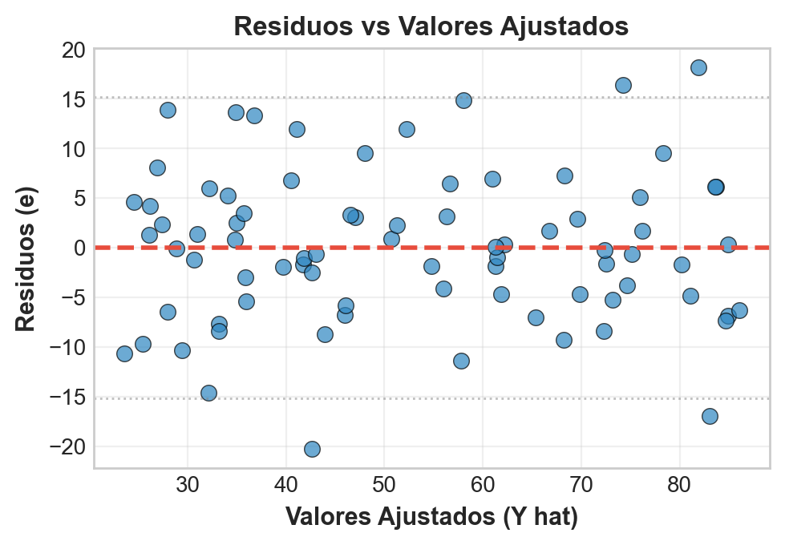
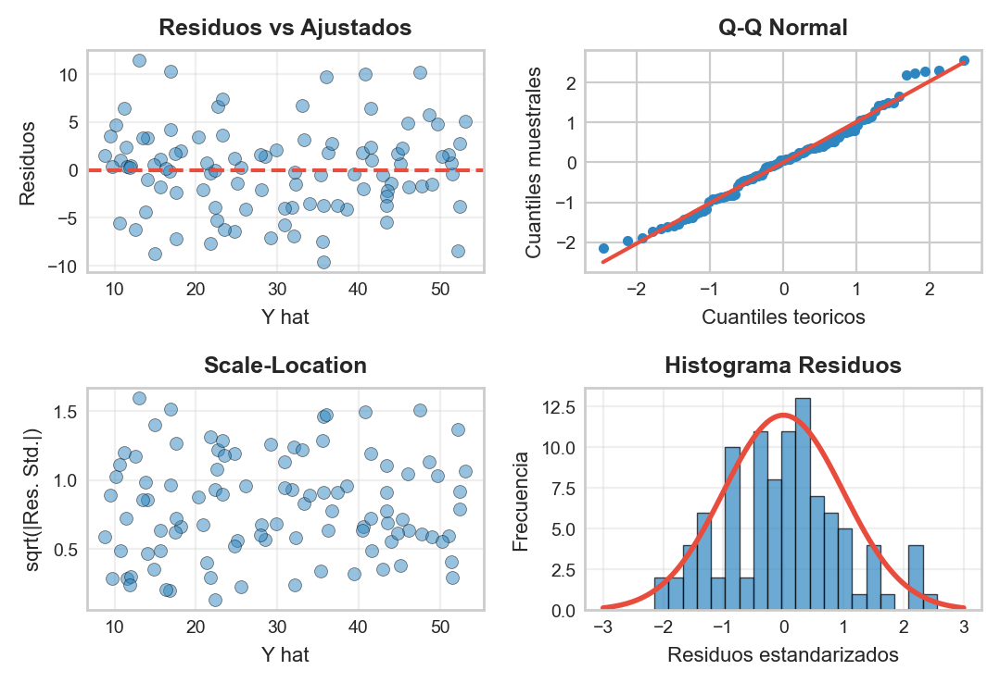

```{r}
#| label: setup
#| echo: false
library(tidyverse)
library(wooldridge)
library(broom)
library(modelsummary)
library(knitr)
library(plotly)
theme_set(theme_minimal(base_size = 13))
azul <- "#1F4E79"; celeste <- "#2E86C1"; rojo <- "#E74C3C"; verde <- "#27AE60"; naranja <- "#F39C12"
data("wage1")
m1 <- lm(wage ~ educ, data = wage1)
m2 <- lm(wage ~ educ + exper + tenure, data = wage1)
d6 <- tibble(educ = c(8, 10, 12, 12, 14, 16),
             salario = c(4, 5, 6, 7, 8, 9)) %>%
  mutate(ajuste = -1.3 + 0.65 * educ, residuo = salario - ajuste)
# En HTML (revealjs) los graficos se vuelven interactivos con plotly;
# en Beamer (PDF) se mantienen estaticos.
es_html <- knitr::is_html_output()
interactivo <- function(p) {
  if (es_html) plotly::config(plotly::ggplotly(p), displayModeBar = FALSE) else p
}
```

## Panorama de la sesión

| Bloque | Concepto clave | Herramienta en R |
|---|---|---|
| Modelo poblacional | $y=\beta_0+\beta_1 x+u$ y el supuesto $\mathbb{E}[u \mid x]=0$ | — |
| Estimación MCO | Derivación completa + ejemplo a mano | `lm()`, `coef()` |
| Bondad de ajuste | $SST=SSE+SSR$, $R^2$ | `summary()$r.squared` |
| Inferencia | $SE$, estadístico $t$, valor-$p$, IC 95% | `broom::tidy()`, `confint()` |
| Lectura de tablas | Anatomía de una tabla de resultados | `modelsummary()` |
| Regresión múltiple | *Ceteris paribus*, sesgo de variable omitida, $\bar{R}^2$, dummies, logaritmos | `lm(y ~ x1 + x2)` |

::: {.callout-note appearance="simple"}
**Datos de trabajo:** `wooldridge::wage1` — 526 trabajadores (EE.UU., 1976): salario por hora (USD), educación, experiencia y antigüedad. **Pregunta empírica ancla:** ¿cuál es el retorno salarial de un año adicional de educación?
:::

## La pregunta ancla: ¿cuánto rinde un año más de educación?

```{r}
#| label: plot-ancla
#| echo: false
#| fig-height: 2.3
p <- ggplot(wage1, aes(x = educ, y = wage)) +
  geom_jitter(width = 0.25, alpha = 0.35, color = celeste, size = 1.6) +
  geom_smooth(method = "lm", se = FALSE, color = rojo, linewidth = 1.1) +
  labs(x = "Educación (años)", y = "Salario por hora (USD)",
       title = "526 trabajadores: la recta MCO resume la nube con pendiente 0.54")
interactivo(p)
```

Para diseñar subsidios a la educación superior o evaluar la gratuidad, necesitamos **cuantificar** esta asociación: la regresión lineal convierte la nube de puntos en **un número interpretable** (la pendiente) con su margen de error.

::: {.callout-tip title="Intuición" appearance="simple"}
La regresión es una máquina de resumir: convierte 526 puntos en una sola frase — "cada año extra de educación viaja con medio dólar más por hora".
:::

## El modelo poblacional de regresión lineal simple

:::: {.columns}

::: {.column width="55%"}
$$y = \beta_0 + \beta_1 x + u$$

- $y$: variable **dependiente** (salario por hora)
- $x$: variable **explicativa** (años de educación)
- $\beta_0$: **intercepto** poblacional — nivel de $y$ cuando $x=0$
- $\beta_1$: **pendiente** poblacional — el parámetro de interés
- $u$: **término de error** — *todo lo demás* que afecta a $y$: habilidad, redes, origen familiar, suerte

Los parámetros $(\beta_0,\beta_1)$ son fijos y **desconocidos**; con la muestra los *estimamos*.
:::

::: {.column width="45%"}
```{r}
#| label: img-scatter
#| echo: false
#| out.width: "100%"
knitr::include_graphics("figuras/scatter_regresion.png")
```

MCO elige la recta que minimiza las **distancias verticales** (segmentos verdes) al cuadrado.
:::

::::

## El supuesto clave: $\mathbb{E}[u \mid x] = 0$

:::: {.columns}

::: {.column width="52%"}
**Definición (media condicional cero).** Para todo valor de $x$:
$$\mathbb{E}[u \mid x] = 0$$

Entonces la recta poblacional **es** la media condicional:
$$
\begin{aligned}
\mathbb{E}[y \mid x] &= \mathbb{E}[\beta_0 + \beta_1 x + u \mid x] \\
&= \beta_0 + \beta_1 x + \mathbb{E}[u \mid x] \\
&= \beta_0 + \beta_1 x
\end{aligned}
$$

**Lectura:** a cada nivel de educación, los factores no observados (habilidad, redes) promedian cero — no están sistemáticamente asociados a $x$. Implica $\operatorname{Cov}(x,u)=0$.
:::

::: {.column width="48%"}
```{r}
#| label: plot-condmean
#| echo: false
#| fig-width: 5
#| fig-height: 3.4
#| out.width: "100%"
set.seed(123)
sim <- tibble(x = rep(seq(8, 16, 2), each = 50)) %>%
  mutate(y = 1 + 0.5 * x + rnorm(n(), 0, 1.1))
medias_c <- sim %>% group_by(x) %>% summarise(y = mean(y))
p <- ggplot(sim, aes(x, y)) +
  geom_jitter(width = 0.25, alpha = 0.25, color = celeste) +
  geom_abline(intercept = 1, slope = 0.5, color = azul, linewidth = 1) +
  geom_point(data = medias_c, color = rojo, size = 3.2) +
  labs(x = "x (años de educación)", y = "y",
       title = "Las medias de y (rojo) caen sobre la recta")
interactivo(p)
```

**Qué significa:** la recta no es un dibujo — es la **esperanza condicional** de $y$ dado $x$.
:::

::::

::: {.content-visible when-format="html"}
::: {.callout-tip title="Intuición" appearance="simple"}
Exigir media condicional cero es pedir que, a cada nivel de educación, la suerte y la habilidad estén repartidas por igual: nada oculto camina junto a la educación.
:::
:::

## $\beta_1$ es una derivada: el efecto marginal

**Definición.** Bajo $\mathbb{E}[u \mid x]=0$, la pendiente es la derivada de la media condicional:
$$\beta_1 = \frac{d\, \mathbb{E}[y \mid x]}{d x} \qquad \Longrightarrow \qquad \Delta \mathbb{E}[y \mid x] = \beta_1 \, \Delta x \ \ \text{(manteniendo } u \text{ fijo)}$$

- Si $\Delta x = 1$: $y$ cambia **en promedio** $\beta_1$ unidades *de* $y$. Las unidades importan: con salario en USD/hora y educación en años, $\beta_1$ se lee en **USD/hora por año**.
- **Linealidad:** el modelo impone que el efecto marginal es el **mismo** en todos los niveles de $x$ (pasar de 8 a 9 años "vale" lo mismo que de 15 a 16).

::: {.callout-tip appearance="simple"}
**Políticas públicas:** si $\beta_1 = 0.54$, un programa que agrega un año de escolaridad se asocia con $+0.54$ USD/hora. Que esa asociación sea un **efecto causal** exige tomarse en serio $\mathbb{E}[u \mid x]=0$ (última parte de la sesión).
:::

## Derivación de MCO (1/3): el problema de minimización

**Definición (estimador MCO).** Dada la muestra $\{(x_i,y_i)\}_{i=1}^{n}$, el estimador de mínimos cuadrados ordinarios resuelve:
$$(\hat{\beta}_0, \hat{\beta}_1) = \arg\min_{b_0,\, b_1} \; Q(b_0, b_1), \qquad Q(b_0,b_1) = \sum_{i=1}^{n} \left(y_i - b_0 - b_1 x_i\right)^2$$

¿Por qué **cuadrados** y no otra cosa?

1. Evitan que errores positivos y negativos se **cancelen** (a diferencia de sumar errores a secas).
2. Penalizan más los errores **grandes** que los pequeños.
3. $Q$ es **diferenciable y convexa** en $(b_0,b_1)$: el mínimo se obtiene con cálculo y tiene **solución cerrada**.

**Qué significa:** buscamos la recta que deja los datos "lo menos mal explicados posible", midiendo el desajuste con la suma de errores al cuadrado.

::: {.callout-tip title="Intuición" appearance="simple"}
La recta MCO es el equilibrio de una varilla apoyada sobre la nube: cada punto tira de ella, y los lejanos tiran mucho más fuerte.
:::

## Derivación de MCO (2/3): condiciones de primer orden

**Paso 1.** Derivamos $Q$ respecto de cada argumento e igualamos a cero:
$$
\begin{aligned}
\frac{\partial Q}{\partial b_0} &= -2 \sum_{i=1}^{n} \left(y_i - b_0 - b_1 x_i\right) = 0 \\[2pt]
\frac{\partial Q}{\partial b_1} &= -2 \sum_{i=1}^{n} x_i \left(y_i - b_0 - b_1 x_i\right) = 0
\end{aligned}
$$

**Paso 2.** Dividiendo por $-2$ y reordenando obtenemos las **ecuaciones normales**:
$$
\begin{aligned}
\sum_{i=1}^{n} y_i &= n\, b_0 + b_1 \sum_{i=1}^{n} x_i \\
\sum_{i=1}^{n} x_i y_i &= b_0 \sum_{i=1}^{n} x_i + b_1 \sum_{i=1}^{n} x_i^2
\end{aligned}
$$

**Qué significa:** en el óptimo, los residuos suman cero y no covarían con $x$ — dos propiedades que MCO impone *por construcción*.

## Derivación de MCO (3/3): resolución del sistema

**Paso 3.** De la primera ecuación normal, dividiendo por $n$: $\;\bar{y} = b_0 + b_1 \bar{x} \Rightarrow b_0 = \bar{y} - b_1 \bar{x}$.

**Paso 4.** Sustituimos $b_0$ en la segunda condición y despejamos $b_1$:
$$
\begin{aligned}
\sum_{i=1}^{n} x_i \left(y_i - \bar{y} + b_1 \bar{x} - b_1 x_i\right) &= 0 \\
\sum_{i=1}^{n} x_i (y_i - \bar{y}) &= b_1 \sum_{i=1}^{n} x_i (x_i - \bar{x}) \\
b_1 &= \frac{\sum_{i=1}^{n} (x_i-\bar{x})(y_i-\bar{y})}{\sum_{i=1}^{n} (x_i-\bar{x})^2}
\end{aligned}
$$
(la última línea usa $\sum x_i(y_i-\bar{y}) = \sum (x_i-\bar{x})(y_i-\bar{y})$, pues $\sum \bar{x}(y_i-\bar{y})=0$; ídem en el denominador).

$$\boxed{\;\hat{\beta}_1 = \frac{\sum (x_i-\bar{x})(y_i-\bar{y})}{\sum (x_i-\bar{x})^2} = \frac{\widehat{\operatorname{Cov}}(x,y)}{\widehat{\operatorname{Var}}(x)}, \qquad \hat{\beta}_0 = \bar{y} - \hat{\beta}_1 \bar{x}\;}$$

**Qué significa:** la pendiente es la covarianza reescalada por la varianza de $x$; exige que $x$ **varíe**.

## Ejemplo a mano (1/3): seis trabajadores

**Enunciado.** Microdatos de $n=6$ trabajadores: $x_i$ = educación (años), $y_i$ = salario por hora (USD). **Paso 1:** medias
$\bar{x} = 72/6 = 12$, $\;\bar{y} = 39/6 = 6.5$.

| $i$ | $x_i$ | $y_i$ | $x_i-\bar{x}$ | $y_i-\bar{y}$ | $(x_i-\bar{x})(y_i-\bar{y})$ | $(x_i-\bar{x})^2$ |
|:-:|:-:|:-:|:-:|:-:|:-:|:-:|
| 1 | 8 | 4 | $-4$ | $-2.5$ | $10$ | $16$ |
| 2 | 10 | 5 | $-2$ | $-1.5$ | $3$ | $4$ |
| 3 | 12 | 6 | $0$ | $-0.5$ | $0$ | $0$ |
| 4 | 12 | 7 | $0$ | $0.5$ | $0$ | $0$ |
| 5 | 14 | 8 | $2$ | $1.5$ | $3$ | $4$ |
| 6 | 16 | 9 | $4$ | $2.5$ | $10$ | $16$ |
| $\sum$ | $72$ | $39$ | $0$ | $0$ | $\mathbf{26}$ | $\mathbf{40}$ |

Las columnas de desvíos suman cero **siempre** (propiedad de la media) — un chequeo aritmético gratis.

## Ejemplo a mano (2/3): cálculo de los estimadores

**Paso 2.** Pendiente — cociente de las dos sumas de la tabla:
$$\hat{\beta}_1 = \frac{\sum (x_i-\bar{x})(y_i-\bar{y})}{\sum (x_i-\bar{x})^2} = \frac{26}{40} = 0.65$$

**Paso 3.** Intercepto — evaluando en las medias:
$$\hat{\beta}_0 = \bar{y} - \hat{\beta}_1 \bar{x} = 6.5 - 0.65 \times 12 = 6.5 - 7.8 = -1.3$$

**Resultado:**
$$\boxed{\;\widehat{salario} = -1.3 + 0.65 \times educ\;}$$

- **Pendiente:** cada año adicional de educación se asocia con $+0.65$ USD/hora de salario, en promedio.
- **Intercepto:** el valor predicho con $educ=0$ es $-1.3$ (¡negativo!). No se interpreta: es una **extrapolación** fuera del soporte de los datos (nadie en la muestra tiene 0 años de educación).

## Ejemplo a mano (3/3): verificación con `lm()` y residuos

:::: {.columns}

::: {.column width="46%"}
```{r}
#| label: ej-lm-mano
d6 <- tibble(
  educ = c(8, 10, 12, 12, 14, 16),
  salario = c(4, 5, 6, 7, 8, 9))
coef(lm(salario ~ educ, data = d6))
```

Coincide **exactamente** con el cálculo manual: $\hat{\beta}_0=-1.3$, $\hat{\beta}_1=0.65$.

Residuos $\hat{u}_i = y_i - \hat{y}_i$:
$$0.1,\, -0.2,\, -0.5,\, 0.5,\, 0.2,\, -0.1$$
$$\sum_{i=1}^{6} \hat{u}_i = 0$$
:::

::: {.column width="54%"}
```{r}
#| label: plot-mano
#| echo: false
#| fig-width: 5.6
#| fig-height: 3.9
#| out.width: "100%"
p <- ggplot(d6 %>% mutate(ajuste = -1.3 + 0.65 * educ),
            aes(x = educ, y = salario)) +
  geom_segment(aes(xend = educ, yend = ajuste),
               color = naranja, linewidth = 0.9) +
  geom_abline(intercept = -1.3, slope = 0.65,
              color = rojo, linewidth = 1.1) +
  geom_point(size = 3, color = azul) +
  labs(x = "Educación (años)", y = "Salario por hora (USD)",
       title = "Recta MCO y residuos (segmentos verticales)")
interactivo(p)
```
:::

::::

## La geometría de MCO: distancias verticales al cuadrado

```{r}
#| label: plot-geometria
#| echo: false
#| fig-height: 3.2
geo <- bind_rows(
  d6 %>% mutate(yhat = -1.3 + 0.65 * educ, recta = "Recta MCO: SSR = 0.60"),
  d6 %>% mutate(yhat = 1 + 0.40 * educ, recta = "Otra recta (1 + 0.40x): SSR = 6.04")) %>%
  mutate(recta = factor(recta, levels = c("Recta MCO: SSR = 0.60",
                                          "Otra recta (1 + 0.40x): SSR = 6.04")))
p <- ggplot(geo, aes(x = educ, y = salario)) +
  geom_segment(aes(xend = educ, yend = yhat), color = naranja, linewidth = 0.8) +
  geom_line(aes(y = yhat), color = rojo, linewidth = 1) +
  geom_point(size = 2.6, color = azul) +
  facet_wrap(~recta) +
  labs(x = "Educación (años)", y = "Salario por hora (USD)")
interactivo(p)
```

MCO minimiza las distancias **verticales** (errores al predecir $y$), no las perpendiculares a la recta. Cualquier otra recta —aquí una con pendiente $0.40$— produce una suma de cuadrados **mayor**: $6.04 > 0.60$.

## Laboratorio: mínimos cuadrados a mano

**Objetivo:** encontrar a mano la recta que minimiza la suma de cuadrados de los residuos $SSR(b_0, b_1)$ para 8 trabajadores.

::: {.content-visible when-format="html"}

Mueva $b_0$ y $b_1$ y trate de igualar el mínimo que alcanza MCO.

```{=html}
<div style="display:flex; gap:1.5em; align-items:center; flex-wrap:wrap; font-size:0.62em; margin-bottom:0.3em;">
  <label>Intercepto b0: <input type="range" id="lab1-b0" min="-6" max="6" step="0.1" value="1.5" style="width:170px; vertical-align:middle;"> <span id="lab1-b0-val"></span></label>
  <label>Pendiente b1: <input type="range" id="lab1-b1" min="-0.2" max="1.4" step="0.01" value="0.3" style="width:170px; vertical-align:middle;"> <span id="lab1-b1-val"></span></label>
</div>
<div id="lab1-plot" style="width:100%; height:400px;"></div>
<div id="lab1-lectura" style="font-size:0.6em; color:#1F4E79; font-weight:600;"></div>
<script>
(function() {
  var xs = [8, 9, 10, 11, 12, 13, 14, 16];
  var ys = [4.5, 4.0, 6.0, 5.2, 6.8, 6.4, 8.2, 8.6];
  var n = xs.length;
  var xbar = 0, ybar = 0;
  for (var i = 0; i < n; i++) { xbar += xs[i]; ybar += ys[i]; }
  xbar /= n; ybar /= n;
  var sxy = 0, sxx = 0;
  for (i = 0; i < n; i++) { sxy += (xs[i] - xbar) * (ys[i] - ybar); sxx += (xs[i] - xbar) * (xs[i] - xbar); }
  var b1opt = sxy / sxx, b0opt = ybar - b1opt * xbar, ssrOpt = 0;
  for (i = 0; i < n; i++) { var e = ys[i] - b0opt - b1opt * xs[i]; ssrOpt += e * e; }
  function dibujar() {
    var b0 = parseFloat(document.getElementById('lab1-b0').value);
    var b1 = parseFloat(document.getElementById('lab1-b1').value);
    document.getElementById('lab1-b0-val').textContent = b0.toFixed(1);
    document.getElementById('lab1-b1-val').textContent = b1.toFixed(2);
    var ssr = 0, rx = [], ry = [];
    for (var i = 0; i < n; i++) {
      var yhat = b0 + b1 * xs[i], res = ys[i] - yhat;
      ssr += res * res;
      rx.push(xs[i], xs[i], null);
      ry.push(ys[i], yhat, null);
    }
    Plotly.react('lab1-plot', [
      {x: rx, y: ry, mode: 'lines', line: {color: '#F39C12', width: 2}, hoverinfo: 'skip', name: 'Residuos'},
      {x: [7, 17], y: [b0 + 7 * b1, b0 + 17 * b1], mode: 'lines', line: {color: '#E74C3C', width: 3}, name: 'Recta candidata'},
      {x: xs, y: ys, mode: 'markers', marker: {color: '#1F4E79', size: 9}, name: 'Datos'}
    ], {margin: {t: 10, r: 20, b: 40, l: 50},
        xaxis: {range: [7, 17], title: {text: 'Educación (años)'}},
        yaxis: {range: [1, 12], title: {text: 'Salario por hora (USD)'}},
        showlegend: false},
       {displayModeBar: false});
    var brecha = ssr - ssrOpt;
    document.getElementById('lab1-lectura').textContent =
      'SSR(b0, b1) = ' + ssr.toFixed(2) + '   |   Minimo MCO: SSR = ' + ssrOpt.toFixed(2) +
      ' (b0 = ' + b0opt.toFixed(2) + ', b1 = ' + b1opt.toFixed(2) + ')   |   Exceso sobre el minimo: ' + brecha.toFixed(2);
  }
  function init() {
    if (typeof Plotly === 'undefined') { setTimeout(init, 200); return; }
    ['lab1-b0', 'lab1-b1'].forEach(function(id) { document.getElementById(id).addEventListener('input', dibujar); });
    dibujar();
  }
  if (document.readyState === 'complete') { init(); } else { window.addEventListener('load', init); }
})();
</script>
```

:::

::: {.content-visible unless-format="html"}

```{r}
#| label: lab1-pdf
#| echo: false
#| fig-height: 2.7
d8 <- tibble(x = c(8, 9, 10, 11, 12, 13, 14, 16),
             y = c(4.5, 4.0, 6.0, 5.2, 6.8, 6.4, 8.2, 8.6))
m8 <- lm(y ~ x, data = d8)
d8 <- d8 %>% mutate(yhat = fitted(m8))
p <- ggplot(d8, aes(x, y)) +
  geom_segment(aes(xend = x, yend = yhat), color = naranja, linewidth = 0.9) +
  geom_abline(intercept = coef(m8)[1], slope = coef(m8)[2], color = rojo, linewidth = 1.1) +
  geom_point(color = azul, size = 2.8) +
  labs(x = "Educación (años)", y = "Salario por hora (USD)",
       title = "La recta ganadora: -0.46 + 0.57x, con SSR = 2.49")
p
```

En la versión HTML se mueven $b_0$ y $b_1$ con deslizadores: cualquier otra recta deja un $SSR$ mayor que $2.49$, el mínimo que MCO alcanza de una sola vez con las fórmulas.

:::

## Propiedades algebraicas de la recta MCO

Tres propiedades que valen **siempre** (con intercepto en el modelo), sea cual sea la muestra:

**P1.** $\displaystyle\sum_{i=1}^{n} \hat{u}_i = 0$ — los residuos suman cero. **P2.** $\displaystyle\sum_{i=1}^{n} x_i \hat{u}_i = 0$ — los residuos no están correlacionados con $x$. **P3.** La recta pasa por el punto de medias: $\hat{\beta}_0 + \hat{\beta}_1 \bar{x} = \bar{y}$.

**Demostración de P1** (directa desde la primera CPO evaluada en el óptimo):
$$
\begin{aligned}
\left.\frac{\partial Q}{\partial b_0}\right|_{(\hat{\beta}_0,\hat{\beta}_1)} = -2\sum_{i=1}^{n} \left(y_i - \hat{\beta}_0 - \hat{\beta}_1 x_i\right) &= 0 \\
\Longrightarrow \; \sum_{i=1}^{n} \hat{u}_i &= 0 \qquad \blacksquare
\end{aligned}
$$
P2 es la segunda CPO; P3 es la definición de $\hat{\beta}_0$ reordenada. En el ejemplo a mano: $0.1-0.2-0.5+0.5+0.2-0.1=0$.

**Qué significa:** el residuo promedio nulo es **construcción algebraica**, no evidencia de que el modelo sea bueno.

## Valores ajustados y residuos: notación formal

:::: {.columns}

::: {.column width="52%"}
**Definiciones.** Para cada observación $i$:
$$\hat{y}_i = \hat{\beta}_0 + \hat{\beta}_1 x_i \qquad \text{(valor ajustado)}$$
$$\hat{u}_i = y_i - \hat{y}_i \qquad \text{(residuo)}$$

Toda observación se descompone en parte explicada y no explicada:
$$y_i = \hat{y}_i + \hat{u}_i$$

::: {.callout-important appearance="simple"}
No confundir: $u_i$ es el **error poblacional** (no observable); $\hat{u}_i$ es el **residuo muestral** (calculable). $\hat{u}_i$ estima a $u_i$, no son lo mismo.
:::
:::

::: {.column width="48%"}
```{r}
#| label: img-residuos
#| echo: false
#| out.width: "96%"

```

El gráfico residuos vs ajustados: media cero en toda la banda y **sin patrón** — así se ve un ajuste lineal razonable.
:::

::::

## Bondad de ajuste (1): la descomposición de la varianza

**Definiciones.** Tres sumas de cuadrados:
$$SST = \sum_{i=1}^{n} (y_i - \bar{y})^2, \qquad SSE = \sum_{i=1}^{n} (\hat{y}_i - \bar{y})^2, \qquad SSR = \sum_{i=1}^{n} \hat{u}_i^2$$

**Teorema (descomposición).** Con intercepto en el modelo:
$$SST = SSE + SSR$$
La clave de la prueba es que el término cruzado $\sum (\hat{y}_i - \bar{y})\hat{u}_i$ se anula por **P1 y P2** ($\sum \hat{u}_i = \sum x_i\hat{u}_i = 0$).

**Definición ($R^2$).** La fracción de la variación muestral de $y$ explicada linealmente por $x$:
$$R^2 = \frac{SSE}{SST} = 1 - \frac{SSR}{SST}, \qquad 0 \le R^2 \le 1$$

**Qué significa:** la variación total de $y$ se reparte —sin traslape— entre lo que la recta captura y lo que queda en los residuos. Cuidado con la notación: en Wooldridge $SSE$ es la *explicada* y $SSR$ la *residual*; otros textos invierten los nombres.

::: {.content-visible when-format="html"}
::: {.callout-tip title="Intuición" appearance="simple"}
Piense en la variación del salario como una torta: la recta se sirve una porción (lo explicado) y deja el resto en el plato de los residuos. El R cuadrado solo dice qué fracción de la torta se sirvió.
:::
:::

## Bondad de ajuste (2): qué mide y qué NO mide $R^2$

:::: {.columns}

::: {.column width="48%"}
```{r}
#| label: img-r2
#| echo: false
#| out.width: "100%"
knitr::include_graphics("figuras/r_cuadrado.png")
```
:::

::: {.column width="52%"}
**$R^2$ mide:** qué proporción de la varianza de $y$ captura la recta; qué tan cerca de ella caen los puntos.

**$R^2$ NO mide:**

- **Causalidad**: un $R^2$ alto no valida $\mathbb{E}[u \mid x]=0$.
- **Magnitud** del efecto: $\hat{\beta}_1$ puede ser grande y preciso con $R^2$ bajo.
- **Corrección** del modelo: puede faltar una curva, un control, etc.

::: {.callout-tip appearance="simple"}
Con microdatos de personas, $R^2$ de $0.1$ a $0.3$ es lo **normal** (en `wage1`: $0.165$). El salario depende de mucho más que la educación — eso no invalida el retorno estimado.
:::
:::

::::

## Bondad de ajuste (3): $R^2$ del ejemplo a mano, paso a paso

:::: {.columns}

::: {.column width="55%"}
**Paso 1.** $SST = \sum (y_i-\bar{y})^2$:
$$6.25 + 2.25 + 0.25 + 0.25 + 2.25 + 6.25 = 17.5$$

**Paso 2.** $SSR = \sum \hat{u}_i^2$:
$$0.01 + 0.04 + 0.25 + 0.25 + 0.04 + 0.01 = 0.60$$

**Paso 3.** $SSE = SST - SSR = 17.5 - 0.60 = 16.9$

**Paso 4.**
$$\boxed{\;R^2 = \frac{16.9}{17.5} = 0.966\;}$$

```{r}
#| label: ej-r2-mano
round(summary(lm(salario ~ educ, d6))$r.squared, 4)
```
:::

::: {.column width="45%"}
```{r}
#| label: plot-descomp
#| echo: false
#| fig-width: 5
#| fig-height: 3.2
#| out.width: "100%"
p <- tibble(
  comp = factor(c("SST (total)", "SSE (explicada)", "SSR (residual)"),
                levels = c("SSR (residual)", "SSE (explicada)", "SST (total)")),
  valor = c(17.5, 16.9, 0.6)) %>%
  ggplot(aes(x = valor, y = comp, fill = comp)) +
  geom_col(width = 0.55, show.legend = FALSE) +
  geom_text(aes(label = valor), hjust = -0.2, size = 4.5, color = azul) +
  scale_fill_manual(values = c(naranja, verde, celeste)) +
  scale_x_continuous(limits = c(0, 21)) +
  labs(x = "Suma de cuadrados", y = NULL,
       title = "17.5 = 16.9 + 0.6")
interactivo(p)
```

La educación "explica" el 96.6% de la varianza salarial **en estos 6 casos artificiales** — en datos reales la cifra cae drásticamente.
:::

::::

## Laboratorio: ruido y $R^2$

**Experimento:** el modelo verdadero es siempre $y = 2 + 0.5x + u$; solo cambia el ruido $\sigma$. ¿Qué le pasa al $R^2$?

::: {.content-visible when-format="html"}

Suba $\sigma$ y cambie la semilla: la recta MCO sigue cerca de la verdadera, pero el $R^2$ se desploma.

```{=html}
<div style="display:flex; gap:1.5em; align-items:center; flex-wrap:wrap; font-size:0.62em; margin-bottom:0.3em;">
  <label>Ruido sigma: <input type="range" id="lab2-sigma" min="0.5" max="8" step="0.1" value="1.5" style="width:170px; vertical-align:middle;"> <span id="lab2-sigma-val"></span></label>
  <label>Semilla (nueva muestra): <input type="range" id="lab2-seed" min="1" max="30" step="1" value="7" style="width:170px; vertical-align:middle;"> <span id="lab2-seed-val"></span></label>
</div>
<div id="lab2-plot" style="width:100%; height:400px;"></div>
<div id="lab2-lectura" style="font-size:0.6em; color:#1F4E79; font-weight:600;"></div>
<script>
(function() {
  function mulberry32(a) {
    return function() {
      a |= 0; a = a + 0x6D2B79F5 | 0;
      var t = Math.imul(a ^ a >>> 15, 1 | a);
      t = t + Math.imul(t ^ t >>> 7, 61 | t) ^ t;
      return ((t ^ t >>> 14) >>> 0) / 4294967296;
    };
  }
  function dibujar() {
    var sigma = parseFloat(document.getElementById('lab2-sigma').value);
    var seed = parseInt(document.getElementById('lab2-seed').value, 10);
    document.getElementById('lab2-sigma-val').textContent = sigma.toFixed(1);
    document.getElementById('lab2-seed-val').textContent = seed;
    var rand = mulberry32(seed * 9301 + 49297);
    var n = 80, xs = [], ys = [];
    for (var i = 0; i < n; i++) {
      var x = 10 * rand();
      var u1 = rand(); if (u1 < 1e-12) { u1 = 1e-12; }
      var u2 = rand();
      var z = Math.sqrt(-2 * Math.log(u1)) * Math.cos(2 * Math.PI * u2);
      xs.push(x);
      ys.push(2 + 0.5 * x + sigma * z);
    }
    var xbar = 0, ybar = 0;
    for (i = 0; i < n; i++) { xbar += xs[i]; ybar += ys[i]; }
    xbar /= n; ybar /= n;
    var sxy = 0, sxx = 0;
    for (i = 0; i < n; i++) { sxy += (xs[i] - xbar) * (ys[i] - ybar); sxx += (xs[i] - xbar) * (xs[i] - xbar); }
    var b1 = sxy / sxx, b0 = ybar - b1 * xbar;
    var ssr = 0, sst = 0;
    for (i = 0; i < n; i++) {
      var e = ys[i] - b0 - b1 * xs[i]; ssr += e * e;
      var d = ys[i] - ybar; sst += d * d;
    }
    var r2 = 1 - ssr / sst;
    var r2teo = 2.083 / (2.083 + sigma * sigma);
    Plotly.react('lab2-plot', [
      {x: xs, y: ys, mode: 'markers', marker: {color: '#2E86C1', size: 6, opacity: 0.65}, name: 'Muestra'},
      {x: [0, 10], y: [2, 7], mode: 'lines', line: {color: '#1F4E79', width: 2, dash: 'dash'}, name: 'Recta verdadera'},
      {x: [0, 10], y: [b0, b0 + 10 * b1], mode: 'lines', line: {color: '#E74C3C', width: 3}, name: 'Recta MCO'}
    ], {margin: {t: 10, r: 20, b: 40, l: 50},
        xaxis: {range: [0, 10], title: {text: 'x'}},
        yaxis: {range: [-20, 30], title: {text: 'y'}},
        legend: {orientation: 'h', y: 1.08, font: {size: 10}}},
       {displayModeBar: false});
    document.getElementById('lab2-lectura').textContent =
      'Recta MCO: y = ' + b0.toFixed(2) + ' + ' + b1.toFixed(2) + 'x   |   R2 muestral = ' + r2.toFixed(3) +
      '   |   R2 teorico con este sigma = ' + r2teo.toFixed(3);
  }
  function init() {
    if (typeof Plotly === 'undefined') { setTimeout(init, 200); return; }
    ['lab2-sigma', 'lab2-seed'].forEach(function(id) { document.getElementById(id).addEventListener('input', dibujar); });
    dibujar();
  }
  if (document.readyState === 'complete') { init(); } else { window.addEventListener('load', init); }
})();
</script>
```

:::

::: {.content-visible unless-format="html"}

```{r}
#| label: lab2-pdf
#| echo: false
#| fig-height: 2.7
set.seed(7)
sim2 <- purrr::map_dfr(c(1, 6), function(s) {
  x <- runif(80, 0, 10)
  y <- 2 + 0.5 * x + rnorm(80, 0, s)
  r2 <- summary(lm(y ~ x))$r.squared
  tibble(x, y, panel = sprintf("DE del error = %.0f:  R2 = %.2f", s, r2))
})
p <- ggplot(sim2, aes(x, y)) +
  geom_point(color = celeste, alpha = 0.55, size = 1.5) +
  geom_abline(intercept = 2, slope = 0.5, color = azul, linetype = "dashed") +
  geom_smooth(method = "lm", se = FALSE, color = rojo, linewidth = 1) +
  facet_wrap(~panel) +
  labs(x = "x", y = "y")
p
```

Mismo modelo verdadero, distinto ruido: con más varianza del error el $R^2$ cae de $0.74$ a $0.02$, aunque la recta MCO (roja) siga pegada a la verdadera (azul). Un $R^2$ bajo **no** dice que el modelo esté mal.

:::

## Inferencia (1): error estándar y estadístico $t$

:::: {.columns}

::: {.column width="55%"}
Bajo homocedasticidad ($\operatorname{Var}(u \mid x) = \sigma^2$), el error estándar de la pendiente es:
$$\operatorname{SE}(\hat{\beta}_1) = \sqrt{\frac{\hat{\sigma}^2}{\sum (x_i-\bar{x})^2}}, \qquad \hat{\sigma}^2 = \frac{SSR}{n-2}$$

Para contrastar $H_0\!: \beta_1 = 0$ (la educación no se asocia al salario):
$$t = \frac{\hat{\beta}_1 - 0}{\operatorname{SE}(\hat{\beta}_1)} \;\sim\; t_{n-2} \ \text{bajo } H_0$$

Rechazamos al 5% si $|t| > t^{*} \approx 1.96$ (con $n$ grande). El $SE$ **cae** con: más observaciones, más varianza de $x$, menos ruido $\sigma^2$.
:::

::: {.column width="45%"}
```{r}
#| label: plot-tdist
#| echo: false
#| fig-width: 5
#| fig-height: 3.4
#| out.width: "100%"
tt <- tibble(x = seq(-4, 4, 0.02), dens = dt(x, df = 524))
p <- ggplot(tt, aes(x, dens)) +
  geom_area(data = filter(tt, x <= -1.9645), fill = rojo, alpha = 0.55) +
  geom_area(data = filter(tt, x >= 1.9645), fill = rojo, alpha = 0.55) +
  geom_line(color = azul, linewidth = 1) +
  annotate("text", x = -3, y = 0.09, label = "2.5%", color = rojo, size = 4.5) +
  annotate("text", x = 3, y = 0.09, label = "2.5%", color = rojo, size = 4.5) +
  annotate("text", x = 2.6, y = 0.3, label = "t observado = 10.2\n(muy fuera de escala)",
           color = azul, size = 3.6) +
  labs(x = "t", y = "Densidad",
       title = "t con 524 g.l.: rechazo si |t| > 1.96")
interactivo(p)
```

**Qué significa:** el valor-$p$ es la probabilidad de un $t$ tan extremo como el observado **si** $\beta_1$ fuera 0.
:::

::::

::: {.content-visible when-format="html"}
::: {.callout-tip title="Intuición" appearance="simple"}
El error estándar mide cuánto "bailaría" la pendiente si repitiéramos el muestreo una y otra vez; el estadístico t pregunta a cuántos pasos de ese baile está el cero.
:::
:::

## Inferencia (2): IC 95% del retorno a la educación, paso a paso

Modelo $wage = \beta_0 + \beta_1\, educ + u$ con `wage1` ($n = 526$). Todo con la salida de `lm()`:

$$
\begin{aligned}
\textbf{Paso 1 } (SE): \quad & \hat{\sigma}^2 = \tfrac{SSR}{n-2} = \tfrac{5980.7}{524} = 11.41; \quad \operatorname{SE}(\hat{\beta}_1) = \sqrt{\tfrac{11.41}{4025.4}} = 0.0532 \\
\textbf{Paso 2 } (t): \quad & t = \tfrac{0.5414}{0.0532} = 10.17 \gg 1.96 \;\Rightarrow\; \text{se rechaza } H_0\!:\beta_1 = 0,\; p < 0.001 \\
\textbf{Paso 3 } (t^{*}): \quad & t^{*} = t_{0.975,\,524} = 1.9645 \\
\textbf{Paso 4 } (IC): \quad & 0.5414 \pm 1.9645 \times 0.0532 \;\Rightarrow\; \boxed{IC_{95\%} = [0.437,\; 0.646]}
\end{aligned}
$$

```{r}
#| label: ej-ic-wage
tidy(m1, conf.int = TRUE) %>% filter(term == "educ") %>%
  select(term, estimate, std.error, statistic, conf.low, conf.high) %>% kable(digits = 4)
```

**Lectura:** con 95% de confianza, el retorno está entre $0.44$ y $0.65$ USD/hora por año — excluye el cero con holgura.

## La tabla de resultados: el formato estándar

```{r}
#| label: tabla-modelos
#| echo: false
m3 <- lm(wage ~ educ + exper + tenure + female, data = wage1)
modelsummary(list("(1) Salario" = m1, "(2) Salario" = m2, "(3) Salario" = m3),
             output = "markdown", fmt = 3,
             stars = c("+" = 0.1, "*" = 0.05, "**" = 0.01, "***" = 0.001),
             estimate = "{estimate}{stars}",
             coef_rename = c(educ = "Educación (años)", exper = "Experiencia (años)",
                             tenure = "Antigüedad (años)", female = "Mujer (dummy)",
                             "(Intercept)" = "Constante"),
             gof_map = c("nobs", "r.squared", "adj.r.squared"))
```

Estrellas: `+` $p<0.1$, `*` $p<0.05$, `**` $p<0.01$, `***` $p<0.001$; (error estándar) entre paréntesis.

::: {.content-visible when-format="html"}
Cada columna es un modelo: el (2) agrega experiencia y antigüedad como controles; el (3) suma la dummy de género — es la tabla multivariada típica de cualquier paper.
:::

::: {.content-visible when-format="html"}
::: {.callout-tip title="Intuición" appearance="simple"}
Una tabla de regresión es un parte médico: el coeficiente es el diagnóstico (cuánto), el error estándar es la letra chica (con qué certeza) y las estrellas son solo el semáforo de esa certeza.
:::
:::

## Anatomía de la tabla: qué es cada número — modelo (1)

| Número | Qué es | Cómo se lee |
|---|---|---|
| $0.541$ | Coeficiente $\hat{\beta}_{educ}$ | $+0.54$ USD/hora por año adicional, en promedio |
| $(0.053)$ | Error estándar | Precisión: DE de $\hat{\beta}$ entre muestras |
| $0.541/0.053 = 10.17$ | Estadístico $t$ (implícito) | A cuántos $SE$ está $\hat{\beta}$ de cero |
| $p < 0.001$, `***` | Valor-$p$ y estrellas | Prob. de un $t$ tan extremo si $\beta_{educ}=0$ |
| $526$ | $n$ (Num.Obs.) | Tamaño muestral que sostiene la inferencia |
| $0.165$ | $R^2$ | 16.5% de la varianza salarial explicada |

::: {.callout-important appearance="simple"}
Estrellas: `+` $p<0.1$, `*` $p<0.05$, `**` $p<0.01$, `***` $p<0.001$. La constante ($-0.905$, $t=-1.32$) no es significativa ni interpretable aquí.
:::

## Lectura guiada: cinco preguntas a toda tabla

| # | Pregunta | Dónde mirar | Respuesta: educación, modelo (2) |
|:-:|---|---|---|
| 1 | ¿**Cuánto**? | Coeficiente | $+0.599$ USD/hora por año, *ceteris paribus* |
| 2 | ¿Es **preciso**? | $SE$ e IC 95% | $SE=0.051 \Rightarrow IC \approx [0.498,\, 0.700]$ |
| 3 | ¿Es **significativo**? | $t$, valor-$p$, estrellas | $t = 0.599/0.051 = 11.7$; `***`: $p<0.001$ |
| 4 | ¿**Cuánto explica**? | $R^2$ | $0.306$: un 30.6% de la varianza |
| 5 | ¿Con **qué datos**? | Num.Obs., muestra | $n=526$, corte transversal 1976 |

**El orden importa:** primero magnitud y unidades (1), después precisión (2) y solo entonces significancia (3). Leer las estrellas antes que las unidades es el error más común en informes de política.

## Regresión múltiple: formulación y *ceteris paribus*

**Definición (modelo lineal múltiple).** Con $k$ regresores:
$$y = \beta_0 + \beta_1 x_1 + \beta_2 x_2 + \cdots + \beta_k x_k + u, \qquad \mathbb{E}[u \mid x_1, \dots, x_k] = 0$$

**Interpretación formal (derivada parcial).** Cada coeficiente es un efecto *ceteris paribus*:
$$\beta_j = \frac{\partial\, \mathbb{E}[y \mid x_1,\dots,x_k]}{\partial x_j} \qquad \text{— manteniendo fijos los demás } x_{\ell},\ \ell \neq j$$

En nuestro ejemplo: $wage = \beta_0 + \beta_1\, educ + \beta_2\, exper + \beta_3\, tenure + u$. Ahora $\beta_1$ compara personas con **la misma** experiencia y antigüedad que difieren en un año de educación.

**Qué significa:** agregar controles cambia la pregunta — de "¿ganan más los más educados?" (comparación bruta) a "¿gana más el más educado **entre personas comparables** en lo observable?".

::: {.callout-tip title="Intuición" appearance="simple"}
Controlar es comparar manzanas con manzanas: la pendiente de educación ya no mezcla novatos con veteranos, sino que compara personas con la misma experiencia y antigüedad.
:::

## Corto vs largo: qué cambia al agregar controles

:::: {.columns}

::: {.column width="50%"}
**Paso 1.** Modelo corto: $\hat{\beta}_{educ} = 0.541$ — compara personas cualesquiera.

**Paso 2.** Modelo largo: $\hat{\beta}_{educ} = 0.599$ — compara a igual experiencia y antigüedad.

**Paso 3.** ¿Por qué **sube**? En estos datos educación y experiencia se correlacionan *negativamente* (quien estudió más lleva menos años trabajando). El modelo corto mezclaba el retorno a la educación con la "penalización" por menor experiencia.

**Paso 4.** $R^2$: $0.165 \to 0.306$; el $SE$ de educación casi no cambia ($0.053 \to 0.051$).
:::

::: {.column width="50%"}
```{r}
#| label: plot-coefplot
#| echo: false
#| fig-width: 5
#| fig-height: 3.3
#| out.width: "100%"
cc <- bind_rows(
  tidy(m1, conf.int = TRUE) %>% filter(term == "educ") %>% mutate(modelo = "(1) corto"),
  tidy(m2, conf.int = TRUE) %>% filter(term == "educ") %>% mutate(modelo = "(2) largo"))
p <- ggplot(cc, aes(x = estimate, y = modelo)) +
  geom_vline(xintercept = 0, linetype = "dashed", color = "grey50") +
  geom_segment(aes(x = conf.low, xend = conf.high, yend = modelo),
               color = celeste, linewidth = 1.2) +
  geom_point(size = 3.4, color = azul) +
  scale_x_continuous(limits = c(0, 0.75)) +
  labs(x = "Coeficiente de educación (USD/hora por año), IC 95%",
       y = NULL, title = "El retorno estimado sube de 0.54 a 0.60")
interactivo(p)
```

**Qué significa:** los coeficientes **cambian de definición** al cambiar el conjunto de controles; por eso toda tabla seria muestra varias columnas.
:::

::::

## El álgebra del cambio: sesgo de variable omitida

**Resultado (fórmula del sesgo de variable omitida).** Si el modelo verdadero es $y = \beta_0 + \beta_1 x_1 + \beta_2 x_2 + u$ pero se estima el modelo corto omitiendo $x_2$, entonces:

$$\hat{\beta}_1^{\,corto} = \hat{\beta}_1^{\,largo} + \hat{\beta}_2^{\,largo} \cdot \hat{\delta}_1, \qquad \text{donde } \hat{\delta}_1 \text{ es la pendiente de } x_2 \text{ sobre } x_1$$

**Verificación paso a paso** con $wage$ ($x_1 = educ$, $x_2 = exper$):

$$\begin{aligned}
\hat{\beta}_1^{\,corto} &= \hat{\beta}_1^{\,largo} + \hat{\beta}_{exper} \cdot \hat{\delta}_1 && \text{(fórmula)} \\[1pt]
&= 0.6443 + (0.0701)(-1.4682) && \text{(los tres números salen de \texttt{lm()})} \\[1pt]
&= 0.6443 - 0.1029 = 0.5414 && \checkmark \text{ coincide exactamente con el corto}
\end{aligned}$$

**Qué significa:** la diferencia entre el modelo corto y el largo no es un misterio empírico — es un número con fórmula: el efecto de la variable omitida sobre $y$ multiplicado por cuánto se mueve esa variable con $x_1$.

## La dirección del sesgo: cuatro casos

| Signo de $\beta_2$ | Corr($x_1, x_2$) | Sesgo del modelo corto |
|:--:|:--:|:--|
| $+$ | $+$ | Sobreestima ($\hat{\beta}_1$ demasiado grande) |
| $+$ | $-$ | Subestima — **nuestro caso**: $\beta_{exper}>0$, corr $=-0.30$ |
| $-$ | $+$ | Subestima |
| $-$ | $-$ | Sobreestima |

**Lectura del caso:** experiencia paga ($\beta_{exper} > 0$) y se correlaciona negativamente con educación (corr $=-0.30$): el corto le descuenta a la educación la experiencia que "le falta" a los más educados, y por eso subestima el retorno (0.54 en vez de 0.64).

::: {.content-visible when-format="html"}
::: {.callout-tip title="Intuición" appearance="simple"}
Antes de correr una sola regresión ya se puede anticipar hacia dónde miente el modelo corto: basta razonar el signo del efecto omitido y el de su correlación con la variable de interés.
:::
:::

## $R^2$ ajustado: penalizar la complejidad

El $R^2$ **nunca baja** al agregar regresores (aunque sean irrelevantes). El $R^2$ ajustado corrige por los grados de libertad consumidos:

$$\bar{R}^2 = 1 - (1 - R^2)\,\frac{n-1}{n-k-1}$$

**Cálculo paso a paso** para el modelo (2) ($R^2 = 0.3064$, $n = 526$, $k = 3$):

$$\bar{R}^2 = 1 - (1 - 0.3064) \cdot \frac{525}{522} = 1 - 0.6936 \times 1.00575 = 0.3024$$

- Si un regresor nuevo no aporta, $R^2$ sube marginalmente pero $\bar{R}^2$ **puede bajar**: la penalización $\frac{n-1}{n-k-1}$ crece con cada $k$ adicional.
- Sirve para comparar modelos con distinto número de regresores sobre la **misma** $y$ y la misma muestra; no se interpreta como proporción de varianza.

::: {.content-visible when-format="html"}
::: {.callout-tip title="Intuición" appearance="simple"}
El $R^2$ premia agregar variables como un examen que regala puntos por escribir más; el ajustado descuenta por cada página extra: solo sube si lo nuevo realmente explica.
:::
:::

## Hacia Métodos Cuantitativos: la notación matricial

Apilando las $n$ observaciones, el modelo múltiple se escribe en forma compacta:
$$\mathbf{y} = \mathbf{X}\boldsymbol{\beta} + \mathbf{u}, \qquad \mathbf{y} \in \mathbb{R}^{n},\quad \mathbf{X} \in \mathbb{R}^{n \times (k+1)},\quad \boldsymbol{\beta} \in \mathbb{R}^{k+1}$$

y el estimador MCO tiene la misma lógica que hoy — ecuaciones normales $\mathbf{X}'(\mathbf{y} - \mathbf{X}\hat{\boldsymbol{\beta}}) = \mathbf{0}$ — resueltas en bloque:
$$\hat{\boldsymbol{\beta}} = (\mathbf{X}'\mathbf{X})^{-1}\mathbf{X}'\mathbf{y}$$

- Es la **generalización exacta** de lo que derivamos: con $k=1$, esa fórmula reproduce $\hat{\beta}_1 = \widehat{\operatorname{Cov}}/\widehat{\operatorname{Var}}$ y $\hat{\beta}_0 = \bar{y}-\hat{\beta}_1\bar{x}$. Las condiciones $\sum\hat{u}_i = 0$ y $\sum x_{ij}\hat{u}_i = 0$ son las filas de $\mathbf{X}'\hat{\mathbf{u}} = \mathbf{0}$.
- `lm()` resuelve exactamente este sistema (con descomposición QR, no invirtiendo la matriz).

::: {.callout-note appearance="simple"}
En **Métodos Cuantitativos** verán su derivación formal, el teorema de Gauss-Markov (cuándo MCO es el mejor estimador lineal insesgado) y qué pasa cuando los supuestos fallan. Hoy basta con reconocer la fórmula.
:::

## Leer una dummy: la brecha salarial de género

:::: {.columns}

::: {.column width="52%"}
Con $female \in \{0,1\}$, el modelo $wage = \delta_0 + \delta_1\, female + u$ compara **medias de grupo**:
$$
\begin{aligned}
\mathbb{E}[wage \mid female=0] &= \delta_0 \\
\mathbb{E}[wage \mid female=1] &= \delta_0 + \delta_1 \\
\Rightarrow\; \delta_1 &= \text{diferencia de medias}
\end{aligned}
$$

```{r}
#| label: ej-dummy
round(coef(lm(wage ~ female, wage1)), 2)
```

**Paso 1:** $\hat{\delta}_0 = 7.10$ = salario medio de los hombres. **Paso 2:** $\hat{\delta}_1 = -2.51$ ($SE=0.30$, $t=-8.28$): las mujeres ganan en promedio $2.51$ USD/hora **menos**; media mujeres $= 7.10 - 2.51 = 4.59$. **Paso 3:** con controles (educ, exper, tenure) la brecha *no explicada* es $-1.81$ ($SE=0.26$).
:::

::: {.column width="48%"}
```{r}
#| label: plot-dummy
#| echo: false
#| fig-width: 5
#| fig-height: 3.6
#| out.width: "100%"
dsex <- wage1 %>%
  mutate(sexo = if_else(female == 1, "Mujeres", "Hombres"))
medias_s <- dsex %>% group_by(sexo) %>%
  summarise(wage = mean(wage))
p <- ggplot(dsex, aes(x = sexo, y = wage)) +
  geom_jitter(width = 0.18, alpha = 0.25, color = celeste, size = 1.4) +
  geom_point(data = medias_s, color = rojo, size = 4) +
  annotate("text", x = 1, y = 9.6, label = "media = 7.10", color = rojo, size = 4.2) +
  annotate("text", x = 2, y = 7.1, label = "media = 4.59", color = rojo, size = 4.2) +
  coord_cartesian(ylim = c(0, 15)) +
  labs(x = NULL, y = "Salario por hora (USD)",
       title = "La dummy estima la brecha de medias: -2.51")
interactivo(p)
```

**Qué significa:** el coeficiente de una dummy siempre se lee **respecto de la categoría de referencia** (aquí, hombres).
:::

::::

::: {.content-visible when-format="html"}
::: {.callout-tip title="Intuición" appearance="simple"}
Una dummy parte la muestra en dos grupos y su coeficiente es, simplemente, la distancia entre las dos medias: la regresión más sencilla del mundo es una comparación de promedios.
:::
:::

## Semi-elasticidad: leer $\log(y)$ en porcentaje

:::: {.columns}

::: {.column width="52%"}
Modelo log-nivel: $\log(wage) = \beta_0 + \beta_1\, educ + u$. Como $\Delta \log(w) \approx \Delta w / w$, para $\Delta educ = 1$:
$$
\begin{aligned}
\Delta \log(wage) &= \beta_1 \\
\% \Delta wage &\approx 100 \cdot \beta_1
\end{aligned}
$$

```{r}
#| label: ej-log
tidy(lm(log(wage) ~ educ, wage1)) %>%
  select(term, estimate, std.error) %>%
  kable(digits = 4)
```

**Lectura:** $\hat{\beta}_1 = 0.0827$ — un año más de educación se asocia con $\approx 8.3\%$ más de salario (efecto exacto: $100(e^{0.0827}-1) = 8.6\%$). Esta es la forma **estándar** de reportar retornos.
:::

::: {.column width="48%"}
```{r}
#| label: plot-logfit
#| echo: false
#| fig-width: 5
#| fig-height: 3.5
#| out.width: "100%"
p <- ggplot(wage1, aes(x = educ, y = log(wage))) +
  geom_jitter(width = 0.25, alpha = 0.3, color = celeste, size = 1.5) +
  geom_smooth(method = "lm", se = FALSE, color = rojo, linewidth = 1.1) +
  labs(x = "Educación (años)", y = "log(salario por hora)",
       title = "En logs, la pendiente es un cambio porcentual")
interactivo(p)
```

**Qué significa:** en logs el efecto es **proporcional**, no en USD fijos: 8.3% de un salario alto son más dólares que 8.3% de uno bajo — a menudo más realista.
:::

::::

## Advertencia final: asociación no es causalidad

:::: {.columns}

::: {.column width="55%"}
MCO siempre entrega **la mejor recta descriptiva**. Que $\hat{\beta}_1$ estime un *efecto causal* depende de $\mathbb{E}[u \mid x]=0$ **en serio**. Si un factor omitido (habilidad) se correlaciona con la educación:
$$\operatorname{plim}\; \hat{\beta}_1 = \beta_1 + \frac{\operatorname{Cov}(x,u)}{\operatorname{Var}(x)} \neq \beta_1$$

- **Sesgo de habilidad:** personas más hábiles estudian más *y* ganan más $\Rightarrow \operatorname{Cov}(educ,u)>0$ y el retorno estimado **sobreestima** el causal.
- La regresión de hoy responde: "¿cuánto más ganan, *en promedio*, los más educados?" — una pregunta **descriptiva condicional**, valiosa pero distinta de "¿cuánto ganaría esta persona si estudiara un año más?".
- **Métodos Cuantitativos** aborda el salto causal: experimentos, variables instrumentales, panel, diseños cuasi-experimentales.
:::

::: {.column width="45%"}
```{r}
#| label: img-supuestos
#| echo: false
#| out.width: "100%"

```

Además, la **inferencia** (los $SE$, $t$ e IC de hoy) descansa en supuestos sobre $u$ que se examinan con diagnósticos como estos — también materia de la asignatura.
:::

::::

::: {.content-visible when-format="html"}
::: {.callout-tip title="Intuición" appearance="simple"}
La recta describe cómo les va a quienes ya estudiaron; no promete lo que ganaría una persona si la lleváramos a estudiar un año más. Describir no es intervenir.
:::
:::

## Errores comunes al leer una tabla de regresión

| Error | Consecuencia | Corrección |
|---|---|---|
| Leer $\hat{\beta}$ como efecto causal sin discutir el diseño | Recomendaciones de política infundadas | Preguntar cómo se justifica $\mathbb{E}[u \mid x]=0$ |
| Confundir significancia con importancia ("`***` = relevante") | Efectos minúsculos vendidos como hallazgos | Leer magnitud en **unidades** y el IC |
| Ignorar el $SE$ y reportar solo el punto | Falsa sensación de precisión | Reportar siempre $\hat{\beta} \pm 1.96\, SE$ |
| Descartar un modelo por $R^2$ bajo | Se pierden estimados precisos y útiles | $R^2$ no mide la validez de $\hat{\beta}$ |
| Interpretar un coeficiente en $\log(y)$ en unidades de $y$ | Error de dos órdenes de magnitud | $100 \cdot \hat{\beta}$ es un cambio en % |
| Comparar coeficientes entre modelos con distinta muestra | Diferencias espurias | Misma muestra y especificación comparable |

::: {.content-visible when-format="html"}
::: {.callout-tip title="Intuición" appearance="simple"}
Casi todos estos errores tienen la misma raíz: tratar la tabla como un veredicto automático, en vez de como una medición con unidades, margen de error y una pregunta detrás.
:::
:::

## Síntesis: checklist para leer cualquier tabla

:::: {.columns}

::: {.column width="55%"}
**Antes de opinar sobre una regresión:**

1. Identificar $y$, los $x$, la **muestra** y el $n$.
2. Revisar **unidades** de cada variable (¿hay logs? ¿dummies?).
3. Coeficiente: **signo y magnitud** en sus unidades.
4. Precisión: IC 95% mental con $\hat{\beta} \pm 2\, SE$.
5. Significancia ($t$, valor-$p$) — sin confundirla con importancia.
6. $R^2$ como **contexto**, nunca como veredicto.
7. Preguntar qué se controla y qué **no** (¿asociación o causalidad?).
:::

::: {.column width="45%"}
**Funciones R de esta sesión**

`lm()` `coef()` `resid()` `fitted()` `broom::tidy()` `confint()` `summary()$r.squared` `modelsummary()`

**Qué sigue:** en *Métodos Cuantitativos* — Gauss-Markov, forma matricial $(\mathbf{X}'\mathbf{X})^{-1}\mathbf{X}'\mathbf{y}$, heterocedasticidad e identificación causal. Esta sesión es su punto de partida.
:::

::::

## Ejercicios propuestos (con respuestas)

Use la tabla de resultados de la sesión (modelos (1) y (2) con `wage1`, $n=526$, $t^{*}=1.96$):

1. **Leer la tabla:** en el modelo (2), interprete el coeficiente de antigüedad ($0.169$, $SE = 0.022$) en una frase completa, con unidades y cláusula *ceteris paribus*.
2. **Calcular un IC:** construya el IC 95% para ese coeficiente y concluya sobre $H_0\!: \beta_{tenure}=0$.
3. **Interpretar una dummy:** en $\widehat{wage} = 7.10 - 2.51\, female$, ¿qué es $7.10$? ¿Qué es $-2.51$? ¿Cuál es el salario medio de las mujeres?

::: {.callout-note appearance="simple"}
**Respuestas.** (1) Un año adicional en el mismo empleador se asocia con $+0.17$ USD/hora, manteniendo educación y experiencia constantes; significativo al 0.1%. (2) $0.169 \pm 1.9645 \times 0.022 \Rightarrow [0.127,\, 0.212]$; excluye el 0 $\Rightarrow$ se rechaza $H_0$. (3) $7.10$ = salario medio de los hombres (categoría de referencia); $-2.51$ = brecha de medias; media de mujeres $= 7.10-2.51 = 4.59$ USD/hora.

**Referencias:** Wooldridge, *Introductory Econometrics* (caps. 2–4) · Stock & Watson, *Introduction to Econometrics* (caps. 4–6) · Angrist & Pischke, *Mastering 'Metrics* (cap. 2).
:::
